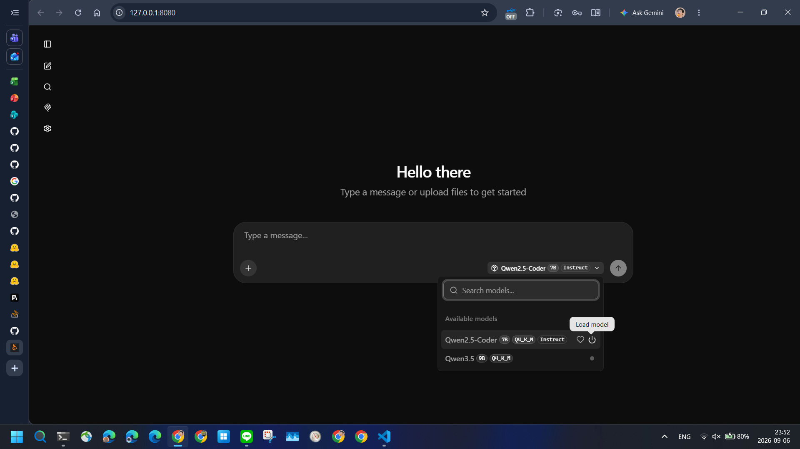

# Llama.cpp

- Git Repo
  - https://github.com/ggml-org/llama.cpp

[TOC]

## 2026-05-16

- 安裝：
  - 根據 https://github.com/ggml-org/llama.cpp/blob/master/docs/install.md
  - Windows 機器可以用以下指令安裝
```bash
$ winget install llama.cpp
Found llama.cpp [ggml.llamacpp] Version b9159
This application is licensed to you by its owner.
Microsoft is not responsible for, nor does it grant any licenses to, third-party packages.
This package requires the following dependencies:
  - Packages
      Microsoft.VCRedist.2015+.x64
Downloading https://github.com/ggml-org/llama.cpp/releases/download/b9159/llama-b9159-bin-win-vulkan-x64.zip
  ██████████████████████████████  31.1 MB / 31.1 MB
Successfully verified installer hash
Extracting archive...
Successfully extracted archive
Starting package install...
Path environment variable modified; restart your shell to use the new value.
Command line alias added: "llama-batched-bench"
Command line alias added: "llama-bench"
Command line alias added: "llama-cli"
Command line alias added: "llama-gguf-split"
Command line alias added: "llama-imatrix"
Command line alias added: "llama-mtmd-cli"
Command line alias added: "llama-perplexity"
Command line alias added: "llama-quantize"
Command line alias added: "llama-server"
Command line alias added: "llama-tokenize"
Command line alias added: "llama-tts"
Successfully installed
```
  - 如果用 scoop 的話，要加 `versions` bucket
```bash
~$ scoop search llama.cpp
Results from other known buckets...
(add them using 'scoop bucket add <bucket name>')

Name                  Source
----                  ------
llama.cpp-cpu         versions
llama.cpp-cu117       versions
llama.cpp-cu124-dll   versions
llama.cpp-cu124       versions
llama.cpp-cu131-dll   versions
llama.cpp-cu131       versions
llama.cpp-hip-gfx1030 versions
llama.cpp-hip-gfx1100 versions
llama.cpp-hip-gfx1101 versions
llama.cpp-hip-radeon  versions
llama.cpp-opencl      versions
llama.cpp-sycl        versions
llama.cpp-vulkan      versions

~$ scoop bucket add versions
Checking repo... OK
The versions bucket was added successfully.

~$ scoop search llama.cpp
Results from local buckets...

Name                  Version Source   Binaries
----                  ------- ------   --------
llama.cpp-cpu         b9174   versions
llama.cpp-cu117       b5449   versions
llama.cpp-cu124-dll   b9174   versions
llama.cpp-cu124       b9174   versions
llama.cpp-cu131-dll   b9174   versions
llama.cpp-cu131       b9174   versions
llama.cpp-hip-gfx1030 b5449   versions
llama.cpp-hip-gfx1100 b5449   versions
llama.cpp-hip-gfx1101 b5449   versions
llama.cpp-hip-radeon  b9174   versions
llama.cpp-opencl      b9174   versions
llama.cpp-sycl        b9174   versions
llama.cpp-vulkan      b9174   versions
```
- 緣起：
  - 想重現 https://www.youtube.com/watch?v=8F_5pdcD3HY
- 疑惑：只有 llama.cpp 辦得到嗎？vLLM 不行？
  - Google Gemini App
  - Gemini 3

> could you refer to https://www.youtube.com/watch?v=8F_5pdcD3HY and explore the possibility to apply similar strategy using vLLM instead of llama.cpp

The video from Codacus demonstrates a highly effective strategy for running a large **Mixture of Experts (MoE)** model (`Qwen-3.6-35B-A23B`) on a resource-constrained 6GB VRAM system.

To evaluate whether you can replicate this exact strategy using **vLLM** instead of `llama.cpp`, we have to break down the five core pillars of the video's technique and look at how vLLM's architecture handles them:

### The 5 Pillars of the Video's Strategy vs. vLLM

| **Strategy Pillar (llama.cpp)** | **vLLM Equivalent Capability** | **Feasibility in vLLM** |
| --- |  --- |  --- |
| **1. Split Experts to CPU (`--n-cpu-moe`)** | Device Mapping / Offloading | **No / Extremely Limited** |
| **2. Prefetch Model to RAM (`--no-mmap`)** | vLLM allocates all memory up front | **Yes (Default)** |
| **3. High Compression KV Cache (`TurboQuant`)** | FP8 / INT4 KV Cache Quantization | **Yes** |
| **4. Memory Locking (`--mlock`)** | Pinning memory allocations | **Yes (Handled by PyTorch/vLLM)** |
| **5. Avoid Speculative Decoding on MoE/SSM** | Speculative Decoding configuration | **Yes (Disabled by default)** |

### Deep Dive: Why a 1:1 Port to vLLM is Not Feasible

#### 1. The Dealbreaker: MoE CPU Offloading (`--n-cpu-moe`)

The core trick that makes the video's setup work is `llama.cpp`'s unique ability to split a single layer's components: keeping the small attention/shared blocks on the GPU while routing the massive **inactive expert weights** to system RAM via the CPU [03:33](http://www.youtube.com/watch?v=8F_5pdcD3HY&t=213). It stream-loads only the active 8 experts dynamically over the PCIe bus per token [03:50](http://www.youtube.com/watch?v=8F_5pdcD3HY&t=230).

-   **How vLLM works:** vLLM is built from the ground up as a **high-throughput, enterprise serving engine** optimized for GPUs. It expects the entire active model (or an entire layer, if pipeline-parallelized across multiple GPUs) to fit perfectly into VRAM.

-   **vLLM's CPU support:** While vLLM does have an experimental CPU backend (`vllm-cpu`), it requires running the *entire* model on the CPU. It **does not support hybrid GPU-attention / CPU-expert slicing** within the same engine instance. If a model exceeds your VRAM, vLLM will simply trigger an Out-of-Memory (OOM) error or fail to initialize.

#### 2. KV Cache Compression (TurboQuant vs. vLLM KV Quant)

The video utilizes **TurboQuant** (compressing keys to 4-bit and values to 3-bit) to cram a 256,000 token context window into a fraction of VRAM [07:45](http://www.youtube.com/watch?v=8F_5pdcD3HY&t=465), [08:39](http://www.youtube.com/watch?v=8F_5pdcD3HY&t=519).

-   **vLLM Alternative:** vLLM natively utilizes **PagedAttention**, which completely eliminates memory fragmentation. Furthermore, vLLM natively supports KV cache quantization down to **FP8** or **INT4** via arguments like `--kv-cache-dtype fp8`. While it doesn't support asymmetric 4-bit/3-bit configurations out of the box, PagedAttention with FP8 achieves massive context windows natively---*provided* the weights themselves fit in VRAM first.

#### 3. RAM Locking and Prefetching

The video notes that Linux tends to page model weights out to disk during idle periods, causing lag spikes, which they fix using `--no-mmap` and `mlock` [05:01](http://www.youtube.com/watch?v=8F_5pdcD3HY&t=301), [09:33](http://www.youtube.com/watch?v=8F_5pdcD3HY&t=573).

-   **vLLM Alternative:** vLLM already acts like this by default. Because it is a Python/PyTorch-based server, when it starts up, it aggressively allocates and locks down a massive block of VRAM (configured by `--gpu-memory-utilization`) and system RAM to prepare its PagedAttention blocks. It does not page-fault weights on the fly during inference.

### How to Achieve a Similar "Budget-Friendly" Strategy in vLLM

If you want to stick with vLLM but achieve the goal of running a massive model on a tighter hardware budget, you cannot use the video's CPU-MoE routing. Instead, you have to use **Weight Quantization**.

Instead of pulling unquantized or lightly quantized experts across a slow PCIe bus, you drastically compress the entire model so that it fits completely inside your VRAM. For a 35B MoE model (where total parameter disk size is ~35GB unquantized), you would approach it in vLLM like this:

1.  **Use GPTQ or AWQ Quantized Weights:** Find or quantize a 4-bit or 3-bit version of the Qwen model (e.g., `Qwen2.5-32B-Instruct-AWQ`). A 4-bit quantization reduces a 35B model's footprint to roughly 18-20GB. (Note: To fit a 35B model *completely* into 6GB VRAM is impossible even at 2-bit quantization, making `llama.cpp` the only viable option for a 6GB card).

2.  **Enable FP8 KV Cache:**

    Run vLLM with the following flag to save VRAM on the context window:

    Bash

    ```
    vllm serve qwen-model-repo --kv-cache-dtype fp8 --gpu-memory-utilization 0.90
    ```

3.  **Limit Max Model Length:**

    To guarantee you don't OOM on long prompts, strictly limit the max context size to match your remaining VRAM cushion:

    Bash

    ```
    --max-model-len 32768
    ```

### Conclusion

If your goal is to replicate the video by running a **35B model on a 6GB or 8GB VRAM card**, you **must use `llama.cpp`**. vLLM lacks the granular CPU/GPU hybrid memory slicing (`--n-cpu-moe`) required to offload sleeping layers to system RAM [03:33](http://www.youtube.com/watch?v=8F_5pdcD3HY&t=213).

However, if you upgrade your GPU hardware slightly (e.g., to a dual-GPU setup or a single 24GB VRAM card), **vLLM** combined with **AWQ/GPTQ weight quantization** and **FP8 PagedAttention** will drastically outperform `llama.cpp` in speed and multi-user throughput.

> what is the final conclusion of llama.cpp command to run Qwen 3.6 35B on 6GB VRAM machine?

The final structure of the `llama.cpp` command used by Codacus to run the Qwen-3.6-35B MoE model at **17 tokens per second with a 256,000-token context window** on a 6GB VRAM machine relies on precisely balancing the five core flags:

```bash
llama-cli \
  -m qwen3.6-35b-instruct-q4_k_m.gguf \
  --n-cpu-moe 36 \
  -L 35 \
  --no-mmap \
  --ctx-scale-key-quant 4 \
  --ctx-scale-value-quant 3 \
  --mlock \
  -c 256000

```

### Command Parameter Breakdown:

* **`-m qwen3.6-35b-instruct-q4_k_m.gguf`**: The model path (using a typical standard quantization like Q4 to fit the base model size within system memory).
* **`--n-cpu-moe 36`**: Pins 36 layers of the Mixture of Experts (MoE) blocks directly to system RAM to keep them off the GPU.
* **`-L 35`**: Offloads the non-MoE components (attention mechanisms) plus 5-6 layers of experts to the GPU to maximize the remaining 6GB VRAM.
* **`--no-mmap`**: Forces the system to preload all 20GB of weights straight into RAM upon startup, removing random disk-read stuttering during text generation.
* **`--ctx-scale-key-quant 4` & `--ctx-scale-value-quant 3**`: The asymmetric **TurboQuant** flags that compress the context cache aggressively down to 4-bit keys and 3-bit values.
* **`-c 256000`**: Expands the active context window to a massive 256k tokens, made possible by the TurboQuant compression.
* **`--mlock`**: Locks all the model weights into the physical RAM blocks so the operating system can never page them out to disk, preserving steady performance over weeks of idle time.

### Critical Deployment Requirement

As noted in the video, just putting `--mlock` in the command line will silently fail if your environment restricts memory locking. To ensure it works permanently, you must also allow **IPC locking** in your host configuration:

* If running natively on Linux: Ensure your user limits allow locking memory (`ulimit -l`).
* If using Docker: Pass the capability flag **`--cap-add=IPC_LOCK`** to your Docker run command.

- 實測：
```bash
~$ llama-cli   -m qwen3.6-35b-instruct-q4_k_m.gguf   --n-cpu-moe 36   -L 35   --no-mmap   --ctx-scale-key-quant 4   --ctx-scale-value-quant 3   --mlock   -c 256000
error: invalid argument: -L
~$ llama-cli   -m qwen3.6-35b-instruct-q4_k_m.gguf   --n-cpu-moe 36  --no-mmap   --ctx-scale-key-quant 4   --ctx-scale-value-quant 3   --mlock   -c 256000
error: invalid argument: --ctx-scale-key-quant
~$ llama-cli   -m qwen3.6-35b-instruct-q4_k_m.gguf   --n-cpu-moe 36  --no-mmap   --ctx-scale-value-quant 3   --mlock   -c 256000
error: invalid argument: --ctx-scale-value-quant
~$ llama-cli   -m qwen3.6-35b-instruct-q4_k_m.gguf   --n-cpu-moe 36  --no-mmap   --mlock   -c 256000
```

## 2026-06-12

- Tool: Google Search - AI Mode
> [!QUESTION]
> steps to install llama.cpp on linux without GPU

To install and run llama.cpp on Linux for CPU-only inference (without a GPU), you need to compile the code from source using CMake. By default, compiling llama.cpp without specifying any GPU flags automatically optimizes the build for your local CPU. [1, 2, 3, 4]

### 1. Install Required Dependencies [5]

You must install a C++ compiler (GCC), Git, and CMake. Choose the command below that matches your Linux distribution: [2, 3]

-   Ubuntu / Debian / Mint:
    ```bash
    sudo apt update
    sudo apt install -y git build-essential cmake libcurl4-openssl-dev
    ```

-   Fedora / RHEL / CentOS:
    ```bash
    sudo dnf groupinstall "Development Tools"
    sudo dnf install -y cmake openssl-devel libcurl-devel
    ```

-   Arch Linux:
    ```bash
    sudo pacman -S --needed git base-devel cmake curl
    ```

    [4, 6]

### 2. Clone the Repository [7]

Download the official source code from the ggml-org llama.cpp GitHub repository and navigate into the project directory: [2, 4, 8, 9, 10]
```bash
git clone https://github.com/ggml-org/llama.cpp.git
cd llama.cpp
```

### 3. Generate Build Files and Compile [4]

Create a build directory, configure CMake for a CPU-only Release build, and compile the binaries. [2, 4]

```bash
cmake -B build -DCMAKE_BUILD_TYPE=Release -DBUILD_SHARED_LIBS=OFF
cmake --build build --config Release -j $(nproc)
```

*Note: The `-j $(nproc)` flag tells the compiler to use all available CPU cores, which speeds up the compilation process significantly.* [2]

### 4. Verify the Installation

Test that the build succeeded by checking the help menu for the main command-line interface executable: [6]
```bash
./build/bin/llama-cli --help
```

### 5. Running a Local Model (Example)

To actually use `llama.cpp`, you need to download a model in the GGUF format. For CPU-only hardware, a lightweight model like Microsoft's Phi-3 or Phi-4 is recommended. [2, 11]

1.  Download a model file using `wget` or `curl` (e.g., a 4-bit quantized model from Hugging Face):
    ```bash
    mkdir models
    curl -L -o models/phi-3-mini-4k-instruct-q4_K_M.gguf https://huggingface.co
    ```

2.  Execute the model using the command line: [2, 11, 12, 13]
    ```bash
    ./build/bin/llama-cli -m models/phi-3-mini-4k-instruct-q4_K_M.gguf -p "Why is the sky blue?" -n 128
    ```
If you plan on writing Python applications around this build, let me know if you would also like instructions on configuring the Python bindings (`llama-cpp-python`) or setting up an OpenAI-compatible server local endpoint. [7, 14, 15]

[1] [https://www.reddit.com](https://www.reddit.com/r/LocalLLaMA/comments/18ggbg5/built_llamacpp_from_source_on_ubuntu_with_no_gpu/)
[2] [https://www.youtube.com](https://www.youtube.com/watch?v=JC7zaJGwbHU)
[3] [https://www.youtube.com](https://www.youtube.com/watch?v=EPYsP-l6z2s&t=521)
[4] [https://github.com](https://github.com/ggml-org/llama.cpp/discussions/21136)
[5] [https://www.linkedin.com](https://www.linkedin.com/posts/shaikhquader_textembeddings-localllm-llamacpp-activity-7335035389218365440-WlQv)
[6] [https://llama-cpp.com](https://llama-cpp.com/getting-started/)
[7] [https://dev.to](https://dev.to/avatsaev/pro-developers-guide-to-local-llms-with-llamacpp-qwen-coder-qwencode-on-linux-15h)
[8] [https://learn.arm.com](https://learn.arm.com/learning-paths/servers-and-cloud-computing/arcee-foundation-model-on-aws/03_building_llama_cpp/)
[9] [https://huggingface.co](https://huggingface.co/boneylizardwizard/llama-cpp-python-038-cu128-gemma3-wheel/blame/main/Build.Guide.md)
[10] [https://forums.developer.nvidia.com](https://forums.developer.nvidia.com/t/building-llama-cpp-container-images-for-spark-gb10/353664)
[11] [https://www.youtube.com](https://www.youtube.com/watch?v=o5ItHSvCPbA&t=354)
[12] [https://rocm.docs.amd.com](https://rocm.docs.amd.com/projects/radeon-ryzen/en/latest/docs/advanced/advancedrad/linux/llm/llamacpp.html)
[13] [https://ai.plainenglish.io](https://ai.plainenglish.io/how-to-use-llama-locally-on-cpu-step-by-step-guide-fc9f70291809)
[14] [https://github.com](https://github.com/abetlen/llama-cpp-python/issues/1963)
[15] [https://github.com](https://github.com/abetlen/llama-cpp-python/issues/877)

## 2026-06-13

- Tool: Google Search - AI Mode

> [!QUESTION]
> 支援 CPU 的 LLM model servicing 工具,除了 llama.cpp 以外,還有其他工具嗎?

### Llama.cpp Alternatives

除了 llama.cpp 以外，目前市面上還有許多專門針對 CPU 優化、或對 CPU 支援度極佳的大語言模型（LLM）推論與伺服端工具。
以下為您盤點 5 個主流的替代方案：

#### 1. Ollama

* 特點：開箱即用，極簡部署。
* CPU 支援：後端基於 llama.cpp，但包裝成極簡的 CLI 與 API 服務。
* 適用場景：適合想在本地快速啟動模型、不需要複雜設定的開發者。 [1, 2, 3, 4]

#### 2. OpenVINO GenAI / Model Server

* 特點：由 Intel 官方開發，專為 Intel CPU/iGPU/NPU 進行極限優化。
* CPU 支援：透過權重優化與量化（如 INT4/INT8），在 Intel 處理器上效能極佳。
* 適用場景：使用 Intel 硬體架構並追求最高推論速度的企業環境。

#### 3. vLLM

* 特點：以高吞吐量（Throughput）聞名的生產級服務框架。
* CPU 支援：除了 GPU，官方也原生支援 x86 CPU 架構（透過 OpenVINO 或 AVX-512 優化）。
* 適用場景：需要處理高並發（High Concurrency）請求的後端 API 服務。 [5, 6]

#### 4. LM Deploy

* 特點：由商湯科技開發的高效能 LLM 推論與服務工具箱。
* CPU 支援：支援 PyTorch-based 的 CPU 推論，並具備優異的量化效能。
* 適用場景：需要完整 MLOps 管線、動態批處理（Dynamic Batching）的場景。 [7]

#### 5. Llamafile

* 特點：Mozilla 推出的專案，將模型和執行檔打包成單一檔案（Single-file executable）。
* CPU 支援：內建高度優化的 CPU 執行期環境，跨平台（Linux, macOS, Windows）一鍵執行。
* 適用場景：模型分發、離線部署、追求極致便攜性的情境。 [8, 9]

如果想進一步評估哪款工具最適合您，可以告訴我：

* 您預計使用的 CPU 型號（Intel、AMD 或 ARM/Mac M系列）？
* 您的 模型格式（如 GGUF、Hugging Face 權重、AWQ 等）？
* 您的 應用場景（個人測試、需要整合到現有系統，還是高流量生產環境）？

我可以為您推薦最能發揮硬體效能的架構。

[1] [https://adg.csdn.net](https://adg.csdn.net/694cfd2c5b9f5f31781abd69.html)
[2] [https://medium.com](https://medium.com/@simon3458/%E8%AE%93-llm-model-%E5%8F%AF%E4%BB%A5%E5%BF%AB%E9%80%9F%E8%AE%8A%E6%88%90%E5%9C%B0%E7%AB%AF%E6%9C%8D%E5%8B%99-ollama-d849fb6d9ced)
[3] [https://cloud.tencent.com](https://cloud.tencent.com/developer/article/2577992)
[4] [https://blog.csdn.net](https://blog.csdn.net/weixin_42524004/article/details/160936202)
[5] [https://sider.ai](https://sider.ai/zh-TW/blog/ai-tools/llama_cpp-alternatives-faster-setups-fewer-headaches-same-local-ai-magic)
[6] [https://zhuanlan.zhihu.com](https://zhuanlan.zhihu.com/p/21951797307)
[7] [https://www.investglass.com](https://www.investglass.com/zh/%E5%A6%82%E4%BD%95%E5%9C%A8%E6%9C%AC%E5%9C%B0%E8%BF%90%E8%A1%8C-llms-%E8%87%AA%E6%89%98%E7%AE%A1-ai-%E6%A8%A1%E5%9E%8B%E5%AE%8C%E6%95%B4-2025-%E6%8C%87%E5%8D%97/)
[8] [https://ithelp.ithome.com.tw](https://ithelp.ithome.com.tw/m/articles/10386239)
[9] [https://www.bilibili.com](https://www.bilibili.com/video/BV1ihXrYEEyn/)


> [!QUESTION]
> AMD. GGUF. 個人測試

### Test GGUF on AMD

針對 AMD CPU、GGUF 格式 以及 個人測試 的需求，最推薦的 3 個工具與設定方向如下：

#### 1. Ollama (首選)

* 優勢：個人測試最省心的選擇。
* AMD 優化：在 Windows 或 Linux 上，它會自動偵測硬體。如果您的 AMD CPU 支援 AVX2 指令集（近年 CPU 皆支援），它會自動調用最優化的推論引擎。
* GGUF 支援：支援直接匯入自訂的 GGUF 檔案。只需撰寫一個簡單的 Modelfile（寫入 FROM ./你的模型.gguf），即可一鍵將其轉為 API 服務。

#### 2. Llamafile (最方便)

* 優勢：完全不需安裝任何依賴環境。
* AMD 優化：由 Mozilla 維護，內部對 AMD 的 CPU 架構（x86-64）有極佳的編譯優化。
* GGUF 支援：可以直接用命令列執行 llamafile -m 你的模型.gguf，它會自動在瀏覽器開啟一個網頁版 Chat UI，非常適合快速測試。

#### 3. vLLM (進階測試)

* 優勢：若您未來想測試多輪對話的並發效能（吞吐量），這是標準配備。
* AMD 優化：vLLM 目前已支援 CPU 後端，在 AMD 多核心處理器（如 Ryzen 9 或 Threadripper）上能展現不錯的平行運算能力。
* GGUF 支援：近期版本已加入對 GGUF 格式的支援，但設定上比前兩者複雜。

#### 💡 額外建議：效能最大化設定

無論您使用上述哪款工具，由於是 AMD CPU 推論，請注意以下幾點：

   1. 執行緒設定 (Threads)：執行時，將 CPU 執行緒數設定為您處理器的 「實體核心數（Physical Cores）」，而非邏輯核心數（Hyper-threading），效能通常最好。
   2. 記憶體頻寬：CPU 推論的瓶頸在於記憶體速度。若您的 AMD 平台支援雙通道 DDR5，其推論速度會明顯快於 DDR4。

您可以告訴我您目前正在使用的是哪一個 AMD CPU 型號（例如 Ryzen 7 5800X、Ryzen 9 7900 等）？我可以幫您預估大約的推論速度（Tokens/second），或是直接提供您 Ollama 匯入 GGUF 的指令步驟。

> [!QUESTION]
> Ryzen 7 7735HS. 可以預估 vLLM 推論速度嗎?

### AMD Ryzen 7 vLLM inference speed

在 AMD Ryzen 7 7735HS 上使用 vLLM 進行 CPU 推論，在生成階段（Decode）的預估速度大約落在 每秒 2 到 8 個 Token (2~8 t/s)。 [1]

這個速度並不算快，主要原因是 vLLM 的設計初衷是為了高吞吐量的 GPU 伺服器設計（如處理大量並發請求），它的 CPU 後端（基於 OpenVINO 或 PyTorch） 在單一使用者、單純單執行緒的本地測試中，效能通常無法完全釋放。 [1, 2, 3, 4]
以下為您精確估算不同模型大小在您的硬體上的表現：

#### 📊 vLLM 速度預估（以 8-bit 或 4-bit 量化為例）

| 模型大小 (以 GGUF 量化後) [5] | 預估推論速度 (Tokens/Second) | 體驗流暢度 |
|---|---|---|
| 1B ~ 3B (如 Qwen2.5-3B) | 5 ~ 8 t/s | 勉強可讀（正常打字速度） |
| 7B ~ 8B (如 Llama3-8B) | 2 ~ 4 t/s | 明顯慢、有卡頓感 |
| 14B 以上 | < 1.5 t/s | 逐字慢速蹦出，不建議使用 |

#### 🔍 決定效能的關鍵瓶頸

   1. 記憶體頻寬（記憶體是最大殺手）
   LLM 在 CPU 上的推論速度，90% 取決於您的記憶體（RAM）頻寬，而非 CPU 核心算力。Ryzen 7 7735HS 支援雙通道 DDR5-4800 或 LPDDR5-6400。
   * 如果您的筆電/迷你電腦是 DDR5雙通道，效能會接近上述預估的上限。
      * 如果不幸是單條單通道，速度會直接減半。 [6]
   2. vLLM 在 CPU 上的架構劣勢
   vLLM 在 CPU 上的記憶體管理與動態調度（如 PagedAttention），其額外開銷（Overhead）在單機 CPU 環境下非常明顯。這也是為什麼許多工程師回報，在個人測試中 vLLM CPU 的速度往往不如預期。 [1, 3, 5]

#### 💡 實用替代方案建議

如果您的目標是順暢的個人測試體驗，在相同的 Ryzen 7 7735HS 硬體下，高度強烈建議切換到以下兩種方案，速度會大幅提升：

* 改用 llama.cpp 或 Ollama（CPU 模式）：
由於它們對 x86 核心（AVX2 指令集）的單核與多核優化極為極致，跑 7B-GGUF 模型通常能穩定達到 8 ~ 13 t/s，比 vLLM 快上 2 至 3 倍，能達到完全流暢閱讀的體驗。
* 利用 7735HS 內建的強大核顯 (Radeon 680M)：
您的 CPU 帶有非常強悍的內顯。如果您的系統有 32GB 記憶體，您可以進入 BIOS 將 iGPU 的顯示記憶體（VRAM）強行配置分配到 8GB 或 16GB。接著使用 Ollama (Vulkan 模式) 或 LMDeploy (Marlin/ROCm 模式)，讓核顯來跑推論，7B 模型速度有機會衝上 15+ t/s。 [7, 8]

您目前打算在 vLLM 上測試的 GGUF 模型是哪一個（例如 Llama-3-8B 還是 Qwen-7B）？若您需要，我可以提供您在 7735HS 上用 Ollama 或 Llamafile 執行該模型的具體指令與優化參數！

[1] [https://dev.to](https://dev.to/daniel_lm_bf221f14807a4fd/inside-vllms-cpu-backend-a-new-contributors-notes-4kin)
[2] [https://docs.vllm.ai](https://docs.vllm.ai/en/stable/getting_started/installation/cpu/)
[3] [https://github.com](https://github.com/vllm-project/vllm?utm_cta=website)
[4] [https://www.hyperstack.cloud](https://www.hyperstack.cloud/blog/case-study/what-is-vllm-a-guide-to-quick-inference)
[5] [https://github.com](https://github.com/vllm-project/vllm/issues/7379)
[6] [https://www.notebookcheck.net](https://www.notebookcheck.net/AMD-Ryzen-7-7735HS-Processor-Benchmarks-and-Specs.681410.0.html)
[7] [https://laptopmedia.com](https://laptopmedia.com/news/cpu-rankings-the-new-amd-ryzen-7-7735hs-is-just-below-the-top-5-laptop-cpus/)
[8] [https://github.com](https://github.com/ollama/ollama/issues/2637)

## 2026-08-27

> [!QUESTION]
> 請問執行 llama serve -hf unsloth/Qwen3.8-27B-GGUF:UD-IQ2_XXS 指令,llama.cpp 會把 GGUF 檔案存放在哪裡?作業系統是 Windows 11

在 Windows 11 作業系統下，執行 `llama serve -hf` 指令時，`llama.cpp` 會將下載的 GGUF 檔案自動存放在 Hugging Face 的標準本地快取路徑： [1, 2]

👉 `C:\Users\<您的用戶名>\.cache\huggingface\hub\models--unsloth--Qwen3.8-27B-GGUF` [3, 4]

### 📂 詳細檔案結構與路徑

在該目錄下，實際的 `.gguf` 檔案通常會以符號連結（Symlink）或直接儲存在以下結構中： [5]

-   快取根目錄： `C:\Users\<您的用戶名>\.cache\huggingface\hub\`
-   專案資料夾： `models--unsloth--Qwen3.8-27B-GGUF\`
-   實際檔案位置： 該資料夾內的 `blobs\`（存放實際資料）與 `snapshots\<一串雜湊值>\`（存放指向 blobs 的連結，包含您的 `UD-IQ2_XXS` 檔案）。 [3, 4, 5]

### ⚙️ 如何自訂存放位置？

如果您想更換路徑（例如 C 槽空間不足），可以透過設定 Windows 環境變數來改變預設位置（優先權由高到低）： [3, 4]

1.  `HF_HUB_CACHE`：直接指定快取資料夾路徑。
2.  `HF_HOME`：指定 Hugging Face 的根目錄（模型會存在該目錄下的 `hub\` 中）。 [2, 6, 7]

設定方法（以命令提示字元 CMD 為例）：

```cmd
set HF_HOME=D:\AI_Models\huggingface
llama serve -hf unsloth/Qwen3.8-27B-GGUF:UD-IQ2_XXS
```

*設定後，檔案就會改存在 `D:\AI_Models\huggingface\hub\` 底下。* [7]

[1] [https://tech-insider.org](https://tech-insider.org/llama-cpp-tutorial-2026/)
[2] [https://github.com](https://github.com/janhq/jan/issues/8252)
[3] [https://github.com](https://github.com/ggml-org/llama.cpp/issues/7252)
[4] [https://github.com](https://github.com/ggml-org/llama.cpp/issues/7252)
[5] [https://forums.developer.nvidia.com](https://forums.developer.nvidia.com/t/can-i-salvage-a-model-in-hf-cache-into-a-normal-directory-with-safetensors/369507)
[6] [https://github.com](https://github.com/ggml-org/llama.cpp/issues/20994)
[7] [https://huggingface.co](https://huggingface.co/docs/hub/local-cache)

## 2026-08-31

> [!QUESTION]
> 最佳化自行佈署 Qwen 3.8 27B 的作法?vLLM?llama.cpp?llamafile?

佈署 Qwen 3.8 27B 的最佳化作法，取決於你的硬體規格（單卡/多卡/VRAM 大小）以及應用場景（單人使用/Agent 任務/多人高吞吐）。 [1, 2, 3]
結論先行：首選 vLLM（搭配官方 FP8）進行高吞吐與 Agent 服務；單卡 24GB（如 RTX 4090）單人任務、大 context 首選 llama.cpp；而 llamafile 僅適合要求「極簡部署」的非極致效能場景。 [1, 2, 3]

### 一、 三大引擎核心對比與最佳化策略

#### 1\. vLLM：高吞吐、多人並發與 Agent 首選

-   核心優勢：擁有 PagedAttention、連續批處理（Continuous Batching），並支援 Qwen 3.8 內建的 MTP（Multi-Token Prediction，多 token 預測）。開啟 MTP-2 後，單人推理速度最高可提升 73.5%。 [3, 4]
-   最佳化作法：

        -   模型選擇：直接跑官方 FP8 量化版本（約佔 27GB VRAM）。
        -   硬體建議：1 張 32GB/48GB 顯卡（如 [RTX 5090](https://www.google.com/search?kgmid=FAILED_OR_SKIPPED)、[RTX 6000 Ada](https://www.google.com/search?kgmid=FAILED_OR_SKIPPED)），或 2 張 24GB 顯卡（如兩張 4090 做 Tensor Parallelism）。
        -   情境限制：在長 Context（超過 60k-70k）時，vLLM 的 KV Cache 會吞噬大量顯存，此時效能或容量可能會遇到瓶頸。 [1, 2, 3, 4, 5]

#### 2\. llama.cpp：單卡戰神、長 Context 與資源受限最佳解

-   核心優勢：記憶體管理極其精細，支援 GGUF 格式。在 24GB 顯卡（如 RTX 4090）上，它是唯一能讓你舒服跑起 Qwen 3.8 27B 的解法。 [1, 2]
-   最佳化作法：

        -   模型選擇：下載 Q4\_K\_M（約 15-17GB，保留空間給 KV Cache）或 Q5\_K\_M。
        -   Context 密技：llama.cpp 支援 Flash Attention 與更好的 KV Cache 量化（如轉為 `q8_0` 或 `q4_0` 的 KV Cache），可以在有限顯存下壓榨出 1.5 倍的長度。
        -   情境限制：雖然也能開啟 MTP，但提升僅約 20%（遠輸 vLLM），且多人高並發吞吐量較差。 [2, 3, 4, 6]

#### 3\. llamafile：極簡單一檔案部署，非效能極致流

-   核心優勢：將 `llama.cpp` 和模型權重打包成一個可執行檔（Executable），跨平台、雙擊即跑。
-   最佳化作法：只適合用於快速概念驗證（PoC）或內部離線、無運維基礎的伺服器。
-   情境限制：底層雖是 `llama.cpp`，但因為打包限制，無法靈活微調最前端的 MTP、KV Cache 壓縮或進階張量並行（Tensor Parallelism）等最佳化參數。

### 二、 部署決策樹（依據硬體與情境選擇）

| 硬體與情境 | 推薦引擎 | 推薦模型格式 | 核心優化參數 / 理由 |
| --- |  --- |  --- |  --- |
| 單張 24GB 顯卡(如 RTX 3090 / 4090) | llama.cpp(或經由 Ollama) | GGUF (Q4\_K\_M) | 開啟 `--flash-attn`，並將 KV Cache 設定為 `q8_0` 以節省顯存並拉長 Context。 |
| 單張 32GB/48GB 顯卡或雙卡並行 | vLLM / SGLang | 官方 FP8 | 開啟 MTP-2 (Multi-Token Prediction)，在 Agent 任務與多人調用時，吞吐量高達數百 tok/s。 |
| 需要極高並發的服務(API 供應商、多員工共用) | vLLM | FP8 | 利用 vLLM 的 PagedAttention 機制，一卡可以同時流暢餵飽多個用戶。 |
| 無 GPU / 純 CPU 伺服器 | llama.cpp | GGUF (Q4\_0) | 使用多執行緒（Thread）綁定，利用 CPU 和系統記憶體硬扛（速度較慢）。 |
| 零基礎部署、跨平台 | llamafile | 內嵌 GGUF | 不用安裝 Python、CUDA 驅動等環境，一鍵跑起來。 |

### 三、 實戰最佳化參數範例

#### 💡 若選擇 vLLM 路線（以 Docker 部署 FP8 為例）

為了最大化 Qwen 3.8 的速度，強烈建議開啟多 Token 預測：

```bash
docker run --gpus all --ipc=host\
  -v ~/.cache/huggingface:/root/.cache/huggingface\
  vllm/vllm-openai:latest\
  --model Qwen/Qwen3.8-27B-Instruct-FP8\
  --max-model-len 32768\
  --gpu-memory-utilization 0.90\
  --enable-chunked-prefill\
  --num-scheduler-steps 2# 啟用類似 MTP/Speculative Decoding 的推測加速
```

#### 💡 若選擇 llama.cpp 路線（單卡 4090 的極致榨乾參數）

```bash
./llama-server\
  -m qwen3.8-27b-instruct-q4_k_m.gguf\
  -c 32768\
  --flash-attn\
  --ctk q8_0\
  --ctv q8_0\
  -ngl 99# 將所有 Layer 塞進 4090 顯存
```

*(註：`--ctk q8_0` 和 `--ctv q8_0` 可以把 KV Cache 進行量化，這就是讓 4090 能白嫖 1.5 倍 Context 長度的關鍵！)* [2]
如果你想進一步評估，請告訴我：

-   你目前的顯示卡型號與 VRAM 容量是多少？
-   這個模型主要拿來做什麼任務（例如：本地 Coding Agent、多人共用 API、長文本分析）？ [2, 3]

我可以為你提供專屬的啟動腳本與顯存估算。

[1] [https://ithelp.ithome.com.tw](https://ithelp.ithome.com.tw/articles/10405431)
[2] [https://medium.com](https://medium.com/@changtimwu/%E4%B8%80%E5%BC%B5-4090-%E8%B7%91-qwen3-8-27b-vllm-vs-llama-cpp-%E5%AF%A6%E6%B8%AC-%E5%92%8C%E4%B8%80%E5%80%8B%E6%B2%92%E4%BA%BA%E5%9C%A8%E8%AC%9B%E7%9A%84%E5%85%8D%E8%B2%BB-1-5-%E5%80%8D-context-fdb32a769b64)
[3] [https://zhuanlan.zhihu.com](https://zhuanlan.zhihu.com/p/2071984701632419778)
[4] [https://ai-coding.wiselychen.com](https://ai-coding.wiselychen.com/youtube-qwen38-27b-rtx5090-sglang-vllm-mtp-transcript/)
[5] [https://www.autobuy.tw](https://www.autobuy.tw/thread_19)
[6] [https://bbs.csdn.net](https://bbs.csdn.net/weixin_29031057/article/details/100267175)

> [!QUESTION]
> 使用 vLLM 對比 llama.cpp 來 serve 同一個模型的 FP8 跟 GGUF Q4_K_M 效能上有何優缺點?

使用 vLLM 部署 FP8 模型與使用 llama.cpp 部署 GGUF Q4\_K\_M 模型，是目前主流的兩種大語言模型（LLM）推論優化方案。
核心結論：vLLM (FP8) 專為「高併發、高吞吐量」的雲端伺服器場景設計；llama.cpp (GGUF Q4\_K\_M) 則專為「低硬體門檻、單用戶、消費級顯示卡或 CPU」的本地邊緣端優化。
以下為您詳細對比兩者的效能與優缺點：

### 核心性能對比總覽

| 評比維度 | vLLM (FP8) | llama.cpp (GGUF Q4\_K\_M) |
| --- |  --- |  --- |
| 硬體要求 | 高（需 Ada/Hopper 架構以後的 NVIDIA GPU，如 RTX 40/H100） | 極低（支援 Apple Silicon、Intel/AMD CPU、舊款顯示卡） |
| 首字延遲 (TTFT) | 極快（GPU 原生 Tensor Core 加速） | 較慢（取決於硬體，解量化需要計算開銷） |
| 每秒吞吐量 (TPS) | 極高（高併發下因 PagedAttention 表現極佳） | 較低（適合單人或少數人同時使用） |
| 記憶體佔用 | 約為原模型的 50%（每 1B 參數約 1 GB VRAM） | 約為原模型的 30%（每 1B 參數約 0.6 GB VRAM） |
| 模型精準度 | 較高（FP8 活化值與權重保留較多語義資訊） | 稍低（4-bit 量化有輕微精準度損失） |

### vLLM (FP8) 的優缺點

#### 🟢 優點

-   吞吐量（Throughput）極致： 內建 PagedAttention 技術，能有效管理 KV Cache 記憶體碎片。在多用戶同時發送請求（高併發）時，吞吐量比 llama.cpp 高出數倍。
-   精準度損失極小： 雖然 FP8 只有 8-bit，但由於保留了動態範圍且通常搭配 KV Cache FP8 量化，對於多數模型（如 Llama 3）而言，其基準測試（Benchmark）得分幾乎與不量化的原模型持平。
-   原生生產級 API： 完美相容 OpenAI API 格式，內建動態批處理（Continuous Batching），非常適合直接部署為商業服務。

#### 🔴 缺點

-   硬體架構限制嚴格： FP8 計算需要特定顯示卡硬體支援（NVIDIA Ampere 架構如 A100 僅支援儲存，必須到 Ada Lovelace/Hopper 架構 如 RTX 40 系列、L4、H100 才能獲得硬體加速）。
-   VRAM 門檻相對較高： 8-bit 佔用的記憶體是 4-bit 的兩倍。如果顯示卡記憶體（VRAM）放不下模型，vLLM 無法像 llama.cpp 那樣優雅地將部分層分流（Offload）到系統記憶體（RAM），容易直接導致 OOM（記憶體溢出）。

### llama.cpp (GGUF Q4\_K\_M) 的優缺點

#### 🟢 優點

-   極致的硬體兼容性與彈性： 支援混合推論（Hybrid Inference）。如果 VRAM 不夠大，可以設定將 30 層放進 VRAM，剩下的層放進系統 RAM 執行。甚至在純 CPU（如 Mac M 系列晶片）上也能跑出不錯的速度。
-   記憶體佔用極小： Q4\_K\_M（約 4.5-bit）將模型體積壓縮了近 70%。一台 16GB VRAM 的顯示卡可能放不下 FP8 的大模型，但能輕鬆塞下 GGUF Q4\_K\_M，還能留出空間給長文本的 KV Cache。
-   單人使用首字反應快： 在單一用戶（Concurrency = 1）的情境下，llama.cpp 的啟動速度與反應時間非常迅速。

#### 🔴 缺點

-   高併發性能低落： 缺乏類似 PagedAttention 的現代記憶體管理機制。當並行請求增加時，效能會急劇下降，不適合用於公開的雲端 API 服務。
-   量化精度損失： 4-bit 量化相較於 FP8，在邏輯推理、程式碼生成（Coding）以及複雜數學題上，會出現較明顯的「降智」或幻覺現象。
-   計算開銷（De-quantization Overhead）： 權重在計算時需要實時解量化回浮點數，這會消耗額外的運算資源。

### 您該如何選擇？

-   選擇 vLLM (FP8) 的場景：
    1.  您正在開發一款要給多個用戶同時使用的應用（如公司內部工具、SaaS 產品）。
    2.  您擁有 RTX 40 系列或企業級（L4/H100） 以上的 NVIDIA 顯示卡。
    3.  您的任務對模型精準度要求極高，不能接受 4-bit 量化帶來的能力衰退。

-   選擇 llama.cpp (GGUF Q4\_K\_M) 的場景：
    1.  您是在本地個人電腦（如 MacBook、單張消費級顯卡）上進行開發、測試或個人日常使用。
    2.  顯示卡 VRAM 嚴重不足，必須依賴系統記憶體（RAM）共享。
    3.  需要處理的併發量極低（通常只有您自己一個人用）。

如果想更進一步評估，可以告訴我：您預計使用的 GPU/CPU 型號、模型參數大小（例如 8B, 70B）以及預期的同時使用人數，我可以為您提供更精準的架構部署建議。

> [!QUESTION]
> 請根據 Qwen 3.8 27B 為例,製作 side-by-side comparison table,請提供使用 vLLM 跟 llama.cpp 的最低硬體需求、TTFT、TPS、VRAM 用量、精準度損失

以阿里巴巴最新推出的 Qwen 3.8 27B Dense 多模態模型為例，此模型原生支援 MTP（多Token預測）加速機制，上下文長度達 256K。 [1, 2, 3]
以下為您整理使用 vLLM (FP8) 與 llama.cpp (GGUF Q4\_K\_M) 部署該模型的 Side-by-Side 效能與硬體需求對比表。

### Qwen 3.8 27B 部署效能對比表

| 評估維度 | vLLM (FP8 版) | llama.cpp (GGUF Q4\_K\_M 版) |
| --- |  --- |  --- |
| 最低硬體需求 | 單卡 RTX 4090 (24GB) 或 [RTX 5090](https://www.google.com/search?kgmid=FAILED_OR_SKIPPED) (32GB)（必須具備 Ada/Hopper 以上架構以支援 FP8 硬體加速） | MacBook (32GB 統一記憶體) 或單卡 [RTX 3090](https://www.google.com/search?kgmid=FAILED_OR_SKIPPED)/4080 (16GB~24GB) 搭配部分層分流 |
| 模型權重體積 | 約 27.5 GB | 約 17 GB ~ 18 GB |
| 運行時 VRAM 估算*(含基礎 KV Cache)* | 約 30 GB ~ 32 GB*(註：24GB 顯卡需搭配量化 KV Cache 或壓低 Context)* | 約 20 GB ~ 22 GB*(剩餘 VRAM 可留給更長的 256K 上下文)* |
| 首字延遲 (TTFT) | 極低（反應極快）GPU 矩陣乘法原生運算，無需解量化開銷 | 中等計算時需將 4-bit 即時還原，輸入極長文本時延遲明顯 |
| 每秒吞吐量 (TPS)*(單人 Concurrency=1)* | 約 60 ~ 90+ tokens/s*(開啟 vLLM 的 MTP 猜測加速後表現極佳)* | 約 35 ~ 50 tokens/s*(4090/5090 搭配 GGUF 新版 MTP 亦有顯著提升)* |
| 每秒吞吐量 (TPS)*(高併發多用戶)* | 極高（維持 80% 以上效能）動態批處理與 PagedAttention 確保多用戶不卡頓 | 極低（斷崖式下跌）多用戶同時排隊會造成嚴重的排隊延遲 |
| 精準度損失 | 極低（低於 1%）幾乎等同於 BF16 原版，精準保留 Coding 邏輯 | 輕微至中等（約 1% ~ 3%）在極為複雜的程式碼生成與多模態推理上有微幅降智 |
| 最大上下文彈性 | 受限於 VRAM一旦 VRAM 耗盡即 OOM 崩潰，長文本需高度依賴 KV 量化 | 極高可將 KV Cache 放至系統記憶體（RAM），支援超長文本 |

### 關鍵決策點分析

1.  單卡 24GB VRAM (如 RTX 4090) 的尷尬點：

    -   Qwen 3.8 27B 由於是 Dense（稠密）模型，FP8 的權重（~27.5GB）已經超越了 24GB 顯示卡的上限。
    -   若用 vLLM： 您必須使用特定優化分支（如 Unsloth 的 NVFP4/W4A16 混合量化），或者使用兩張顯示卡（Tensor Parallel）才能完美跑起 FP8。
    -   若用 llama.cpp： GGUF Q4\_K\_M 僅需 18GB，在 24GB 顯卡上運作綽綽有餘，還能留下 6GB 的 VRAM 塞滿 KV Cache，跑長文字非常穩定。 [1, 2, 4, 5, 6, 7]

2.  多模態（Vision）與 MTP 的支援：

    -   Qwen 3.8 27B 內建強大的多模態（看圖、看影片）與 MTP（Multi-Token Prediction）機制。
    -   vLLM 在生產環境下對多模態 API 的支援度更完整，且高併發下 MTP 帶來的效能放大效應（Token 噴發速度）遠超 llama.cpp。 [2, 3, 8, 9, 10]

如果您目前手邊只有單張 24GB 顯卡（如 3090/4090）且是個人開發，強烈建議先從 llama.cpp (GGUF Q4\_K\_M) 開始；若是 伺服器端要開 API 給團隊使用且有 32GB 以上 VRAM (如 5090 或雙卡)，則無腦選擇 vLLM (FP8)。 [3, 6, 7]

請問您目前預計用來部署這尊 27B 模型的具體硬體配置（例如：幾張顯卡、多少 VRAM）是什麼呢？我可以為您規劃專屬的啟動參數與量化檔選擇。

[1] [https://qwen.ai](https://qwen.ai/blog?id=qwen3.6-27b)
[2] [https://vocus.cc](https://vocus.cc/article/6a7fa7b1fd897800010a91cc)
[3] [https://pub.towardsai.net](https://pub.towardsai.net/qwen-3-8-27b-runs-faster-on-a-3090-than-a-4090-the-gpu-isnt-why-a01034210337)
[4] [https://syntalith.ai](https://syntalith.ai/en/blog/llama-cpp-or-vllm-for-qwen3-8)
[5] [https://www.orcarouter.ai](https://www.orcarouter.ai/zh-TW/blog/qwen-3-8-27b-ollama)
[6] [https://ofox.ai](https://ofox.ai/blog/qwen-3-8-27b-run-locally-vram-gguf-2026/)
[7] [https://www.reddit.com](https://www.reddit.com/r/LocalLLaMA/comments/1w2pk15/which_is_better_ninfer_vs_vllm_for_qwen_38_27b_on/)
[8] [https://huggingface.co](https://huggingface.co/Qwen/Qwen3.8-27B)
[9] [https://gigagpu.com](https://gigagpu.com/vllm-vs-llama-cpp-gpu-servers/)
[10] [https://www.reddit.com](https://www.reddit.com/r/IntelArcPro/comments/1vzxxgj/llamacpp_vs_vllm_high_raw_tps_but_poor_realworld/)

## 2026-09-06

> [!QUESTION]
> 已有下載 GGUF 模型,如何用 llama.cpp 來 serve llm model 並且設定成 opencode 可以呼叫該模型

要使用 `llama.cpp` 將已下載的 GGUF 模型 啟動為 API 伺服器，並將其連接到 OpenCode（如 OpenCode / OpenCode-Interpreter 等 [Coding Agent](https://haimaker.ai/zh-tw/blog/opencode%E9%80%A3%E6%8E%A5ollama%E6%9C%AC%E6%A9%9F%E6%A8%A1%E5%9E%8B/) 工具），你可以透過 `llama.cpp` 內建的 `llama-server` 執行檔 來建立一個相容於 OpenAI 規範的 HTTP 端點。 [1, 2, 3, 4]

請依照以下兩個主要步驟進行設定：

### 步驟一：使用 `llama-server` 啟動 GGUF 模型

`llama.cpp` 編譯或下載完成後，會包含一個名為 `llama-server`（Windows 上為 `llama-server.exe`）的程式。打開終端機（Terminal）或命令提示字元，執行以下指令來 Serve 你的模型： [5, 6]

```bash
# 基本啟動指令
./llama-server -m "/路徑/到/你的/模型.gguf" --host 127.0.0.1 --port 8080 -c 4096# 如果你想發揮顯卡效能（以 NVIDIA CUDA 為例，將所有模型層(layers)搬到 GPU）
./llama-server -m "/路徑/到/你的/模型.gguf" --host 127.0.0.1 --port 8080 -c 8192 -ngl 99
```

#### 💡 常用關鍵參數說明：

-   `-m`：指定你下載的 GGUF 模型檔案路徑。
-   `--host` 與 `--port`：設定伺服器接聽的 IP 與連接埠（預設通常為 `127.0.0.1` 與 `8080`）。
-   `-c` (或 `--ctx-size`)：設定上下文視窗大小（如 `4096` 或 `8192`）。如果你的模型和記憶體夠大，且 OpenCode 需要讀取大量程式碼，可以視情況調高。
-   `-ngl` (或 `--n-gpu-layers`)：將多少層模型分配給 GPU 運算。設定 `99` 代表全送進 GPU；若只用 CPU 運行則可忽略此參數。 [6]

啟動成功後，終端機會顯示 `HTTP server listening` 等字樣，這代表你的本地 OpenAI 相容伺服器已架設完成。 [1, 4]

### 步驟二：在 OpenCode 中配置該模型

OpenCode 通常支援自訂 OpenAI 相容端點（OpenAI-Compatible Endpoint） 或藉由配置檔連線。請依你的 OpenCode 版本介面或設定檔（如 `.env` 或 `config.json`）進行以下對接： [7]

#### 情況 A：透過圖形介面 (UI) 設定

如果在 OpenCode 的設定（Settings）或模型提供者（Provider）選單中：

1.  Provider / 平台：選擇 OpenAI 增強/相容模式（OpenAI-Compatible / Custom）。
2.  Base URL / API 網址：填入 `http://127.0.0`（注意尾端需加上 `/v1`）。
3.  API Key / 金鑰：因為是本地端，若 `llama-server` 沒特別設密碼，通常填入任意字串（例如 `local-secret` 或 `ollama`）即可。
4.  Model Name / 模型名稱：填入你自訂的名稱，或與你的 GGUF 檔名一致（例如 `qwen2.5-coder-7b`）。

#### 情況 B：透過環境變數或設定檔設定

若是使用 CLI 版本的 OpenCode，請在專案根目錄的 `.env` 檔案中加入以下設定：

```bash
OPENCODE_API_KEY=local-secret
OPENCODE_BASE_URL=http://127.0.0
OPENCODE_MODEL=qwen2.5-coder-7b
```

#### ⚠️ 進階注意事項（Coding Agent 避坑指南）

1.  工具呼叫 (Tool Call / Function Calling)：OpenCode 在執行自動化寫程式時，極度依賴模型的 Tool Call 能力。請確保你下載的 GGUF 模型本身是具備 Tool Use 能力的（例如 `Qwen2.5-Coder` 系列 或是 `Gemma-2`）。 [3, 7]
2.  前綴快取 (Prompt Cache)：處理大量原始碼時，建議在 `llama-server` 啟動參數中加上 `-fa`（開啟 Flash Attention） 與快取參數，以大幅加快 OpenCode 重複讀取專案上下文時的推論速度。 [6, 8]

如果想進一步調校，請問你目前下載的是哪一個具體的 GGUF 模型（例如 Qwen, Llama3）？以及你的電腦是否有 NVIDIA 獨立顯卡 呢？我可以為你提供最合適的優化啟動參數。 [5, 6]

[1] [https://viml.nchc.org.tw](https://viml.nchc.org.tw/create-openai-compatible-server-with-llama-cpp/)
[2] [https://haimaker.ai](https://haimaker.ai/zh-tw/blog/opencode%E9%80%A3%E6%8E%A5ollama%E6%9C%AC%E6%A9%9F%E6%A8%A1%E5%9E%8B/)
[3] [https://www.reddit.com](https://www.reddit.com/r/LocalLLaMA/comments/1qqpon2/opencode_llamacpp_glm47_flash_claude_code_at_home/?tl=zh-hant)
[4] [https://sider.ai](https://sider.ai/zh-TW/blog/ai-tools/so-you-want-to-use-llama_cpp-start-here-skip-the-nonsense)
[5] [https://huggingface.tw](https://huggingface.tw/docs/hub/gguf-llamacpp)
[6] [https://www.facebook.com](https://www.facebook.com/groups/gaitech/posts/1771293924054815/)
[7] [https://www.alphalab.site](https://www.alphalab.site/qwen38-27b-local-agent-test)
[8] [https://ithelp.ithome.com.tw](https://ithelp.ithome.com.tw/articles/10406812)

> [!QUESTION]
> 我已經正確跑 llama-server 指令,並確認監聽於 127.0.0.1:8080.
> 但在 Pi Coding Agent 中使用 `/login` 選 llama.cpp 後,
> 錯誤訊息是
> ```
> Error: Failed to save API key for llama.cpp: Server is not running in llama.cpp router mode
> ```
> 可以如何修改呢?

這個錯誤的原因是 Pi Coding Agent 的內建 `llama.cpp` 連接器預設採用了 `llama.cpp` 的「多模型路由模式（Router Mode）」。 [1, 2]

當你使用指令 `-m "/路徑/模型.gguf"` 啟動時，`llama-server` 會進入單一模型模式。由於 Pi Agent 無法在該埠口偵測到路由端點（如 `/llama` 分發路徑），因而拒絕綁定金鑰並拋出 `Server is not running in llama.cpp router mode` 的錯誤。 [2, 3]

要解決這個問題，你有兩種修改方式：

### 方法一：將 `llama-server` 切換為「路由模式」（推薦 🌟）

新版的 `llama.cpp` 支援類似 Ollama 的動態模型管理（Router Mode），你只需要將 GGUF 模型放到一個專屬資料夾中，並調整啟動指令即可。 [4]

1.  建立模型目錄：

    建立一個名為 `models` 的資料夾，並把你的 `.gguf` 檔案放進去（可以放多個）。

    ```bash
    mkdir ./my_models
    mv 你的模型.gguf ./my_models/
    ```

2.  以路由模式啟動 `llama-server`：

    不要使用 `-m` 或 `--model` 參數。改用 `--models-dir` 指向剛才建立的資料夾：

    ```bash
    ./llama-server --models-dir ./my_models --host 127.0.0.1 --port 8080
    ```

3.  返回 Pi Agent 設定：

    現在回到 Pi Agent 的終端機再次輸入 `/login` 並選 `llama.cpp`，這時就能夠順利儲存並通過驗證。登入成功後，你可以透過 `/llama` 指令列出、載入模型，或用 `/model` 切換模型。 [2, 3, 5]

### 方法二：維持原本單模型啟動，改用「環境變數」強行對接

如果你不想改變 `llama-server` 的啟動方式，只想維持原來的指令，那你就不需要在 Pi Agent 裡面執行 `/login`。你可以直接透過環境變數跳過路由驗證，將 Pi Agent 引導到你的 OpenAI 相容端點： [6]

1.  關閉目前的 Pi Agent 視窗。
2.  在終端機中，直接設定 Base URL 環境變數：

    -   Linux / macOS:
        ```bash
        export LLAMA_BASE_URL="http://127.0.0"
        pi
        ```

    -   Windows (Command Prompt / CMD):
        ```cmd
        set LLAMA_BASE_URL=http://127.0.0
        pi
        ```

    -   Windows (PowerShell):
        ```powershell
        $env:LLAMA_BASE_URL="http://127.0.0"
        pi
        ```

3.  進入 Pi Agent 後，直接使用 `/model` 指令選擇你的本地模型即可。 [6, 7]

如果你在調整後遇到模型無法正確解析程式碼、或是在工具呼叫（Tool Call）時發生錯誤，可以告訴我你目前使用的是哪一款 GGUF 模型（例如 Qwen2.5-Coder、Llama-3 等），我能幫你確認特定的 Prompt Template 設定。

[1] [https://stackoverflow.max-everyday.com](https://stackoverflow.max-everyday.com/2026/08/pi-coding-agent-llama-server/)
[2] [https://github.com](https://github.com/earendil-works/pi/blob/main/packages/coding-agent/docs/providers.md)
[3] [https://github.com](https://github.com/earendil-works/pi/blob/main/packages/coding-agent/docs/llama-cpp.md)
[4] [https://huggingface.co](https://huggingface.co/blog/ggml-org/model-management-in-llamacpp)
[5] [https://pi.dev](https://pi.dev/docs/latest/llama-cpp)
[6] [https://www.kdnuggets.com](https://www.kdnuggets.com/run-the-mythos-enhanced-coding-model-locally-with-llama-cpp-and-pi)
[7] [https://deepakness.com](https://deepakness.com/blog/pi-agent-setup/)

> [!TIP]
> 以下是實際測試過程，意外發現 llama.cpp 已經有自己的 Web UI

```bash
[09/06 15:12:06] ~$ mkdir -p .models
[09/06 15:13:06] ~$ cd .models/
[09/06 15:14:47] ~/.models$ wget -c https://huggingface.co/lmstudio-community/Qwen2.5-Coder-7B-Instruct-GGUF/resolve/main/Qwen2.5-Coder-7B-Instruct-Q4_K_M.gguf
[09/06 15:15:05] ~/.models$ wget -c https://huggingface.co/Jackrong/Qwen3.5-9B-Claude-4.6-Opus-Reasoning-Distilled-v2-GGUF/resolve/main/Qwen3.5-9B.Q4_K_M.gguf
[09/06 15:15:51] ~/.models$ llama-server --models-dir ~/.models
```

