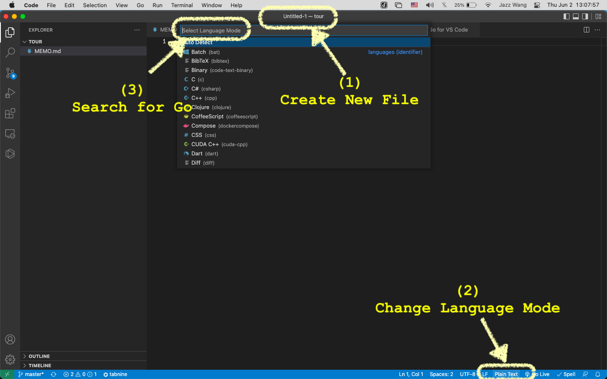
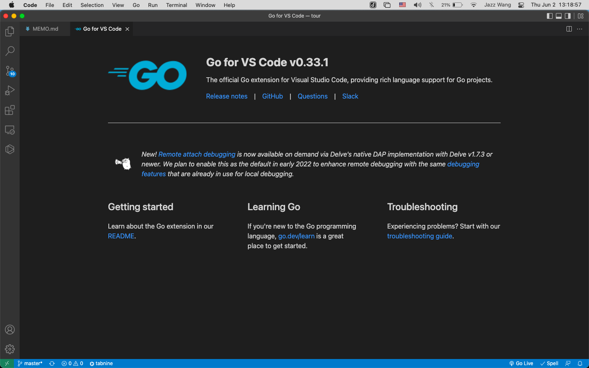

# MEMO

[TOC]

- This is a MEMO document for Udemy training course
- https://www.udemy.com/course/go-the-complete-developers-guide/

## 2022-06-02

- ( 2022-06-02 13:07:14 )
- VS Code 小技巧

- Go Extension for VS Code

  - https://go.dev/learn/
  - [VS Code Golang Troubleshooting](https://github.com/golang/vscode-go/blob/master/docs/troubleshooting.md)
  - [VS Code Golang Debugging](https://github.com/golang/vscode-go/blob/master/docs/debugging.md)
  - [Go for Visual Studio Code - Getting started](https://github.com/golang/vscode-go/blob/master/README.md)