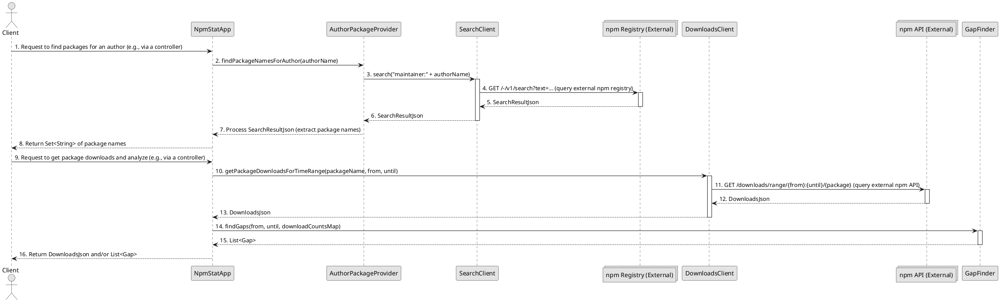
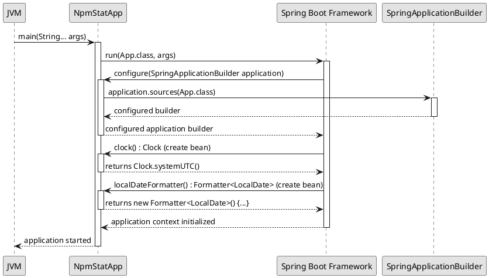
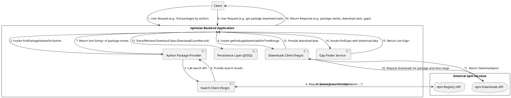

# npm-stat

- Git Repo
  - https://github.com/pvorb/npm-stat.com
- DeepWiki
  - https://deepwiki.com/pvorb/npm-stat.com

## 2025-11-18

- 需求：
  - 想比較不同的 npm 套件下載趨勢，特別是 gemini-cli 類似的實作
- 思路：
  - 嘗試了解 npm-stat.com 的實作
    - 從 api.npmjs.org 取得 downloads

> C:\Users\jazzw\.local\bin\aider --no-auto-commits --no-gitignore --model gemini/gemini-2.5-flash  
> Aider v0.86.1  
> Model: gemini/gemini-2.5-flash with diff-fenced edit format  
> Git repo: .git with 109 files  
> Repo-map: using 4096 tokens, auto refresh  

#### high-level overview

This Git repository appears to contain a Spring Boot application named "NpmStatApp" that interacts with npm APIs to retrieve package download statistics and author-related package information.

Key components include:
*   **API Clients**: Feign clients (`DownloadsClient`, `SearchClient`) for fetching data from npm's download and registry APIs.
*   **Data Processing**: Services (`GapFinder`, `AuthorPackageProvider`) for identifying gaps in download data and extracting package names from search results.
*   **Persistence**: jOOQ-generated classes (`DownloadCount`, `DefaultCatalog`, `Public`, etc.) and a `LocalDateConverter` for database interaction, likely storing download counts.
*   **Web Frontend**: JavaScript files (`charts.js`, `highcharts-3.0.10.min.js`, `jquery-2.0.3.min.js`) suggest a web interface for displaying charts and data.
*   **Build System**: Maven is used as the build tool.

#### could you explain the purpose of each folder in this repo?  

Based on the provided file summaries, here is the purpose of each folder:

*   **`src\main\java\de\vorb\npmstat\`**: This is the root package for the main Java application code. It contains the core Spring Boot application class (`NpmStatApp`) and other top-level configuration.
    *   **`src\main\java\de\vorb\npmstat\clients\`**: This folder contains classes related to external API clients.
        *   **`src\main\java\de\vorb\npmstat\clients\authors\`**: This subfolder specifically holds components for interacting with the npm registry's author/package search API, including client interfaces (`SearchClient`) and data transfer objects (`PackageDetailsJson`, `SearchResultJson`, `SearchResultRowJson`).
        *   **`src\main\java\de\vorb\npmstat\clients\downloads\`**: This subfolder contains components for interacting with the npm download counts API, including the client interface (`DownloadsClient`) and data transfer objects (`DownloadsJson`).
    *   **`src\main\java\de\vorb\npmstat\persistence\`**: This folder is dedicated to database persistence logic.
        *   **`src\main\java\de\vorb\npmstat\persistence\converters\`**: This subfolder contains custom converters, such as `LocalDateConverter`, used for mapping Java objects to database types.
        *   **`src\main\java\de\vorb\npmstat\persistence\jooq\`**: This subfolder holds the jOOQ-generated classes for database interaction, representing the schema, tables, and records.
            *   **`src\main\java\de\vorb\npmstat\persistence\jooq\tables\`**: This subfolder contains the jOOQ-generated classes that represent the database tables (e.g., `DownloadCount`, `HypertableRelationSize`).
                *   **`src\main\java\de\vorb\npmstat\persistence\jooq\tables\pojos\`**: This subfolder contains the jOOQ-generated Plain Old Java Objects (POJOs) corresponding to the rows of the database tables.
                *   **`src\main\java\de\vorb\npmstat\persistence\jooq\tables\records\`**: This subfolder contains the jOOQ-generated record classes used for interacting with individual rows of the database tables.
    *   **`src\main\java\de\vorb\npmstat\services\`**: This folder contains business logic services, such as `AuthorPackageProvider` and `GapFinder`, which encapsulate application-specific operations.
*   **`src\main\js\`**: This folder contains unminified, source JavaScript files, likely for the frontend application logic (`charts.js`, `escape-html.js`).
*   **`src\main\resources\static\`**: This folder holds static web resources that are served directly by the Spring Boot application, including compiled/minified JavaScript files (`charts.js`, `highcharts-3.0.10.min.js`, `jquery-2.0.3.min.js`).

#### main backend program

The main backend program is located at `src\main\java\de\vorb\npmstat\NpmStatApp.java`.

#### sequence diagram of those backend classes

Here is a high-level sequence diagram showing interactions between the identified backend classes. This diagram illustrates two common flows: finding packages by an author and fetching package download statistics to identify gaps.

#### how does the backend fetch npm downloads?  

The backend fetches npm downloads through the `DownloadsClient` interface.

1.  The `DownloadsClient` is a Spring Cloud OpenFeign client configured to interact with the npm API's download endpoint, with its base URL set by `${npm.api.baseUrl}/downloads/`.
2.  The `getPackageDownloadsForTimeRange` method within this interface is annotated with `@GetMapping("range/{from}:{until}/{package}")`.
3.  When this method is called, Feign constructs and executes an HTTP GET request to the npm API. The URL will be similar to `http://<npm.api.baseUrl>/downloads/range/<from_date>:<until_date>/<package_name>`.
4.  The `packageName`, `from` (start date), and `until` (end date) parameters are used to populate the path variables in the request URL.
5.  The npm API's response is then automatically deserialized into a `DownloadsJson` object, which contains the download statistics.

> Tokens: 8.9k sent, 201 received. Cost: $0.0036 message, $0.03 session.  

#### sequence diagram of `NpmStatApp`

#### create a flow diagram of npmstat using plantuml syntax  

- ( 2025-11-18 13:59:33 )
- 透過 deepwiki 來了解實作方式
- https://deepwiki.com/pvorb/npm-stat.com#service-layer

> ### Client Layer
> 
> -   **DownloadsClient**: Feign client for `api.npmjs.org/downloads/*` endpoints
> -   **SearchClient**: Feign client for `registry.npmjs.org/-/v1/search` endpoint

- 短結論：如果我想比較 `aider-chat` (PyPI 下載量) 跟 `@google/gemini-cli`, `@anthropic-ai/claude-code
` , `opencode-ai` (npm 下載量)，可能要參考 ClickPy 跟 npm-stat 的資料源
  - https://clickpy.clickhouse.com/dashboard/aider-chat
  - https://www.npmjs.com/package/@anthropic-ai/claude-code
  - https://www.npmjs.com/package/@google/gemini-cli
  - https://www.npmjs.com/package/@github/copilot
  - https://www.npmjs.com/package/opencode-ai