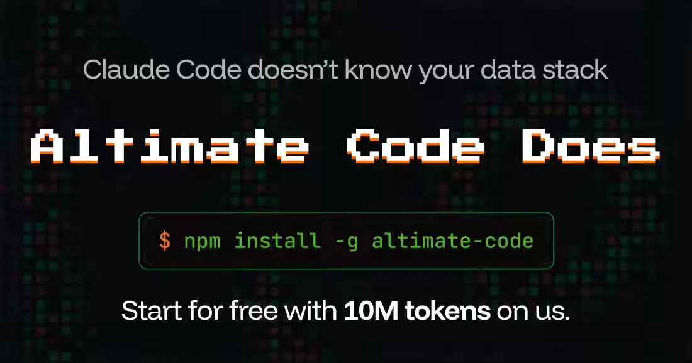
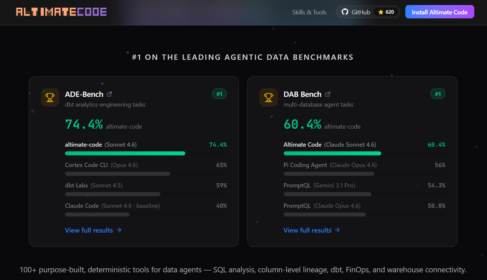

# altimate-code

- Git Repo
  - https://github.com/AltimateAI/altimate-code
- Website
  - https://altimate.sh/

## 2026-06-01

- 緣起：
  - [Data Engineering Weekly #271](https://www.dataengineeringweekly.com/p/data-engineering-weekly-271)
  - https://www.dataengineeringweekly.com/i/199198908/sponsored-agents-for-data-engineering
- 簡介：
  - 針對 Data Engineer 設計
    > Open-source agentic data engineering harness for dbt, SQL, and cloud warehouses. 100+ tools, 10 warehouses, AI-powered.
    
  - 操作跟 OpenCode 類似，因為是從 OpenCode fork 出來的，支援地端 LLM
  > altimate-code is <mark>a fork of OpenCode</mark> rebuilt for data teams. Model-agnostic — bring your own LLM or <mark>run locally with Ollama</mark>.
  > ### Acknowledgements
  > altimate is a fork of [OpenCode](https://github.com/anomalyco/opencode), the open-source AI coding agent. We build on top of their excellent foundation to <mark>add data-team-specific capabilities</mark>.
  - 19 個 Skill，79 個 Tool
    - https://www.altimate.sh/skills-tools
  - #1 on the leading agentic data benchmarks
    