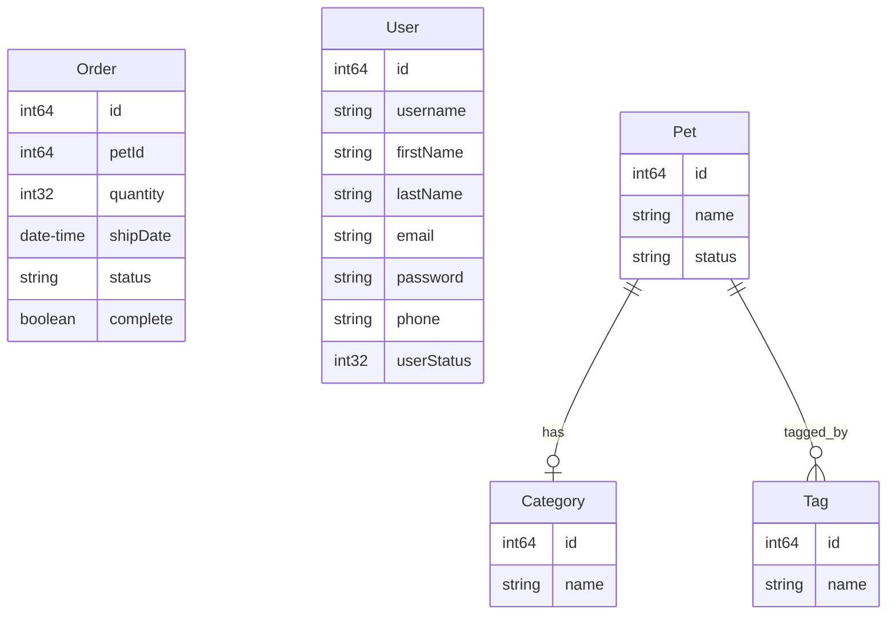

# AsyncAPI CLI

- Git Repo
  - https://github.com/asyncapi/cli
- Website
  - https://www.asyncapi.com/tools/cli

> CLI to work with your AsyncAPI files. You can validate them and in the future use a generator and even bootstrap a new file. Contributions are welcomed!

## 2026-06-21

- 緣起：想了解是否有 OpenAPI 生成 Event-Driven Kafka + Spring Boot Backend API 的工具
- 發想：

<table><tr style="background-color:lightgreen;"><td>Tool:</td><td>
Google Search - AI Mode
</td></tr><tr style="background-color:lightyellow;"><td>Q:</td><td>
給定 https://petstore.swagger.io/v2/swagger.json OpenAPI 規格，有辦法逆向生成 data model 嗎？
</td></tr><tr><td>A:</td><td>

## OpenAPI JSON to Data Model

可以，完全沒問題。 透過該 OpenAPI 規格（Swagger JSON），你可以使用多種自動化工具，在幾秒鐘內逆向生成各個主流程式語言（如 TypeScript, Python, Java, Go 等）的 Data Model（資料模型/結構體）。

以下是幾種最常見且高效的實作方法：

### 1. 使用線上工具（最快、免安裝）

如果你只需要快速查看或複製 Model 程式碼，可以直接使用線上轉換工具：

-   [Quicktype](https://quicktype.io/)：

        1.  開啟網站後，將左側來源切換為 OpenAPI / Swagger。
        2.  複製你的 URL `https://petstore.swagger.io/v2/swagger.json` 並貼上。
        3.  右側即可選擇你想要的程式語言（如 TypeScript Interface、Python Pydantic、Go Struct），工具會自動生成對應的 Data Model。

-   [Swagger Editor](https://editor.swagger.io/)：

        1.  開啟網頁，點選選單的 `File` -> `Import URL`，輸入該 JSON 網址。
        2.  載入後，點選上方選單的 `Generate Client`。
        3.  選擇你的程式語言下載完整專案包，裡面的 `Model` 資料夾即為所需的資料結構。

### 2. 使用 CLI 命令列工具（適合自動化整合）

如果你希望將此步驟整合進開發流程（如前端 API 自動更新），可以使用 npm 套件。

#### 2.1: 方法 A：使用 OpenAPI Generator (推薦)
------------------------------

這是目前社群最強大、支援語言最多的工具。
```bash
# 使用 npx 免安裝直接執行 (以生成 TypeScript 為例)
npx @openapitools/openapi-generator-cli generate\
  -i https://petstore.swagger.io/v2/swagger.json\
  -g typescript-fetch\
  -o ./petstore-api
```

-   執行後，在 `./petstore-api/models` 目錄下就會看到 `Pet`、`Order`、`User` 等 Model 檔案。
-   你可以將 `-g` 後面的參數換成 `python`、`go`、`java` 等其他語言代碼。

#### 2.2: 方法 B：前端常用的 openapi-typescript

如果你使用的是前端生態系（TypeScript），這個工具能生成極度精準的類型定義。

```bash
# 執行轉換指令
npx openapi-typescript https://petstore.swagger.io/v2/swagger.json --output ./petstore.ts
```

-   這會在本地生成一個 `petstore.ts`，裡面完整包含了 `components["schemas"]`（或 Swagger v2 的 `definitions`）所對應的強型別定義。

### 3. 本地程式碼逆向解析（自訂邏輯）

如果你想用 Python 自己寫腳本來解析並抽取 Data Model，可以利用 `requests` 讀取該 JSON，並解析其中的 `definitions` 欄位（在 OpenAPI v3 中稱為 `components.schemas`）：

```python
importrequestsurl = "https://petstore.swagger.io/v2/swagger.json"data = requests.get(url).json()

# Swagger v2 的 Data Model 都定義在 definitions 中models = data.get("definitions", {})

formodel_name, model_infoin models.items():
    print(f"Model 名稱: {model_name}")
    properties = model_info.get("properties", {})
    forprop_name, prop_infoin properties.items():
        print(f"  - 欄位: {prop_name} ({prop_info.get('type', 'object')})")
```

### 4. ✅ 結論

透過 `https://petstore.swagger.io/v2/swagger.json` 逆向生成 Data Model 是完全可行且屬於業界標準實踐。你可以依據需求選擇 Quicktype 線上工具（適合單次快速生成）或 OpenAPI Generator CLI（適合專案自動化）。
請問你目前專案主要使用的是哪一種程式語言（例如：TypeScript、Python、Go）？我可以為你提供該語言專屬的具體程式碼生成範例與指令。

</td></tr>
<tr style="background-color:lightyellow;"><td>Q:</td><td>
有辦法生成資料庫的 ER Model 嗎？
</td></tr><tr><td>A:</td><td>

## OpenAPI JSON to SQL ER Model

可以，完全沒問題。
OpenAPI 規格中的 `definitions`（或 OpenAPI v3 的 `schemas`）本質上就是物件之間的關係圖，因此可以被逆向工程轉換為資料庫的 ER Model（實體關係圖，Entity-Relationship Diagram）。

以下是幾種將該 Swagger JSON 轉換為 ER 圖的最有效方法：

### 1. 使用 Mermaid.js 自動生成（最直覺、文字即圖片）

你可以利用工具將 JSON 轉換為 Mermaid.js 的 `erDiagram` 語法，接著就能在任何支援 Mermaid 的編輯器（如 Notion、Obsidian、GitHub 或線上編輯器）中直接渲染出 ER 圖。
如果你將該 JSON 丟給 AI（或使用開源轉換腳本），會生成如下的 Mermaid 語法：



-   如何檢視：你可以直接複製上方代碼，貼到 [Mermaid Live Editor](https://mermaid.live/) 網頁中，就能立刻看到美觀的 ER 圖。

### 2. 使用開源工具列：`openapi-to-erd`

社群有專門的工具可以直接讀取 OpenAPI JSON 並輸出成資料庫圖表。

-   openapi-to-erd (或類似的 npm 工具)：
    這類工具會解析 Swagger 檔案中的 Object 屬性，並嘗試將 `properties` 轉換為欄位，將物件參照（如 `$ref`）轉換為外鍵關係（Foreign Key），最後輸出成 HTML 或圖片。

### 3. 先轉為 SQL DDL，再匯入資料庫建模工具

如果你需要的是極度標準的資料庫 ER 圖（包含主鍵、外鍵、索引），業界最標準的變通做法是：

1.  轉為 SQL：使用工具（如前端所述的 Quicktype 或 OpenAPI Generator）先將 JSON 轉為資料庫建表語法（SQL DDL）。
2.  匯入工具：將生成的 SQL 語法匯入到以下專業的資料庫建模工具中，一鍵生成逆向 ER 圖：
    -   [dbdiagram.io](https://dbdiagram.io/)（線上快速建模，極力推薦）
    -   DBeaver（免費開源，內建實體關係圖功能）
    -   DataGrip / Navicat（商業強大工具）

### 4. 💡 逆向轉換的潛在限制

由於 OpenAPI 是為 API 傳輸設計，而非資料庫儲存設計，因此逆向生成時會有以下小盲點：

-   多對多關係（Many-to-Many）：在 Swagger 中，`Pet` 包含一個 `Tag` 陣列（一對多物件）。在真實資料庫中，這通常需要一張「中間資料表（`pet_tags`）」，但自動工具通常只會畫出直連的線，你需要手動補上中間表。
-   主外鍵宣告：Swagger JSON 不一定會明寫誰是 Primary Key（主鍵），工具通常是依據欄位名稱（如 `id`）來盲猜。

請問你希望獲得哪一種格式的 ER 圖？

1.  想要直接能看圖的 Mermaid 完整代碼（我可以幫你把該 Petstore 的完整關聯都寫出來）
2.  想要直接能建立資料庫表的 SQL DDL 語法？

</td></tr>
<tr style="background-color:lightyellow;"><td>Q:</td><td>
從 OpenAPI JSON 可以觀察或者推論 Microservice 的 DDD 該如何設計嗎？
</td></tr><tr><td>A:</td><td>

## OpenAPI to MicroService DDD

可以，但僅限於「由外而內」的推論。

OpenAPI JSON 展現的是系統的對外契約（Contract）。雖然它無法直接告訴你內部的業務邏輯，但透過分析它的 路徑結構（Paths）、HTTP 方法、參數 以及 資料模型（Definitions），你可以像考古學家一樣，高度推論出該系統在領域驅動設計（DDD）中的 戰術設計（Tactical Design） 與部分 戰略設計（Strategic Design）。

以你提供的 Swagger Petstore JSON 為例，我們可以從中觀察並推論出以下幾點 DDD 設計：

### 1. 識別「聚合根（Aggregate Root）」與「實體（Entity）」

在 DDD 中，聚合（Aggregate） 是一組相關聯的物件集合，而 聚合根（Aggregate Root） 是外部系統唯一能直接存取的入口。所有對內部的修改都必須透過聚合根。 [1, 2, 3, 4]

-   如何觀察路徑（Paths）：
    看 API 的一級路徑（Top-level resources）。在 Petstore 中，主要的根路徑有：
    -   `/pet`
    -   `/store/order`
    -   `/user`
-   DDD 推論：
    這代表 `Pet`（寵物）、`Order`（訂單）與 `User`（使用者） 是三個獨立的聚合根。 [5]
-   如何識別內部實體/值物件（Entity / Value Object）：
    觀察 `/pet/{petId}` 返回的資料模型，它包含了 `Category` 和 `Tag`。但因為沒有 `/category/{id}` 這種可以直接由外部生命週期管理的 API，這推論出 `Category` 和 `Tag` 在這裡可能只是 `Pet` 聚合內部的實體或值物件（Value Object），不應該獨立成為微服務。

### 2. 劃分「限界上下文（Bounded Context）」與微服務邊界

限界上下文是 DDD 劃分微服務最重要的依據。我們可以透過 API 的業務職能（Business Capability）與資料模型的邊界來切分。 [6]
在 Petstore JSON 中，雖然所有 API 寫在同一個檔案裡，但我們可以明確劃分出三個上下文：

| API 範疇 | 對應的限界上下文 (Bounded Context) | 微服務切分建議 |
| --- |  --- |  --- |
| `/pet/*` | 寵物目錄上下文 (Pet Catalog Context) | 寵物管理微服務：負責寵物上架、狀態、標籤。 |
| `/store/order/*`, `/store/inventory` | 交易/庫存上下文 (Trading & Inventory Context) | 訂單微服務：負責購物、庫存盤點、物流觸發。 |
| `/user/*` | 使用者帳戶上下文 (Identity & Access Context) | 用戶/認證微服務：負責會員資料與權限。 |


> [!NOTE]
> #### 💡 關鍵的 DDD 觀察點：概念在不同上下文的語意
>
> 注意 `/store/order` 裡面有一個欄位叫 `petId`。
>
> -   在寵物上下文中，`Pet` 是一個充滿屬性（名字、照片、標籤）的完整聚合。
> -   在交易上下文中，`Order` 聚合只需要知道 `petId`（這在 DDD 中稱為 Identity Reference，識別碼參照）。交易服務不需要知道寵物的品種，它只關心這個 ID 是否被預訂。這正是完美的微服務解耦設計！


### 3. 從 HTTP Method 推論「領域事件（Domain Events）」與「命令（Commands）」

DDD 強調行為（Behavior）而非單純的 CRUD。我們可以從 API 的操作推論出領域中所發生的事件。

-   `POST /store/order` (建立訂單)
    -   DDD 命令 (Command): `PlaceOrder` (下單)
    -   潛在領域事件 (Domain Event): `OrderPlaced` (訂單已建立) ➜ 這可以觸發後續的庫存扣減或通知服務。
-   `POST /pet/{petId}/uploadImage` (上傳寵物照片)
    -   DDD 推論: 這是一個明確的領域行為（行為大於資料）。在領域模型中，`Pet` 聚合根應該要有一個 `uploadImage()` 的方法，而不是單純由外部直接修改 `photoUrls` 陣列。

### 4. 識別防腐層（Anti-Corruption Layer, ACL）的必要性

如果你的新微服務需要呼叫這個 Petstore 的 API，你可以從它的設計推論出是否需要 ACL：

-   觀察：這個 Swagger v2 是一個相對傳統、偏向 CRUD 的 API 設計，且資料結構較為扁平。
-   推論：如果你的新系統正在使用現代純粹的 DDD 核心模型（例如有嚴格的業務驗證與狀態機），你不應該讓這個 Petstore 的資料模型直接滲透進你的核心。你需要在你的微服務中建立一個 防腐層（ACL），將 Petstore 的 JSON 轉譯為你自己的領域概念。

### ⚠️ 從 OpenAPI JSON 推論 DDD 的局限性（反思）

雖然可以推論，但這種「逆向」方法有兩個致命盲點：

1.  它可能是貧血模型（Anemic Domain Model）： 很多 Swagger 是由資料庫直接產生的（DB-first），這導致 API 看起來像 CRUD。如果盲目照抄，你只會設計出「包著微服務外皮的分布式資料庫」，而非真正的 DDD 領域模型。
2.  缺乏業務場景（Context）： OpenAPI 告訴你「可以做什麼（What）」，但沒告訴你「為什麼要做（Why）」。真正的微服務邊界，必須透過與領域專家（Domain Expert）進行 事件風暴（Event Storming） 才能真正定案。

### 🚀 接下來你可以...

如果你正在嘗試為這個系統重新架構，我們可以挑選其中一個模組深入。你想先探討 `Order（訂單）` 服務 在微服務架構下，應該如何與 `Pet（寵物）` 服務 透過非同步事件（Event-Driven） 進行溝通與解耦嗎？

[1] [https://www.infoq.cn](https://www.infoq.cn/article/zgudel6rhvipjmtlyimt)
[2] [https://developer.aliyun.com](https://developer.aliyun.com/article/1714710)
[3] [https://zhuanlan.zhihu.com](https://zhuanlan.zhihu.com/p/176958203)
[4] [https://www.cnblogs.com](https://www.cnblogs.com/aimoboshu/p/18011145)
[5] [https://zhuanlan.zhihu.com](https://zhuanlan.zhihu.com/p/1961098035212822222)
[6] [https://zhuanlan.zhihu.com](https://zhuanlan.zhihu.com/p/31130773)

</td></tr>
<tr style="background-color:lightyellow;"><td>Q:</td><td>
Event-driven 的 Microservice 還會走 contract first 的設計嗎？
</td></tr><tr><td>A:</td><td>

## Event-driven Microservice - Contract First Design

會，而且比同步（HTTP/REST）架構更需要 Contract First（契約優先）的設計。 [1]

在 Event-driven（事件驅動）微服務架構中，服務之間不再透過 HTTP 直接呼叫，而是透過訊息佇列（Message Broker，如 Kafka, RabbitMQ）傳遞「事件 JSON/Avro/Protobuf」。 [1]
這時候，Event 欄位的定義就是微服務之間的生命線。如果沒有 Contract First，當 A 微服務改了事件欄位，B 和 C 微服務就會直接崩潰（Data Incompatibility）。

以下是 Event-driven 架構中進行 Contract First 設計的核心做法與工具：

### 1. 事件驅動的 OpenAPI：AsyncAPI

針對 HTTP/REST，我們使用 OpenAPI（Swagger）；針對事件驅動，業界標準是 [AsyncAPI](https://www.asyncapi.com/)。 [2]

AsyncAPI 的語法與 OpenAPI 幾乎一模一樣，但它是專門為了 Pub/Sub（發布/訂閱）模式設計的。你可以用它來定義：

-   Channels（通道）：對應到 Kafka Topic 或 RabbitMQ Queue。
-   Messages（訊息）：事件的 Payload 結構（也就是 Data Model）。

#### 範例：`OrderPlaced` 契約片段

```yaml
asyncapi: 3.0.0info:
  title: Order Service Events
  version: 1.0.0channels:
  order-events:
    address: shop.orders.v1
    messages:
      OrderPlacedEvent:
        $ref: '#/components/messages/OrderPlaced'components:
  messages:
    OrderPlaced:
      payload:
        type: object
        properties:
          orderId:
            type: string
          petId:
            type: string
          amount:
            type: number

```

### 2. 生態系的實踐：Schema Registry

在 RESTful 中，我們看 Swagger UI 來對接；在 Event-driven 中，我們透過 Schema Registry（綱要註冊表） 來強制執行契約。 [3]

1.  設計先行：架構師或開發者先在 Schema Registry 定義好 `OrderPlaced.avsc` (Avro) 或 `.proto` (Protobuf) 檔案（這就是 Contract）。
2.  自動生成程式碼：微服務（如 Java, Go, Python）在編譯時，從 Registry 下載 Schema，自動生成對應的實體類別（Data Model）。 [3]
3.  執行期校驗：
    -   Producer（發送端） 發送事件時，Schema Registry 會檢查欄位是否符合契約。
    -   Consumer（接收端） 訂閱時，依據契約反序列化，確保絕不解析錯誤資料。

### 3. 事件驅動的契約版本控制策略

同步 API 可以透過 `/v1/pet`, `/v2/pet` 來並存。但事件 Topic 的資料是一直在流動的，因此 Contract First 更強調 相容性規範（Compatibility Modes）：

-   Backward Compatibility（向後相容）：新版的微服務可以讀取舊版 Producer 發出的事件。 [4]
-   Forward Compatibility（向前相容）：舊版的微服務可以讀取新版 Producer 發出的事件（忽略新欄位）。 [4]
-   Full Compatibility（全相容）：不論新舊版本互相發送，服務都不會壞掉。 [4]

### 💡 總結

在事件驅動微服務中，「事件就是唯一的真實（Event is the source of truth）」。 [5] [2]

如果沒有走 Contract First，微服務之間會陷入極度混亂的「隱性耦合」。走 Contract First 不僅能讓團隊在開發前就對「業務事件（Domain Events）」達成共識，更能透過自動化工具確保系統升級時不會發生斷崖式故障。

請問你目前評估的 Event-driven 系統，預計會使用哪種技術棧（例如：Kafka + Avro，或是 RabbitMQ + JSON）呢？我可以為你說明該搭配如何落地 Contract First。

[1] [https://medium.com](https://medium.com/peerone-technology-%E7%9A%AE%E5%81%B6%E7%8E%A9%E4%BA%92%E5%8B%95%E7%A7%91%E6%8A%80/%E5%9F%BA%E6%96%BC-event-driven-architecture-%E7%82%BA%E5%BE%AE%E6%9C%8D%E5%8B%99%E6%9E%B6%E6%A7%8B%E6%89%93%E9%80%A0-auth-service-a81aac364b21)
[2] [https://cloud.tencent.com](https://cloud.tencent.com/developer/article/2099617)

</td></tr>
<tr style="background-color:lightyellow;"><td>Q:</td><td>
Kafka + Avro 該如何搭配 AsyncAPI 來落地 Contract First 呢？有沒有 Hello World 等級的 Contract 範本？
</td></tr><tr><td>A:</td><td>

## AsyncAPI - Contract First - Hello World Template

在 Kafka + Avro 的生態系中，落地 Contract First 的核心秘密是：AsyncAPI 負責定義「通道（Topic）與通訊規則」，而 Avro Schema（`.avsc`）負責定義「精準的資料結構」。

在實際開發中，我們通常不會把龐大的 Avro 結構直接硬寫在 AsyncAPI 裡面，而是讓 AsyncAPI 去 外部引用（`$ref`） Avro 檔案。

以下為你提供一個 Hello World 等級的完整落地範本與實踐步驟。

### 1. Hello World 契約範本 (Contract First)

假設我們的業務場景是：當使用者下單後，訂單微服務要發送一個 `OrderPlaced`（訂單已建立）事件到 Kafka。

#### 1.1: 步驟 A：定義 Avro Schema (`OrderPlaced.avsc`)

這是最底層的資料契約，用來強制規範 Kafka 裡的二進位資料格式。
```json
{
  "type": "record",
  "name": "OrderPlaced",
  "namespace": "com.petstore.order.events",
  "doc": "當消費者成功建立訂單時發出的事件",
  "fields": [
    { "name": "orderId", "type": "string", "doc": "唯一訂單編號" },
    { "name": "petId", "type": "long", "doc": "購買的寵物 ID" },
    { "name": "quantity", "type": "int", "doc": "購買數量" },
    { "name": "price", "type": "double", "doc": "訂單總金額" }
  ]
}
```

#### 1.2: 步驟 B：定義 AsyncAPI 契約 (`asyncapi.yaml`)

這是架構層面的契約，用來告訴全團隊：這個事件在線路上怎麼跑、去哪裡訂閱。注意我們在 `schemaFormat` 中指定了 Avro。

```yaml
asyncapi: 3.0.0info:
  title: Petstore Order Service Events
  version: 1.0.0description: 訂單微服務的事件發佈契約

servers:
  production:
    host: ://petstore.com
    protocol: kafka
    description: 生產環境的 Kafka 叢集

channels:
  order-events-v1:
    address: petstore.orders.v1
    messages:
      OrderPlacedMessage:
        $ref: '#/components/messages/OrderPlacedMessage'components:
  messages:
    OrderPlacedMessage:
      name: OrderPlaced
      title: 訂單已建立事件
      summary: 通知庫存與通知系統進行後續處理
      # 關鍵點：指定這是一份 Avro 契約schemaFormat: 'application/vnd.apache.avro+json;version=1.9.0'# 引用剛剛定義好的本地或線上 Avro Schemapayload:
        $ref: './OrderPlaced.avsc'
```

### 2. 核心落地四步驟（如何跑起來？）

有了這兩份檔案後，團隊如何實現自動化與解耦？

#### 2.1: 1️⃣ 契約版本控管與註冊 (Schema Registry)

-   作法：將 `OrderPlaced.avsc` 檔案推送到 Git 倉庫。
-   自動化：透過 CI/CD 流程（例如 GitHub Actions），使用 Confluent 提供的 Maven/Gradle 外掛或 REST API，將該 Avro Schema 註冊到 Confluent Schema Registry 中。
-   好處：Schema Registry 會自動檢查這次修改是否符合「相容性規範」（例如有沒有亂刪欄位），通過才會註冊成功，並取得一個 `Schema ID`。

#### 2.2: 2️⃣ 自動生成雙端 Data Model 程式碼

-   Producer (發送端) 與 Consumer (接收端) 的工程師都不需要手動寫 Model。
-   作法：使用 `avro-tools`（Java/Kotlin）或 `pyavro-gen`（Python）、`gogen-avro`（Go）。
-   在編譯期（Compile time），工具會直接讀取 `OrderPlaced.avsc`，自動生成該語言的強型別 Data Model 類別。

#### 2.3: 3️⃣ 發送端執行期（Serialization）

當 Order 服務要發送訊息時：
```
# 虛擬碼範例event = OrderPlaced(orderId="ORD-123", petId=99, quantity=1, price=150.0)
# Kafka Producer 會自動向 Schema Registry 驗證，並將 event 轉為超輕量的二進位 Avro 格式發出
kafka_producer.send(topic="petstore.orders.v1", value=event)
```

#### 2.4: 4️⃣ 生成文件（視覺化門戶）

你可以使用 AsyncAPI CLI 執行以下指令：
```bash
npx @asyncapi/cli generate html asyncapi.yaml -o ./docs
```

這會一鍵生成一個極度美觀的靜態網頁（類似 Swagger UI）。團隊內不論是前端、後端、還是測試，都能在這個網頁上看到有什麼 Kafka Topic 可以訂閱，裡面長什麼樣子。

### 💡 實戰小建議

在 Kafka 生態系中，AsyncAPI 是給「人」看的（團隊溝通、系統架構、探索 Topic）；而 Schema Registry + Avro 是給「機器」看的（序列化、資料校驗、編譯程式碼）。兩者相輔相成，就是最頂級的事件驅動 Contract First 實踐。

你目前正在架構的系統，預計會使用哪種程式語言來開發 Kafka 的 Consumer 或 Producer 呢？我可以提供該語言如何將 `.avsc` 自動轉成強型別 Model 的具體工具配置。

</td></tr>
<tr style="background-color:lightyellow;"><td>Q:</td><td>
AsyncAPI 有類似 petstore 的範例嗎？
</td></tr><tr><td>A:</td><td>

## AsyncAPI PetStore YAML Example

有的，AsyncAPI 官方與微服務社群（如 [Microcks.io](https://microcks.io/)）最常拿來當作標準教學與測試的範例，正是 AsyncAPI 版的 Petstore。 [1, 2]
在非同步（Event-Driven）的場景下，Petstore 範例通常會被轉換為 「當寵物商店有新訂單、或有新寵物上架時發送事件」 的架構。 [3]
以下為你提供 AsyncAPI v3.0 最新標準 的 Petstore 完整範本（以 Kafka 為基礎，內含 `Pet` 與 `Order` 的事件宣告）： [1, 2]

### 1: 📄 Petstore AsyncAPI v3.0 範本 (`petstore-asyncapi.yaml`)

```yaml
asyncapi: 3.0.0info:
  title: Petstore Asynchronous Stream API
  version: 1.0.0description: 寵物商店非同步 API，定義 Pet/Order 的 Kafka 事件。
servers:
  dev-kafka:
    host: localhost:9092protocol: kafka
# ... (Channels and Components defined below)
```

*(上述 YAML 內容展示了 Kafka 基礎結構，詳細的 `channels` 與 `components` 定義可參考 [Microcks 範例網站](https://microcks.io/documentation/tutorials/first-asyncapi-mock/))*\* [1, 2]

### 2: 💡 AsyncAPI 與 OpenAPI 的核心差異

1.  channels 與 operations：非同步架構，明確定義發送 (`send`) 或訂閱 (`receive`) 的主題。
2.  相容的 schema：Data model 完全沿用。
3.  多協定支援：`servers` 區塊可定義 Kafka、AMQP、MQTT 等協定。 [1, 3, 4, 5, 6]

### 3: 🛠️ 實作建議

1.  [AsyncAPI Studio](https://studio.asyncapi.com/)：線上直接渲染視覺化文件。
2.  Microcks 網站：自動模擬 Kafka Broker，進行測試。 [1, 2, 7, 8]

[1] [https://microcks.io](https://microcks.io/documentation/tutorials/first-asyncapi-mock/)
[2] [https://microcks.io](https://microcks.io/documentation/tutorials/first-asyncapi-mock/)
[3] [https://mokapi.io](https://mokapi.io/resources/blogs/mock-api-based-on-openapi-asyncapi)
[4] [https://www.asyncapi.com](https://www.asyncapi.com/docs/reference/specification/latest)
[5] [https://medium.com](https://medium.com/@santhoshziyam/define-rest-apis-using-asyncapi-specification-a4e779ee58bf)
[6] [https://www.youtube.com](https://www.youtube.com/watch?v=28ifyPXoe-Y)
[7] [https://medium.com](https://medium.com/@jack43581996/asyncapi-%E5%85%A5%E9%96%80%E7%AD%86%E8%A8%98-122ae469b6b0)
[8] [https://www.asyncapi.com](https://www.asyncapi.com/docs/tools/generator/asyncapi-document)

</td></tr>
<tr style="background-color:lightyellow;"><td>Q:</td><td>
https://github.com/asyncapi/asyncapi-react/ 是拿來實作 AsyncAPI 的 React.js Frontend 用的嗎?
</td></tr><tr><td>A:</td><td>

## AsyncAPI React Web Component

是的，完全正確。

`@asyncapi/react-component`（也就是該 GitHub 專案）的核心用途，就是在瀏覽器或 Web 應用程式中，即時將 AsyncAPI 的規格書（YAML 或 JSON）渲染成美觀、可互動的 API 文件網頁。它的定位就相當於 RESTful API 生態系中的 Swagger UI。
這個套件在前端實作上具有以下幾個關鍵特點與用途：

### 1. 核心功能

-   視覺化文件：它能把複雜的 Channels（通道）、Operations（發送/接收操作）和 Message Payloads（資料結構）轉換成人類好閱讀的 UI 介面。
-   規格書校驗：除了渲染畫面，它內建了規範檢查功能，如果你的 AsyncAPI 語法寫錯，它會在瀏覽器上直接跳出錯誤提示。

### 2. 雖然名字叫 React，但支援全端前端生態系

雖然它本質上是用 React 寫的，但官方非常貼心地將其封裝，因此你不一定要用 React 專案才能跑：

-   純 React 實作：直接當作 React Component 引入（支援 React 16.8+）。
-   Web Component / Standalone Bundle：它有提供編譯好的獨立 JS 檔案，不論你是用 Vue、Angular，還是最傳統的 HTML + 靜態網頁，都能直接用 `<asyncapi-component>` 標籤來載入文件。

### 3. 常見的應用場景

企業在架構微服務平台時，通常會用這個套件來做兩件事：

1.  建置內部的「事件門戶（Event Portal / Developer Portal）」：把公司所有微服務的 `asyncapi.yaml` 收集起來，在內部網站提供一個統一的介面，讓其他團隊的工程師進來查閱有哪些 Kafka Topic 可以訂閱。
2.  打造線上的 Playground：像官方自己的 AsyncAPI Studio 一樣，讓使用者可以左邊寫 YAML 契約、右邊即時看到渲染出來的網頁結果。


### 💡 程式碼引入範例 (React)

在 React 專案中，你只需要把 AsyncAPI 的字串丟給它，它就會幫你畫出整張精美的文檔網頁：

```js
importReactfrom'react';
importAsyncApiComponentfrom'@asyncapi/react-component';
import'@asyncapi/react-component/styles/default.min.css';

// 你的 AsyncAPI 契約內容constmyAsyncApiSchema = `...`;

functionApiDocsPage() {
  return <AsyncApiComponent schema={myAsyncApiSchema} />;
}

```

您可以將該套件整合至前端頁面中，透過 `<AsyncApiComponent schema={...} />` 載入 AsyncAPI 規格。建議您參閱 [官方 GitHub 範例與文件](https://github.com/asyncapi/asyncapi-react) 以了解詳細用法與樣式自訂，以及 [使用 VS Code 的 AsyncAPI 擴充套件](https://marketplace.visualstudio.com/items?itemName=asyncapi.asyncapi-preview) 進行本地快速預覽。

</td></tr>
<tr style="background-color:lightyellow;"><td>Q:</td><td>
給定 AsyncAPI 的 YAML 可以對應生成 React.js 的 Mock UI 嗎？
</td></tr><tr><td>A:</td><td>

## AsyncAPI to React.js MOCK UI

可以，但需要釐清「Mock UI」在非同步（Event-Driven）架構下的定義與實踐方式。
在同步的 REST API（OpenAPI）中，Mock UI 指的是一個網頁，你點擊「Try it out」按鈕，網頁就會透過 HTTP 發送請求並回傳假資料。
然而，在 AsyncAPI（Kafka/RabbitMQ） 的世界裡，網頁前端（瀏覽器）無法直接連線到 Kafka 叢集去發送或監聽二進位事件。因此，要生成 React 的 Mock UI，業界通常有兩種完全不同的落地思路：

### 思路一：使用官方 asyncapi-react（純前端展示與範例模擬）

前文提到的 @asyncapi/react-component 雖然主要功能是渲染文檔，但它其實內建了 Mock（模擬）的視覺化區塊。 [1] 

* 怎麼做：只要你的 AsyncAPI YAML 裡面有寫 examples（範例資料），這個 React 元件就會自動在 UI 上生成一個極為精美的 Message Payload Mock 區塊。
* 效果：前端工程師或測試人員可以在 React 網頁上看到：「噢！如果未來 OrderPlaced 事件觸發了，在 Kafka 裡面流動的 JSON/Avro 實體就會長成像 UI 上模擬的這個樣子。」
* 局限：它只是純靜態的 UI 呈現，點擊它並不會真的有事件飛進 Kafka。

### 思路二：React 前端 + 後端 Mock 引擎（真正可互動的「事件控制台」）

如果你希望做出的 Mock UI 是「點擊 React 網頁上的按鈕，就能真的發送一個測試事件到 Kafka，或者在網頁上即時看到 Kafka 吐出的 Mock 事件」，你就必須採用 React 結合後端 Mock 伺服器 的架構。

通常會搭配以下工具來實作：

#### 1. 搭配 Microcks (最推薦的微服務 Mock 方案)

[Microcks.io](https://microcks.io/) 是目前非同步 API 最強大的 Mock 引擎。 [2] 

* 運作原理：你把 AsyncAPI YAML 丟給 Microcks，它會自動在後端幫你關聯一個「記憶體內的虛擬 Kafka Broker」，並依據規格書的範例定時或定量發送 Mock 事件。 [2, 3] 
* React 結合方式：你可以自己寫一個簡單的 React UI，透過 WebSocket 或 SSE（Server-Sent Events）連線到 Microcks。這樣一來，你的 React UI 就能即時跳出「Mock 事件已經發佈」的動態通知，達成完美的端到端 Mock 體驗。

#### 2. 搭配 Mock-Server 的 AsyncAPI Broker Mocking
[Mock-Server](https://www.mock-server.com/) 支援讀取 AsyncAPI 規格書。它會解析 YAML 中的 components.messages，並利用內建的 MessageExampleGenerator 依據你的資料型別（如 string, int）自動盲猜並生成極度逼真的 Mock 資料，並幫你真的 Publish 到指定的 Kafka Topic 上。 [4] 

### 🚀 如果你想動手做一個「React 事件產生器 UI」

如果你想在 React 專案中寫一個內部的測試工具，讓開發者可以選取 Topic 並一鍵 Mock 發送，你可以利用 AsyncAPI 官方的 JavaScript SDK（或 Parser） 來逆向動態生成 UI 表單：

   1. 在 React 中引入 @asyncapi/parser。
   2. 讀取你的 AsyncAPI YAML，利用 asyncapi.allMessages() 撈出所有的事件結構。 [5] 
   3. 利用迴圈遍歷該結構的 properties（欄位與型別），在 React 畫面上動態渲染出對應的輸入表單（Input text, Number filter）。
   4. 當使用者在 React 畫面上填完假資料、點擊「送出」時，背後透過一個簡單的 Node.js/Python BFF（Backend For Frontend）當代理，把這筆資料封裝成 Avro/JSON 送進測試環境的 Kafka。

請問你目前希望達到的 Mock UI 效果，比較偏向 「在網頁上能看到漂亮的事件結構範例（思路一）」，還是 「希望能有一個網頁按鈕，點了能真正觸發測試環境的 Kafka 資料流（思路二）」 呢？

[1] [https://github.com](https://github.com/asyncapi/asyncapi-react)
[2] [https://www.youtube.com](https://www.youtube.com/watch?v=SIHZOaw15s4)
[3] [https://www.youtube.com](https://www.youtube.com/watch?v=9yRf75p_kTU&t=83)
[4] [https://www.mock-server.com](https://www.mock-server.com/mock_server/asyncapi_messaging.html)
[5] [https://www.asyncapi.com](https://www.asyncapi.com/docs/tools/generator/asyncapi-document)

</td></tr>
</table>

- 安裝 AsyncAPI CLI
- https://github.com/asyncapi/cli/blob/master/docs/installation.md
```bash
npm install -g @asyncapi/cli
```
> [!NOTE]
>
> **目標**：
> 使用 https://github.com/asyncapi/generator 生成 PetStore 的 Java Spring Boot Backend API
- 觀察 AsyncAPI PetStore YAML 範例在 Web UI 上呈現的結果
  - 把 https://microcks.io/documentation/tutorials/petstore-1.0.0-asyncapi.yaml 貼上 https://studio.asyncapi.com/
  - 原本是 asyncapi `3.0.0` 版本，經 studio.asyncapi.com 修正後 async `3.1.0` 版本
```yaml
asyncapi: 3.1.0
info:
  title: Petstore Asynchronous API
  version: 1.0.0
  description: |-
    A sample API that uses a petstore as an example to demonstrate features
    in the AsyncAPI 3.0 specification and Microcks
  contact:
    name: Microcks Team
    url: 'https://microcks.io'
  license:
    name: Apache 2.0
    url: 'https://www.apache.org/licenses/LICENSE-2.0'
defaultContentType: application/json
channels:
  newPetCreated:
    address: new-pet
    messages:
      newPetCreated:
        $ref: '#/components/messages/pet'
  petByColor:
    address: 'pet-{color}'
    messages:
      petByColor:
        $ref: '#/components/messages/petByColor'
    parameters:
      color:
        location: $message.payload#/color
operations:
  receiveNewPetCreateEvent:
    action: receive
    channel:
      $ref: '#/channels/newPetCreated'
    messages:
      - $ref: '#/channels/newPetCreated/messages/newPetCreated'
  receivePetByColorEvent:
    action: receive
    channel:
      $ref: '#/channels/petByColor'
    messages:
      - $ref: '#/channels/petByColor/messages/petByColor'
components:
  messages:
    pet:
      payload:
        $ref: '#/components/schemas/Pet'
      examples:
        - name: Zaza
          payload:
            id: 1
            name: Zaza
        - name: Tigress
          payload:
            id: 2
            name: Tigresse
        - name: Random
          payload: |-
            {
              "id": {{ randomInt(5,10) }},
              "name": "{{ randomValue(Rusty,Poppy,Bella) }}"
            }
    petByColor:
      payload:
        $ref: '#/components/schemas/PetWithColor'
      examples:
        - name: Zaza
          payload:
            id: 1
            name: Zaza
            color: blue
        - name: Tigress
          payload:
            id: 2
            name: Tigress
            color: stripped
        - name: Maki
          payload:
            id: 3
            name: Maki
            color: calico
        - name: Toufik
          payload:
            id: 4
            name: Toufik
            color: stripped
  schemas:
    Pet:
      type: object
      properties:
        id:
          format: int64
          type: integer
        name:
          type: string
      required:
        - id
        - name
    PetWithColor:
      allOf:
        - $ref: '#/components/schemas/Pet'
        - properties:
            color:
              type: string
          required:
            - color
```
- 根據 https://github.com/asyncapi/java-spring-template#examples 的範例，要拿 AsyncAPI YAML 生成 Java Spring Boot API 可以用 AsyncAPI CLI 來生成：
```bash
asyncapi generate fromTemplate asyncapi.yaml @asyncapi/java-spring-template -o ./src -p listenerPollTimeout=5000
```
- 在 Google Cloud Shell 進行實驗：
```bash
jazzwang@cloudshell:~$ npm install @asyncapi/cli
jazzwang@cloudshell:~$ alias asyncapi="~/node_modules/.bin/asyncapi"
jazzwang@cloudshell:~$ asyncapi
All in one CLI for all AsyncAPI tools

VERSION
  @asyncapi/cli/6.0.2 linux-x64 node-v24.16.0

USAGE
  $ asyncapi [COMMAND]

TOPICS
  config    CLI config settings
  generate  Generate models and template
  new       Create a new AsyncAPI project, specification files, or templates for clients and applications.
  start     Starts AsyncAPI-related services. Currently, it supports launching the AsyncAPI Studio

COMMANDS
  autocomplete  Display autocomplete installation instructions.
  bundle        Bundle one or multiple AsyncAPI Documents and their references together.
  config        CLI config settings
  convert       Convert asyncapi documents older to newer versions or OpenAPI documents to AsyncAPI
  diff          Find diff between two asyncapi files
  format        Convert asyncapi documents from any format to yaml, yml or JSON
  generate      Generate typed models or other things like clients, applications or docs using AsyncAPI Generator templates.
  new           Create a new AsyncAPI project, specification files, or templates for clients and applications.
  optimize      optimize asyncapi specification file
  pretty        Beautify the AsyncAPI spec file (indentation, styling) in place or output the formatted spec to a new file.
  start         Starts AsyncAPI-related services. Currently, it supports launching the AsyncAPI Studio
  validate      validate asyncapi file
```
- 下載範例 AsyncAPI PetStore v3.0.0 YAML
```bash
jazzwang@cloudshell:~$ wget https://microcks.io/documentation/tutorials/petstore-1.0.0-asyncapi.yaml
jazzwang@cloudshell:~$ asyncapi generate fromTemplate petstore-1.0.0-asyncapi.yaml @asyncapi/java-spring-template -o ./backend/src -p listenerPollTimeout=5000
┌  AsyncAPI Generator
Generator Error: @asyncapi/java-spring-template template does not support AsyncAPI v3 documents, please checkout https://github.com/asyncapi/java-spring-template/issues/308
```
- 結果：不支援 AsyncAPI v3 標準，必須轉回 AsyncAPI v2 標準