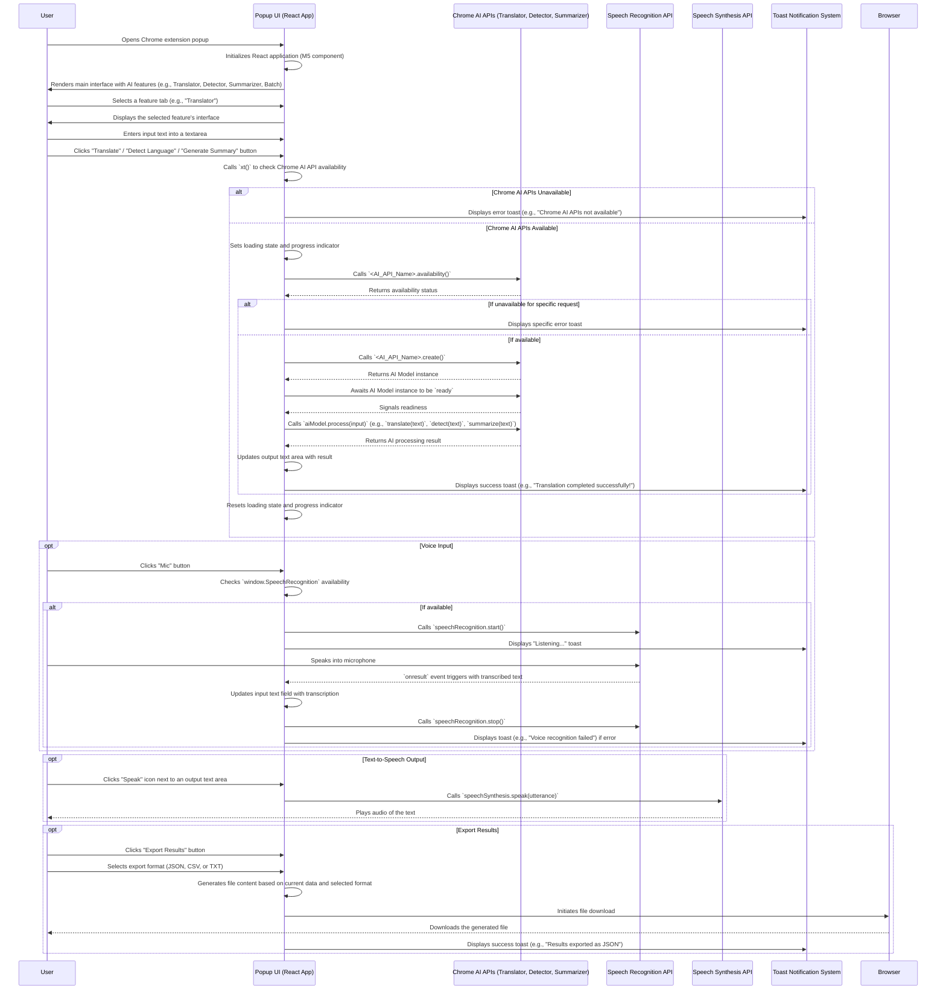

# Chrome AI Playground

- https://chromewebstore.google.com/detail/chrome-ai-playground/dcmocbmlpaneabpbihldcdlabkgmcfac

## 2025-12-14

- 緣起：想找使用 Chrome Built-in AI API 的範例
- 先安裝套件，然後把原始碼找出來
```bash
~/AppData/Local/Google/Chrome/User Data$ find . -name "dcmocbmlpaneabpbihldcdlabkgmcfac"
./Default/Extensions/dcmocbmlpaneabpbihldcdlabkgmcfac
```
- 目錄結構：
```bash
~/git/snippet/js/chrome-extensions/chrome-ai-playground$ tree
.
├── 2.0.0_0
│   ├── _metadata
│   │   ├── computed_hashes.json
│   │   └── verified_contents.json
│   ├── assets
│   │   ├── popup.css
│   │   └── popup.js
│   ├── icon.png
│   ├── index.html
│   └── manifest.json
└── chrome-ai-playground.md

4 directories, 8 files
```
- 把用 Aider 做逆向工程的討論留在這個 Markdown 裡。
```bash
~/git/snippet/js/chrome-extensions/chrome-ai-playground$ git add .
~/git/snippet/js/chrome-extensions/chrome-ai-playground$ aider --no-auto-commits --no-gitignore --model gemini/gemini-2.5-flash --chat-history-file chrome-ai-playground.md
```

> \# aider chat started at 2025-12-14 09:15:32

> C:\Users\jazzw\.local\bin\aider --no-auto-commits --no-gitignore --model gemini/gemini-2.5-flash --chat-history-file chrome-ai-playground.md  
> Aider v0.86.1  
> Model: gemini/gemini-2.5-flash with diff-fenced edit format  
> Cur working dir: C:\Users\jazzw\git\snippet\js\chrome-extensions\chrome-ai-playground  
> Git working dir: C:\Users\jazzw\git\snippet  

> #### /ask could you give me a high-level overview of js\chrome-extensions\chrome-ai-playground?  

This code appears to be the JavaScript for a Chrome extension, specifically for a "Chrome AI Playground."

Here's a high-level overview:
*   **React-based UI**: The code snippets indicate the use of React for building the user interface, including references to "react.transitional.element" and component rendering.
*   **UI Component Library**: It leverages a UI component library, explicitly mentioning Radix UI in a comment (`https://radix-ui.com/primitives/docs/components/`).
*   **AI Output Handling**: The core functionality seems to involve displaying and handling "Output" and "Translation" data, likely from an AI process.
*   **Data Export**: It includes logic for generating and downloading this data as files, supporting both CSV (`chrome-ai-results-${Date.now()}.csv`) and plain text (`chrome-ai-results-${Date.now()}.txt`) formats.
*   **Minified Code**: The presence of short, obfuscated variable and function names (e.g., `zE`, `VE`, `LE`, `bh`, `Rb`) suggests that this is a minified version of the code, typically seen in production builds.

> Tokens: 9.5k sent, 236 received. Cost: \$0.0039 message, \$0.0039 session.  

> #### /read-only js\chrome-extensions\chrome-ai-playground\2.0.0_0\assets\popup.js  
> Added C:\Users\jazzw\git\snippet\js\chrome-extensions\chrome-ai-playground\2.0.0_0\assets\popup.js to read-only files.  

> #### /ask draw a sequence diagram of popup.js using mermaid.js syntax  



> Tokens: 175k sent, 846 received. Cost: \$0.06 message, \$0.07 session.  

> #### /quit  

- SVG 版本循序圖
![](https://mermaid.ink/svg/pako:eNqtV21vIjcQ_ivufilIZMslF5KgKhKXnCqqy4tCcqoqpMPsDouVXdu1vZdwUf57x95XloWDqnxaG894_Mwzj8dvXiBC8Iaehn9S4AFcMxopmkw5wZ-kyrCAScoNedKgNmfvhUzl05hQnX0S_O48AA0MGUnZ3TS4WiqRwGg8kkxbq2xMRmMyuh9r0nlUlOuYGqF65BoMBO5rkiYJVewHqBaXEwkQLB8gEBFnhgmOnqzrbJ7U_rB7bLOfrLhZgmZ63bqcbrd9FFSbW2HYggXUbuEO5WZJfRr9aAMtsH5S4sUhm_1lUT66vMxhHZI7CbwECV4Njqw3af_PLPKldaOxPS2NES5NslxQKeMiks7NKQlEIgUHbrpNJzaAIVrxEJQmCWWcMG5ALWgA5IWZpU3VAqhJFXrvgB_5PfKzpPXIJ2qCZXfbKScQow1CV3gmhs4L51Ovcj_1tgR8zbSM6UoTTBbRzh2EhbdfdXWGbSF8tgvsOpkaYhBpayIwIvtNFdB2syuE9VnXYoSpR37DcQYD-UJ5lNKomP0DOChclGOzwul5aozgRVgt2byicazJ7NV0ujOCIQVLCJ7X64bQ75TFdM5iZlaZIxqbZm098XxZDNma9Q03qVyDFZQSCne3vC7z0vDPhSHVDkWmINbQjGS0K44aK5ASsaAh4xHRxsJGeUikEhFyz-YqtJEK1ealrjMlhr-Pxt8wgG-3NIFLvw4aYlt5qdse1SN6AKSTLfGapYss1ZW1RX68IGmFNlkgdlpCYKElyiqtNpXBAWkondTyUTlyUOPWLWk-GJwAKW9gDZa9oMEU3-CNEmN2EBge7BnD6IUy02JtCT8HMsNowtW-sUxYxCkeyRoxjlQ5CAfKXAg-8ixA246TBCy9nPYzU1R6x0pDd4ZToSv2aqwL5cunuoeDmO9uqY9kT-OtfCmNn2SIQWkiUlNqmBWuTLV3O9lNujSwoTSrv1A8e6fY-yQGK7n54kUax6tfShFw7OThznJ_AH1YwTuH2aeQhnwVDPkyttmq9tmq1zcsqInvjrCurNwiLV5wd_HibzQbsxbxrcnAT2uxrXspuaibf_oIizIbZblnJqfeF4ZtCEd8fd_H8zcEpIZYe1g4S591djUmLFBCLrGNWHfQZrnG8pngGRtnBL5jD0KMYlFkb1_HVFdfgWJzZJMl8d7Er93dCwZxuO5O2lD-tyQI-V9z0KiijLWq1qMukDAQYukQtsh0vqWGGtx_xEMfGXGUN613TgL2qAKXT-QBC3BjbpGzPQ_f0JC2CtlsmxuIlX_52m7TwVrD5gdFvY7cppejsqm7d4DRNGSCiIVr7SpCNBD4_CqFMlZEkFh6j6M3DDa1YFuTCpkh3ukJxUT-Obm77ZGrydcewRv58a_H7k45KTpAjRzFzgBxN7YE5lQj3a2SpkrZCaQ0depXNbNuwzbn-RuiaPxL56hX3MppZZOvrCC-zpdkjXOUBxc6-4ObxC0XRQ5xDhw6xxeSRa1qEXno9bxIsdAbGpVCz0sAz2qH3ptdMvUwugR7yiF-xixamqk35e9ohG-ov4VICjsl0mjpDRd4--ModcKQv2jLJe5pcyVSbrzhyZlz4Q3fvFcc9Qf-oD84OT45G5yenPePP_a8FU4P_A_HHy_OP5xc9PsfB4OL9573w23a98_PTnsehAwvpZvsIe3e0-__AhYQFAM)