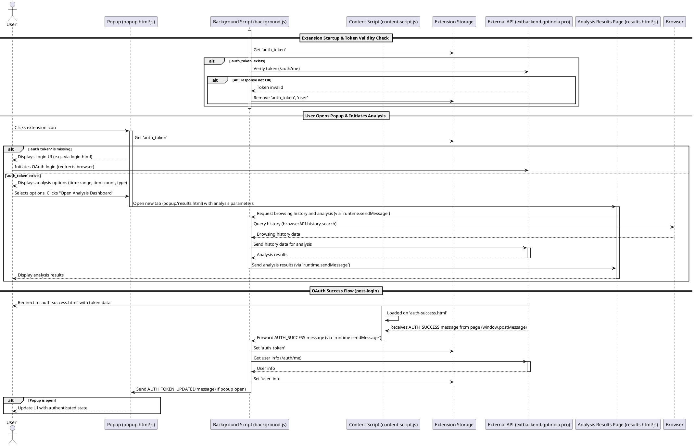

# Reverse Engineering - Know Yourself

- Chrome Webstore
  - https://chromewebstore.google.com/detail/know-yourself/dicpnapnocjahfflfebafhcagkklemcb
- Website
  - https://gptindia.pro/

> \# aider chat started at 2025-11-11 09:21:16

> C:\Users\jazzw\.local\bin\aider --no-gitignore --model gemini/gemini-2.5-flash  
> Aider v0.86.1  
> Model: gemini/gemini-2.5-flash with diff-fenced edit format  
> Git repo: .git with 28 files  
> Repo-map: using 4096 tokens, auto refresh  

##### cloud you give me a high-level overvoew of this repo?  

This repository appears to contain the source code for a **browser extension**.

Here's a high-level overview of its components:

*   **Browser Extension Core:** `manifest.json` defines the extension, while `background.js` handles background operations, including authentication token validity checks. `content-script.js` likely interacts with web pages.
*   **Cross-Browser Compatibility:** `browser-compat.js` provides an abstraction layer for browser APIs (storage, runtime, tabs, history) to ensure compatibility across different browser environments. `browser-polyfill.min.js` further aids in this.
*   **User Interface (Popup):** The `popup/` directory contains HTML and JavaScript files for the extension's user interface, including:
    *   **Login Functionality:** `popup/login.html` and `popup/login.js` (and `popup/login.chrome.js`) handle user authentication.
    *   **Results Display:** `popup/results.html` and `popup/results.js` (along with `popup/results.chrome.js`, `popup/backup.result.crome.js`, `popup/backup2.js`) are responsible for displaying analysis results. These files include functions for formatting markdown, calculating estimated times, and managing countdowns for analysis processes.
    *   **Main Popup:** `popup/popup.html` and `popup/popup.js` (and `popup/popup.chrome.js`) likely form the main interactive popup.
*   **Configuration:** `config.js` and `background-config.js` store configuration settings for the extension.
*   **Assets:** The `icons/` directory contains various icon images for the extension.

##### based on manifest.json, could you explain where is the main function of this browser extension?  

Based on `manifest.json`, the browser extension has several main entry points for its functionality:

1.  **Background Service Worker:** The primary background logic starts in `background.js`, specified by `"background": { "service_worker": "background.js", "type": "module" }`. This script runs independently in the background and handles tasks such as checking token validity and other persistent operations.
2.  **Popup User Interface:** When the user clicks the extension's icon, the interface defined in `popup/popup.html` is displayed, as specified by `"action": { "default_popup": "popup/popup.html" }`. This HTML file, along with its associated JavaScript (like `popup/popup.js`), provides the main interactive experience for the user.
3.  **Content Script:** For interacting with specific web pages, `content-script.js` is injected into `https://extbackend.gptindia.pro/*` pages, as defined under `"content_scripts"`.

##### could you draw a sequence diagram of this browser extension using plantuml syntax?  



![](https://img.plantuml.biz/plantuml/png/bLP9Szem5BupmtzuaqE16I1tfiaq8UaoNP9Yw3LLx0UeiILNaY7y-puj1ij0E-M0iVJMxtiBxxHXobH5tksmr4W52usgs-bsIZhcAI-PC73nACkgX7vf7-ErAVBBNtfm0Ko3ksb9txBqPQLa9J98KiLB0_td_T6urZn8jTIdKXYa7xLkwjz7shtlzOEObsgPk7-bAysbW8HoOYjq6k7t2LabM0utZv-WZw_6neeKwAeqN6ISZKiblKkIQ2dVaE9ESmqpr5Lk20zo07tbtsAeWiYZ2w7RkRg2PfYMXHBUm5oIS_Z1SfvniuFf6jCNkBfozF0DCnW1ru1wT5qdE84FQA37AhD-CjPSZxJp-0JmbMkZknsWJso5ifp03rHykGCd3FrBgtbPuC3BMsCMBKgpb48Z26dWuRE_j1zxEI9J1yEJa1WN6vlQGVHC1ZCiv0QZa8VGgwWuUruNRVhkAyEJq3Y4RJN3Gqae-qebW3y9RZW94vqrUHPU9qaHEB49J7EUlcX2gMQ8KnasI0Xrxut-9_JaiU1QSx7ogGGZPCK6CO4xhikSxJHyaIikO67BShmQ3s736UJsp1LM8ACEtD5sIExXXZnwQLkF6LUOKdq-Axab1TB5NEFvaZWR4wj1azGUH3xq3IyG51Ch708tM41A19WXc5s9hHW3k0dcBfXWObYZVM6PEj1on_JwMJALNKGnNJSxQUBO1O5RCEmvZAZBPlyDOCi9YNtSrB-iGEhva6cZV0AfeSZhqwXlxKtZ05f5FiFV5MhZOIQ2OKsGIhKZzzaXXBubygSYb0YwiQOg_efQaxcVWvRlPa4VTykj9tC2toia7xMlVY2PAc8SpiW9K-awc0zwHorwsuuwOuQT7H49nHr9mfBsHvraAn4tEi-DXZtZWRSZOlRQSHXH7RXmMClIlw4-CpsEU6vtmf6h8tDHtU1-9Fd6JAeqfK3WVIwtjcgr6RbU7RXXr9iJhh2qT_JaeQaflINLBJ2mSn2qDx6iydnd6zqAkX5XrWwnNZq4o7SfkJ0qYnpwTIQpC1Leolj1C0ecNT_qVD_u3U0BOPzQQ_T6hzP-T32XESOoYfwcw0atRVMtev6lhncco3TsJY_c7v-InNHwdoHGUFfWgMH1lMotxPRMjDoEBOY1tC69c9e5zrwgBSsLqvR_MZ8DVbiW_D-6JexMn8aEixl4KSt5KaPREEwCKpsrgFMYc9tutq9o6pRenNBxsIq2RlE7p_VVdXQFTpVp-xi3Udm9RWZJT4SnEBkUxLRq0ztj4XIdzywYpAmcxK0_nGa1mfodhXtelwivzDOxUj8VsJy0)

##### could you draw a flow chart of this browser extension using plantuml syntax?  

```plantuml
@startuml
start

partition "Extension Initialization (Background Script)" {
  :Background script starts;
  if (Auth Token in Storage?) then (Yes)
    :Verify Auth Token with External API;
    if (Token Valid?) then (No)
      :Remove Auth Token and User Info from Storage;
    endif
  endif
}

partition "User Interaction: Popup (popup.html/js)" {
  :User opens extension Popup;
  if (Auth Token in Storage?) then (No - Unauthenticated)
    :Display Login User Interface;
    :User clicks Login/Sign Up button;
    :Browser redirects for OAuth Login on External API page;
    note right
      This external OAuth flow eventually redirects
      to `auth-success.html` which initiates the
      Authentication Success Flow.
    end note
    stop "Awaiting OAuth Redirect & Authentication"

  else (Yes - Authenticated)
    :Display Analysis Options:
      - Time Range
      - Max Items
      - Analysis Focus;
    :User selects desired options;
    :User clicks "Open Analysis Dashboard" button;
    :Open `popup/results.html` in a new browser tab;
  endif
}

partition "Analysis Dashboard (results.html/js)" {
  :Results Dashboard page loads;
  :Retrieves analysis parameters from URL;
  :Displays loading animation and estimated time;
  :Sends message to Background script to start analysis;
  :Background script queries browser.history based on parameters;
  :Background script sends collected history data to External API for analysis;
  :External API processes data and returns analysis results;
  :Background script sends analysis results back to Results Dashboard;
  :Results Dashboard formats and displays the analysis;
}

partition "Authentication Success Flow (Content Script & Background)" {
  note "This flow is triggered by an OAuth redirect to `auth-success.html`"
  start
  :Content Script loads on `auth-success.html`;
  :Content Script receives AUTH_SUCCESS message from web page;
  :Content Script forwards AUTH_SUCCESS message to Background script;
  :Background script saves Auth Token to Extension Storage;
  :Background script fetches User Info from External API;
  :Background script saves User Info to Extension Storage;
  if (Original Popup is currently open?) then (Yes)
    :Background sends AUTH_TOKEN_UPDATED message to Popup;
  endif
  end
}

stop
@enduml
```

![](https://img.plantuml.biz/plantuml/png/ZLPDSzem4Bqpmt_OuT0XXoHtE3Gaa6ccQSXWo4nFYP1bh69BhYI7qax_UtSb6vklJ4ysydwyVVkqourrpBWopxeT_zRjT3i5FgMJMa5lyii9PUdrGU4Ho-Hlvh_qRnbVhumkLGmHDx9m5ptuq-q035fVhFy2Fh8TqbUPG7zKkXJcUYqKI0MHquQjnESBS2cUzByBUq6M6Eb569bieMM_aVXAe8nY6OoU7uR1bC86YnV46E-2FUag5aQRYLo_YtOqXX0NLXWiBj6G69tNQAgmGiKoeTVgvUy1FPKpmc6SJWRmh8koW7v1ZwlKvTdr3xjZnflh0Xa5iIFMU_mdDqyQBc6XM4a_dUJCYRWcQonjaR4jFEeLUZR84iRhSW80dac-ji7kEf8hD2vWMJgdLMrtQ_I6J8s8fH7SMKYqWQa75-8Zy7ORe6X8Kze9C7ALkfhwUIf3nTuyX4aolG7nZcMKBCksJQhQoMbueq8lRScviDQp-GQRLF8KkI4rEc69cDfZrD12n4R13-unqzMkdnvU-6MTBgYXU9vPuPM7z8u-8dU41MmjLZCjA8STrBalOIvp0JEcLg8v-yP-mOCJkMsETX7kDI_jNcEio3pNiR18HOnAyJbEDQytHHKriSRCfalDJDmxQAGtU_Dgl3R2bfchUSGUCb1Y0ykgruujXnz8_JWNzDiHspgVXVEMASa3CitYK0rQE2En-nRlO1KNSx5Se4Pik8cBsMEmhRYttb-g5Rh8FBIOBh2mZduYN_WC6Xn4M8I57BjFUL59npC93_rOsW4OdXbUFqkSGWYqukaAjOotSWjBPgb7gWNyN0ZhuN2TKN_HgGuHCyS8oDvDefksZsd_eXbDgaP0tfiOCCALHhMehFhoCPn3Qoo8hmdDKVU6PvgAI95uwp74TPFmyhJX7yde_1s5_ft6WQLSjL3WKwjjjRQg9OLu3eozkAWT9uR6y9G33XiXIO6ZnVpBQxIukvj4qKupNe8RiMm6sw4_Lhz15ixudzBSsNum3wEP_9KamdveRwGJpebmF4NtWprsj2FFvcqSpwQbnJJ5YIufODXmg1jU6eDyuEocbNPgVxTJUirvgkRJhvEdryNpU3IVZDk4DPkmlNSh3OLXVOC7-6Vb7m00)

##### which LLM model used in this browser extension?  

Based on the `popup/results.html` file, the browsing history is analyzed using **Deepseek AI**.

##### where can I find the logic to analyze browsing history using LLM?  

The actual logic for analyzing browsing history using an LLM (Deepseek AI, as mentioned in `popup/results.html`) resides on an **external API server**, not directly within the browser extension's code.

However, the logic within the extension that orchestrates this analysis can be found in:

1.  **`popup/results.js`** (and its variations like `popup/backup.result.crome.js`, `popup/results.chrome.js`): The `startAnalysis` asynchronous function initiates the process. It constructs a message with analysis parameters (time range, item count, analysis type) and sends it to the background script using `browser.runtime.sendMessage`.
2.  **`background.js`**: This script is responsible for receiving the analysis request from the popup. Although the specific `START_ANALYSIS` message handler is not fully detailed in the provided snippet of `background.js`, this is where the extension would:
    *   Query the user's browsing history using `browserAPI.history.search` (as exposed by `browser-compat.js`).
    *   Send the collected browsing history data to the external API (defined by `API_URL` from `background-config.js`) for the actual AI analysis.
    *   Receive the analysis results back from the API and forward them to the `results.html` page.