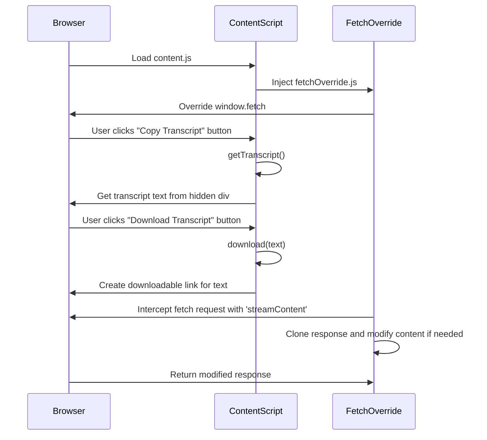
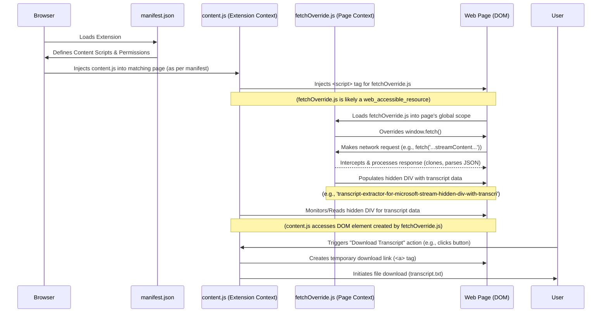
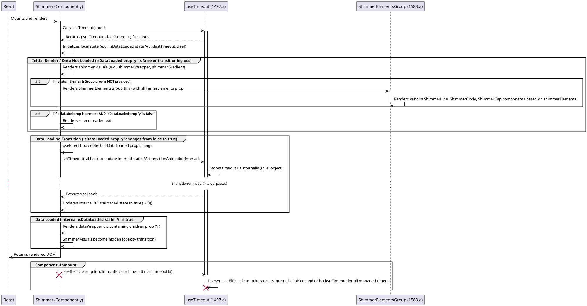
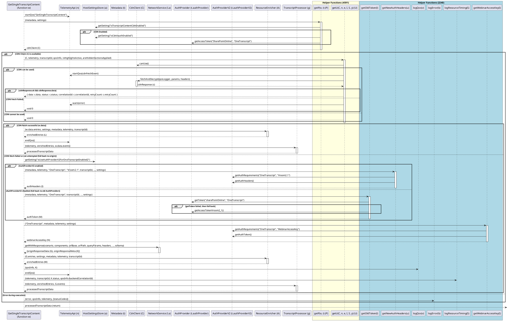

# Reverse Engineering of `Transcript Extractor for Microsoft Stream`

- Transcript Extractor for Microsoft Stream
  - https://chromewebstore.google.com/detail/transcript-extractor-for/pabgaigmlgofdiialamkcpijifmodahl
- Git Repo
  - https://github.com/vullnetyy/stream-transcript-extractor-extension

## 2025-06-16

#### could you based on `manifest.json` to draw a sequence diagram using mermaid.js syntax especially highlight the call graph between content.js and fetchOverride.js?  
> content.js  
> Add file to the chat? (Y)es/(N)o/(A)ll/(S)kip all/(D)on't ask again [Yes]: y  
> fetchOverride.js  
> Add file to the chat? (Y)es/(N)o/(A)ll/(S)kip all/(D)on't ask again [Yes]: y  
> manifest.json  
> Add file to the chat? (Y)es/(N)o/(A)ll/(S)kip all/(D)on't ask again [Yes]: y  

Certainly! Below is a Mermaid.js syntax sequence diagram that highlights the call graph between `content.js` and `fetchOverride.js` as described in your `manifest.json`.



### Explanation:
1. **Browser**: Represents the browser environment where the extension runs.
2. **ContentScript**: The script that runs in the context of web pages, as defined in `content.js`.
3. **FetchOverride**: The script that overrides the native `fetch` function, as defined in `fetchOverride.js`.

- **Sequence Diagram**:
  - The browser loads `content.js`, which injects `fetchOverride.js` into the page.
  - When a user clicks the "Copy Transcript" or "Download Transcript" button, `content.js` calls `getTranscript()` and `download(text)` respectively.
  - `FetchOverride` intercepts fetch requests that include 'streamContent' in the resource URL and modifies the response if necessary.

This diagram should help visualize how the different parts of your extension interact with each other.

> Tokens: 1.5k sent, 387 received.  

> ### aider chat started at 2025-06-16 22:42:00
> C:\Users\jazzw\.local\bin\aider --model ollama/qwen25-coder-7b:q4_k_m --no-auto-commits  
> Aider v0.76.1.dev0+gc838f9bf.d20250509  
> Model: ollama/qwen25-coder-7b:q4_k_m with whole edit format  
> Git repo: ..\..\..\.git\modules\js\chrome-extensions\ms-stream-transcript-extractor with 14 files  
> Repo-map: using 4096.0 tokens, auto refresh  
>
> #### /model gemini/gemini-2.5-flash-preview-05-20  
> Aider v0.76.1.dev0+gc838f9bf.d20250509  
> Main model: `gemini/gemini-2.5-flash-preview-05-20` with whole edit format  
> Weak model: `ollama/qwen25-coder-7b:q4_k_m`  
> Git repo: ..\..\..\.git\modules\js\chrome-extensions\ms-stream-transcript-extractor with 14 files  
> Repo-map: using 4096.0 tokens, auto refresh  
>
> #### /ask could you give me a high-level overview of this git repo?  

This Git repository appears to contain the source code for a **browser extension** designed to extract and download transcripts from online video content, specifically targeting platforms like Microsoft Stream.

Here's a high-level overview of its components and functionality:

*   **Browser Extension Core:**
    *   `manifest.json`: This file defines the extension itself, including its permissions, scripts, and other metadata.
    *   `content.js`: This is a content script that runs within the context of web pages. It's responsible for:
        *   Identifying and extracting the transcript text from a hidden HTML element (`transcript-extractor-for-microsoft-stream-hidden-div-with-transcri`).
        *   Determining a suitable filename for the transcript based on the video title.
        *   Initiating the download of the extracted transcript as a `.txt` file.
    *   `fetchOverride.js`: This script likely runs as a background script or another injected script. Its primary role is to intercept network requests made by the browser (specifically `fetch` calls). It looks for requests containing `streamContent` in their URL, suggesting it's capturing the raw transcript data as it's loaded by the video player. This data is then likely passed to the `content.js` script via a hidden div or message passing.
    *   `styles.css`: Provides styling for any UI elements the extension might inject into web pages.
    *   `icons/`: Contains various sizes of icons for the extension.

*   **Development & Build:**
    *   `package.json` and `package-lock.json`: These indicate a Node.js project, likely used for managing development dependencies or build scripts.
    *   `build.sh`: A shell script for automating the build process of the extension.

*   **Repository Management:**
    *   `.gitignore`: Specifies files and directories that Git should ignore.
    *   `LICENSE.md`: Contains the licensing information for the project.
    *   `README.md`: Provides general information about the project.

In essence, the extension works by "listening" to network traffic to capture transcript data, then provides a mechanism (likely a button or automatic trigger) on the video page to download that captured transcript as a text file, named appropriately after the video.

> #### /ask could you based on `manifest.json` to draw a sequence diagram using mermaid.js syntax especially highlight the call graph between content.js and fetchOverride.js?  

You've asked for a sequence diagram based on `manifest.json` to highlight the call graph between `content.js` and `fetchOverride.js`.

It's important to clarify that the `manifest.json` file doesn't directly define a "call graph" between JavaScript files in the traditional sense (i.e., one function calling another). Instead, it defines **how and when** these scripts are loaded and what permissions they have, which in turn dictates their interaction model.

Based on the code snippets you provided earlier, and the typical architecture of browser extensions that modify `window` objects:

1.  `fetchOverride.js` needs to run in the **web page's isolated context** to override `window.fetch`.
2.  `content.js` runs in the **extension's isolated context** but can interact with the DOM of the web page.
3.  The line `fetchOverride.onload = function () { this.remove();` in `content.js` strongly suggests that `content.js` is responsible for **injecting** `fetchOverride.js` into the page's context. This is a common pattern for content scripts to get code into the page's `window` scope.

Therefore, the `manifest.json` would likely declare `content.js` as a `content_script` and `fetchOverride.js` as a `web_accessible_resource` (so `content.js` can inject it).

Here's a high-level sequence diagram illustrating the inferred interaction flow, assuming `content.js` injects `fetchOverride.js` into the page context:



**Explanation of the "Call Graph" (Interaction Flow):**

*   **`manifest.json`'s Role:** It's the orchestrator, telling the browser *when* and *where* to load `content.js`. It also likely declares `fetchOverride.js` as a `web_accessible_resource` so `content.js` can inject it.
*   **`content.js`'s Role:** It's the primary content script. It's responsible for:
    1.  **Injecting `fetchOverride.js`**: This is the "call" or rather, the *injection* mechanism. `content.js` dynamically adds `fetchOverride.js` into the web page's DOM as a `<script>` tag, allowing it to run in the page's context and modify `window.fetch`.
    2.  **Reading Data**: After `fetchOverride.js` has done its work (intercepting network requests and populating a hidden div), `content.js` reads the extracted transcript data from that hidden div in the page's DOM.
    3.  **User Interaction & Download**: It handles the user's request to download the transcript, using the data it read from the DOM.
*   **`fetchOverride.js`'s Role:** It's the "interceptor." Once injected by `content.js`, it immediately overrides `window.fetch`. When the web page makes a `fetch` request for `streamContent`, `fetchOverride.js` intercepts it, extracts the relevant data, and then places that data into a specific hidden `div` element within the web page's DOM. This hidden div acts as the communication bridge back to `content.js`.

> #### /architect could you code review and refactor this repo in order to make it easy to read?  

- removed this part since the modified code base (even modified by `Gemini 2.5 flash-preview-05-20`) are not workable after testing.

> #### /ask how to test the modified codes?  

To test the modified browser extension, you'll need to load it into your browser in "developer mode" and then navigate to a page where it's expected to function.

Here's a step-by-step guide, primarily for Chrome/Edge (Firefox has a similar process but with slightly different menu names):

### 1. Load the Extension in Your Browser (Developer Mode)

**For Google Chrome or Microsoft Edge:**

1.  **Open your browser.**
2.  **Go to the Extensions page:**
    *   Type `chrome://extensions` (for Chrome) or `edge://extensions` (for Edge) into the address bar and press Enter.
    *   Alternatively, click the three-dot menu (⋮) -> More tools -> Extensions (Chrome) or Settings and more (...) -> Extensions (Edge).
3.  **Enable Developer Mode:** In the top-right corner of the Extensions page, toggle on "Developer mode."
4.  **Load Unpacked Extension:**
    *   Click the "Load unpacked" button that appears.
    *   A file dialog will open. Navigate to the root directory of your Git repository (the folder containing `manifest.json`, `content.js`, `fetchOverride.js`, etc.).
    *   Select this folder and click "Select Folder" (or "Open").
5.  **Verify Loading:** Your extension should now appear in the list of extensions. If there are any errors in `manifest.json` or other core files, you'll see an error message.

### 2. Test the Functionality

Based on the code snippets, this extension is designed to extract transcripts from Microsoft Stream videos.

1.  **Navigate to a Microsoft Stream Video:** Open a new tab and go to a Microsoft Stream video page (e.g., a video hosted on Microsoft 365/SharePoint that uses Stream).
2.  **Observe for the Hidden Div (Optional, for debugging):**
    *   Open your browser's Developer Tools (F12 or right-click -> Inspect).
    *   Go to the "Elements" tab.
    *   Search for the hidden div ID: `transcript-extractor-for-microsoft-stream-hidden-div-with-transcri`. You should see it appear in the DOM, and its `innerText` should contain the transcript data once the video player loads it. This confirms `fetchOverride.js` is working.
3.  **Locate the Download Button:** The `content.js` file has a line:
    ```javascript
    document.getElementById('download-button').addEventListener('click', () => {
        download(getTranscript(), getTranscriptFileName());
    });
    ```
    This implies there should be an HTML element with the ID `download-button` on the page. This button is likely injected by your extension or is expected to be present on the Stream page.
    *   **If the button is part of your extension's UI:** Look for the button that your extension adds to the page.
    *   **If the button is expected to be on the Stream page:** Ensure it exists. If not, you might need to add code to `content.js` to create and inject this button.
4.  **Click the Download Button:** Click the "download-button" on the video page.
5.  **Verify Download:**
    *   A file download should initiate.
    *   **Check the filename:** It should be in the format `transcript-VideoTitle.txt` (e.g., `transcript-MyAwesomeVideo.txt`).
    *   **Check the content:** Open the downloaded `.txt` file. It should contain the full transcript of the video.

### 3. Debugging Tips

If something doesn't work as expected:

*   **Check Extension Errors:** On the `chrome://extensions` page, if your extension has an error, a red "Errors" button will appear. Click it to see the console output for background scripts or manifest errors.
*   **Inspect the Page's Console:**
    *   Open Developer Tools (F12) on the Stream video page.
    *   Go to the "Console" tab.
    *   **For `content.js`:** In the console, there's a dropdown menu (often labeled "top" or "All contexts"). Select the context corresponding to your extension's `content.js` (it might be named after your extension or `content script`). Any `console.log` or errors from `content.js` will appear here.
    *   **For `fetchOverride.js`:** Since `fetchOverride.js` runs in the *page's* context, its `console.error` messages (like the one for `Error processing streamContent response`) will appear in the main "top" context of the console.
*   **Network Tab:** In Developer Tools, go to the "Network" tab. Reload the page. Look for requests that include `streamContent` in their URL. Observe their responses. This can help confirm if `fetchOverride.js` is correctly intercepting and processing these requests.
*   **Elements Tab:** As mentioned, use the "Elements" tab to inspect the DOM and confirm the presence and content of the hidden `div` (`transcript-extractor-for-microsoft-stream-hidden-div-with-transcri`). This is crucial for verifying the communication bridge between `fetchOverride.js` and `content.js`.

By following these steps, you should be able to thoroughly test your modified extension.

> Tokens: 3.4k sent, 1.1k received. Cost: \$0.0012 message, \$0.0041 session.  

> #### aider chat started at 2025-06-16 23:03:46
>
> You can skip this check with --no-gitignore  
> Add .aider* to .gitignore (recommended)? (Y)es/(N)o [Yes]: n  
> C:\Users\jazzw\.local\bin\aider --model ollama/qwen25-coder-7b:q4_k_m --no-auto-commits --auto-lint  
> Aider v0.76.1.dev0+gc838f9bf.d20250509  
> Model: ollama/qwen25-coder-7b:q4_k_m with whole edit format  
> Git repo: ..\..\..\.git\modules\js\chrome-extensions\ms-stream-transcript-extractor with 14 files  
> Repo-map: using 4096.0 tokens, auto refresh  
>
> #### /read-only fetchOverride.js  
> Added C:\Users\jazzw\git\snippet\js\chrome-extensions\ms-stream-transcript-extractor\fetchOverride.js to read-only files.  
>
> #### /ask could you explain the logic written in `fetchOverride.js`?  

Certainly! The code in `fetchOverride.js` is designed to intercept and modify HTTP requests made by the browser, specifically targeting requests that include the string 'streamContent'. Here's a breakdown of how it works:

> [!NOTE]
>
> 這一段很重要，原來這個 Chrome Extension 用了一個很特別的手法：
>
> <mark>override 瀏覽器的 `fetch()` 函數。</mark>
>
> 真好奇作者是怎麼找出這個規則的。

1. **Intercepting Fetch Requests**:
   - The script starts by capturing the original `fetch` function from the global `window` object.
   - It then reassigns `window.fetch` to a new asynchronous function that takes any number of arguments (`...args`).

2. **Handling the Request**:
   - Inside the new `fetch` function, it deconstructs the arguments into `resource` (the URL) and `config` (the request configuration).
   - It then makes an actual fetch call using the original `fetch` function with the provided arguments.

3. **Cloning the Response**:
   - After receiving the response from the server, it clones this response to allow multiple reads of the same data (`const clone = response.clone()`).

4. **Checking for 'streamContent' in Resource URL**:
   - The script checks if the `resource` URL includes the string 'streamContent'. If it does, it proceeds to process the response.

5. **Processing the Response**:
   - It attempts to parse the cloned response as JSON (`clone.json()`).
   - If successful, it extracts the text entries from the JSON data and concatenates them into a single string.
   - A hidden `div` element is created and appended to the document's body. This `div` contains the concatenated text.

6. **Error Handling**:
   - Any errors encountered during the parsing or processing of the response are caught and logged to the console (`catch((err) => console.error(err))`).

7. **Returning the Original Response**:
   - Finally, the script returns the original response object, ensuring that any subsequent code relying on this fetch call receives the unmodified response.

This script is likely used in a browser extension or similar application where the goal is to extract and display transcripts from Microsoft Stream videos. The hidden `div` created by this script can then be accessed and manipulated by other parts of the application (e.g., `content.js`) to provide features like downloading the transcript.

> #### /read-only content.js  
> Added C:\Users\jazzw\git\snippet\js\chrome-extensions\ms-stream-transcript-extractor\content.js to read-only files.  
> 
> #### /ask could you explain the logic written in `content.js`?  

Certainly! The code in `content.js` is designed to enhance the user interface of a web page, specifically for Microsoft Stream videos. It adds buttons for copying and downloading transcripts, as well as a button to close the transcript display. Here's a breakdown of how it works:

1. **Loading `fetchOverride.js`**:
   - The script starts by creating a new `<script>` element.
   - It sets the source of this script to the URL of `fetchOverride.js`, which is obtained using `chrome.runtime.getURL("fetchOverride.js")`.
   - When the script loads, it removes itself from the document (`this.remove()`).
   - The script is appended to the head or document element of the page.

2. **Creating UI Elements**:
   - Three buttons are created: `copyTranscriptButton`, `downloadTranscriptButton`, and `closeButton`.
   - These buttons are added to a wrapper `<div>` element, which is also created.

3. **Setting Button Text and Classes**:
   - The text for each button is set using the `innerHTML` property.
   - Each button is assigned a class name for styling purposes.

4. **Appending UI Elements to the Document**:
   - The wrapper `<div>` containing all the buttons is appended to the body of the document.

5. **Adding Event Listeners**:
   - An event listener is added to each button to handle specific actions when clicked.
     - For `copyTranscriptButton`, it calls the `getTranscript` function and attempts to copy the text to the clipboard using `navigator.clipboard.writeText`.
     - For `downloadTranscriptButton`, it calls the `getTranscript` function and then calls the `download` function with the transcript text.
     - For `closeButton`, it removes the wrapper `<div>` from the document.

6. **Defining Helper Functions**:
   - The `getTranscript` function retrieves the text content from a hidden `div` element with the ID `transcript-extractor-for-microsoft-stream-hidden-div-with-transcript`.
   - The `download` function creates a temporary anchor (`<a>`) element, sets its `href` attribute to a data URL containing the transcript text, and triggers a click event to download the file.
   - The `getTranscriptFileName` function generates a filename based on the video title. If no title is found, it defaults to 'transcript.txt'.

### Summary:

The `content.js` script enhances the user interface of Microsoft Stream videos by adding buttons for copying and downloading transcripts. It uses event listeners to handle button clicks and helper functions to retrieve and manipulate the transcript data. The script also dynamically loads another script (`fetchOverride.js`) to intercept and process fetch requests that contain 'streamContent' in their URLs, allowing it to extract and display the transcript content.

## 結論：

後來在 `fetchOverride.js` 加上了一段 `console.log()` 把呼叫 `fetch()` 函數的 `resource` 列出來。
```diff
diff --git a/fetchOverride.js b/fetchOverride.js
index 963ffc2..66bb263 100644
--- a/fetchOverride.js
+++ b/fetchOverride.js
@@ -8,6 +8,7 @@
 		const clone = response.clone();
 
 		if (resource.includes('streamContent')) {
+			console.log('fetch called with:', resource);
 			clone.json()
 				.then((data) => {
 					const hiddenDiv = document.createElement('div')
```

- 結果發現 console.log() 顯示的結果是這樣： 

```js
fetch called with: https://XXX-my.sharepoint.com/personal/xxxx_xxxx_com/_api/v2.1/drives/b!rw6I54ugwUOX3aLXB2u6hYDVW0zlJuFPqF_YcJdg-jg7Niq09xViSYpaWriU_ntL/items/01TYEPGWAT4I7RMHDNI5EK2DYCYXGTCESZ/media/transcripts/cba3a418-cade-4d4d-8449-42c6e8ca85ef/streamContent?format=json&applyhighlights=false&applymediaedits=false
```

- 打開該 json 檔案，內容根本就跟 webvtt 轉成的 JSON 如出一轍，只差在 schema 更複雜了～

```json
{
    "$schema": "http://stream.office.com/schemas/transcript.json",
    "version": "1.0.0",
    "type": "Transcript",
    "entries": [
        {
            "id": "******-****-****-****-********/***",
            "speechServiceResultId": "xxxxxxxxxxxxxxxxxxxxxxxxxxxxxxxx",
            "text": "So we are having it in a database so that internal to the ****** team we are making them available and the ****** also can access these parts through ******** or any other services.",
            "rawText": null,
            "speakerId": "xxx-xxx-xxx-xxx-xxx@xxx-xxx-xxx-xxx-xxx",
            "speakerDisplayName": "S***** N****",
            "confidence": 0.0,
            "startOffset": "00:00:07.0033780",
            "endOffset": "00:00:20.8033780",
            "hasBeenEdited": false,
            "roomId": null,
            "spokenLanguageTag": "en-us"
        }
    ],
    "events": [
        {
            "id": "xxx-xxx-xxxx-xxx-xxxxx/xxx",
            "eventType": "CallStarted",
            "userId": "xxx-xxx-xxx-xxx-xxx@xxx-xxx-xxx-xxx-xxx",
            "userDisplayName": "Zxx xxx Cxxx",
            "startOffset": "00:00:03.3948247"
        }
    ]
}
```
- 其實備份這個檔案就可以了～甚至，我懷疑把網址從 `/streamContent?format=json` 換成 `/streamContent?format=vtt` 搞不好就可以拿到 `WebVTT` 格式的檔案。

## 2025-07-09

- 備忘：如果需要清洗下載到的 JSON 格式 Stream Transcript 檔案，可以用 `jq` 抓必要的欄位即可。
```bash
jq '.entries[] | {speakerDisplayName, text, startOffset}' 2025-07-09_123059_Supercharging_Your_Daily_Workflow_with_Aider_and_Local_LLMs.json | tee 2025-07-09_Supercharging_Your_Daily_Workflow_with_Aider_and_Local_LLMs.json
```
- 另外，由於 JSON 重複的文字較多，會增加 input token 數量，所以可以只留 Name 跟 Text 就好。經實測，時間戳記對於 LLM 做會議發言摘要的幫助不大。

## 2025-11-13

- 突然靈機一動，想到在拿到 JSON 網址的同時，就直接強迫照會議錄影檔名，觸發存成 JSON 檔的作法。目前實測省下不少手動下載 transcript 
的時間。
- 紀錄一下目前對這個 extension 做的微調：

```diff
gitignore b/.gitignore
index d062a73..6b46265 100644
--- a/.gitignore
+++ b/.gitignore
@@ -130,3 +130,4 @@ dist
 .yarn/build-state.yml
 .yarn/install-state.gz
 .pnp.*
+.aider*
diff --git a/fetchOverride.js b/fetchOverride.js
index 963ffc2..b677463 100644
--- a/fetchOverride.js
+++ b/fetchOverride.js
@@ -8,6 +8,16 @@
 		const clone = response.clone();
 
 		if (resource.includes('streamContent')) {
+			if (resource.includes('?format=json')) {
+				console.log('[!NOTE!] fetch called with:', resource);
+				filename = document.querySelector("[data-unique-id='DocumentTitleContent']").innerText + '.json';
+				console.log('[!NOTE!] document title: ', filename);
+				var dl = document.createElement('a');
+				dl.href = resource;
+				dl.download = filename;
+				console.log(dl)
+				dl.click()
+			}
 			clone.json()
 				.then((data) => {
 					const hiddenDiv = document.createElement('div')
@@ -24,4 +34,4 @@
 
 		return response;
 	};
-})();
\ No newline at end of file
+})();
diff --git a/styles.css b/styles.css
index c9b3c0f..035710e 100644
--- a/styles.css
+++ b/styles.css
@@ -1,9 +1,9 @@
 div.transcript-extractor-wrapper {
 	position: fixed; 
-	top: 0; 
-	right: 0; 
+	top: 55px; 
+	right: 280px; 
 	z-index: 9999;
-	padding: 10px;
+	padding: 1px;
 	border-color: lightcoral;
 	border-width: 1px;
 	border-style: solid;
```
## 2025-12-05

- 突然發現程式碼失效了，沒辦法自動下載。
- 逆向追了一下，原本除錯的 `console.log` 也都沒有印出 `fetch()` 的資訊。
- 改把所有被 override 的 fetch() 拉出來:

```diff
~/git/snippet/js/chrome-extensions/ms-stream-transcript-extractor$ git diff fetchOverride.js
diff --git a/fetchOverride.js b/fetchOverride.js
index 963ffc2..f3e46df 100644
--- a/fetchOverride.js
+++ b/fetchOverride.js
@@ -6,8 +6,19 @@
                const response = await originalFetch(resource, config);

                const clone = response.clone();
+               console.log('[!NOTE!] fetch called with:', resource);

                if (resource.includes('streamContent')) {
                        clone.json()
                                .then((data) => {
                                        const hiddenDiv = document.createElement('div')
@@ -24,4 +35,4 @@

                return response;
        };
-})();
\ No newline at end of file
+})();
```
- 確認原本的 `streamContent` 在 DevTool Console 中消失了。
- 進一步深入搜尋 `?format=json` 有查到這一段：
  - https://res-1.cdn.office.net/files/odsp-web-prod_2025-11-14.002/spstreamhomewebpack/412.js
  - 代表 2025-11-14 Teams 有一版新的 UI，刻意地把這個 extension 會用到的條件換成不同的實作。

> #### aider chat started at 2025-12-05 20:35:22
> C:\Users\jazzw\.local\bin\aider --no-auto-commits --no-gitignore --model gemini/gemini-2.5-flash --chat-history-file 412.js.md 412.js  
> Aider v0.86.1  
> Model: gemini/gemini-2.5-flash with diff-fenced edit format  
> Git repo: ..\..\.git with 1,574 files  
> Warning: For large repos, consider using --subtree-only and .aiderignore  
> See: https://aider.chat/docs/faq.html#can-i-use-aider-in-a-large-mono-repo  
> Repo-map: using 4096 tokens, auto refresh  
> Added js\chrome-extensions\412.js to the chat.  
> Note: in-chat filenames are always relative to the git working dir, not the current working dir.  
> Cur working dir: C:\Users\jazzw\git\snippet\js\chrome-extensions  
> Git working dir: C:\Users\jazzw\git\snippet  

> #### /ask could you draw a sequence diagram of 412.js using plantuml syntax?  

Here is a sequence diagram for the `412.js` file using PlantUML syntax. This diagram focuses on the main `Shimmer` component's lifecycle and its interactions with its direct dependencies defined within this file.



> #### aider chat started at 2025-12-05 20:42:23
> C:\Users\jazzw\.local\bin\aider --no-auto-commits --no-gitignore --model gemini/gemini-2.5-flash --chat-history-file 412.js.md 412.js  
> Aider v0.86.1  
> Model: gemini/gemini-2.5-flash with diff-fenced edit format  
> Git repo: ..\..\.git with 1,574 files  
> Warning: For large repos, consider using --subtree-only and .aiderignore  
> See: https://aider.chat/docs/faq.html#can-i-use-aider-in-a-large-mono-repo  
> Repo-map: using 4096 tokens, auto refresh  
> Added js\chrome-extensions\412.js to the chat.  
> Note: in-chat filenames are always relative to the git working dir, not the current working dir.  
> Cur working dir: C:\Users\jazzw\git\snippet\js\chrome-extensions  
> Git working dir: C:\Users\jazzw\git\snippet  

> #### /ask what is defined in function 4591()?  

In `js\chrome-extensions\412.js`, the module `4591` defines and exports the following:

*   `w`: An asynchronous function responsible for fetching the content of a single transcript. It handles different content variants (highlights, hidden sections) and can use a CDN or fall back to an origin request.
*   `E`: An asynchronous function that updates transcript content using a delta patch. It constructs the request with appropriate authentication headers and logs QoS metrics.
*   `k`: A function that sends a batch update for transcript content using a patch request with `keepalive: true`. It also logs an application logic event.

> #### /ask could you draw a sequence diagram of function w defined in module 4591 using plantuml syntax?  


- 結論：根據 DevTool Networking 的行為與新的程式碼，粗略的判斷是多加了一層，讓 React.js 去讀 webvtt 格式，而不是抓 JSON 格式的 transcript
- 像是 `412.js` 裡就有一個 `case 0` 是讀 `temporaryDownloadUrl`，甚至有一段是對 `temporaryDownloadUrl` 的內容加上 highlight (從行為上是發生在搜尋字幕檔時，會把符合的內容標記出來)

```js
                switch (p.label) {
                  case 0:
                    return (
                      (t = !!e.onePlayerSettingsStore.getSetting(
                        "isOneTranscriptGenerateEnabled",
                        "boolean"
                      )),
                      (n = !!e.onePlayerSettingsStore.getSetting(
                        "isTranscriptForAudioEnabled",
                        "boolean"
                      )),
                      (i = function (t) {
                        if ((0, f.b)(t)) {
                          for (var n = [], a = 0; a < t.length; a++) {
                            var i = t[a];
                            if (null == i ? void 0 : i.temporaryDownloadUrl) {
                              var r = _.addApplyMediaEditsQspToTranscriptUrl(
                                i.temporaryDownloadUrl,
                                e
                              );
                              n.push({
                                url: r,
                                languageTag: i.languageTag,
                                source: i.source,
                                isVisible: i.isVisible,
                              });
                            }
                          }
                          e.player.initializeTextTracks(n);
                        } else e.player.toggleCCButtons(!1);
                      }),
```
- 感想：
  - 很神奇的是 LLM 居然讀得懂 Webpack 編譯後的結果！雖然說原本程式碼就是想辦法讓電腦可以執行，人腦不好讀（降低易讀性，增加執行效率），但 LLM 意外地成為逆向工程的好幫手。

## 2025-12-08

- 跟 Aider + Gemini 2.5 聯手，把 `fetchOverride.js` 改成從 `temporaryDownloadUrl` 下載 WebVTT 檔。
  - 因為
```diff
~/git/snippet/js/chrome-extensions/ms-stream-transcript-extractor$ git diff fetchOverride.js
diff --git a/fetchOverride.js b/fetchOverride.js
index 963ffc2..cd0119a 100644
--- a/fetchOverride.js
+++ b/fetchOverride.js
@@ -6,7 +6,22 @@
                const response = await originalFetch(resource, config);

                const clone = response.clone();
-
+               if (resource.includes('select=media%2Ftranscripts')) {
+                       clone.json()
+                               .then(data => {
+                                       if (data && data.media && data.media.transcripts && data.media.transcripts.length > 0) {
+                                               const temporaryDownloadUrl = data.media.transcripts[0].temporaryDownloadUrl;
+                                               console.log("[!NOTE!] Temporary WebVTT Download URL:", temporaryDownloadUrl);
+                                               var dl = document.createElement('a');
+                                               dl.href = temporaryDownloadUrl;
+                                               console.log(dl);
+                                               dl.click();
+                                       } else {
+                                               console.warn("Could not find temporaryDownloadUrl in transcripts data.");
+                                       }
+                               })
+                               .catch(err => console.error("Error processing transcripts JSON:", err));
+               }
                if (resource.includes('streamContent')) {
                        clone.json()
                                .then((data) => {
@@ -24,4 +39,4 @@

                return response;
        };
-})();
\ No newline at end of file
+})();
```
- ( 2025-12-08 23:42:32 )
- 略為比對了一下 WebVTT 的 `temporaryDownloadUrl` 網址，跟先前看到的其實只有很小的差異。嘗試把先前的邏輯與 `?format=json` 套上去。Bingo!!恢復原本的 JSON 輸出，Yeah!!
```diff
~/git/snippet/js/chrome-extensions/ms-stream-transcript-extractor$ git diff fetchOverride.js
diff --git a/fetchOverride.js b/fetchOverride.js
index 963ffc2..ddc7a00 100644
--- a/fetchOverride.js
+++ b/fetchOverride.js
@@ -6,22 +6,22 @@
                const response = await originalFetch(resource, config);

                const clone = response.clone();
-
-               if (resource.includes('streamContent')) {
+               if (resource.includes('select=media%2Ftranscripts')) {
                        clone.json()
-                               .then((data) => {
-                                       const hiddenDiv = document.createElement('div')
-                                       hiddenDiv.style.display = 'none';
-                                       hiddenDiv.id = 'transcript-extractor-for-microsoft-stream-hidden-div-with-transcript';
-                                       hiddenDiv.innerHTML = data.entries
-                                               .map(x => x.text)
-                                               .reduce((sum, x) => sum + x, "\n");
-
-                                       window.document.body.appendChild(hiddenDiv);
+                               .then(data => {
+                                       if (data && data.media && data.media.transcripts && data.media.transcripts.length > 0) {
+                                               const temporaryDownloadUrl = data.media.transcripts[0].temporaryDownloadUrl;
+                                               console.log("[!NOTE!] Temporary WebVTT Download URL:", temporaryDownloadUrl + '?format=json');
+                                               var dl = document.createElement('a');
+                                               dl.href = temporaryDownloadUrl + '?format=json';
+                                               filename = document.querySelector("[data-unique-id='DocumentTitleContent']").innerText + '.json';
+                                               dl.download = filename;
+                                               console.log(dl);
+                                               dl.click();
+                                       }
                                })
-                               .catch((err) => console.error(err));
+                               .catch(err => console.error("Error processing transcripts JSON:", err));
                }
-
                return response;
        };
-})();
\ No newline at end of file
+})();
```