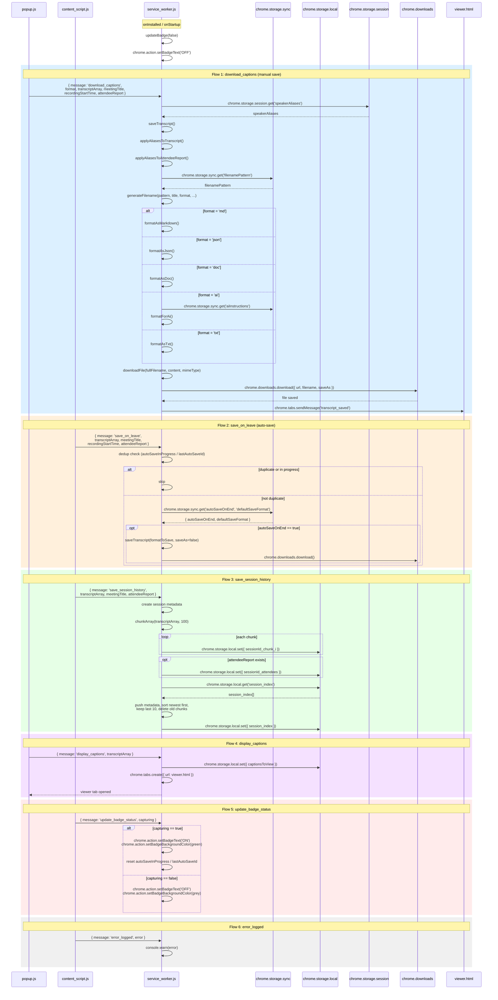
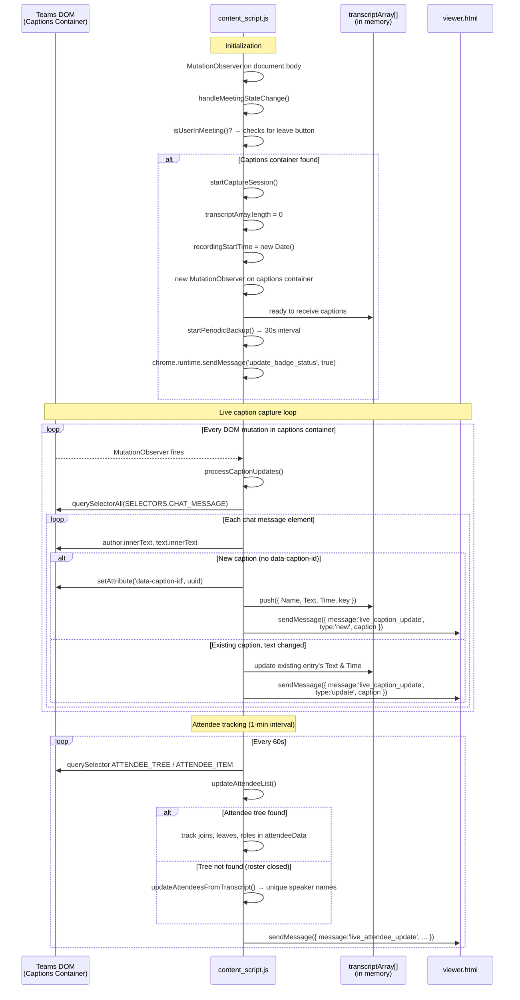
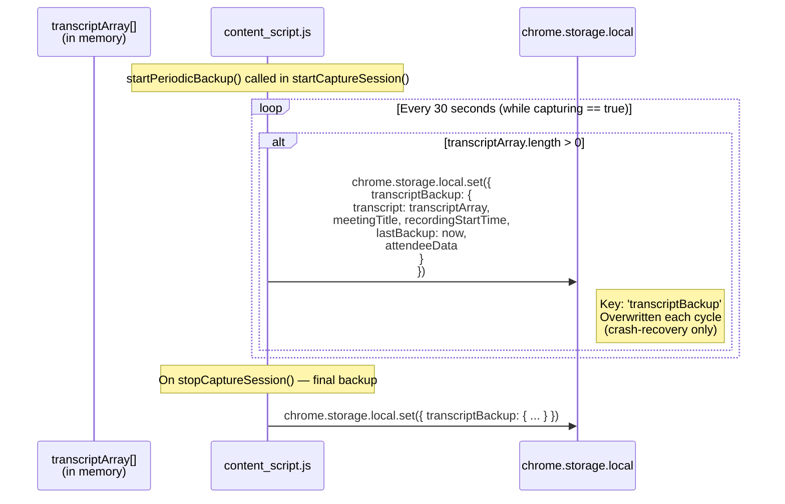
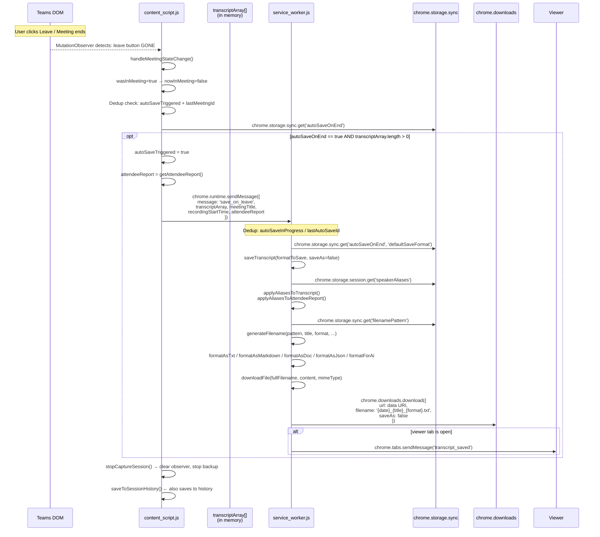
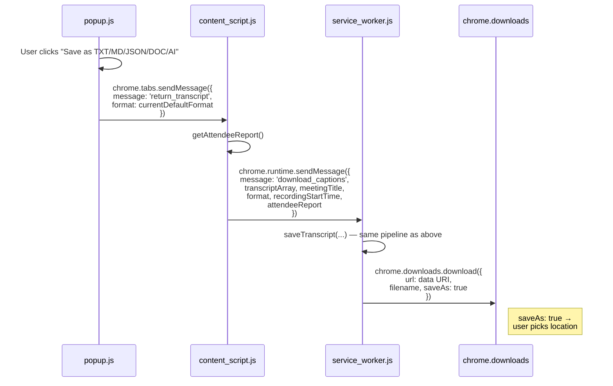
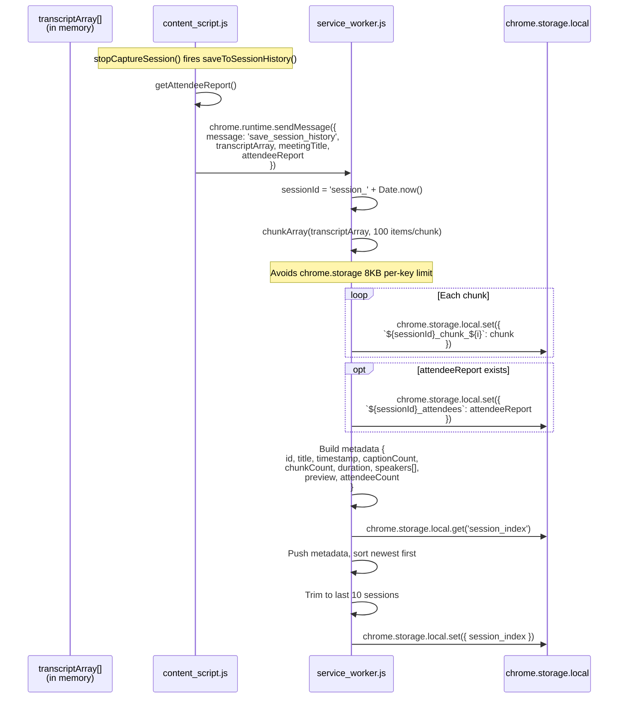

# Teams extension manifest JS relationships

**Session ID:** ses_0ef538bc0ffeDdnL5MmJXi7503
**Created:** 6/29/2026, 7:59:25 AM
**Updated:** 6/29/2026, 8:04:13 AM

---

## User

read @manifest.json and explain to me what are the relationship between those *.js files

---

## Assistant (Plan · Gemini 2.5 Flash · 7.1s)

_Thinking:_

**Analyzing Manifest Relationships**

Okay, I'm focusing on the `manifest.json` now. My task is to unravel the connections between the JavaScript files listed there. I'll need to examine the file and then provide a clear explanation of how each one functions within the broader context of the Chrome extension. It's a key first step!


**Deciphering Script Interconnections**

I'm now diving deeper, mapping the relationships. The `manifest.json` indicates `service_worker.js` as the background handler. `content_script.js` is injected into Teams and interacts with the DOM. I see `viewer.js` paired with `viewer.html` for caption display, accessible by the web page. `sessionManager.js`, also accessible, likely manages caption sessions.


**Clarifying Script Roles**

I've clarified the roles of each script. `service_worker.js` manages events and extension state centrally. `content_script.js` interacts with the Teams DOM for caption capture. `viewer.js` and `sessionManager.js` are utility scripts, with the viewer displaying captions and the manager handling sessions. They are both web accessible.


The `manifest.json` file defines the following relationships between the JavaScript files in the extension:

*   **`service_worker.js`**: This is the background script, acting as the extension's main process. It handles extension-wide events and coordinates communication between different components.
*   **`content_script.js`**: This script is injected directly into Microsoft Teams web pages. Its primary role is to interact with the Teams page, likely to capture live captions.
*   **`viewer.js`**: This script is a "web accessible resource," meaning it can be loaded and used by other parts of the extension (e.g., `popup.html` or `viewer.html`) or even the Teams web page itself. It likely works in conjunction with `viewer.html` to display the captured captions.
*   **`sessionManager.js`**: Also a "web accessible resource," this script probably handles the logic for managing captioning sessions, such as starting, stopping, and saving the caption data. It could be utilized by `content_script.js` or `viewer.js`.

In essence, `service_worker.js` is the core, `content_script.js` is the data gatherer from the Teams page, and `viewer.js` and `sessionManager.js` provide support for displaying and managing that data.

---

## User

let's dig into the detail of @service_worker.js . could you draw a sequence diagram of @service_worker.js using mermaid.js syntax?

---

## Assistant (Plan · Big Pickle · 12.7s)

_Thinking:_

The user wants me to create a sequence diagram using Mermaid.js syntax that illustrates the flow and relationships within `service_worker.js`. Let me analyze the code first to understand the interactions.

Let me trace the main flows:

1. **Initialization**: `onInstalled` and `onStartup` set badge to OFF
2. **Message Handling**: `onMessage` is the main entry point that dispatches to different cases:
   - `save_session_history` - saves meeting to session history
   - `download_captions` - downloads captions in various formats
   - `save_on_leave` - auto-saves when leaving a meeting
   - `display_captions` - opens viewer tab
   - `update_badge_status` - updates extension badge
   - `error_logged` - central error logging

3. **Key helper functions**:
   - `saveTranscript` → `applyAliasesToTranscript` / `applyAliasesToAttendeeReport` → `generateFilename` → format function → `downloadFile`
   - `createViewerTab` → stores data in chrome.storage.local → opens viewer.html
   - `downloadFile` → chrome.downloads.download → notifies viewer tabs

4. **State management**: `lastAutoSaveId`, `autoSaveInProgress`

Let me design a sequence diagram showing the interactions between:
- User / Popup / Content Script (senders of messages)
- Service Worker (the main actor)
- chrome.storage (sync/local/session)
- chrome.downloads
- viewer.html tab

Let me create a comprehensive sequence diagram.

Key interactions:
- Popup/Content Script → Service Worker (messages)
- Service Worker → chrome.storage.sync.get (aliases, settings)
- Service Worker → chrome.storage.local (save session data, captions)
- Service Worker → chrome.downloads.download (save file)
- Service Worker → viewer tab (transcript_saved notification)
- Service Worker → chrome.tabs.create (open viewer)
- Service Worker → chrome.action.setBadgeText (update badge)

Let me think about the structure:

```
Participants:
- Popup (popup.html)
- Content Script (content_script.js)
- Service Worker (service_worker.js)
- chrome.storage.sync
- chrome.storage.local
- chrome.storage.session
- chrome.downloads
- Viewer Tab (viewer.html)

Flows:
1. Init: onInstalled/onStartup → set badge OFF
2. download_captions: Popup → SW → apply aliases → generate filename → format → download
3. save_on_leave: Content Script → SW → check autoSaveOnEnd → save
4. save_session_history: Content Script → SW → chunk storage → update index
5. display_captions: Popup/Content Script → SW → store → open viewer tab
6. update_badge_status: Content Script → SW → update badge
```

I'll create a clean Mermaid sequence diagram.

**Tool: read**

**Input:**
```json
{
  "filePath": "C:\\Users\\jazzw\\git\\snippet\\js\\chrome-extensions\\ms-teams-live-caption-saver\\teams-captions-saver"
}
```

**Output:**
```
<path>C:\Users\jazzw\git\snippet\js\chrome-extensions\ms-teams-live-caption-saver\teams-captions-saver</path>
<type>directory</type>
<entries>
content_script.js
icon.png
manifest.json
popup.html
popup.js
service_worker.js
sessionManager.js
viewer.html
viewer.js

(9 entries)
</entries>
```

---

## Assistant (Plan · Big Pickle · 23.5s)

_Thinking:_

The user wants a sequence diagram of `service_worker.js` using Mermaid.js syntax. Since this is Plan Mode (read-only), I should not create any files. I'll just produce the Mermaid diagram directly in my response.

Let me trace all the flows in the service worker:

1. **Startup flow**: `onInstalled` / `onStartup` → `updateBadge(false)`

2. **`download_captions`** (from popup.js):
   - Popup → SW: `{ message: 'download_captions', transcriptArray, meetingTitle, format, recordingStartTime, attendeeReport }`
   - SW → `chrome.storage.session.get('speakerAliases')`
   - SW → `saveTranscript()` → `applyAliasesToTranscript()` → `applyAliasesToAttendeeReport()` 
   - → `chrome.storage.sync.get('filenamePattern')` → `generateFilename()` 
   - → format function (formatAsTxt/Markdown/Doc/JSON/AI) 
   - → `downloadFile()` → `chrome.downloads.download()`
   - → `chrome.tabs.query` to find viewer → sendMessage('transcript_saved')

3. **`save_on_leave`** (from content_script.js when user leaves meeting):
   - Content Script → SW: `{ message: 'save_on_leave', meetingTitle, transcriptArray, recordingStartTime, attendeeReport }`
   - SW checks `autoSaveInProgress` / `lastAutoSaveId` for dedup
   - SW → `chrome.storage.sync.get(['autoSaveOnEnd', 'defaultSaveFormat'])`
   - If enabled → `saveTranscript()` (with saveAs=false)

4. **`save_session_history`** (from content_script.js or popup):
   - → SW creates session metadata
   - → Chunks transcriptArray (100 items/chunk) → `chrome.storage.local.set()`
   - → Save attendee report → `chrome.storage.local.set()`
   - → Get `session_index` → push metadata → sort → keep last 10 → clean up old
   - → `chrome.storage.local.set({ session_index })`

5. **`display_captions`** (from popup.js):
   - Popup → SW: `{ message: 'display_captions', transcriptArray }`
   - SW → `chrome.storage.local.set({ captionsToView: transcriptArray })`
   - SW → `chrome.tabs.create({ url: viewer.html })`

6. **`update_badge_status`** (from content_script.js):
   - Content Script → SW: `{ message: 'update_badge_status', capturing: true/false }`
   - SW → `updateBadge()` → `chrome.action.setBadgeText()` / `setBadgeBackgroundColor()`
   - If capturing → reset auto-save state

7. **`error_logged`**: Just console.warn

Let me also think about the helper functions and their relationships:

- `getSanitizedMeetingName(fullTitle)` - pure function
- `applyAliasesToTranscript(transcriptArray, aliases)` - pure function
- `applyAliasesToAttendeeReport(attendeeReport, aliases)` - pure function
- `formatAsTxt/Markdown/Doc` - pure functions
- `formatForAi()` - async, reads from `chrome.storage.sync.get('aiInstructions')`
- `escapeHtml()` - pure function
- `generateFilename()` - async, reads from pattern parameter
- `calculateDuration()` - pure function
- `chunkArray()` - pure function

Now let me design the Mermaid sequence diagram. I'll focus on the main message-driven flows since that's the core of the service worker.

I should make the diagram clear with proper participants, alt/opt blocks for conditionals, and notes for key details.

以下是 `service_worker.js` 的 Mermaid 時序圖，以 message type 為主要流程：



**核心參與者與職責：**

| 參與者 | 角色 |
|---|---|
| **popup.js** | 發起手動下載、開啟 viewer |
| **content_script.js** | 發起自動存檔、session 歷史、badge 狀態 |
| **service_worker.js** | 中心調度器 — 接收訊息 → 協調 storage / downloads / badge |
| **chrome.storage.\*** | 持久化：sync(設定)、local(大資料)、session(aliases) |
| **chrome.downloads** | 實際寫出檔案到使用者下載目錄 |
| **viewer.html** | 被動接收 transcript_saved 通知 |

**關鍵特點：**
- 所有訊息處理包在 `chrome.runtime.onMessage` 的 async IIFE 中，`return true` 支援非同步回應
- `save_on_leave` 有重複保護（`autoSaveInProgress` + `lastAutoSaveId`）
- `save_session_history` 以 100 筆為 chunk 避開 storage size limit，並維持最近 10 場會議

---

## User

could you explain to me how does this chrome extension save live caption to local storage? use mermaid.js to draw detailed sequence diagram when needed.

---

## Assistant (Plan · Big Pickle · 5.2s)

_Thinking:_

The user wants a detailed explanation of how the Chrome extension saves live captions to local storage, with Mermaid sequence diagrams. Let me read the content_script.js to understand how captions are captured from the Teams meeting page, since that's the other half of the equation.

Let me read the content script and viewer to understand the full capture pipeline.

**Tool: read**

**Input:**
```json
{
  "filePath": "C:\\Users\\jazzw\\git\\snippet\\js\\chrome-extensions\\ms-teams-live-caption-saver\\teams-captions-saver\\content_script.js"
}
```

**Output:**
```
<path>C:\Users\jazzw\git\snippet\js\chrome-extensions\ms-teams-live-caption-saver\teams-captions-saver\content_script.js</path>
<type>file</type>
<content>
1: // --- Constants ---
2: const TIMING = {
3:     BUTTON_CLICK_DELAY: 400,
4:     RETRY_DELAY: 2000,
5:     MAIN_LOOP_INTERVAL: 5000,
6:     OBSERVER_CHECK_INTERVAL: 10000,
7:     TOOLTIP_DISPLAY_DURATION: 1500,
8:     ATTENDEE_UPDATE_INTERVAL: 60000, // Check attendees every minute
9:     INITIAL_ATTENDEE_DELAY: 1500, // Wait 1.5s after meeting start before first check
10: };
11: 
12: const SELECTORS = {
13:     CAPTIONS_RENDERER: "[data-tid='closed-caption-v2-window-wrapper'], [data-tid='closed-captions-renderer'], [data-tid*='closed-caption']",
14:     CHAT_MESSAGE: '.fui-ChatMessageCompact',
15:     AUTHOR: '[data-tid="author"]',
16:     CAPTION_TEXT: '[data-tid="closed-caption-text"]',
17:     LEAVE_BUTTONS: [
18:         "button[data-tid='hangup-main-btn']",
19:         "button[data-tid='hangup-leave-button']",
20:         "button[data-tid='hangup-end-meeting-button']",
21:         "div#hangup-button button",
22:         "#hangup-button"
23:     ].join(','),
24:     MORE_BUTTON: "button[data-tid='more-button'], button[id='callingButtons-showMoreBtn']",
25:     MORE_BUTTON_EXPANDED: "button[data-tid='more-button'][aria-expanded='true'], button[id='callingButtons-showMoreBtn'][aria-expanded='true']",
26:     LANGUAGE_SPEECH_BUTTON: "div[id='LanguageSpeechMenuControl-id']",
27:     TURN_ON_CAPTIONS_BUTTON: "div[id='closed-captions-button']",
28:     // Attendee tracking selectors
29:     ATTENDEE_TREE: "[role='tree'][aria-label='Attendees']",
30:     ATTENDEE_ITEM: "[data-tid^='participantsInCall-']",
31:     ATTENDEE_COUNT: "#roster-title-section-2",
32:     ATTENDEE_NAME: "[id^='roster-avatar-img-']",
33:     ATTENDEE_ROLE: "[data-tid='ts-roster-organizer-status']",
34:     MEETING_CHAT: "#chat-pane-list",
35:     CHAT_CONTROL_MESSAGE: ".fui-ChatControlMessage",
36:     PEOPLE_BUTTON: "button[data-tid='calling-toolbar-people-button'], button[id='roster-button']",
37: };
38: 
39: // --- State ---
40: const transcriptArray = [];
41: let capturing = false;
42: let meetingTitleOnStart = '';
43: let recordingStartTime = null;
44: let observer = null;
45: let observedElement = null;
46: let hasInitializedListeners = false;
47: let wasInMeeting = false;
48: let meetingObserver = null;
49: let captionsObserver = null;
50: let cachedElements = new Map();
51: let autoEnableInProgress = false;
52: let autoEnableLastAttempt = 0;
53: let autoEnableDebounceTimer = null;
54: let autoSaveTriggered = false;
55: let lastMeetingId = null;
56: 
57: // --- Attendee Tracking State ---
58: let attendeeUpdateInterval = null;
59: let backupInterval = null;
60: let attendeeData = {
61:     allAttendees: new Set(), // All unique attendees who joined
62:     currentAttendees: new Map(), // Currently in meeting (name -> role)
63:     attendeeHistory: [], // Detailed tracking with timestamps
64:     lastUpdated: null,
65:     meetingStartTime: null,
66: };
67: 
68: // --- Real-time Broadcasting ---
69: function broadcastCaptionUpdate(data) {
70:     try {
71:         chrome.runtime.sendMessage({
72:             message: "live_caption_update",
73:             ...data
74:         }).catch(() => {
75:             // Viewer might not be open, ignore error
76:         });
77:     } catch (error) {
78:         // Silent fail if no listeners
79:     }
80: }
81: 
82: function broadcastAttendeeUpdate(data) {
83:     try {
84:         chrome.runtime.sendMessage({
85:             message: "live_attendee_update",
86:             ...data
87:         }).catch(() => {
88:             // Viewer might not be open, ignore error
89:         });
90:     } catch (error) {
91:         // Silent fail if no listeners
92:     }
93: }
94: 
95: // --- Error Handling & Logging ---
96: class ErrorHandler {
97:     static log(error, context = '', silent = false) {
98:         const timestamp = new Date().toISOString();
99:         const errorInfo = {
100:             timestamp,
101:             context,
102:             message: error.message || String(error),
103:             stack: error.stack,
104:             url: window.location.href
105:         };
106:         
107:         console.error(`[Teams Caption Saver] ${context}:`, errorInfo);
108:         
109:         if (!silent) {
110:             // Could send to analytics or show user notification
111:             chrome.runtime.sendMessage({
112:                 message: "error_logged",
113:                 error: errorInfo
114:             }).catch(() => {}); // Prevent recursive errors
115:         }
116:         
117:         return errorInfo;
118:     }
119:     
120:     static wrap(fn, context = '', fallback = null) {
121:         return async function(...args) {
122:             try {
123:                 return await fn.apply(this, args);
124:             } catch (error) {
125:                 ErrorHandler.log(error, context);
126:                 return fallback;
127:             }
128:         };
129:     }
130: }
131: 
132: // --- Retry Mechanism ---
133: class RetryHandler {
134:     static async withRetry(fn, context = '', maxAttempts = 3, baseDelay = 1000) {
135:         let lastError;
136:         
137:         for (let attempt = 1; attempt <= maxAttempts; attempt++) {
138:             try {
139:                 return await fn();
140:             } catch (error) {
141:                 lastError = error;
142:                 
143:                 if (attempt === maxAttempts) {
144:                     ErrorHandler.log(error, `${context} - Final attempt failed`, false);
145:                     throw error;
146:                 }
147:                 
148:                 const delayTime = baseDelay * Math.pow(2, attempt - 1); // Exponential backoff
149:                 console.log(`[Teams Caption Saver] ${context} - Attempt ${attempt} failed, retrying in ${delayTime}ms:`, error.message || error);
150:                 await delay(delayTime);
151:             }
152:         }
153:         
154:         throw lastError;
155:     }
156: }
157: 
158: // --- Utility Functions ---
159: const delay = (ms) => new Promise(resolve => setTimeout(resolve, ms));
160: 
161: const getCleanTranscript = () => transcriptArray.map(({ key, ...rest }) => rest);
162: 
163: // --- DOM Element Caching ---
164: function getCachedElement(selector, expiry = 5000) {
165:     const now = Date.now();
166:     const cached = cachedElements.get(selector);
167:     
168:     if (cached && (now - cached.timestamp) < expiry && document.contains(cached.element)) {
169:         return cached.element;
170:     }
171:     
172:     const element = document.querySelector(selector);
173:     if (element) {
174:         cachedElements.set(selector, { element, timestamp: now });
175:     }
176:     return element;
177: }
178: 
179: function clearElementCache() {
180:     cachedElements.clear();
181: }
182: 
183: const isUserInMeeting = () => getCachedElement(SELECTORS.LEAVE_BUTTONS) !== null;
184: 
185: // --- Core Logic ---
186: const processCaptionUpdates = ErrorHandler.wrap(function() {
187:     const closedCaptionsContainer = getCachedElement(SELECTORS.CAPTIONS_RENDERER);
188:     if (!closedCaptionsContainer) return;
189: 
190:     const transcriptElements = closedCaptionsContainer.querySelectorAll(SELECTORS.CHAT_MESSAGE);
191: 
192:     transcriptElements.forEach(element => {
193:         try {
194:             const authorElement = element.querySelector(SELECTORS.AUTHOR);
195:             const textElement = element.querySelector(SELECTORS.CAPTION_TEXT);
196: 
197:             if (!authorElement || !textElement) return;
198: 
199:             const name = authorElement.innerText.trim();
200:             const text = textElement.innerText.trim();
201:             if (text.length === 0) return;
202: 
203:             let captionId = element.getAttribute('data-caption-id');
204:             if (!captionId) {
205:                 captionId = `caption_${Date.now()}_${Math.random().toString(36).substring(2, 9)}`;
206:                 element.setAttribute('data-caption-id', captionId);
207:             }
208: 
209:             const existingIndex = transcriptArray.findIndex(entry => entry.key === captionId);
210:             const time = new Date().toLocaleTimeString();
211: 
212:             if (existingIndex !== -1) {
213:                 // Update existing entry if text has changed
214:                 if (transcriptArray[existingIndex].Text !== text) {
215:                     transcriptArray[existingIndex].Text = text;
216:                     transcriptArray[existingIndex].Time = time;
217:                     // Broadcast update to viewer
218:                     broadcastCaptionUpdate({
219:                         type: 'update',
220:                         caption: transcriptArray[existingIndex]
221:                     });
222:                 }
223:             } else {
224:                 // Add new entry
225:                 const newCaption = { Name: name, Text: text, Time: time, key: captionId };
226:                 transcriptArray.push(newCaption);
227:                 // Broadcast new caption to viewer
228:                 broadcastCaptionUpdate({
229:                     type: 'new',
230:                     caption: newCaption
231:                 });
232:             }
233:         } catch (error) {
234:             ErrorHandler.log(error, 'Processing individual caption element', true);
235:         }
236:     });
237: }, 'Caption updates processing');
238: 
239: // --- Attendee Tracking Functions ---
240: function updateAttendeesFromTranscript() {
241:     // Fallback method: Extract unique speakers from transcript
242:     const speakers = [...new Set(transcriptArray.map(item => item.Name))];
243:     const currentTime = new Date().toLocaleTimeString();
244:     
245:     speakers.forEach(name => {
246:         if (!attendeeData.allAttendees.has(name)) {
247:             attendeeData.allAttendees.add(name);
248:             attendeeData.currentAttendees.set(name, 'Speaker');
249:             
250:             attendeeData.attendeeHistory.push({
251:                 name,
252:                 role: 'Speaker',
253:                 action: 'detected from transcript',
254:                 time: currentTime
255:             });
256:             
257:             console.log(`Speaker detected from transcript: ${name}`);
258:         }
259:     });
260:     
261:     attendeeData.lastUpdated = currentTime;
262:     console.log(`Attendee update from transcript. Speakers found: ${speakers.length}`);
263: }
264: function updateAttendeeList() {
265:     try {
266:         const attendeeTree = document.querySelector(SELECTORS.ATTENDEE_TREE);
267:         if (!attendeeTree) {
268:             console.log("Attendee tree not found, roster might not be open");
269:             // Fallback: Add speakers from transcript as attendees
270:             updateAttendeesFromTranscript();
271:             return;
272:         }
273:         
274:         const attendeeItems = document.querySelectorAll(SELECTORS.ATTENDEE_ITEM);
275:         const currentTime = new Date().toLocaleTimeString();
276:         
277:         // Clear current attendees for fresh update
278:         const previousAttendees = new Set(attendeeData.currentAttendees.keys());
279:         attendeeData.currentAttendees.clear();
280:         
281:         // Process each attendee
282:         attendeeItems.forEach(item => {
283:             const nameElement = item.querySelector(SELECTORS.ATTENDEE_NAME);
284:             const roleElement = item.querySelector(SELECTORS.ATTENDEE_ROLE);
285:             
286:             if (nameElement) {
287:                 const name = nameElement.textContent.trim();
288:                 const role = roleElement ? roleElement.textContent.trim() : 'Attendee';
289:                 
290:                 // Add to current attendees
291:                 attendeeData.currentAttendees.set(name, role);
292:                 
293:                 // Track in all attendees
294:                 if (!attendeeData.allAttendees.has(name)) {
295:                     attendeeData.allAttendees.add(name);
296:                     
297:                     // Add to history as new join
298:                     attendeeData.attendeeHistory.push({
299:                         name,
300:                         role,
301:                         action: 'joined',
302:                         time: currentTime
303:                     });
304:                     
305:                     console.log(`New attendee detected: ${name} (${role})`);
306:                 }
307:             }
308:         });
309:         
310:         // Check for attendees who left
311:         previousAttendees.forEach(name => {
312:             if (!attendeeData.currentAttendees.has(name)) {
313:                 attendeeData.attendeeHistory.push({
314:                     name,
315:                     action: 'left',
316:                     time: currentTime
317:                 });
318:                 console.log(`Attendee left: ${name}`);
319:             }
320:         });
321:         
322:         attendeeData.lastUpdated = currentTime;
323:         
324:         // Get count from header
325:         const countElement = document.querySelector(SELECTORS.ATTENDEE_COUNT);
326:         if (countElement) {
327:             const countMatch = countElement.textContent.match(/\((\d+)\)/);
328:             if (countMatch) {
329:                 console.log(`Total attendees in meeting: ${countMatch[1]}`);
330:             }
331:         }
332:         
333:         console.log(`Attendee update complete. Current: ${attendeeData.currentAttendees.size}, Total: ${attendeeData.allAttendees.size}`);
334:         
335:     } catch (error) {
336:         ErrorHandler.log(error, 'Updating attendee list', true);
337:     }
338: }
339: 
340: async function tryOpenParticipantPanel() {
341:     try {
342:         const peopleButton = document.querySelector(SELECTORS.PEOPLE_BUTTON);
343:         if (peopleButton && peopleButton.getAttribute('aria-pressed') !== 'true') {
344:             console.log("Attempting to open participant panel for attendee tracking...");
345:             peopleButton.click();
346:             await delay(500); // Wait for panel to open
347:             return true;
348:         }
349:         return false;
350:     } catch (error) {
351:         console.log("Could not open participant panel:", error);
352:         return false;
353:     }
354: }
355: 
356: async function startAttendeeTracking() {
357:     // Check if attendee tracking is enabled
358:     const { trackAttendees, autoOpenAttendees } = await chrome.storage.sync.get(['trackAttendees', 'autoOpenAttendees']);
359:     if (trackAttendees === false) {
360:         console.log("Attendee tracking is disabled in settings");
361:         return;
362:     }
363:     
364:     if (attendeeUpdateInterval) {
365:         clearInterval(attendeeUpdateInterval);
366:     }
367:     
368:     // Reset attendee data for new meeting
369:     attendeeData = {
370:         allAttendees: new Set(),
371:         currentAttendees: new Map(),
372:         attendeeHistory: [],
373:         lastUpdated: null,
374:         meetingStartTime: new Date().toISOString(),
375:     };
376:     
377:     console.log("Starting attendee tracking...");
378:     
379:     // Initial update after delay
380:     setTimeout(async () => {
381:         // Only auto-open participant panel if setting is enabled
382:         if (autoOpenAttendees) {
383:             await tryOpenParticipantPanel();
384:         }
385:         
386:         updateAttendeeList();
387:         
388:         // Then update every minute
389:         attendeeUpdateInterval = setInterval(updateAttendeeList, TIMING.ATTENDEE_UPDATE_INTERVAL);
390:     }, TIMING.INITIAL_ATTENDEE_DELAY);
391: }
392: 
393: function stopAttendeeTracking() {
394:     if (attendeeUpdateInterval) {
395:         clearInterval(attendeeUpdateInterval);
396:         attendeeUpdateInterval = null;
397:         console.log("Stopped attendee tracking");
398:     }
399: }
400: 
401: async function getAttendeeReport() {
402:     // Check if attendee tracking is enabled
403:     const { trackAttendees } = await chrome.storage.sync.get('trackAttendees');
404:     if (trackAttendees === false) {
405:         return null; // Return null if tracking is disabled
406:     }
407:     
408:     const report = {
409:         meetingStartTime: attendeeData.meetingStartTime,
410:         lastUpdated: attendeeData.lastUpdated,
411:         totalUniqueAttendees: attendeeData.allAttendees.size,
412:         currentAttendeeCount: attendeeData.currentAttendees.size,
413:         attendeeList: Array.from(attendeeData.allAttendees),
414:         currentAttendees: Array.from(attendeeData.currentAttendees.entries()).map(([name, role]) => ({
415:             name,
416:             role
417:         })),
418:         attendeeHistory: attendeeData.attendeeHistory
419:     };
420:     
421:     console.log("[Teams Caption Saver] Attendee report generated:", {
422:         totalAttendees: report.totalUniqueAttendees,
423:         attendees: report.attendeeList
424:     });
425:     
426:     return report;
427: }
428: 
429: // --- Event-Driven Meeting Detection ---
430: let meetingStateDebounceTimer = null;
431: let captionsStateDebounceTimer = null;
432: 
433: function setupMeetingObserver() {
434:     if (meetingObserver) return;
435:     
436:     meetingObserver = new MutationObserver(() => {
437:         // Debounce meeting state changes to prevent excessive calls
438:         if (meetingStateDebounceTimer) {
439:             clearTimeout(meetingStateDebounceTimer);
440:         }
441:         meetingStateDebounceTimer = setTimeout(() => {
442:             handleMeetingStateChange();
443:         }, 1000);
444:     });
445:     
446:     meetingObserver.observe(document.body, {
447:         childList: true,
448:         subtree: true,
449:         attributeFilter: ['data-tid']
450:     });
451: }
452: 
453: function setupCaptionsObserver() {
454:     if (captionsObserver) return;
455:     
456:     captionsObserver = new MutationObserver(() => {
457:         // Debounce captions state changes to prevent excessive calls
458:         if (captionsStateDebounceTimer) {
459:             clearTimeout(captionsStateDebounceTimer);
460:         }
461:         captionsStateDebounceTimer = setTimeout(() => {
462:             handleCaptionsStateChange();
463:         }, 1500);
464:     });
465:     
466:     captionsObserver.observe(document.body, {
467:         childList: true,
468:         subtree: true,
469:         attributeFilter: ['data-tid']
470:     });
471: }
472: 
473: const handleMeetingStateChange = ErrorHandler.wrap(async function() {
474:     const nowInMeeting = isUserInMeeting();
475:     
476:     if (wasInMeeting && !nowInMeeting) {
477:         console.log("Meeting transition detected: In -> Out. Checking for auto-save.");
478:         
479:         // Send meeting ended signal to viewer
480:         try {
481:             chrome.runtime.sendMessage({
482:                 message: "meeting_ended"
483:             }).catch(() => {
484:                 // Viewer might not be open, ignore error
485:             });
486:         } catch (error) {
487:             // Silent fail if no listeners
488:         }
489:         
490:         // Generate a unique meeting session ID
491:         const currentMeetingId = `${meetingTitleOnStart}_${recordingStartTime?.toISOString() || Date.now()}`;
492:         
493:         // Prevent duplicate auto-saves for the same meeting session
494:         if (autoSaveTriggered && lastMeetingId === currentMeetingId) {
495:             console.log("Auto-save already triggered for this meeting session, skipping...");
496:             clearElementCache();
497:             wasInMeeting = nowInMeeting;
498:             return;
499:         }
500:         
501:         try {
502:             const { autoSaveOnEnd } = await chrome.storage.sync.get('autoSaveOnEnd');
503:             if (autoSaveOnEnd && transcriptArray.length > 0) {
504:                 console.log("Auto-save is ON and transcript has data. Triggering save.");
505:                 
506:                 // Mark auto-save as triggered before sending message
507:                 autoSaveTriggered = true;
508:                 lastMeetingId = currentMeetingId;
509:                 
510:                 // Send save message without retry (let service worker handle retries if needed)
511:                 const attendeeReport = await getAttendeeReport();
512:                 await chrome.runtime.sendMessage({
513:                     message: "save_on_leave",
514:                     transcriptArray: getCleanTranscript(),
515:                     meetingTitle: meetingTitleOnStart,
516:                     recordingStartTime: recordingStartTime ? recordingStartTime.toISOString() : new Date().toISOString(),
517:                     attendeeReport: attendeeReport
518:                 });
519:                 
520:                 console.log("Auto-save message sent successfully.");
521:             }
522:         } catch (error) {
523:             ErrorHandler.log(error, 'Auto-save on meeting end', false);
524:             // Reset auto-save state on error so it can be retried
525:             autoSaveTriggered = false;
526:         }
527:         
528:         clearElementCache();
529:     }
530:     
531:     wasInMeeting = nowInMeeting;
532:     
533:     if (!nowInMeeting) {
534:         stopCaptureSession();
535:         stopAttendeeTracking();
536:         return;
537:     } else if (!wasInMeeting && nowInMeeting) {
538:         // Reset auto-save state when joining a new meeting
539:         console.log("Meeting transition detected: Out -> In. Resetting auto-save state.");
540:         autoSaveTriggered = false;
541:         lastMeetingId = null;
542:         // Start attendee tracking when entering meeting
543:         startAttendeeTracking();
544:     }
545:     
546:     handleCaptionsStateChange();
547: }, 'Meeting state change handler');
548: 
549: const handleCaptionsStateChange = ErrorHandler.wrap(async function() {
550:     if (!isUserInMeeting()) return;
551:     
552:     const { trackCaptions } = await chrome.storage.sync.get('trackCaptions');
553:     if (trackCaptions === false) {
554:         console.log("Caption tracking disabled, skipping caption state handling");
555:         return;
556:     }
557:     
558:     const captionsContainer = getCachedElement(SELECTORS.CAPTIONS_RENDERER);
559:     if (captionsContainer) {
560:         startCaptureSession();
561:     } else {
562:         stopCaptureSession();
563:         
564:         const { autoEnableCaptions } = await chrome.storage.sync.get('autoEnableCaptions');
565:         if (autoEnableCaptions) {
566:             // Use debounced version to prevent rapid firing
567:             debouncedAutoEnableCaptions();
568:         }
569:     }
570: }, 'Captions state change handler');
571: 
572: function ensureObserverIsActive() {
573:     if (!capturing) return;
574: 
575:     const captionContainer = getCachedElement(SELECTORS.CAPTIONS_RENDERER);
576:     
577:     // If the container doesn't exist or has changed, re-initialize the observer
578:     if (!captionContainer || captionContainer !== observedElement) {
579:         if (observer) {
580:             observer.disconnect();
581:         }
582: 
583:         if (captionContainer) {
584:             observer = new MutationObserver(processCaptionUpdates);
585:             observer.observe(captionContainer, {
586:                 childList: true,
587:                 subtree: true,
588:                 characterData: true,
589:             });
590:             observedElement = captionContainer;
591:             processCaptionUpdates(); // Initial scan
592:         } else {
593:             observedElement = null;
594:         }
595:     }
596: }
597: 
598: async function startCaptureSession() {
599:     // Check if caption tracking is enabled
600:     const { trackCaptions } = await chrome.storage.sync.get('trackCaptions');
601:     if (trackCaptions === false) {
602:         console.log("Caption tracking is disabled in settings");
603:         // Still start attendee tracking if captions are disabled
604:         startAttendeeTracking();
605:         return;
606:     }
607:     
608:     if (capturing) return;
609: 
610:     console.log("New caption session detected. Starting capture.");
611:     transcriptArray.length = 0;
612:     chrome.storage.session.remove('speakerAliases');
613: 
614:     capturing = true;
615:     meetingTitleOnStart = document.title;
616:     recordingStartTime = new Date();
617:     
618:     console.log(`Capture started. Title: "${meetingTitleOnStart}", Time: ${recordingStartTime.toLocaleString()}`);
619:     
620:     // Start periodic backup
621:     startPeriodicBackup();
622:     
623:     // Start attendee tracking
624:     startAttendeeTracking();
625:     
626:     chrome.runtime.sendMessage({ message: "update_badge_status", capturing: true });
627:     
628:     ensureObserverIsActive();
629: }
630: 
631: function startPeriodicBackup() {
632:     // Clear any existing backup interval
633:     if (backupInterval) {
634:         clearInterval(backupInterval);
635:     }
636:     
637:     // Backup transcript every 30 seconds
638:     backupInterval = setInterval(async () => {
639:         if (transcriptArray.length > 0) {
640:             try {
641:                 await chrome.storage.local.set({
642:                     transcriptBackup: {
643:                         transcript: transcriptArray,
644:                         meetingTitle: meetingTitleOnStart,
645:                         recordingStartTime: recordingStartTime ? recordingStartTime.toISOString() : null,
646:                         lastBackup: new Date().toISOString(),
647:                         attendeeData: attendeeData
648:                     }
649:                 });
650:                 console.log(`[Teams Caption Saver] Backup saved: ${transcriptArray.length} entries`);
651:             } catch (error) {
652:                 console.error("[Teams Caption Saver] Backup failed:", error);
653:             }
654:         }
655:     }, 30000); // 30 seconds
656: }
657: 
658: function stopCaptureSession() {
659:     if (!capturing) return;
660: 
661:     console.log("Captions turned off or meeting ended. Capture stopped. Data preserved.");
662:     capturing = false;
663:     if (observer) {
664:         observer.disconnect();
665:         observer = null;
666:     }
667:     observedElement = null;
668:     
669:     // Stop periodic backup
670:     if (backupInterval) {
671:         clearInterval(backupInterval);
672:         backupInterval = null;
673:     }
674:     
675:     // Final backup before stopping
676:     if (transcriptArray.length > 0) {
677:         chrome.storage.local.set({
678:             transcriptBackup: {
679:                 transcript: transcriptArray,
680:                 meetingTitle: meetingTitleOnStart,
681:                 recordingStartTime: recordingStartTime ? recordingStartTime.toISOString() : null,
682:                 lastBackup: new Date().toISOString(),
683:                 attendeeData: attendeeData
684:             }
685:         });
686:         
687:         // Save to session history when meeting ends (even if < 5 minutes)
688:         saveToSessionHistory();
689:     }
690:     
691:     // Stop attendee tracking
692:     stopAttendeeTracking();
693:     
694:     chrome.runtime.sendMessage({ message: "update_badge_status", capturing: false });
695: }
696: 
697: // Save current transcript to session history
698: async function saveToSessionHistory() {
699:     if (transcriptArray.length === 0) return;
700:     
701:     try {
702:         // Use message passing to save session (content scripts can't import modules)
703:         const attendeeReport = await getAttendeeReport();
704:         await chrome.runtime.sendMessage({
705:             message: "save_session_history",
706:             transcriptArray: transcriptArray,
707:             meetingTitle: meetingTitleOnStart || 'Untitled Meeting',
708:             attendeeReport: attendeeReport
709:         });
710:         
711:         console.log('[Teams Caption Saver] Session saved to history');
712:     } catch (error) {
713:         console.log('[Teams Caption Saver] Could not save to session history:', error);
714:     }
715: }
716: 
717: // --- Automated Features ---
718: async function attemptAutoEnableCaptions() {
719:     // Prevent multiple simultaneous auto-enable attempts
720:     if (autoEnableInProgress) {
721:         console.log("Auto-enable already in progress, skipping...");
722:         return;
723:     }
724:     
725:     // Prevent too frequent attempts (min 10 seconds between attempts)
726:     const now = Date.now();
727:     if (now - autoEnableLastAttempt < 10000) {
728:         console.log("Auto-enable attempted too recently, skipping...");
729:         return;
730:     }
731:     
732:     autoEnableInProgress = true;
733:     autoEnableLastAttempt = now;
734:     
735:     try {
736:         console.log("Starting auto-enable captions attempt...");
737:         
738:         const moreButton = getCachedElement(SELECTORS.MORE_BUTTON);
739:         if (!moreButton) {
740:             console.error("Auto-enable FAILED: Could not find 'More' button.");
741:             return;
742:         }
743:         
744:         // Check if More menu is already expanded
745:         const expandedMoreButton = getCachedElement(SELECTORS.MORE_BUTTON_EXPANDED);
746:         if (!expandedMoreButton) {
747:             console.log("Clicking More button...");
748:             moreButton.click();
749:             await delay(TIMING.BUTTON_CLICK_DELAY);
750:         } else {
751:             console.log("More menu already expanded, proceeding...");
752:         }
753: 
754:         const langAndSpeechButton = getCachedElement(SELECTORS.LANGUAGE_SPEECH_BUTTON);
755:         if (!langAndSpeechButton) {
756:             console.error("Auto-enable FAILED: Could not find 'Language and speech' menu item.");
757:             // Close the More menu if we opened it
758:             const currentExpandedButton = getCachedElement(SELECTORS.MORE_BUTTON_EXPANDED);
759:             if (currentExpandedButton) {
760:                 currentExpandedButton.click();
761:             }
762:             return;
763:         }
764:         
765:         console.log("Clicking Language and speech...");
766:         langAndSpeechButton.click();
767:         await delay(TIMING.BUTTON_CLICK_DELAY);
768: 
769:         const turnOnCaptionsButton = getCachedElement(SELECTORS.TURN_ON_CAPTIONS_BUTTON);
770:         if (turnOnCaptionsButton) {
771:             console.log("Clicking Turn on live captions...");
772:             turnOnCaptionsButton.click();
773:             await delay(TIMING.BUTTON_CLICK_DELAY);
774:         } else {
775:             console.error("Auto-enable FAILED: Could not find 'Turn on live captions' button.");
776:         }
777: 
778:         // Attempt to close the 'More' menu
779:         const finalExpandedButton = getCachedElement(SELECTORS.MORE_BUTTON_EXPANDED);
780:         if (finalExpandedButton) {
781:             console.log("Closing More menu...");
782:             finalExpandedButton.click();
783:         }
784:         
785:         console.log("Auto-enable captions attempt completed.");
786:     } catch (e) {
787:         console.error("Error during auto-enable captions attempt:", e);
788:     } finally {
789:         autoEnableInProgress = false;
790:     }
791: }
792: 
793: function debouncedAutoEnableCaptions() {
794:     if (autoEnableDebounceTimer) {
795:         clearTimeout(autoEnableDebounceTimer);
796:     }
797:     
798:     autoEnableDebounceTimer = setTimeout(() => {
799:         attemptAutoEnableCaptions();
800:     }, 2000); // 2 second debounce to prevent rapid firing
801: }
802: 
803: // --- Event-Driven Initialization ---
804: function initializeEventDrivenSystem() {
805:     if (hasInitializedListeners) return;
806:     
807:     console.log("Initializing event-driven caption system...");
808:     
809:     // Set up observers for meeting state changes
810:     setupMeetingObserver();
811:     setupCaptionsObserver();
812:     
813:     // Periodically check observer status (much less frequent than before)
814:     setInterval(ensureObserverIsActive, TIMING.OBSERVER_CHECK_INTERVAL);
815:     
816:     // Initial state check
817:     handleMeetingStateChange();
818:     
819:     hasInitializedListeners = true;
820: }
821: 
822: // --- Memory Leak Prevention ---
823: function cleanupObservers() {
824:     if (observer) {
825:         observer.disconnect();
826:         observer = null;
827:     }
828:     if (meetingObserver) {
829:         meetingObserver.disconnect();
830:         meetingObserver = null;
831:     }
832:     if (captionsObserver) {
833:         captionsObserver.disconnect();
834:         captionsObserver = null;
835:     }
836:     
837:     // Clear all debounce timers
838:     if (meetingStateDebounceTimer) {
839:         clearTimeout(meetingStateDebounceTimer);
840:         meetingStateDebounceTimer = null;
841:     }
842:     if (captionsStateDebounceTimer) {
843:         clearTimeout(captionsStateDebounceTimer);
844:         captionsStateDebounceTimer = null;
845:     }
846:     if (autoEnableDebounceTimer) {
847:         clearTimeout(autoEnableDebounceTimer);
848:         autoEnableDebounceTimer = null;
849:     }
850:     
851:     // Reset auto-enable state
852:     autoEnableInProgress = false;
853:     
854:     // Stop attendee tracking
855:     stopAttendeeTracking();
856:     
857:     clearElementCache();
858: }
859: 
860: // Cleanup on page unload
861: window.addEventListener('beforeunload', cleanupObservers);
862: 
863: // Initialize the system
864: initializeEventDrivenSystem();
865: 
866: // --- Message Handling ---
867: chrome.runtime.onMessage.addListener((request, _sender, sendResponse) => {
868:     switch (request.message) {
869:         case 'viewer_ready':
870:             // Viewer is ready to receive live updates
871:             sendResponse({
872:                 streaming: capturing,
873:                 captionCount: transcriptArray.length
874:             });
875:             return true;
876:             
877:         case 'get_status':
878:             (async () => {
879:                 const { trackCaptions } = await chrome.storage.sync.get('trackCaptions');
880:                 const attendeeReport = await getAttendeeReport();
881:                 sendResponse({
882:                     capturing: trackCaptions !== false ? capturing : false,
883:                     captionCount: transcriptArray.length,
884:                     isInMeeting: isUserInMeeting(),
885:                     attendeeCount: attendeeReport ? attendeeReport.totalUniqueAttendees : 0
886:                 });
887:             })();
888:             return true; // Will respond asynchronously
889: 
890:         case 'return_transcript':
891:             if (transcriptArray.length > 0) {
892:                 (async () => {
893:                     const attendeeReport = await getAttendeeReport();
894:                     console.log("[Teams Caption Saver] Sending transcript with attendee report:", {
895:                         transcriptCount: transcriptArray.length,
896:                         attendeeCount: attendeeReport ? attendeeReport.totalUniqueAttendees : 0,
897:                         attendees: attendeeReport ? attendeeReport.attendeeList : []
898:                     });
899:                     chrome.runtime.sendMessage({
900:                         message: "download_captions",
901:                         transcriptArray: getCleanTranscript(),
902:                         meetingTitle: meetingTitleOnStart,
903:                         format: request.format,
904:                         recordingStartTime: recordingStartTime ? recordingStartTime.toISOString() : new Date().toISOString(),
905:                         attendeeReport: attendeeReport
906:                     });
907:                 })();
908:             } else {
909:                 alert("No captions were captured. Please ensure captions are turned on in the meeting.");
910:             }
911:             break;
912: 
913:         case 'get_transcript_for_copying':
914:             sendResponse({ transcriptArray: getCleanTranscript() });
915:             break;
916: 
917:         case 'get_captions_for_viewing':
918:             if (transcriptArray.length > 0) {
919:                 chrome.runtime.sendMessage({
920:                     message: "display_captions",
921:                     transcriptArray: getCleanTranscript()
922:                 });
923:             } else {
924:                 alert("No captions were captured. Please ensure captions are turned on in the meeting.");
925:             }
926:             break;
927: 
928:         case 'get_unique_speakers':
929:             const speakers = [...new Set(transcriptArray.map(item => item.Name))];
930:             sendResponse({ speakers });
931:             break;
932:             
933:         case 'get_attendee_report':
934:             (async () => {
935:                 const attendeeReport = await getAttendeeReport();
936:                 sendResponse({ attendeeReport: attendeeReport });
937:             })();
938:             return true; // Will respond asynchronously
939:         
940:         default:
941:             console.log("Unhandled message received in content script:", request.message);
942:             break;
943:     }
944: 
945:     return true; // Indicates an asynchronous response may be sent.
946: });
947: 
948: console.log("Teams Captions Saver content script is running.");

(End of file - total 948 lines)
</content>
```

**Tool: read**

**Input:**
```json
{
  "filePath": "C:\\Users\\jazzw\\git\\snippet\\js\\chrome-extensions\\ms-teams-live-caption-saver\\teams-captions-saver\\popup.js"
}
```

**Output:**
```
<path>C:\Users\jazzw\git\snippet\js\chrome-extensions\ms-teams-live-caption-saver\teams-captions-saver\popup.js</path>
<type>file</type>
<content>
1: // --- Constants for DOM Elements and Data ---
2: const UI_ELEMENTS = {
3:     statusMessage: document.getElementById('status-message'),
4:     manualStartInfo: document.getElementById('manual-start-info'),
5:     copyButton: document.getElementById('copyButton'),
6:     copyDropdownButton: document.getElementById('copyDropdownButton'),
7:     copyOptions: document.getElementById('copyOptions'),
8:     saveButton: document.getElementById('saveButton'),
9:     saveDropdownButton: document.getElementById('saveDropdownButton'),
10:     saveOptions: document.getElementById('saveOptions'),
11:     viewButton: document.getElementById('viewButton'),
12:     defaultSaveFormatSelect: document.getElementById('defaultSaveFormat'),
13:     autoEnableCaptionsToggle: document.getElementById('autoEnableCaptionsToggle'),
14:     autoSaveOnEndToggle: document.getElementById('autoSaveOnEndToggle'),
15:     trackCaptionsToggle: document.getElementById('trackCaptionsToggle'),
16:     trackAttendeesToggle: document.getElementById('trackAttendeesToggle'),
17:     autoOpenAttendeesToggle: document.getElementById('autoOpenAttendeesToggle'),
18:     timestampFormat: document.getElementById('timestampFormat'),
19:     filenamePattern: document.getElementById('filenamePattern'),
20:     meetingType: document.getElementById('meetingType'),
21:     templateName: document.getElementById('templateName'),
22:     saveTemplateBtn: document.getElementById('saveTemplateBtn'),
23:     deleteTemplateBtn: document.getElementById('deleteTemplateBtn'),
24:     customTemplatesGroup: document.getElementById('customTemplatesGroup'),
25:     aiInstructions: document.getElementById('aiInstructions'),
26:     speakerAliasList: document.getElementById('speaker-alias-list'),
27:     promptButtons: document.querySelectorAll('.prompt-button'),
28:     // Session History Elements
29:     sessionHistory: document.getElementById('sessionHistory'),
30:     historyButton: document.getElementById('historyButton'),
31:     sessionList: document.getElementById('sessionList')
32: };
33: 
34: 
35: const MEETING_TYPE_PROMPTS = {
36:     "executive": "You are an executive assistant preparing a comprehensive meeting brief. Analyze this transcript and create a structured summary with:\n\n## Executive Summary\nProvide a 2-3 sentence overview of the meeting's purpose and outcome.\n\n## Key Decisions Made\nList each decision with:\n- The decision itself\n- Who made it\n- Impact/rationale\n- Timeline if mentioned\n\n## Action Items & Owners\nFormat as a table:\n| Owner | Action | Due Date | Priority |\n\n## Critical Discussion Points\n- Highlight 3-5 most important topics discussed\n- Include any concerns or risks raised\n\n## Follow-up Required\nList items needing attention from leadership\n\n## Metrics & KPIs Mentioned\nExtract any numbers, targets, or measurements discussed\n\nBe concise but thorough. Focus on what executives need to know and act upon.",
37:     "standup": "You are a scrum master analyzing this daily standup. Create a comprehensive summary with:\n\n## Team Status Overview\nOne-line health check of the team's progress\n\n## Individual Updates\nFor each team member, capture:\n- ✅ Completed yesterday\n- 🎯 Working on today\n- 🚧 Blockers/impediments\n\n## Blocked Items Requiring Attention\nPrioritize by impact on sprint goals\n\n## Action Items\n- Include who will help resolve blockers\n- Note any meetings needed\n\n## Sprint Health Indicators\n- Are we on track for sprint goals?\n- Any risks to delivery?\n\nHighlight patterns across multiple team members (e.g., common blockers).",
38:     "retrospective": "You are an agile coach facilitating continuous improvement. Analyze this retrospective and produce:\n\n## Sprint Sentiment\nOverall team morale and satisfaction (based on tone and feedback)\n\n## What Went Well\n- Group by themes (e.g., Process, Communication, Technical)\n- Note frequency if mentioned multiple times\n- Identify practices to continue\n\n## What Could Be Improved\n- Categorize by impact (High/Medium/Low)\n- Include root causes if discussed\n- Link related issues\n\n## Action Items (SMART format)\nFor each action:\n- Specific action to take\n- Owner(s)\n- Success criteria\n- Target completion date\n- Expected impact\n\n## Trends from Previous Retros\nIdentify recurring themes or unresolved issues\n\n## Team Dynamics Observations\nNote participation levels and any team health indicators",
39:     "planning": "You are a product manager optimizing sprint planning. Extract and organize:\n\n## Sprint Goal\nClear, measurable objective for this sprint\n\n## Capacity Planning\n- Team availability (holidays, meetings)\n- Velocity comparison to previous sprints\n- Risk buffer included?\n\n## Committed User Stories\n| Story ID | Title | Story Points | Assignee | Acceptance Criteria Met? |\n\n## Technical Dependencies\n- Internal dependencies between stories\n- External team dependencies\n- Blocker mitigation plans\n\n## Risks & Mitigation\n- Identified risks to sprint success\n- Mitigation strategies discussed\n\n## Definition of Done Reminders\nAny special criteria for this sprint\n\n## Parking Lot\nItems discussed but deferred to next sprint\n\nCalculate total story points and flag if over/under capacity.",
40:     "review": "You are a senior architect conducting a thorough design review. Document:\n\n## Design Overview\nBrief description of what was reviewed\n\n## Architectural Decisions\nFor each major decision:\n- Decision made\n- Alternatives considered\n- Trade-offs accepted\n- Technical rationale\n\n## Concerns & Risks Identified\nCategorize by:\n- 🔴 Critical (blocks implementation)\n- 🟡 Important (needs resolution soon)\n- 🟢 Minor (can be addressed later)\n\n## Approved Changes\n- What was approved\n- Conditions/requirements\n- Impact on timeline\n\n## Technical Debt Acknowledged\n- What debt was accepted\n- Plan to address it\n\n## Follow-up Actions\n| Action | Owner | Due Date | Required For |\n\n## Compliance & Standards\nNote any deviations from standards and justifications\n\n## Performance Considerations\nAny performance impacts discussed",
41:     "interview": "You are a hiring manager evaluating candidates objectively. Structure your assessment as:\n\n## Candidate Overview\n- Role interviewed for\n- Interview round/type\n- Interviewers present\n\n## Technical Competencies Demonstrated\nRate each skill discussed:\n- Skill: [Strong/Adequate/Needs Development/Not Assessed]\n- Evidence from conversation\n\n## Behavioral Indicators\nUsing STAR format when possible:\n- Situation described\n- Actions taken\n- Results achieved\n- Competency demonstrated\n\n## Cultural Fit Observations\n- Alignment with company values\n- Team collaboration potential\n- Communication style\n\n## Red Flags or Concerns\n- Be specific and objective\n- Quote relevant statements\n\n## Strengths Highlighted\n- Unique value propositions\n- Standout moments\n\n## Questions from Candidate\n- What they asked about\n- Indicates interest/research level\n\n## Recommended Next Steps\n- Clear hire/no-hire recommendation\n- If proceeding, what to explore further\n- If not, specific gaps to document",
42:     "allhands": "You are a communications director ensuring company-wide alignment. Create a digest with:\n\n## Meeting Headline\nOne impactful sentence summarizing the main message\n\n## Leadership Messages\n- Key points from each executive\n- Strategic priorities emphasized\n- Cultural messages reinforced\n\n## Company Metrics Shared\n| Metric | Current | Target | Trend |\n\n## Major Announcements\nFor each announcement:\n- What's changing/new\n- Why it matters\n- Timeline\n- Impact on teams\n\n## Recognition & Celebrations\n- Teams/individuals recognized\n- Achievements celebrated\n\n## Q&A Highlights\n- Most important questions asked\n- Leadership responses\n- Concerns addressed\n\n## Action Items by Department\nWhat each team needs to do differently\n\n## Resources Mentioned\n- Links, documents, or tools referenced\n\n## Next All-Hands Preview\nTopics to be covered next time",
43:     "1on1": "You are a people manager focused on employee development. Document this 1:1 with:\n\n## Meeting Context\n- Manager and direct report names\n- Recurring or special 1:1?\n\n## Employee Well-being Check\n- Overall morale/satisfaction\n- Work-life balance indicators\n- Any personal concerns affecting work\n\n## Performance Discussion\n- Progress on current goals\n- Achievements to celebrate\n- Areas for improvement\n- Specific feedback exchanged\n\n## Career Development\n- Growth aspirations discussed\n- Skills to develop\n- Opportunities identified\n- Training/mentoring needs\n\n## Challenges & Support Needed\n- Current obstacles\n- Resources requested\n- Manager commitments to help\n\n## Action Items\n| Who | What | By When |\n\n## Topics for Next 1:1\n- Follow-ups needed\n- Topics parked for later\n\n## Manager Notes (Confidential)\n- Performance trends\n- Development opportunities\n- Team dynamics observations\n\nMaintain professional tone while capturing coaching moments.",
44:     "brainstorm": "You are an innovation strategist maximizing creative output. Organize this session into:\n\n## Session Objective\nWhat problem were we trying to solve?\n\n## Ideas Generated (Grouped by Theme)\nOrganize ideas into logical categories:\n\n### Category 1\n- Idea (contributor)\n- Build on this: [related ideas]\n\n### Category 2\n- Continue pattern...\n\n## Top Ideas by Engagement\nList 5-7 ideas that generated most discussion/excitement:\n1. Idea - Why it resonated\n2. Continue...\n\n## Feasibility Quick Assessment\n| Idea | Impact | Effort | Priority |\n| --- | --- | --- | --- |\n| Top ideas... | High/Med/Low | High/Med/Low | 1-5 |\n\n## Wild Cards\nUnconventional ideas worth noting (even if not practical)\n\n## Next Steps\n- Which ideas move to validation?\n- Who owns follow-up?\n- Timeline for decisions\n\n## Parking Lot\nGood ideas outside current scope\n\n## Session Effectiveness\n- Participation level\n- Diversity of ideas\n- Did we meet objective?\n\nCapture the energy and creativity while maintaining actionable output."
45: };
46: 
47: let currentDefaultFormat = 'txt';
48: 
49: // --- Error Handling ---
50: function safeExecute(fn, context = '', fallback = null) {
51:     try {
52:         return fn();
53:     } catch (error) {
54:         console.error(`[Teams Caption Saver] ${context}:`, error);
55:         return fallback;
56:     }
57: }
58: 
59: // --- Utility Functions ---
60: function escapeHtml(str) {
61:     const div = document.createElement('div');
62:     div.textContent = str;
63:     return div.innerHTML;
64: }
65: 
66: async function getActiveTeamsTab() {
67:     const tabs = await chrome.tabs.query({ active: true, currentWindow: true });
68:     const teamsTab = tabs.find(tab => 
69:         tab.url?.startsWith("https://teams.microsoft.com") ||
70:         tab.url?.startsWith("https://teams.cloud.microsoft") || 
71:         tab.url?.startsWith("https://teams.live.com") 
72:     );
73:     return teamsTab || null;
74: }
75: 
76: async function formatTranscript(transcript, aliases, type = 'standard') {
77:     const processed = transcript.map(entry => ({
78:         ...entry,
79:         Name: aliases[entry.Name] || entry.Name
80:     }));
81: 
82:     if (type === 'ai') {
83:         const { aiInstructions: instructions } = await chrome.storage.sync.get('aiInstructions');
84:         const transcriptText = processed.map(entry => `[${entry.Time}] ${entry.Name}: ${entry.Text}`).join('\n\n');
85:         return instructions ? `${instructions}\n\n---\n\n${transcriptText}` : transcriptText;
86:     }
87: 
88:     return processed.map(entry => `[${entry.Time}] ${entry.Name}: ${entry.Text}`).join('\n');
89: }
90: 
91: // --- UI Update Functions ---
92: async function updateStatusUI({ capturing, captionCount, isInMeeting, attendeeCount }) {
93:     const { statusMessage } = UI_ELEMENTS;
94:     const { trackCaptions, trackAttendees } = await chrome.storage.sync.get(['trackCaptions', 'trackAttendees']);
95:     
96:     if (isInMeeting) {
97:         // In meeting - show appropriate status based on what's being tracked
98:         if (trackCaptions !== false && capturing) {
99:             let status = captionCount > 0 ? `Capturing! (${captionCount} lines recorded` : 'Capturing... (Waiting for speech';
100:             if (attendeeCount > 0) {
101:                 status += `, ${attendeeCount} attendees`;
102:             }
103:             status += ')';
104:             statusMessage.textContent = status;
105:             statusMessage.style.color = captionCount > 0 ? '#28a745' : '#ffc107';
106:         } else if (trackCaptions === false && trackAttendees !== false && attendeeCount > 0) {
107:             // Only tracking attendees
108:             statusMessage.textContent = `Tracking attendees (${attendeeCount} participants)`;
109:             statusMessage.style.color = '#17a2b8';
110:         } else if (trackCaptions === false) {
111:             statusMessage.textContent = 'In a meeting (caption tracking disabled)';
112:             statusMessage.style.color = '#6c757d';
113:         } else {
114:             statusMessage.textContent = 'In a meeting, but captions are off.';
115:             statusMessage.style.color = '#dc3545';
116:         }
117:     } else {
118:         // Not in meeting - show saved data status
119:         let hasData = captionCount > 0 || attendeeCount > 0;
120:         if (hasData) {
121:             let status = 'Meeting ended. ';
122:             let parts = [];
123:             if (captionCount > 0) parts.push(`${captionCount} lines`);
124:             if (attendeeCount > 0) parts.push(`${attendeeCount} attendees`);
125:             status += parts.join(', ') + ' available.';
126:             statusMessage.textContent = status;
127:             statusMessage.style.color = '#17a2b8';
128:         } else {
129:             statusMessage.textContent = 'Not in a meeting.';
130:             statusMessage.style.color = '#6c757d';
131:         }
132:     }
133: }
134: 
135: function updateButtonStates(hasData) {
136:     const buttons = [
137:         UI_ELEMENTS.copyButton, UI_ELEMENTS.copyDropdownButton,
138:         UI_ELEMENTS.saveButton, UI_ELEMENTS.saveDropdownButton,
139:         UI_ELEMENTS.viewButton
140:     ];
141:     buttons.forEach(btn => btn.disabled = !hasData);
142: }
143: 
144: function updateSaveButtonText(format) {
145:     UI_ELEMENTS.saveButton.textContent = format === 'ai' ? 'Save for AI' : `Save as ${format.toUpperCase()}`;
146: }
147: 
148: async function renderSpeakerAliases(tab) {
149:     const { speakerAliasList } = UI_ELEMENTS;
150:     try {
151:         const response = await chrome.tabs.sendMessage(tab.id, { message: "get_unique_speakers" });
152:         if (!response?.speakers?.length) {
153:             speakerAliasList.innerHTML = '<p>No speakers detected yet.</p>';
154:             return;
155:         }
156: 
157:         const { speakerAliases = {} } = await chrome.storage.session.get('speakerAliases');
158:         speakerAliasList.innerHTML = ''; // Clear existing
159: 
160:         response.speakers.forEach(speaker => {
161:             const item = document.createElement('div');
162:             item.className = 'alias-item';
163:             item.innerHTML = `
164:                 <label title="${escapeHtml(speaker)}">${escapeHtml(speaker)}</label>
165:                 <input type="text" data-original-name="${escapeHtml(speaker)}" placeholder="Enter alias..." value="${escapeHtml(speakerAliases[speaker] || '')}">
166:             `;
167:             speakerAliasList.appendChild(item);
168:         });
169:     } catch (error) {
170:         console.error("Could not fetch or render speaker aliases:", error);
171:         speakerAliasList.innerHTML = '<p>Unable to load speakers. Please refresh the Teams tab and try again.</p>';
172:     }
173: }
174: 
175: // --- Template Management ---
176: async function loadCustomTemplates() {
177:     const { customTemplates = {} } = await chrome.storage.sync.get('customTemplates');
178:     
179:     // Clear existing custom templates
180:     UI_ELEMENTS.customTemplatesGroup.innerHTML = '';
181:     
182:     // Add custom templates to dropdown
183:     Object.entries(customTemplates).forEach(([id, template]) => {
184:         const option = document.createElement('option');
185:         option.value = `custom_${id}`;
186:         option.textContent = template.name;
187:         UI_ELEMENTS.customTemplatesGroup.appendChild(option);
188:     });
189:     
190:     // Show/hide custom templates optgroup
191:     UI_ELEMENTS.customTemplatesGroup.style.display = 
192:         Object.keys(customTemplates).length > 0 ? 'block' : 'none';
193: }
194: 
195: async function saveCustomTemplate(name, instructions) {
196:     if (!name.trim() || !instructions.trim()) {
197:         alert('Please enter both a template name and instructions.');
198:         return;
199:     }
200:     
201:     const { customTemplates = {} } = await chrome.storage.sync.get('customTemplates');
202:     
203:     // Generate unique ID
204:     const id = Date.now().toString();
205:     
206:     // Add new template
207:     customTemplates[id] = {
208:         name: name.trim(),
209:         instructions: instructions.trim(),
210:         createdAt: new Date().toISOString()
211:     };
212:     
213:     // Save to storage
214:     await chrome.storage.sync.set({ customTemplates });
215:     
216:     // Reload templates
217:     await loadCustomTemplates();
218:     
219:     // Clear template name input
220:     UI_ELEMENTS.templateName.value = '';
221:     
222:     // Select the newly created template
223:     UI_ELEMENTS.meetingType.value = `custom_${id}`;
224:     
225:     alert('Template saved successfully!');
226: }
227: 
228: async function deleteCustomTemplate(templateId) {
229:     if (!confirm('Are you sure you want to delete this custom template?')) {
230:         return;
231:     }
232:     
233:     const { customTemplates = {} } = await chrome.storage.sync.get('customTemplates');
234:     
235:     // Remove the custom_ prefix to get the actual ID
236:     const id = templateId.replace('custom_', '');
237:     
238:     delete customTemplates[id];
239:     
240:     // Save to storage
241:     await chrome.storage.sync.set({ customTemplates });
242:     
243:     // Reload templates
244:     await loadCustomTemplates();
245:     
246:     // Reset selection
247:     UI_ELEMENTS.meetingType.value = '';
248:     UI_ELEMENTS.deleteTemplateBtn.style.display = 'none';
249:     
250:     alert('Template deleted successfully!');
251: }
252: 
253: // --- Settings Management ---
254: async function loadSettings() {
255:     const settings = await chrome.storage.sync.get([
256:         'autoEnableCaptions',
257:         'autoSaveOnEnd',
258:         'aiInstructions',
259:         'defaultSaveFormat',
260:         'trackCaptions',
261:         'trackAttendees',
262:         'autoOpenAttendees',
263:         'timestampFormat',
264:         'filenamePattern'
265:     ]);
266: 
267:     UI_ELEMENTS.autoEnableCaptionsToggle.checked = !!settings.autoEnableCaptions;
268:     UI_ELEMENTS.autoSaveOnEndToggle.checked = !!settings.autoSaveOnEnd;
269:     UI_ELEMENTS.trackCaptionsToggle.checked = settings.trackCaptions !== false; // Default to true
270:     UI_ELEMENTS.trackAttendeesToggle.checked = settings.trackAttendees !== false; // Default to true
271:     if (UI_ELEMENTS.autoOpenAttendeesToggle) {
272:         UI_ELEMENTS.autoOpenAttendeesToggle.checked = !!settings.autoOpenAttendees;
273:         UI_ELEMENTS.autoOpenAttendeesToggle.disabled = !UI_ELEMENTS.trackAttendeesToggle.checked;
274:     }
275:     UI_ELEMENTS.timestampFormat.value = settings.timestampFormat || '12hr';
276:     UI_ELEMENTS.filenamePattern.value = settings.filenamePattern || '{date}_{title}_{format}';
277:     UI_ELEMENTS.aiInstructions.value = settings.aiInstructions || '';
278:     UI_ELEMENTS.manualStartInfo.style.display = settings.autoEnableCaptions ? 'none' : 'block';
279: 
280:     currentDefaultFormat = settings.defaultSaveFormat || 'txt';
281:     UI_ELEMENTS.defaultSaveFormatSelect.value = currentDefaultFormat;
282:     updateSaveButtonText(currentDefaultFormat);
283: }
284: 
285: // --- Event Handling ---
286: function setupEventListeners() {
287:     // Settings Listeners
288:     UI_ELEMENTS.defaultSaveFormatSelect.addEventListener('change', (e) => {
289:         currentDefaultFormat = e.target.value;
290:         chrome.storage.sync.set({ defaultSaveFormat: currentDefaultFormat });
291:         updateSaveButtonText(currentDefaultFormat);
292:     });
293: 
294:     UI_ELEMENTS.trackCaptionsToggle.addEventListener('change', (e) => {
295:         chrome.storage.sync.set({ trackCaptions: e.target.checked });
296:         // Disable auto-enable captions if caption tracking is disabled
297:         if (!e.target.checked) {
298:             UI_ELEMENTS.autoEnableCaptionsToggle.checked = false;
299:             UI_ELEMENTS.autoEnableCaptionsToggle.disabled = true;
300:             chrome.storage.sync.set({ autoEnableCaptions: false });
301:         } else {
302:             UI_ELEMENTS.autoEnableCaptionsToggle.disabled = false;
303:         }
304:     });
305:     
306:     UI_ELEMENTS.autoEnableCaptionsToggle.addEventListener('change', (e) => {
307:         chrome.storage.sync.set({ autoEnableCaptions: e.target.checked });
308:         UI_ELEMENTS.manualStartInfo.style.display = e.target.checked ? 'none' : 'block';
309:     });
310: 
311:     UI_ELEMENTS.autoSaveOnEndToggle.addEventListener('change', (e) => {
312:         chrome.storage.sync.set({ autoSaveOnEnd: e.target.checked });
313:     });
314: 
315:     UI_ELEMENTS.trackAttendeesToggle.addEventListener('change', (e) => {
316:         chrome.storage.sync.set({ trackAttendees: e.target.checked });
317:         // Disable auto-open if tracking is disabled
318:         if (UI_ELEMENTS.autoOpenAttendeesToggle) {
319:             if (!e.target.checked) {
320:                 UI_ELEMENTS.autoOpenAttendeesToggle.checked = false;
321:                 UI_ELEMENTS.autoOpenAttendeesToggle.disabled = true;
322:                 chrome.storage.sync.set({ autoOpenAttendees: false });
323:             } else {
324:                 UI_ELEMENTS.autoOpenAttendeesToggle.disabled = false;
325:             }
326:         }
327:     });
328:     
329:     if (UI_ELEMENTS.autoOpenAttendeesToggle) {
330:         UI_ELEMENTS.autoOpenAttendeesToggle.addEventListener('change', (e) => {
331:             chrome.storage.sync.set({ autoOpenAttendees: e.target.checked });
332:         });
333:     }
334:     
335:     // Initialize auto-enable captions toggle state based on track captions
336:     if (UI_ELEMENTS.trackCaptionsToggle) {
337:         UI_ELEMENTS.autoEnableCaptionsToggle.disabled = !UI_ELEMENTS.trackCaptionsToggle.checked;
338:     }
339: 
340:     UI_ELEMENTS.timestampFormat.addEventListener('change', (e) => {
341:         chrome.storage.sync.set({ timestampFormat: e.target.value });
342:     });
343: 
344:     UI_ELEMENTS.filenamePattern.addEventListener('input', (e) => {
345:         chrome.storage.sync.set({ filenamePattern: e.target.value });
346:     });
347: 
348:     UI_ELEMENTS.meetingType.addEventListener('change', async (e) => {
349:         const value = e.target.value;
350:         
351:         // Show/hide delete button for custom templates
352:         UI_ELEMENTS.deleteTemplateBtn.style.display = 
353:             value.startsWith('custom_') ? 'inline-block' : 'none';
354:         
355:         if (value) {
356:             if (value.startsWith('custom_')) {
357:                 // Load custom template
358:                 const { customTemplates = {} } = await chrome.storage.sync.get('customTemplates');
359:                 const id = value.replace('custom_', '');
360:                 if (customTemplates[id]) {
361:                     UI_ELEMENTS.aiInstructions.value = customTemplates[id].instructions;
362:                     UI_ELEMENTS.aiInstructions.dispatchEvent(new Event('change'));
363:                 }
364:             } else if (MEETING_TYPE_PROMPTS[value]) {
365:                 // Load built-in template
366:                 UI_ELEMENTS.aiInstructions.value = MEETING_TYPE_PROMPTS[value];
367:                 UI_ELEMENTS.aiInstructions.dispatchEvent(new Event('change'));
368:             }
369:         }
370:     });
371:     
372:     UI_ELEMENTS.saveTemplateBtn.addEventListener('click', () => {
373:         const name = UI_ELEMENTS.templateName.value;
374:         const instructions = UI_ELEMENTS.aiInstructions.value;
375:         saveCustomTemplate(name, instructions);
376:     });
377:     
378:     UI_ELEMENTS.templateName.addEventListener('keypress', (e) => {
379:         if (e.key === 'Enter') {
380:             const name = UI_ELEMENTS.templateName.value;
381:             const instructions = UI_ELEMENTS.aiInstructions.value;
382:             saveCustomTemplate(name, instructions);
383:         }
384:     });
385:     
386:     UI_ELEMENTS.deleteTemplateBtn.addEventListener('click', () => {
387:         const selectedValue = UI_ELEMENTS.meetingType.value;
388:         if (selectedValue.startsWith('custom_')) {
389:             deleteCustomTemplate(selectedValue);
390:         }
391:     });
392: 
393:     UI_ELEMENTS.aiInstructions.addEventListener('change', (e) => {
394:         chrome.storage.sync.set({ aiInstructions: e.target.value });
395:     });
396: 
397:     UI_ELEMENTS.speakerAliasList.addEventListener('change', async (e) => {
398:         if (e.target.tagName === 'INPUT') {
399:             const { originalName } = e.target.dataset;
400:             const newAlias = e.target.value.trim();
401:             const { speakerAliases = {} } = await chrome.storage.session.get('speakerAliases');
402:             speakerAliases[originalName] = newAlias;
403:             await chrome.storage.session.set({ speakerAliases });
404:         }
405:     });
406: 
407:     // Action Button Listeners
408:     UI_ELEMENTS.saveButton.addEventListener('click', async () => {
409:         const tab = await getActiveTeamsTab();
410:         if (tab) {
411:             chrome.tabs.sendMessage(tab.id, { message: "return_transcript", format: currentDefaultFormat });
412:         }
413:     });
414: 
415:     UI_ELEMENTS.viewButton.addEventListener('click', async () => {
416:         const tab = await getActiveTeamsTab();
417:         if (tab) {
418:             chrome.tabs.sendMessage(tab.id, { message: "get_captions_for_viewing" });
419:         }
420:     });
421: 
422:     setupDropdown(UI_ELEMENTS.copyButton, UI_ELEMENTS.copyDropdownButton, UI_ELEMENTS.copyOptions, handleCopy);
423:     setupDropdown(null, UI_ELEMENTS.saveDropdownButton, UI_ELEMENTS.saveOptions, handleSave);
424: 
425:     // AI Prompt Buttons - Now act as smart template selectors
426:     UI_ELEMENTS.promptButtons.forEach(button => {
427:         button.addEventListener('click', function() {
428:             const buttonText = this.textContent;
429:             let templateToSelect = '';
430:             
431:             // Map buttons to the most appropriate templates
432:             switch(buttonText) {
433:                 case 'Summarize':
434:                     templateToSelect = 'executive'; // Executive Summary template
435:                     break;
436:                 case 'List Action Items':
437:                     templateToSelect = 'retrospective'; // Has comprehensive action items
438:                     break;
439:                 case 'Find Decisions':
440:                     templateToSelect = 'review'; // Design Review has decision tracking
441:                     break;
442:             }
443:             
444:             // Select the template in dropdown
445:             if (templateToSelect) {
446:                 UI_ELEMENTS.meetingType.value = templateToSelect;
447:                 // Trigger change event to load the template
448:                 UI_ELEMENTS.meetingType.dispatchEvent(new Event('change'));
449:                 
450:                 // Provide visual feedback
451:                 this.style.backgroundColor = '#28a745';
452:                 this.style.color = 'white';
453:                 setTimeout(() => {
454:                     this.style.backgroundColor = '';
455:                     this.style.color = '';
456:                 }, 500);
457:             }
458:         });
459:     });
460: 
461:     document.addEventListener('click', () => {
462:         UI_ELEMENTS.copyOptions.style.display = 'none';
463:         UI_ELEMENTS.saveOptions.style.display = 'none';
464:     });
465: }
466: 
467: function setupDropdown(mainButton, dropdownButton, optionsContainer, actionHandler) {
468:     if (mainButton) {
469:         mainButton.addEventListener('click', () => optionsContainer.firstElementChild.click());
470:     }
471:     dropdownButton.addEventListener('click', (e) => {
472:         e.stopPropagation();
473:         optionsContainer.style.display = 'block';
474:     });
475:     optionsContainer.addEventListener('click', (e) => {
476:         e.preventDefault();
477:         e.stopPropagation();
478:         actionHandler(e.target);
479:         optionsContainer.style.display = 'none';
480:     });
481: }
482: 
483: async function handleCopy(target) {
484:     const copyType = target.dataset.copyType;
485:     if (!copyType) return;
486: 
487:     const tab = await getActiveTeamsTab();
488:     if (!tab) return;
489:     
490:     UI_ELEMENTS.statusMessage.textContent = "Preparing text to copy...";
491:     try {
492:         const response = await chrome.tabs.sendMessage(tab.id, { message: "get_transcript_for_copying" });
493:         if (response?.transcriptArray) {
494:             const { speakerAliases = {} } = await chrome.storage.session.get('speakerAliases');
495:             const formattedText = await formatTranscript(response.transcriptArray, speakerAliases, copyType);
496:             await navigator.clipboard.writeText(formattedText);
497:             UI_ELEMENTS.statusMessage.textContent = "Copied to clipboard!";
498:             UI_ELEMENTS.statusMessage.style.color = '#28a745';
499:         }
500:     } catch (error) {
501:         UI_ELEMENTS.statusMessage.textContent = "Copy failed.";
502:         UI_ELEMENTS.statusMessage.style.color = '#dc3545';
503:     }
504: }
505: 
506: async function handleSave(target) {
507:     const format = target.dataset.format;
508:     if (!format) return;
509:     
510:     const tab = await getActiveTeamsTab();
511:     if (tab) {
512:         UI_ELEMENTS.statusMessage.textContent = `Saving as ${format === 'ai' ? 'AI' : format.toUpperCase()}...`;
513:         chrome.tabs.sendMessage(tab.id, { message: "return_transcript", format });
514:     }
515: }
516: 
517: // --- Session History Management ---
518: async function initializeSessionHistory() {
519:     try {
520:         // Load SessionManager script
521:         const script = document.createElement('script');
522:         script.src = 'sessionManager.js';
523:         document.head.appendChild(script);
524:         
525:         // Wait for script to load
526:         await new Promise(resolve => {
527:             script.onload = resolve;
528:             setTimeout(resolve, 100); // Fallback timeout
529:         });
530:         
531:         // Always show session history button
532:         UI_ELEMENTS.sessionHistory.style.display = 'flex';
533:         
534:         // Setup history button click handler
535:         UI_ELEMENTS.historyButton.addEventListener('click', async () => {
536:             const isVisible = UI_ELEMENTS.sessionList.style.display !== 'none';
537:             UI_ELEMENTS.sessionList.style.display = isVisible ? 'none' : 'block';
538:             
539:             if (!isVisible) {
540:                 await loadSessionList();
541:             }
542:         });
543:         
544:         // Check if we have saved sessions and update button text
545:         const sessionManager = new SessionManager();
546:         const sessions = await sessionManager.getSessionIndex();
547:         
548:         if (sessions && sessions.length > 0) {
549:             UI_ELEMENTS.historyButton.innerHTML = `📁 View Previous Sessions (${sessions.length})`;
550:         } else {
551:             UI_ELEMENTS.historyButton.innerHTML = '📁 No Previous Sessions';
552:         }
553:     } catch (error) {
554:         console.log('[Session History] Initialization skipped:', error.message);
555:     }
556: }
557: 
558: async function loadSessionList() {
559:     try {
560:         const sessionManager = new SessionManager();
561:         const sessions = await sessionManager.getSessionIndex();
562:         const stats = await sessionManager.getStorageStats();
563:         
564:         if (!sessions || sessions.length === 0) {
565:             UI_ELEMENTS.sessionList.innerHTML = '<div style="text-align: center; color: #999;">No saved sessions</div>';
566:             return;
567:         }
568:         
569:         let html = '';
570:         for (const session of sessions) {
571:             const timeAgo = getTimeAgo(new Date(session.timestamp));
572:             html += `
573:                 <div class="session-item" data-id="${session.id}">
574:                     <div class="session-title">${escapeHtml(session.title)}</div>
575:                     <div class="session-meta">
576:                         <span>${session.date} • ${session.duration} • ${session.captionCount} captions</span>
577:                         <span>${session.speakers.length} speakers</span>
578:                     </div>
579:                     <div class="session-meta" style="margin-top: 4px;">
580:                         <span style="font-size: 11px; color: #888;">${timeAgo}</span>
581:                     </div>
582:                     <div class="session-actions">
583:                         <button class="session-btn view-btn" data-id="${session.id}">View</button>
584:                         <button class="session-btn export-btn" data-id="${session.id}">Export</button>
585:                         <button class="session-btn delete" data-id="${session.id}">Delete</button>
586:                     </div>
587:                 </div>
588:             `;
589:         }
590:         
591:         // Add storage info
592:         html += `
593:             <div class="storage-info">
594:                 Storage: ${stats.usedMB}MB / ${stats.quotaMB}MB (${stats.percentUsed}%)
595:                 <button id="clearAllSessions" style="margin-left: 10px; font-size: 11px; color: #dc3545; background: none; border: none; cursor: pointer; text-decoration: underline;">Clear All</button>
596:             </div>
597:         `;
598:         
599:         UI_ELEMENTS.sessionList.innerHTML = html;
600:         
601:         // Add event listeners for session actions
602:         document.querySelectorAll('.view-btn').forEach(btn => {
603:             btn.addEventListener('click', (e) => viewSession(e.target.dataset.id));
604:         });
605:         
606:         document.querySelectorAll('.export-btn').forEach(btn => {
607:             btn.addEventListener('click', (e) => exportSession(e.target.dataset.id));
608:         });
609:         
610:         document.querySelectorAll('.session-btn.delete').forEach(btn => {
611:             btn.addEventListener('click', (e) => deleteSession(e.target.dataset.id));
612:         });
613:         
614:         document.getElementById('clearAllSessions')?.addEventListener('click', clearAllSessions);
615:         
616:     } catch (error) {
617:         console.error('[Session History] Failed to load sessions:', error);
618:         UI_ELEMENTS.sessionList.innerHTML = '<div style="text-align: center; color: #dc3545;">Error loading sessions</div>';
619:     }
620: }
621: 
622: async function viewSession(sessionId) {
623:     try {
624:         const sessionManager = new SessionManager();
625:         const sessionData = await sessionManager.loadSession(sessionId);
626:         
627:         // Store in chrome.storage.local for viewer to access - using the correct key
628:         await chrome.storage.local.set({
629:             captionsToView: sessionData.transcript,
630:             viewerData: {
631:                 transcriptArray: sessionData.transcript,
632:                 meetingTitle: sessionData.metadata.title,
633:                 attendeeReport: sessionData.attendeeReport,
634:                 isHistorical: true
635:             }
636:         });
637:         
638:         // Open viewer
639:         window.open(chrome.runtime.getURL('viewer.html'), '_blank');
640:         
641:     } catch (error) {
642:         console.error('[Session History] Failed to view session:', error);
643:         alert('Failed to load session. It may have been corrupted.');
644:     }
645: }
646: 
647: async function exportSession(sessionId) {
648:     try {
649:         const sessionManager = new SessionManager();
650:         const sessionData = await sessionManager.loadSession(sessionId);
651:         
652:         // Use existing export logic - correct message type
653:         const format = currentDefaultFormat;
654:         await chrome.runtime.sendMessage({
655:             message: "download_captions",  // Fixed: was "save_transcript"
656:             transcriptArray: sessionData.transcript,
657:             format: format,
658:             meetingTitle: sessionData.metadata.title,
659:             attendeeReport: sessionData.attendeeReport,
660:             recordingStartTime: sessionData.metadata.timestamp
661:         });
662:         
663:         // Visual feedback
664:         const btn = document.querySelector(`.export-btn[data-id="${sessionId}"]`);
665:         if (btn) {
666:             const originalText = btn.textContent;
667:             btn.textContent = '✓ Exported';
668:             btn.style.background = '#28a745';
669:             btn.style.color = 'white';
670:             setTimeout(() => {
671:                 btn.textContent = originalText;
672:                 btn.style.background = '';
673:                 btn.style.color = '';
674:             }, 2000);
675:         }
676:         
677:     } catch (error) {
678:         console.error('[Session History] Failed to export session:', error);
679:         alert('Failed to export session.');
680:     }
681: }
682: 
683: async function deleteSession(sessionId) {
684:     if (!confirm('Delete this session? This cannot be undone.')) return;
685:     
686:     try {
687:         const sessionManager = new SessionManager();
688:         await sessionManager.deleteSession(sessionId);
689:         await loadSessionList(); // Refresh the list
690:     } catch (error) {
691:         console.error('[Session History] Failed to delete session:', error);
692:     }
693: }
694: 
695: async function clearAllSessions() {
696:     if (!confirm('Delete ALL saved sessions? This cannot be undone.')) return;
697:     
698:     try {
699:         const sessionManager = new SessionManager();
700:         await sessionManager.clearAllSessions();
701:         UI_ELEMENTS.sessionList.style.display = 'none';
702:         UI_ELEMENTS.sessionHistory.style.display = 'none';
703:     } catch (error) {
704:         console.error('[Session History] Failed to clear sessions:', error);
705:     }
706: }
707: 
708: function getTimeAgo(date) {
709:     const seconds = Math.floor((new Date() - date) / 1000);
710:     const intervals = {
711:         year: 31536000,
712:         month: 2592000,
713:         week: 604800,
714:         day: 86400,
715:         hour: 3600,
716:         minute: 60
717:     };
718:     
719:     for (const [unit, secondsInUnit] of Object.entries(intervals)) {
720:         const interval = Math.floor(seconds / secondsInUnit);
721:         if (interval >= 1) {
722:             return `${interval} ${unit}${interval > 1 ? 's' : ''} ago`;
723:         }
724:     }
725:     return 'just now';
726: }
727: 
728: function escapeHtml(text) {
729:     const div = document.createElement('div');
730:     div.textContent = text;
731:     return div.innerHTML;
732: }
733: 
734: // --- Initialization ---
735: async function initializePopup() {
736:     await loadSettings();
737:     await loadCustomTemplates();
738:     setupEventListeners();
739:     await initializeSessionHistory(); // Initialize session history
740: 
741:     const tab = await getActiveTeamsTab();
742:     if (!tab) {
743:         UI_ELEMENTS.statusMessage.innerHTML = 'Please open a Teams tab at <a href="https://teams.microsoft.com" target="_blank">teams.microsoft.com</a> or <a href="https://teams.cloud.microsoft" target="_blank">teams.cloud.microsoft</a> to use this extension.';
744:         UI_ELEMENTS.statusMessage.style.color = '#dc3545';
745:         return;
746:     }
747: 
748:     try {
749:         const status = await chrome.tabs.sendMessage(tab.id, { message: "get_status" });
750:         if (status) {
751:             await updateStatusUI(status);
752:             // Enable buttons if we have either captions or attendees
753:             const hasData = status.captionCount > 0 || (status.attendeeCount > 0 && status.isInMeeting === false);
754:             updateButtonStates(hasData);
755:             if (status.captionCount > 0) {
756:                 renderSpeakerAliases(tab);
757:             }
758:         }
759:     } catch (error) {
760:         // This error is expected when content script isn't loaded yet
761:         if (error.message.includes("Could not establish connection")) {
762:             console.log("Content script not ready. This is normal if the Teams page was just opened.");
763:             UI_ELEMENTS.statusMessage.innerHTML = 'Please refresh your Teams tab (F5) to activate the extension.';
764:             UI_ELEMENTS.statusMessage.style.color = '#ffc107';
765:             
766:             // Try to inject the content script if it's not loaded
767:             try {
768:                 await chrome.scripting.executeScript({
769:                     target: { tabId: tab.id },
770:                     files: ['content_script.js']
771:                 });
772:                 console.log("Content script injected successfully. Retrying connection...");
773:                 // Retry after injection
774:                 setTimeout(() => initializePopup(), 500);
775:             } catch (injectError) {
776:                 console.log("Could not inject content script:", injectError.message);
777:                 UI_ELEMENTS.statusMessage.textContent = "Please refresh your Teams tab to activate the extension.";
778:                 UI_ELEMENTS.statusMessage.style.color = '#dc3545';
779:             }
780:         } else {
781:             console.error("Unexpected error:", error.message);
782:             UI_ELEMENTS.statusMessage.textContent = "Connection error. Please refresh your Teams tab and try again.";
783:             UI_ELEMENTS.statusMessage.style.color = '#dc3545';
784:         }
785:     }
786: }
787: 
788: // --- Keyboard Shortcuts ---
789: document.addEventListener('keydown', (e) => {
790:     // Ctrl/Cmd + S for save
791:     if ((e.ctrlKey || e.metaKey) && e.key === 's') {
792:         e.preventDefault();
793:         if (!UI_ELEMENTS.saveButton.disabled) {
794:             UI_ELEMENTS.saveButton.click();
795:         }
796:     }
797:     
798:     // Ctrl/Cmd + C for copy
799:     if ((e.ctrlKey || e.metaKey) && e.key === 'c' && !e.target.matches('input, textarea')) {
800:         e.preventDefault();
801:         if (!UI_ELEMENTS.copyButton.disabled) {
802:             UI_ELEMENTS.copyButton.click();
803:         }
804:     }
805:     
806:     // Ctrl/Cmd + V for view
807:     if ((e.ctrlKey || e.metaKey) && e.key === 'v' && !e.target.matches('input, textarea')) {
808:         e.preventDefault();
809:         if (!UI_ELEMENTS.viewButton.disabled) {
810:             UI_ELEMENTS.viewButton.click();
811:         }
812:     }
813: });
814: 
815: document.addEventListener('DOMContentLoaded', initializePopup);

(End of file - total 815 lines)
</content>
```

**Tool: read**

**Input:**
```json
{
  "filePath": "C:\\Users\\jazzw\\git\\snippet\\js\\chrome-extensions\\ms-teams-live-caption-saver\\teams-captions-saver\\sessionManager.js"
}
```

**Output:**
```
<path>C:\Users\jazzw\git\snippet\js\chrome-extensions\ms-teams-live-caption-saver\teams-captions-saver\sessionManager.js</path>
<type>file</type>
<content>
1: // Session Manager - Handles storage of meeting history with size management
2: // Storage limits: chrome.storage.local = 10MB total, 8KB per key
3: 
4: class SessionManager {
5:     constructor() {
6:         this.MAX_SESSIONS = 10;
7:         this.MAX_CHUNK_SIZE = 7000; // Stay under 8KB limit per key
8:         this.STORAGE_QUOTA = 8 * 1024 * 1024; // Reserve 8MB for sessions (leaving 2MB for settings)
9:     }
10: 
11:     // Calculate approximate size of data in bytes
12:     calculateSize(obj) {
13:         return new Blob([JSON.stringify(obj)]).size;
14:     }
15: 
16:     // Split large transcripts into chunks
17:     chunkTranscript(transcriptArray) {
18:         const chunks = [];
19:         let currentChunk = [];
20:         let currentSize = 0;
21: 
22:         for (const item of transcriptArray) {
23:             const itemSize = this.calculateSize(item);
24:             if (currentSize + itemSize > this.MAX_CHUNK_SIZE) {
25:                 chunks.push([...currentChunk]);
26:                 currentChunk = [item];
27:                 currentSize = itemSize;
28:             } else {
29:                 currentChunk.push(item);
30:                 currentSize += itemSize;
31:             }
32:         }
33:         
34:         if (currentChunk.length > 0) {
35:             chunks.push(currentChunk);
36:         }
37:         
38:         return chunks;
39:     }
40: 
41:     // Save a meeting session with automatic chunking
42:     async saveSession(transcriptArray, meetingTitle, attendeeReport = null) {
43:         try {
44:             const sessionId = `session_${Date.now()}`;
45:             const chunks = this.chunkTranscript(transcriptArray);
46:             
47:             // Create session metadata
48:             const metadata = {
49:                 id: sessionId,
50:                 title: meetingTitle || 'Untitled Meeting',
51:                 timestamp: new Date().toISOString(),
52:                 date: new Date().toLocaleDateString(),
53:                 time: new Date().toLocaleTimeString(),
54:                 captionCount: transcriptArray.length,
55:                 chunkCount: chunks.length,
56:                 duration: this.calculateDuration(transcriptArray),
57:                 speakers: [...new Set(transcriptArray.map(c => c.Name))].slice(0, 10), // Limit to 10 speakers
58:                 attendees: attendeeReport?.attendeeList?.slice(0, 20), // Limit attendees
59:                 attendeeCount: attendeeReport?.totalUniqueAttendees || 0,
60:                 preview: transcriptArray.slice(0, 3).map(c => `${c.Name}: ${c.Text.substring(0, 50)}`).join(' | '),
61:                 size: this.calculateSize(transcriptArray)
62:             };
63: 
64:             // Check storage quota before saving
65:             const currentUsage = await this.getStorageUsage();
66:             const newDataSize = this.calculateSize(chunks) + this.calculateSize(metadata);
67:             
68:             if (currentUsage + newDataSize > this.STORAGE_QUOTA) {
69:                 // Need to clean up old sessions
70:                 await this.cleanupOldSessions(newDataSize);
71:             }
72: 
73:             // Save chunks
74:             const chunkPromises = chunks.map((chunk, index) => 
75:                 chrome.storage.local.set({
76:                     [`${sessionId}_chunk_${index}`]: chunk
77:                 })
78:             );
79:             await Promise.all(chunkPromises);
80: 
81:             // Save attendee data if exists
82:             if (attendeeReport) {
83:                 await chrome.storage.local.set({
84:                     [`${sessionId}_attendees`]: attendeeReport
85:                 });
86:             }
87: 
88:             // Update session index
89:             await this.updateSessionIndex(metadata);
90:             
91:             console.log(`[SessionManager] Saved session ${sessionId} with ${chunks.length} chunks`);
92:             return sessionId;
93:             
94:         } catch (error) {
95:             console.error('[SessionManager] Failed to save session:', error);
96:             throw error;
97:         }
98:     }
99: 
100:     // Load a session from storage
101:     async loadSession(sessionId) {
102:         try {
103:             const index = await this.getSessionIndex();
104:             const metadata = index.find(s => s.id === sessionId);
105:             
106:             if (!metadata) {
107:                 throw new Error('Session not found');
108:             }
109: 
110:             // Load all chunks
111:             const chunkKeys = [];
112:             for (let i = 0; i < metadata.chunkCount; i++) {
113:                 chunkKeys.push(`${sessionId}_chunk_${i}`);
114:             }
115:             
116:             const chunks = await chrome.storage.local.get(chunkKeys);
117:             const transcriptArray = [];
118:             
119:             for (let i = 0; i < metadata.chunkCount; i++) {
120:                 const chunk = chunks[`${sessionId}_chunk_${i}`];
121:                 if (chunk) {
122:                     transcriptArray.push(...chunk);
123:                 }
124:             }
125: 
126:             // Load attendee data if exists
127:             const attendeeData = await chrome.storage.local.get(`${sessionId}_attendees`);
128:             
129:             return {
130:                 transcript: transcriptArray,
131:                 metadata: metadata,
132:                 attendeeReport: attendeeData[`${sessionId}_attendees`] || null
133:             };
134:             
135:         } catch (error) {
136:             console.error('[SessionManager] Failed to load session:', error);
137:             throw error;
138:         }
139:     }
140: 
141:     // Delete a session
142:     async deleteSession(sessionId) {
143:         try {
144:             const index = await this.getSessionIndex();
145:             const metadata = index.find(s => s.id === sessionId);
146:             
147:             if (!metadata) return;
148: 
149:             // Delete all chunks
150:             const keysToDelete = [];
151:             for (let i = 0; i < metadata.chunkCount; i++) {
152:                 keysToDelete.push(`${sessionId}_chunk_${i}`);
153:             }
154:             keysToDelete.push(`${sessionId}_attendees`);
155:             
156:             await chrome.storage.local.remove(keysToDelete);
157:             
158:             // Update index
159:             const newIndex = index.filter(s => s.id !== sessionId);
160:             await chrome.storage.local.set({ 'session_index': newIndex });
161:             
162:             console.log(`[SessionManager] Deleted session ${sessionId}`);
163:             
164:         } catch (error) {
165:             console.error('[SessionManager] Failed to delete session:', error);
166:         }
167:     }
168: 
169:     // Get list of all sessions
170:     async getSessionIndex() {
171:         const { session_index = [] } = await chrome.storage.local.get('session_index');
172:         return session_index;
173:     }
174: 
175:     // Update session index with new metadata
176:     async updateSessionIndex(metadata) {
177:         let index = await this.getSessionIndex();
178:         
179:         // Remove any existing entry with same ID
180:         index = index.filter(s => s.id !== metadata.id);
181:         
182:         // Add new metadata
183:         index.push(metadata);
184:         
185:         // Keep only recent sessions
186:         if (index.length > this.MAX_SESSIONS) {
187:             // Delete oldest sessions
188:             const toDelete = index.slice(0, index.length - this.MAX_SESSIONS);
189:             for (const session of toDelete) {
190:                 await this.deleteSession(session.id);
191:             }
192:             index = index.slice(-this.MAX_SESSIONS);
193:         }
194:         
195:         // Sort by timestamp (newest first)
196:         index.sort((a, b) => new Date(b.timestamp) - new Date(a.timestamp));
197:         
198:         await chrome.storage.local.set({ 'session_index': index });
199:     }
200: 
201:     // Calculate meeting duration from transcript
202:     calculateDuration(transcriptArray) {
203:         if (transcriptArray.length === 0) return '0 min';
204:         
205:         const firstTime = new Date(transcriptArray[0].Time);
206:         const lastTime = new Date(transcriptArray[transcriptArray.length - 1].Time);
207:         const durationMs = lastTime - firstTime;
208:         const minutes = Math.round(durationMs / 60000);
209:         
210:         if (minutes < 60) {
211:             return `${minutes} min`;
212:         } else {
213:             const hours = Math.floor(minutes / 60);
214:             const mins = minutes % 60;
215:             return `${hours}h ${mins}m`;
216:         }
217:     }
218: 
219:     // Get current storage usage
220:     async getStorageUsage() {
221:         const items = await chrome.storage.local.get(null);
222:         let totalSize = 0;
223:         
224:         for (const key in items) {
225:             if (key.startsWith('session_')) {
226:                 totalSize += this.calculateSize(items[key]);
227:             }
228:         }
229:         
230:         return totalSize;
231:     }
232: 
233:     // Clean up old sessions to make room
234:     async cleanupOldSessions(requiredSpace) {
235:         const index = await this.getSessionIndex();
236:         let freedSpace = 0;
237:         
238:         // Delete oldest sessions first
239:         for (const session of index) {
240:             if (freedSpace >= requiredSpace) break;
241:             
242:             freedSpace += session.size || 0;
243:             await this.deleteSession(session.id);
244:         }
245:     }
246: 
247:     // Get storage statistics
248:     async getStorageStats() {
249:         const usage = await this.getStorageUsage();
250:         const index = await this.getSessionIndex();
251:         
252:         return {
253:             usedBytes: usage,
254:             usedMB: (usage / (1024 * 1024)).toFixed(2),
255:             quotaMB: (this.STORAGE_QUOTA / (1024 * 1024)).toFixed(2),
256:             percentUsed: ((usage / this.STORAGE_QUOTA) * 100).toFixed(1),
257:             sessionCount: index.length,
258:             oldestSession: index[index.length - 1]?.date || 'N/A',
259:             newestSession: index[0]?.date || 'N/A'
260:         };
261:     }
262: 
263:     // Clear all sessions
264:     async clearAllSessions() {
265:         const index = await this.getSessionIndex();
266:         
267:         for (const session of index) {
268:             await this.deleteSession(session.id);
269:         }
270:         
271:         await chrome.storage.local.set({ 'session_index': [] });
272:         console.log('[SessionManager] Cleared all sessions');
273:     }
274: }
275: 
276: // Export for use in other scripts
277: if (typeof module !== 'undefined' && module.exports) {
278:     module.exports = SessionManager;
279: }

(End of file - total 279 lines)
</content>
```

---

## Assistant (Plan · Big Pickle · 38.7s)

_Thinking:_

Now I have a thorough understanding of the entire capture and save pipeline. Let me trace the complete flow of how live captions are saved to local storage from end to end.

**Full pipeline:**

1. **Detection & Capture** (content_script.js):
   - `MutationObserver` watches DOM for meeting state changes and captions container
   - When captions container is found, `startCaptureSession()` is called
   - A `MutationObserver` watches the captions container for new/updated children
   - `processCaptionUpdates()` extracts `author`, `text` from each caption element
   - Each caption gets a unique `key` (either from `data-caption-id` attribute or generated)
   - Captions are stored in `transcriptArray[]` in memory (the runtime array)
   - Each entry: `{ Name, Text, Time, key }`

2. **Backup to local.storage** (content_script.js):
   - `startPeriodicBackup()` sets a `setInterval` every 30 seconds
   - Backs up the entire `transcriptArray` to `chrome.storage.local` under key `transcriptBackup`
   - This is a crash-recovery mechanism

3. **Save on leave (auto-save)** (content_script.js → service_worker.js):
   - `handleMeetingStateChange()` detects In→Out transition
   - Sends `save_on_leave` message to service worker
   - Service worker checks `autoSaveOnEnd` setting
   - Calls `saveTranscript()` which:
     a. Applies speaker aliases
     b. Generates filename from pattern
     c. Formats content (txt/md/json/doc/ai)
     d. Calls `downloadFile()` which creates a data URI and uses `chrome.downloads.download()`

4. **Manual save from popup** (popup.js → content_script.js → service_worker.js):
   - Popup sends `return_transcript` to content script
   - Content script sends `download_captions` to service worker
   - Service worker processes via `saveTranscript()` → `downloadFile()`

5. **Session history** (content_script.js → service_worker.js):
   - When capture stops, `saveToSessionHistory()` sends `save_session_history` to service worker
   - Service worker chunks the transcript into 100-item chunks
   - Saves to `chrome.storage.local` with keys: `{sessionId}_chunk_{i}`, `{sessionId}_attendees`
   - Updates `session_index` array with metadata
   - Keeps last 10 sessions, deletes oldest

6. **Local storage vs chrome.storage.local** distinction:
   - "Local storage" here means `chrome.storage.local` (extension storage), NOT `localStorage` (DOM storage)
   - The file download uses `chrome.downloads.download()` to save to user's filesystem

Let me create a clear Mermaid sequence diagram that shows the complete flow.

Actually, let me clarify - the user asked "how does this chrome extension save live caption to local storage". This could mean:
1. How does it persist captions in chrome.storage.local for session history
2. How does it download captions to the user's local filesystem

I think they mean the overall save mechanism. Let me cover both aspects with clear diagrams.

Let me organize this into a comprehensive explanation with two main diagrams:
1. The live caption capture pipeline (DOM → memory → backup)
2. The save/download pipeline (memory → file download or session history)

Let me trace the specific data flow carefully:

**Capture to memory:**
- `MutationObserver` on captions container → `processCaptionUpdates()` 
- Each new caption element → extract Name, Text → add to `transcriptArray[]` with key + timestamp
- Live broadcast to viewer via `chrome.runtime.sendMessage({ message: "live_caption_update", ... })`

**Periodic backup to chrome.storage.local:**
- `startPeriodicBackup()` → every 30s → `chrome.storage.local.set({ transcriptBackup: {...} })`
- This is the crash recovery mechanism

**Auto-save on meeting end:**
- DOM MutationObserver detects meeting end (leave button disappears)
- `handleMeetingStateChange()` → `save_on_leave` message → service worker
- Service worker: `saveTranscript()` → formats → `downloadFile()` → `chrome.downloads.download()`

**Manual save:**
- Popup → `return_transcript` → content script → `download_captions` → service worker → same path

**Session history save:**
- `stopCaptureSession()` → `saveToSessionHistory()` → `save_session_history` message
- Service worker chunks data → `chrome.storage.local.set()` for chunks + index
- `SessionManager` class in popup provides load/delete/list functionality

Let me design the diagrams now.

Now I have the full picture. Here's a comprehensive explanation of how the extension saves live captions.

---

## The Three Save Mechanisms

The extension has **three distinct save paths**, each using different storage:

| Save Path | Storage Target | Trigger | Purpose |
|---|---|---|---|
| **Periodic Backup** | `chrome.storage.local` | Every 30s during capture | Crash recovery |
| **File Download** | User's filesystem (`chrome.downloads`) | Manual (popup) or auto on leave | Final deliverable |
| **Session History** | `chrome.storage.local` (chunked + indexed) | On capture stop | Review/export later |

---

### 1. Live Capture → Memory Pipeline

This is the foundation — captions are scraped from the Teams DOM page into memory.



---

### 2. Periodic Backup → `chrome.storage.local`

A safety net during the meeting:



---

### 3. Final Save — Two paths from here

#### 3a. Auto-save on Meeting Leave (one-shot to filesystem)



#### 3b. Manual Save (popup → content script → service worker → download)



---

### 4. Session History → `chrome.storage.local` (Chunked)

During `stopCaptureSession()`, the transcript is also saved to session history for later review:



The session index keys in `chrome.storage.local` look like this:

```
session_index            → [{id, title, captionCount, chunkCount, ...}, ...]  (JSON array, max 10)
session_1234567890_chunk_0  → [{Name, Text, Time, key}, ...]                  (captions, up to 100 per chunk)
session_1234567890_chunk_1  → [...]
session_1234567890_attendees → {meetingStartTime, attendeeList, attendeeHistory, ...}
transcriptBackup          → {transcript, meetingTitle, ...}                    (overwritten every 30s)
```

---

### Key Design Decisions

| Decision | Rationale |
|---|---|
| **Chunking at 100 items** (service worker) and **~7KB** (SessionManager) | `chrome.storage` has an 8KB per-key limit; chunking prevents silent truncation |
| **`chrome.storage.session` for aliases** | Session storage is wiped when browser closes — aliases are temporary per-session |
| **`chrome.storage.sync` for settings** | Settings persist across devices via Chrome sync |
| **`chrome.storage.local` for backup & history** | Larger quota (10MB vs 100KB of sync), suitable for bulk transcript data |
| **30s periodic backup** | Balances crash recovery granularity vs write frequency |
| **Dedup guards** (`autoSaveInProgress`, `lastAutoSaveId`, `autoSaveTriggered`) | Prevents double-saves from overlapping observer events |
| **Index trimming to 10 sessions** | Stays within `chrome.storage.local` 10MB quota (~8MB reserved for sessions) |

---

