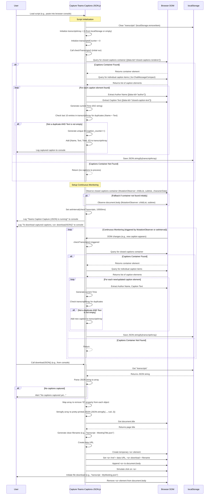

# Reverse Engineering of MS Teams Meeting Live Caption Saver

> ### aider chat started at 2025-06-17 10:44:22
> You can skip this check with --no-gitignore  
> Add .aider* to .gitignore (recommended)? (Y)es/(N)o [Yes]: y  
> Added .aider* to .gitignore  
> C:\Users\jazzw\.local\bin\aider --model ollama/qwen25-coder-7b:q4_k_m --no-auto-commits --auto-lint Capture-Teams-Captrions - JSON.js  
> Aider v0.76.1.dev0+gc838f9bf.d20250509  
> Model: ollama/qwen25-coder-7b:q4_k_m with whole edit format  
> Git repo: ..\..\..\..\.git\modules\js\chrome-extensions\ms-teams-live-caption-saver with 26 files  
> Repo-map: using 4096.0 tokens, auto refresh  
> Added Standalone-scripts\Capture-Teams-Captrions - JSON.js to the chat.  
> Note: in-chat filenames are always relative to the git working dir, not the current working dir.  
> Cur working dir: C:\Users\jazzw\git\snippet\js\chrome-extensions\ms-teams-live-caption-saver\Standalone-scripts  
> Git working dir: C:\Users\jazzw\git\snippet\js\chrome-extensions\ms-teams-live-caption-saver  
>
> #### /model gemini/gemini-2.5-flash-preview-05-20  
> Aider v0.76.1.dev0+gc838f9bf.d20250509  
> Main model: gemini/gemini-2.5-flash-preview-05-20 with whole edit format  
> Weak model: ollama/qwen25-coder-7b:q4_k_m  
> Git repo: ..\..\..\..\.git\modules\js\chrome-extensions\ms-teams-live-caption-saver with 26 files  
> Repo-map: using 4096.0 tokens, auto refresh  
> Added Standalone-scripts\Capture-Teams-Captrions - JSON.js to the chat.  

> #### /ask could you explain the logic written in `Capture-Teams-Captrions - JSON.js`?  

The `Standalone-scripts\Capture-Teams-Captrions - JSON.js` script is designed to capture live captions from Microsoft Teams meetings and save them as a JSON file. It's a standalone script, likely intended to be run directly in the browser's developer console within a Teams meeting.

Here's a breakdown of its logic:

1.  **Initialization and Data Storage:**
    *   `localStorage.removeItem("transcripts");`: When the script starts, it first clears any previously stored captions in `localStorage` under the key "transcripts". This ensures a fresh capture session.
    *   `const transcriptArray = JSON.parse(localStorage.getItem("transcripts")) || [];`: It initializes an empty array `transcriptArray` (or loads existing data if, for some reason, `localStorage` wasn't cleared or the script was re-run without a full page reload). This array will hold all the captured caption objects.
    *   `let transcriptIdCounter = 0;`: A simple counter is used to generate unique IDs for captured captions, as the script notes that native Teams IDs are not reliable for this purpose.

2.  **`checkTranscripts()` Function - The Core Capture Logic:**
    *   **Locating Captions:**
        *   `const closedCaptionsContainer = document.querySelector("[data-tid='closed-captions-renderer']")`: It first tries to find the main container element for closed captions using a specific `data-tid` attribute, which is a common way Teams identifies its UI components.
        *   If this container isn't found, the function returns, implying that live captions are not active or the UI structure has changed.
        *   `const transcripts = closedCaptionsContainer.querySelectorAll('.fui-ChatMessageCompact');`: Once the container is found, it queries for individual caption items within it, using the class `.fui-ChatMessageCompact`.
    *   **Extracting Data:**
        *   It iterates through each found `transcript` element.
        *   `authorElement = transcript.querySelector('[data-tid="author"]')`: It extracts the speaker's name from an element with `data-tid="author"`.
        *   `textElement = transcript.querySelector('[data-tid="closed-caption-text"]')`: It extracts the caption text from an element with `data-tid="closed-caption-text"`.
        *   `Time = new Date().toISOString().replace('T', ' ').slice(0, -1);`: It generates a timestamp for when the caption was captured.
    *   **Duplicate Detection:**
        *   `const recentTranscripts = transcriptArray.slice(-10);`: To avoid capturing the same caption multiple times (which can happen with DOM mutations), it checks only the last 10 entries in `transcriptArray`.
        *   `const isDuplicate = recentTranscripts.some(t => t.Name === Name && t.Text === Text);`: It marks a caption as a duplicate if both the `Name` and `Text` match any of the recent entries. This is a pragmatic approach given the lack of reliable native IDs.
    *   **Storing New Captions:**
        *   `if (!isDuplicate && Text.length > 0)`: If the caption is not a duplicate and has actual text content, it's considered new.
        *   `const ID = `caption_${transcriptIdCounter++}`;`: A unique ID is assigned.
        *   `transcriptArray.push({ Name, Text, Time, ID });`: The new caption object is added to the `transcriptArray`.
    *   **Persisting Data:**
        *   `localStorage.setItem('transcripts', JSON.stringify(transcriptArray));`: After processing all current captions, the entire `transcriptArray` is saved back to `localStorage` as a JSON string.

3.  **Monitoring for Changes (MutationObserver & Interval):**
    *   **MutationObserver:**
        *   `const observer = new MutationObserver(checkTranscripts);`: A `MutationObserver` is set up to call `checkTranscripts` whenever changes occur in the DOM.
        *   `if (captionsContainer) { observer.observe(captionsContainer, { childList: true, subtree: true, characterData: true }); }`: If the specific captions container is found, the observer focuses on it, watching for additions/removals of child nodes (`childList`), changes within its descendants (`subtree`), and changes to text content (`characterData`). This is the primary mechanism for real-time caption capture.
        *   `else { observer.observe(document.body, { childList: true, subtree: true }); }`: As a fallback, if the specific container isn't immediately available, it observes the entire `document.body`. This is less efficient but ensures some level of monitoring.
    *   **Initial Check & Interval:**
        *   `checkTranscripts();`: The `checkTranscripts` function is called immediately when the script runs to capture any captions already present.
        *   `setInterval(checkTranscripts, 10000);`: A `setInterval` is also used to call `checkTranscripts` every 10 seconds. This acts as a safeguard in case the `MutationObserver` somehow misses an event or if captions are updated in a way that doesn't trigger the observer (e.g., if the entire container is re-rendered).

4.  **`downloadJSON()` Function - Exporting Data:**
    *   **Retrieving Data:**
        *   `let transcripts = JSON.parse(localStorage.getItem('transcripts'));`: It retrieves the captured captions from `localStorage`.
        *   It checks if any captions were captured; if not, it alerts the user.
    *   **Data Transformation:**
        *   `transcripts = transcripts.map(({ ID, ...rest }) => rest);`: Before saving, it removes the internally generated `ID` property from each caption object, as these IDs are only for internal tracking and not relevant for the final output.
        *   `const prettyTranscripts = JSON.stringify(transcripts, null, 2);`: The array of caption objects is converted into a human-readable JSON string with 2-space indentation.
    *   **Filename Generation:**
        *   `let title = document.title.replace("__Microsoft_Teams", '').replace(/[^a-z0-9 ]/gi, '');`: It attempts to create a clean filename using the current page's title, removing "Microsoft_Teams" and non-alphanumeric characters.
        *   `const fileName = "transcript - " + title.trim() + ".json";`: The final filename is constructed.
    *   **Download Mechanism:**
        *   It creates a data URL (`text/json;charset=utf-8,...`) containing the JSON string.
        *   It dynamically creates an `<a>` (anchor) HTML element, sets its `href` to the data URL and its `download` attribute to the generated filename.
        *   `document.body.appendChild(downloadAnchorNode);` (required for Firefox) and `downloadAnchorNode.click();` simulate a click on this hidden link, triggering the browser's download prompt.
        *   `downloadAnchorNode.remove();`: The temporary link element is then removed from the DOM.

5.  **Console Messages:**
    *   The script provides helpful messages in the browser's developer console, indicating that it's running and how to manually trigger the download function (`downloadJSON()`).

In essence, this script acts as a "caption logger" for Microsoft Teams, continuously monitoring the DOM for new caption text, storing it locally, and providing a way to export the collected data as a structured JSON file.

> #### /ask translate the explanation into traditional chinese, thanks.    

`Standalone-scripts\Capture-Teams-Captrions - JSON.js` 腳本旨在擷取 Microsoft Teams 會議中的即時字幕，並將其儲存為 JSON 檔案。這是一個獨立的腳本，可能旨在直接在 Teams 會議中的瀏覽器開發者控制台中執行。

以下是其邏輯的詳細說明：

1.  **初始化與資料儲存：**
    *   `localStorage.removeItem("transcripts");`：當腳本啟動時，它首先清除 `localStorage` 中鍵為 "transcripts" 的任何先前儲存的字幕。這確保了新的擷取會話。
    *   `const transcriptArray = JSON.parse(localStorage.getItem("transcripts")) || [];`：它初始化一個空的陣列 `transcriptArray`（或者如果 `localStorage` 未被清除或腳本在沒有完全重新載入頁面的情況下重新執行，則載入現有資料）。這個陣列將儲存所有擷取到的字幕物件。
    *   `let transcriptIdCounter = 0;`：一個簡單的計數器用於為擷取到的字幕生成唯一的 ID，因為腳本指出 Teams 的原生 ID 不可靠。

2.  **`checkTranscripts()` 函數 - 核心擷取邏輯：**
    *   **定位字幕：**
        *   `const closedCaptionsContainer = document.querySelector("[data-tid='closed-captions-renderer']")`：它首先嘗試使用特定的 `data-tid` 屬性找到閉路字幕的主要容器元素，這是 Teams 識別其 UI 組件的常用方式。
        *   如果找不到此容器，函數將返回，表示即時字幕未啟用或 UI 結構已更改。
        *   `const transcripts = closedCaptionsContainer.querySelectorAll('.fui-ChatMessageCompact');`：一旦找到容器，它會查詢其中的個別字幕項目，使用類別 `.fui-ChatMessageCompact`。
    *   **提取資料：**
        *   它遍歷每個找到的 `transcript` 元素。
        *   `authorElement = transcript.querySelector('[data-tid="author"]')`：它從具有 `data-tid="author"` 的元素中提取說話者的姓名。
        *   `textElement = transcript.querySelector('[data-tid="closed-caption-text"]')`：它從具有 `data-tid="closed-caption-text"` 的元素中提取字幕文本。
        *   `Time = new Date().toISOString().replace('T', ' ').slice(0, -1);`：它生成字幕擷取時的時間戳。
    *   **重複檢測：**
        *   `const recentTranscripts = transcriptArray.slice(-10);`：為避免多次擷取相同的字幕（這可能發生在 DOM 變動時），它只檢查 `transcriptArray` 中最後 10 個條目。
        *   `const isDuplicate = recentTranscripts.some(t => t.Name === Name && t.Text === Text);`：如果 `Name` 和 `Text` 都與最近的任何條目匹配，則將字幕標記為重複。考慮到缺乏可靠的原生 ID，這是一種實用的方法。
    *   **儲存新字幕：**
        *   `if (!isDuplicate && Text.length > 0)`：如果字幕不是重複的且具有實際文本內容，則將其視為新字幕。
        *   `const ID = `caption_${transcriptIdCounter++}`;`：分配一個唯一的 ID。
        *   `transcriptArray.push({ Name, Text, Time, ID });`：新的字幕物件被添加到 `transcriptArray` 中。
    *   **持久化資料：**
        *   `localStorage.setItem('transcripts', JSON.stringify(transcriptArray));`：處理完所有當前字幕後，整個 `transcriptArray` 會以 JSON 字串的形式儲存回 `localStorage`。

3.  **監控變更（MutationObserver 和 Interval）：**
    *   **MutationObserver：**
        *   `const observer = new MutationObserver(checkTranscripts);`：設置一個 `MutationObserver`，以便在 DOM 發生變化時呼叫 `checkTranscripts`。
        *   `if (captionsContainer) { observer.observe(captionsContainer, { childList: true, subtree: true, characterData: true }); }`：如果找到特定的字幕容器，觀察者會將焦點放在其上，監控其子節點的添加/刪除 (`childList`)、其後代內部的變化 (`subtree`) 以及文本內容的變化 (`characterData`)。這是即時字幕擷取的主要機制。
        *   `else { observer.observe(document.body, { childList: true, subtree: true }); }`：作為備用方案，如果特定的容器沒有立即可用，它會觀察整個 `document.body`。這效率較低，但確保了某種程度的監控。
    *   **初始檢查和間隔：**
        *   `checkTranscripts();`：腳本運行時立即呼叫 `checkTranscripts` 函數，以擷取任何已存在的字幕。
        *   `setInterval(checkTranscripts, 10000);`：還使用 `setInterval` 每 10 秒呼叫一次 `checkTranscripts`。這作為一種保障，以防 `MutationObserver` 遺漏了事件，或者字幕以不觸發觀察者的方式更新（例如，如果整個容器被重新渲染）。

4.  **`downloadJSON()` 函數 - 匯出資料：**
    *   **檢索資料：**
        *   `let transcripts = JSON.parse(localStorage.getItem('transcripts'));`：它從 `localStorage` 中檢索擷取到的字幕。
        *   它檢查是否擷取到任何字幕；如果沒有，則會提醒用戶。
    *   **資料轉換：**
        *   `transcripts = transcripts.map(({ ID, ...rest }) => rest);`：在儲存之前，它從每個字幕物件中刪除內部生成的 `ID` 屬性，因為這些 ID 僅用於內部追蹤，與最終輸出無關。
        *   `const prettyTranscripts = JSON.stringify(transcripts, null, 2);`：字幕物件陣列被轉換為帶有 2 個空格縮排的人類可讀 JSON 字串。
    *   **檔案名稱生成：**
        *   `let title = document.title.replace("__Microsoft_Teams", '').replace(/[^a-z0-9 ]/gi, '');`：它嘗試使用當前頁面的標題創建一個乾淨的檔案名稱，刪除 "Microsoft_Teams" 和非字母數字字符。
        *   `const fileName = "transcript - " + title.trim() + ".json";`：構建最終的檔案名稱。
    *   **下載機制：**
        *   它創建一個包含 JSON 字串的資料 URL (`text/json;charset=utf-8,...`)。
        *   它動態創建一個 `<a>`（錨點）HTML 元素，將其 `href` 設置為資料 URL，並將其 `download` 屬性設置為生成的檔案名稱。
        *   `document.body.appendChild(downloadAnchorNode);`（Firefox 需要）和 `downloadAnchorNode.click();` 模擬點擊此隱藏連結，觸發瀏覽器的下載提示。
        *   `downloadAnchorNode.remove();`：然後從 DOM 中刪除臨時連結元素。

5.  **控制台訊息：**
    *   腳本在瀏覽器的開發者控制台中提供有用的訊息，指示其正在運行以及如何手動觸發下載函數 (`downloadJSON()`)。

總之，這個腳本充當 Microsoft Teams 的「字幕記錄器」，持續監控 DOM 以獲取新的字幕文本，將其本地儲存，並提供一種將收集到的資料匯出為結構化 JSON 檔案的方法。

> #### /ask could you draw a sequence diagram of `Capture-Teams-Captrions - JSON.js` using mermaid.js syntax? try to capture detail if possible.  



> #### /ask are those transcript from DOM duplicated based on the logic?  

No, the script's logic is specifically designed to **prevent** duplicate entries from the DOM being added to its internal `transcriptArray` for most common scenarios.

Here's how it works:

1.  **Internal Storage:** The script maintains a `transcriptArray` in `localStorage` which stores all the captions it has *already captured and processed*.

2.  **Duplicate Check Logic:**
    *   When `checkTranscripts()` runs, it iterates through the caption elements *currently present in the DOM*.
    *   For each DOM caption, it extracts the `Name` (speaker) and `Text` (caption content).
    *   It then performs a duplicate check against the `transcriptArray`:
        ```javascript
        const recentTranscripts = transcriptArray.slice(-10); // Check last 10 entries
        const isDuplicate = recentTranscripts.some(t =>
            t.Name === Name && t.Text === Text
        );
        ```
    *   This means it looks at the **last 10 entries** that were *already added* to `transcriptArray`. If the current `Name` and `Text` from the DOM element match any of these recent entries, it considers it a duplicate.

3.  **Conditional Addition:**
    *   `if (!isDuplicate && Text.length > 0)`: Only if the extracted caption is **not** found as a duplicate in the `recentTranscripts` and has actual text content, will it be added to the `transcriptArray`.

**Potential Edge Case for Duplication:**

While effective for preventing immediate or near-immediate duplicates (which often occur due to DOM re-renders or slight updates), there's a theoretical edge case:

*   If the **exact same phrase from the exact same speaker** appears, then more than 10 *other unique captions* are spoken, and then the original phrase is repeated, the script *would* add it again. This is because the original instance of that phrase would have "fallen out" of the `recentTranscripts.slice(-10)` window, making the new instance appear as non-duplicate.

However, for the typical flow of a conversation where captions are continuously added, this `slice(-10)` heuristic is generally sufficient to prevent redundant entries caused by the dynamic nature of the Teams DOM. The primary goal is to capture *new* distinct caption events, not necessarily to ensure absolute uniqueness across an entire, potentially very long, transcript if the same exact phrase is repeated much later.

> Tokens: 7.1k sent, 516 received. Cost: $0.0014 message, $0.0062 session.  

## 2025-06-19

<table><tr><td>Q:</td><td>
<!-- add your Prompt bellow-->
could you explain the meaning of the following javascript code posted in Chrome DevTools?

```js
const observer = new MutationObserver(checkTranscripts);
```
</td></tr><tr><td>A:</td><td>
<!-- add Chatbot Response bellow-->
The JavaScript code `const observer = new MutationObserver(checkTranscripts);` creates an instance of a `MutationObserver`. Let's break down what that means:

* **`const observer`**: This declares a constant variable named `observer`. This variable will hold the `MutationObserver` instance we're creating. Being `const` means its value cannot be reassigned later.

* **`new MutationObserver(checkTranscripts)`**: This is the core of the statement.
    * **`new MutationObserver(...)`**: This is the constructor for the `MutationObserver` API. `MutationObserver` is a built-in browser API that provides a way to detect changes to the DOM (Document Object Model) tree.
    * **`checkTranscripts`**: This is the **callback function** that will be executed whenever a registered DOM change occurs.

**In essence, this line of code is setting up a mechanism to "watch" for changes in the web page's structure or content.**

Here's a more detailed explanation of what `MutationObserver` does and why you might use it:

**What `MutationObserver` does:**

`MutationObserver` allows you to asynchronously observe changes to the DOM. Instead of constantly polling the DOM for changes (which can be inefficient), `MutationObserver` provides a more performant way to react to specific types of modifications. It can detect changes like:

* **Node additions or removals:** When elements are added to or removed from the DOM.
* **Attribute changes:** When attributes of an element (e.g., `id`, `class`, `src`) are modified.
* **Character data changes:** When the text content of a text node or `CDATASection` changes.
* **Subtree modifications:** When any of the above changes occur within a specified subtree of the DOM.

**How it works (in simple terms):**

1.  **You create an observer:** `const observer = new MutationObserver(checkTranscripts);`
2.  **You tell it what to observe:** You'll then need to call the `observe()` method on the `observer` instance, specifying which DOM element to watch and what types of changes you're interested in. For example:
    ```javascript
    observer.observe(targetNode, { childList: true, subtree: true, attributes: true });
    ```
    (Where `targetNode` is the DOM element you want to watch).
3.  **It calls your function when changes happen:** When the specified changes occur on the `targetNode` (or its descendants if `subtree` is true), the `checkTranscripts` function will be called.
4.  **The callback receives information about the changes:** The `checkTranscripts` function will receive an array of `MutationRecord` objects as its argument. Each `MutationRecord` object describes a single DOM change that occurred.

**Why it's useful (especially in Chrome DevTools context):**

If you found this code in Chrome DevTools, it's highly likely that it's being used to:

* **Monitor dynamic content:** The web page you're inspecting might be loading content asynchronously, manipulating the DOM with JavaScript, or updating elements in response to user interactions.
* **React to changes in a specific part of the page:** The `checkTranscripts` function name suggests that it's probably related to some kind of transcript or text content that might be changing dynamically. For example, if you're watching a live video stream with captions, the `MutationObserver` could be used to detect when new caption lines are added to the DOM.
* **Debug or analyze behavior:** Developers often use `MutationObserver` to understand how a page is changing its DOM, especially when debugging issues with dynamic content or tracking specific UI updates.

**In summary, `const observer = new MutationObserver(checkTranscripts);` is the initial step in setting up a system to automatically detect and react to changes happening within the HTML structure of a web page, with the `checkTranscripts` function being the code that gets executed when those changes are detected.**
</td></tr><tr><td>Q:</td><td>
<!-- add your Prompt bellow-->
could you explain this as well?

```js
transcripts = transcripts.map(({
        ID,
        ...rest
    }) => rest);
```
</td></tr><tr><td>A:</td><td>
<!-- add Chatbot Response bellow-->
This JavaScript code snippet uses a combination of array `map()` and object destructuring with the rest operator (`...rest`) to transform an array of `transcripts`.

Let's break it down:

**1. `transcripts = transcripts.map(...)`**

* `transcripts`: This is the array you're working with. It's being reassigned to the result of the `map()` method.
* `.map()`: This is a higher-order array method that creates a *new* array by calling a provided function on every element in the original array. It *does not* modify the original array; instead, it returns a new one.

**2. The Callback Function: `({ ID, ...rest }) => rest`**

This is an arrow function that `map()` will execute for each element in the `transcripts` array.

* **`({ ID, ...rest })`**: This is where the magic of **object destructuring** and the **rest operator** happens.
    * Imagine each element in your `transcripts` array is an object. For example:
        ```javascript
        {
            ID: "uniqueId123",
            text: "Hello there!",
            timestamp: "00:05",
            speaker: "Alice"
        }
        ```
    * **`ID`**: This part of the destructuring extracts the value of the `ID` property from the current object and assigns it to a local variable named `ID`. Crucially, in this specific code, the `ID` variable is immediately discarded because it's not used further.
    * **`...rest`**: This is the **rest property** (or "rest operator" when used in destructuring). It collects all *other* properties from the current object (i.e., all properties *except* `ID`) and puts them into a *new object* called `rest`.

* **`=> rest`**: This is the return value of the arrow function. For each element, after `ID` is extracted and the remaining properties are collected into the `rest` object, the `map` function will return this `rest` object.

**What the code effectively does:**

This code iterates through each object in the `transcripts` array. For every object, it creates a *new* object that contains all the original properties *except* the `ID` property. The original `transcripts` array is then replaced with this new array of modified objects.

**Example:**

Let's say your `transcripts` array initially looks like this:

```javascript
let transcripts = [
    { ID: "a1", text: "First line", timestamp: "00:01" },
    { ID: "b2", text: "Second line", speaker: "John" },
    { ID: "c3", text: "Third line", language: "en" }
];
```

After running the code:

```javascript
transcripts = transcripts.map(({ ID, ...rest }) => rest);
```

The `transcripts` array will be transformed into:

```javascript
[
    { text: "First line", timestamp: "00:01" },
    { text: "Second line", speaker: "John" },
    { text: "Third line", language: "en" }
]
```

**Common Use Cases:**

* **Stripping out unnecessary data:** If the `ID` property is only needed for internal processing or identification *before* this step, but not for subsequent rendering or storage, this is a clean way to remove it.
* **Creating a subset of data:** You might be preparing data for a different part of your application or an API call that doesn't require the `ID`.
* **Data normalization:** Ensuring that the objects in the array have a consistent structure by excluding certain fields.
</td></tr>
</table>

<table><tr><td>Q:</td><td>
<!-- add your Prompt bellow-->
Is setInterval() a built-in browser function? if yes, how can I disable the callback?

```js
setInterval(checkTranscripts, 10000);
```
</td></tr><tr><td>A:</td><td>
<!-- add Chatbot Response bellow-->
Yes, `setInterval()` is a built-in browser function. It's part of the WindowTimers interface, which means it's available globally in web browsers (and in Node.js environments as well, though technically part of the `global` object there).

**How to disable (stop) the callback:**

To stop the callback function from executing repeatedly, you need to use the `clearInterval()` function.

Here's how it works:

1.  **`setInterval()` returns an ID:** When you call `setInterval()`, it returns a unique numeric ID that identifies that specific interval. You need to store this ID in a variable.
2.  **Pass the ID to `clearInterval()`:** To stop the interval, you then pass this ID to `clearInterval()`.

**Example:**

```javascript
// 1. Declare a variable to store the interval ID
let intervalId;

function checkTranscripts() {
    console.log("Checking transcripts...");
    // Your logic to check transcripts goes here
}

// 2. Start the interval and store its ID
// This will call checkTranscripts every 10 seconds (10000 milliseconds)
intervalId = setInterval(checkTranscripts, 10000);

console.log("Interval started with ID:", intervalId);

// To stop the interval after, say, 30 seconds (for demonstration purposes)
setTimeout(() => {
    // 3. Use clearInterval() with the stored ID to stop it
    clearInterval(intervalId);
    console.log("Interval stopped with ID:", intervalId);
}, 30000); // Stop after 30 seconds
```

**Explanation within your specific context:**

If you have `setInterval(checkTranscripts, 10000);` in your code, you would modify it like this:

```javascript
let transcriptCheckerId; // Declare a variable to hold the ID

function checkTranscripts() {
    // ... your existing checkTranscripts logic ...
    console.log("Transcripts checked!");

    // Example: Maybe you want to stop it after a certain condition is met
    // if (someConditionIsMet) {
    //     clearInterval(transcriptCheckerId);
    //     console.log("Interval stopped because condition met.");
    // }
}

// Start the interval and store its ID
transcriptCheckerId = setInterval(checkTranscripts, 10000);

// Later, when you want to stop it (e.g., when the user navigates away,
// a specific event occurs, or a task is completed):
// clearInterval(transcriptCheckerId);
```

**Key takeaway:** Always store the ID returned by `setInterval()` if you intend to stop the interval later.
</td></tr></table>

<table><tr><td>Q:</td><td>
<!-- add your Prompt bellow-->
how to disable or stop MutationObserver() callback?
</td></tr><tr><td>A:</td><td>
<!-- add Chatbot Response bellow-->
You disable or stop a `MutationObserver` callback by calling its `disconnect()` method.

When you create a `MutationObserver` instance, you'll typically set it up like this:

```javascript
const observer = new MutationObserver(checkTranscripts); // Create the observer
```

Then, you tell it *what* to observe using the `observe()` method:

```javascript
const targetNode = document.getElementById('someElementToWatch');
const config = { attributes: true, childList: true, subtree: true };

observer.observe(targetNode, config); // Start observing
```

Once `observer.observe()` is called, the `checkTranscripts` callback will be invoked whenever the specified mutations occur on `targetNode` or its children (based on the `config`).

**To stop or disable the observer (and its callback from firing):**

You simply call the `disconnect()` method on your `MutationObserver` instance:

```javascript
observer.disconnect();
```

**What `disconnect()` does:**

* It stops the observer from receiving any further notifications about DOM changes.
* The `checkTranscripts` callback will no longer be executed.
* It effectively releases the references the observer held to the observed DOM nodes, which can be important for memory management if you're observing many nodes or for a long time.

**Example:**

```javascript
// 1. Define your callback function
function checkTranscripts(mutationsList, observer) {
    for (const mutation of mutationsList) {
        if (mutation.type === 'childList') {
            console.log('A child node has been added or removed.', mutation);
        } else if (mutation.type === 'attributes') {
            console.log('The ' + mutation.attributeName + ' attribute was modified.', mutation);
        }
    }

    // Example: Maybe stop observing after the first change, or a certain number of changes
    // if (mutationsList.length > 0) {
    //     console.log("Stopping observer after first change detected.");
    //     observer.disconnect(); // You can disconnect from within the callback too
    // }
}

// 2. Get the target node to observe
const bodyElement = document.body; // Observing the body for demonstration

// 3. Create a new MutationObserver instance
const myObserver = new MutationObserver(checkTranscripts);

// 4. Configure the observer (what changes to look for)
const observerConfig = { attributes: true, childList: true, subtree: true, characterData: true };

// 5. Start observing the target node with the given configuration
myObserver.observe(bodyElement, observerConfig);
console.log("MutationObserver started on body.");

// --- To stop the observer ---
// Let's simulate stopping it after 5 seconds
setTimeout(() => {
    myObserver.disconnect();
    console.log("MutationObserver disconnected after 5 seconds.");

    // Even if DOM changes occur now, the checkTranscripts callback won't fire.
    document.body.appendChild(document.createElement('div')); // This change won't be observed now
}, 5000);

// You can still make changes that would have been observed earlier
setTimeout(() => {
    document.body.classList.add('new-class'); // This would have been observed
    document.body.appendChild(document.createElement('p')); // This would have been observed
    console.log("Made some DOM changes after observer was disconnected.");
}, 2000); // These changes will be observed
```

In summary, remember the `disconnect()` method. It's your primary tool for stopping a `MutationObserver` from listening for further DOM changes and executing its callback.
</td></tr></table>

- https://g.co/gemini/share/a8a7452803ee
- Created with 2.5 Flash June 19, 2025 at 10:46 PM

<table><tr><td>Q:</td><td>
<!-- add your Prompt bellow-->
is it possible to know which javascript is updating specific DOM in Chrome using DevTools?
</td></tr><tr><td>A:</td><td>
<!-- add Chatbot Response bellow-->
Yes, it's absolutely possible to know which JavaScript is updating specific DOM elements in Chrome using DevTools! This is a super common and very useful debugging task. Here's how you can do it:

**The Primary Method: DOM Breakpoints**

This is the most direct and powerful way to catch the JavaScript responsible for DOM changes.

1.  **Open DevTools:** Right-click on the element you're interested in and select "Inspect" (or press `Ctrl+Shift+I` / `Cmd+Option+I`).
2.  **Navigate to Elements Tab:** Make sure you're in the "Elements" tab of DevTools.
3.  **Find the Element:** In the Elements panel, locate the specific DOM element you want to monitor.
4.  **Set a DOM Breakpoint:** Right-click on the element. In the context menu, go to "Break on" and choose one of the following options:
    * **Subtree modifications:** This will pause execution when any descendant of the selected element is added, removed, or has its attributes changed. Use this if you suspect changes within a larger container.
    * **Attributes modifications:** This will pause execution when an attribute of the *selected element itself* is changed (e.g., `class`, `id`, `style`, `data-*`). This is often the most precise option.
    * **Node removal:** This will pause execution when the *selected element itself* is removed from the DOM.

5.  **Trigger the Change:** Now, interact with your webpage in a way that you expect to trigger the DOM update.
6.  **DevTools Pauses:** When the specified DOM change occurs, DevTools will pause script execution at the exact line of JavaScript code that caused the change.
7.  **Examine the Call Stack:** In the "Sources" tab (which DevTools will likely switch to automatically), look at the "Call Stack" panel (usually on the right). This shows you the sequence of function calls that led to the DOM modification. By walking up the call stack, you can identify the origin of the update.

**Other Helpful DevTools Features:**

While DOM breakpoints are the go-to, these can also provide clues:

* **Event Listeners Tab:**
    1.  Select the element in the "Elements" tab.
    2.  Go to the "Event Listeners" tab in the right-hand sidebar.
    3.  This shows you all event listeners attached to that specific element (and sometimes its ancestors). If a DOM change happens in response to a click, mouseover, etc., this can help you find the relevant event handler. Clicking on the source link will take you to the JavaScript code.

* **Changes Panel (Experimental, but powerful):**
    1.  Open the "Command Menu" (`Ctrl+Shift+P` / `Cmd+Shift+P`).
    2.  Type "Show Changes" and select it.
    3.  This panel records all changes made to the CSS and DOM of the page since you opened DevTools. While it won't directly show you the JS, it can highlight *what* changed, which can then guide your DOM breakpoint placement or search for relevant JS.

* **"Break on All Mutations" (Advanced/Less Common):**
    You can go to the "Sources" tab, and in the "DOM Breakpoints" section (usually in the right sidebar, below the Call Stack), you can find a "DOM Breakpoints" section. There's often an option to add a general DOM mutation breakpoint, but this can be very noisy and pause frequently, so it's usually less effective than targeting a specific element.

**Tips for Effective Debugging:**

* **Be Specific:** If you know exactly which element is changing, use "Attributes modifications" or "Node removal" for that element.
* **Start Broader, Then Narrow Down:** If you're not sure which element is changing, start with "Subtree modifications" on a parent element, and then narrow down your breakpoint if it's too broad.
* **Clear Breakpoints:** Remember to clear your DOM breakpoints when you're done, as they can sometimes interfere with performance or unexpected pauses.
* **Search in Sources:** Once you've identified a function in the call stack, you can use the "Search" feature in the "Sources" tab (`Ctrl+Shift+F` / `Cmd+Option+F`) to find all occurrences of that function name or relevant keywords in your project's JavaScript files.

By mastering DOM breakpoints in Chrome DevTools, you'll be well-equipped to pinpoint the JavaScript code responsible for any DOM manipulation on your web pages.
</td></tr></table>

- [Chrome] 如何設定 DOM Breakpoint
  - Pause your code with breakpoints
  - https://developer.chrome.com/docs/devtools/javascript/breakpoints