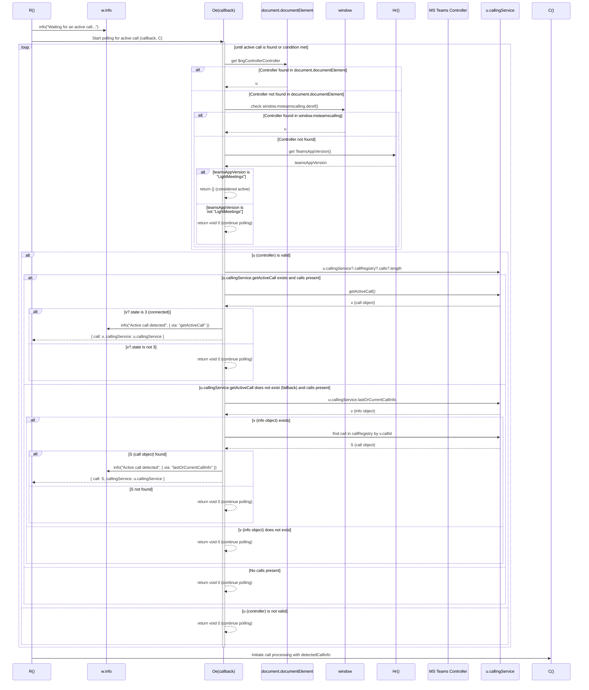

> \# aider chat started at 2025-12-04 15:59:53

> C:\Users\jazzw\.local\bin\aider --no-auto-commits --no-gitignore --model gemini/gemini-2.5-flash --chat-history-file msteams.inline.js.md msteams.inline.js  
> Aider v0.86.1  
> Model: gemini/gemini-2.5-flash with diff-fenced edit format  
> Git repo: .git with 48 files  
> Repo-map: using 4096 tokens, auto refresh  
> Added msteams.inline.js to the chat.  


The `R` function continuously waits for an active call in Microsoft Teams and then initiates the `C` function with the call details.

Here's a breakdown of its functionality:

1.  **Logs Waiting State**: It first logs an informational message indicating it's "Waiting for an active call...".
2.  **Continuously Monitors for Active Call**: It uses the `Oe` function (likely a utility for polling) to repeatedly check for an active call.
3.  **Finds MS Teams Controller**: Inside the `Oe` callback, it attempts to locate the MS Teams controller (`$ngControllerController`) from the `document.documentElement`.
    *   If not found, it checks `window.msteamscalling` and, if `Hr()` indicates "LightMeetings", it returns an empty object `{}`. Otherwise, it returns `void 0`.
4.  **Checks for Active Call in `callingService`**: Once the controller (`u`) is found, it inspects `u.callingService.callRegistry.calls.length` to see if there are any active calls.
    *   **Using `getActiveCall`**: If `u.callingService.getActiveCall` exists, it calls this method. If an active call (`v`) is returned and its `state` is `3` (likely "connected"), it logs "Active call detected" and returns an object containing the `call` and `callingService`.
    *   **Using `lastOrCurrentCallInfo` (Fallback)**: If `getActiveCall` is not available, it tries to get `lastOrCurrentCallInfo` from `u.callingService`. If this information exists, it searches `u.callingService.callRegistry.calls` for a call that matches `v.callId`. If a match (`S`) is found, it logs "Active call detected" and returns an object containing the `call` and `callingService`.
5.  **Passes Call to `C` Function**: Once an active call is successfully identified and returned by the `Oe` callback, the `C` function is invoked with the detected call information.

> Tokens: 68k sent, 439 received. Cost: $0.03 message, $0.03 session.  

> \#### /ask could you draw a sequence diagram of R() function using mermaid.js syntax?  



> \#### what is function c()?  

The function `c` searches for a property within an object `u` that starts with "jQuery". If it finds such a property, it checks if a provided callback function `v` exists. If `v` does not exist, or if `v` returns a truthy value when called with the found "jQuery" property's value, then that property's value is returned.

> \#### /ask could you draw a sequence diagram of async function C(u) using mermaid.js syntax?  

```mermaid
sequenceDiagram
    participant C as C(u)
    participant MutationObserver as MutationObserver
    participant document as document
    participant S as iframe.embedded-electron-webview
    participant Hr as Hr()
    participant w as w.info/debug/warn/error
    participant xe as xe()
    participant call as u.call
    participant CallingService as u.callingService
    participant Oe as Oe()
    participant ai as ai()
    participant Ra as Ra()
    participant Y_handler as Y_handler(event)
    participant s_fn as s(meetingId, isOrganiser, languageCode)
    participant sc as sc()
    participant c_fn as c()
    participant p_fn as p(speechMessage)
    participant lc as lc()
    participant R_fn as R()

    C->>MutationObserver: new MutationObserver(captionFailedCallback)
    MutationObserver->>document: observe(document.body, {childList: true, subtree: true})
    C->>document: querySelector("iframe.embedded-electron-webview")
    document-->>C: S (iframe element)
    C->>Hr: Hr(S)
    Hr-->>C: h (teamsAppVersion)
    C->>w: info("Platform version identified", {teamsAppVersion: h})
    C->>C: Initialize B = false

    opt Try-Catch Block for Meeting Start
        C->>C: Initialize m = {}

        alt h == "LightMeetings"
            C->>w: debug("Light Meetings detected")
        else u.call?.startClosedCaption is truthy (Closed captions ARE available)
            C->>w: debug("Closed captions are available")
            C->>xe: type: "meeting-id", data: u.call._callId
            C->>w: debug("Detected meeting id", {meetingId: u.call._callId})
            C->>C: x = u.call (store current call object)
            C->>w: debug("Getting the meeting title...")
            alt MeetingInfo available
                C->>call: getCallingConversation()
                call-->>C: conversation (with meetingInfo or unParsedMeetingInfo)
                alt meetingInfo.subject exists
                    C->>xe: type: "title-updated", title: subject
                else unParsedMeetingInfo.subject exists
                    C->>Ra: parse unParsedMeetingInfo
                    Ra-->>C: L (subject)
                    C->>xe: type: "title-updated", title: L
                end
            else getCallingConversationAsync().conversation?.threadProperties?.topic available
                C->>call: getCallingConversationAsync()
                call-->>C: promise
                C->>C: await Wr(promise)
                C->>xe: type: "title-updated", title: topic
            else getMeetingDetails() available
                C->>ai: Race (2s timeout) to await Wr(u.call.getMeetingDetails())
                C->>call: getMeetingDetails()
                call-->>C: promise
                C->>C: await Wr(promise)
                C->>xe: type: "title-updated", title: JSON.parse(H).subject
            end
            C->>w: info("Finished getting the meeting title")
            C->>w: debug("Waiting for the call to connect...")
            C->>Oe: Wait for callGotConnected (u.callingService?.getActiveCall?.().callGotConnected)
            Oe-->>C: $ (connection_status: "connected" or "disconnected")
            alt $ == "connected" AND u.call?.startClosedCaption
                C->>call: u.callingService?.getActiveCall?.() (update call object)
                C->>w: debug("Starting closed captions...")
                C->>call: startClosedCaption()
                C->>C: y = u.call.stopClosedCaption (store original)
                C->>call: Override stopClosedCaption with confirm_fn
                C->>Oe: Wait for closedCaptionsHaveBeenStarted() && getClosedCaptionStatus() === 2
                Oe-->>C: captions_ready_status
                C->>w: debug("Started closed captions")

                alt h == "V2"
                    C->>w: info("Configured closed captions", {teamsAppVersion: h})
                    C->>MutationObserver: disconnect()
                    C->>Oe: Wait for u.call?.role to be available
                    Oe-->>C: H (role)
                    C->>s_fn: s(u.call._callId, H === "admin", u.call.getClosedCaptionsLanguage())
                else h == "Modern"
                    C->>w: debug("Waiting for the modern calling to get ready")
                    C->>Oe: Wait for S?.contentWindow to be available
                    Oe-->>C: L (S.contentWindow)
                    C->>L: addEventListener("message", Y_handler)
                    C->>w: info("Configured closed captions", {teamsAppVersion: h})
                    C->>MutationObserver: disconnect()
                    C->>Oe: Wait for x?.role to be available
                    Oe-->>C: L (role)
                    C->>s_fn: s(x._callId, L === "admin", x.getClosedCaptionsLanguage())
                else h == "Classic"
                    C->>w: debug("Configuring classic calling")
                    C->>sc: Observe for "calling-closed-captions" element
                    sc-->>C: L (element)
                    C->>c_fn: Get $callingClosedCaptionsController from L
                    c_fn-->>C: H (controller)
                    C->>H: Store original H.adapter.handler (r)
                    C->>H: Override H.adapter.handler (with p_fn call)
                    C->>w: info("Configured closed captions", {teamsAppVersion: h})
                    C->>MutationObserver: disconnect()
                end
            else Call not connected or captions failed to start
                C->>w: error("Call was not connected and closed")
                C->>C: B = true
            end
        else Closed Captions are NOT available
            C->>w: error("Closed captions are NOT available")
        end
    alt Error occurred in try block
        C->>w: error("Error starting the meeting", {error: JSON.stringify(U)})
        C->>C: B = true
    end

    C->>MutationObserver: disconnect() (Final observer disconnect)

    alt h != "LightMeetings"
        alt h == "Modern"
            C->>Oe: Wait for call end (B || !u.callingService || getActiveCall() === null)
            Oe-->>C: end_status
            C->>S_contentWindow: removeEventListener("message", Y_handler)
            C->>w: info("Meeting ended", {teamsAppVersion: h})
            C->>xe: type: "meeting-id", data: void 0
            C->>C: x = void 0
            C->>R_fn: setTimeout(R, 5e3)
        else h == "V2"
            C->>Oe: Wait for call end (B || !u.callingService || getActiveCall() === null)
            Oe-->>C: end_status
            alt W (original handler) exists
                C->>call: Restore original handler on dataChannel.subscriptions
            end
            C->>w: info("Meeting ended", {teamsAppVersion: h})
            C->>xe: type: "meeting-id", data: void 0
            C->>C: x = void 0
            C->>R_fn: setTimeout(R, 5e3)
        else B is true (error occurred earlier)
            C->>w: info("Meeting ended", {teamsAppVersion: h})
            C->>xe: type: "meeting-id", data: void 0
            C->>call: Try to restore original stopClosedCaption (y)
            C->>C: x = void 0
            C->>R_fn: R()
        else Call ended normally (Classic)
            C->>document: getElementsByTagName("calling-screen")[0]
            document-->>C: U (element)
            C->>lc: lc(U, cleanupCallback)
            lc-->>C: disconnected
            C->>w: info("Meeting ended", {teamsAppVersion: h})
            C->>xe: type: "meeting-id", data: void 0
            C->>call: Try to restore original stopClosedCaption (y)
            C->>C: x = void 0
            C->>R_fn: R()
        end
    end

    Note over Y_handler: Processes messages from iframe (Modern Teams)
    Note over captionFailedCallback: Handles "ufd_title_ClosedCaptionsStartFailed" in document.body
```
