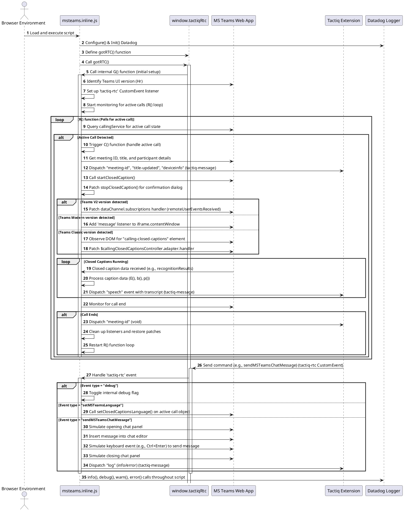

# Tactiq: AI note taker for Google Meet, Zoom and MS Teams

- Chrome Extension
  - https://chromewebstore.google.com/detail/tactiq-ai-note-taker-for/fggkaccpbmombhnjkjokndojfgagejfb

## 2025-09-08

- Version: `3.1.4000`

```bash
cd AppData/Local/Google/Chrome/User\ Data/Profile\ 3/Extensions/fggkaccpbmombhnjkjokndojfgagejfb/
cp -r 3.1.4000_0/ ~/git/tactiq_3.1.4000
```

- Reverse Engineering using Aider

> \# aider chat started at 2025-09-08 09:24:02
> C:\Users\jazzw\.local\bin\aider --no-auto-commits --no-gitignore --model gemini/gemini-2.5-flash-preview-05-20 --llm-history-file .aider.llm.history.md
> Aider v0.86.1
> Model: gemini/gemini-2.5-flash-preview-05-20 with whole edit format
> Git repo: .git with 48 files
> Repo-map: using 4096 tokens, auto refresh
>
> ##### /ask could you give me a high-level overview of this git repo?

This git repository appears to contain the code for a **browser extension** that enhances or integrates with popular video conferencing platforms.

Here's a high-level overview:

*   **Core Functionality:** The extension likely provides features related to **Google Meet, Microsoft Teams, and Zoom**, as indicated by `googlemeet.inline.js`, `msteams.inline.js`, and `zoom.inline.js`. This could involve transcription, meeting notes, or other productivity tools.
*   **Extension Architecture:** It follows a standard browser extension structure with:
    *   `background.js`: For persistent background tasks and event handling.
    *   `content.js`: To interact with the web pages of the conferencing platforms.
    *   `popup.js`: The user interface displayed when the extension icon is clicked.
    *   `options.js`: For managing extension settings and configurations.
*   **Key Technologies/Libraries:**
    *   **State Management:** Uses Redux, including `redux-saga` for handling side effects and `redux-logger` for debugging.
    *   **API Interaction:** Leverages GraphQL (`graphql-tag`) for data fetching.
    *   **Internationalization (i18n):** Incorporates `@formatjs` for handling different languages and pluralization.
    *   **Dynamic Script Injection:** Utilizes `webext-dynamic-content-scripts` for injecting content scripts into web pages.
    *   **UI Components:** Mentions of `MuiTouchRipple` and `MuiCircularProgress` suggest the use of Material-UI (MUI) for some UI elements.
*   **Development/Debugging:** Contains messages related to `redux-logger` breaking changes and `redux-saga` error checking, indicating active development and debugging practices. There are also references to a "Preview backend running in this workspace," suggesting a local development setup.
*   **UI Elements:** Includes SVG path data for icons, likely used within the extension's UI.

> ##### /add manifest.json
> Added manifest.json to the chat

> ##### /ask what are defined in manifest.json?


The `manifest.json` file defines the core metadata and configuration for the browser extension. Here's a breakdown of what's defined:

*   **`action`**: Configures the browser action button, specifying `popup.html` as the default popup page and "Manage Tactiq's options" as its default title.
*   **`background`**: Declares `background.js` as the service worker script, which runs in the background to handle events and perform tasks.
*   **`content_scripts`**: Defines scripts and CSS files to be injected into specific web pages.
    *   It injects `content.css` and `content.js` into Google Meet pages (`*://meet.google.com/*-*-*`).
    *   It also injects `rtcinjector.js` into Google Meet pages at `document_start` for early execution.
*   **`content_security_policy`**: Sets security policies for the extension's own pages, restricting script sources, object sources, base URIs, form actions, and frame ancestors to `self`.
*   **`default_locale`**: Specifies "en" (English) as the default language for the extension.
*   **`description`**: Uses `__MSG_appDesc__` as a placeholder for the application description, indicating it's localized.
*   **`externally_connectable`**: Lists URLs (`https://app.tactiq.io/*`, `https://testfirebaseauth-f5df6.firebaseapp.com/*`) that are allowed to connect to the extension.
*   **`host_permissions`**: Requests permission to interact with Google Meet pages (`*://meet.google.com/*-*-*`).
*   **`icons`**: Provides paths to various icon sizes for the extension (16x16, 48x48, 128x128).
*   **`key`**: Contains a public key, which helps ensure a consistent extension ID across different installations and updates.
*   **`manifest_version`**: Specifies that this manifest adheres to Manifest V3.
*   **`name`**: Uses `__MSG_appName__` as a placeholder for the application name, indicating it's localized.
*   **`optional_host_permissions`**: Lists additional host permissions (`*://*/*`, `<all_urls>`) that the user can optionally grant to the extension.
*   **`options_page`**: Designates `options.html` as the page for the extension's settings.
*   **`permissions`**: Requests various API permissions, including `declarativeContent`, `activeTab`, `storage`, `alarms`, `scripting`, `unlimitedStorage`, and `declarativeNetRequest`.
*   **`short_name`**: Provides a shorter name for the extension, "Tactiq".
*   **`update_url`**: Specifies the URL for checking extension updates from the Chrome Web Store.
*   **`version`**: Sets the current version of the extension to "3.1.4000".
*   **`web_accessible_resources`**: Declares resources (`lang/*.json`, `*.svg`, `rtcinjector.js`, `*.inline.js`) that web pages are allowed to access directly.

> ##### /ask could you identify the corresponding javascript for each action defined in manifest.json?

Okay, here's the mapping of the actions defined in `manifest.json` to their corresponding JavaScript files:

1.  **Browser Action (`action.default_popup`)**:
    *   **Manifest Entry**: `popup.html`
    *   **Corresponding JavaScript**: `popup.js` (This script provides the functionality for the popup UI.)

2.  **Background Service Worker (`background.service_worker`)**:
    *   **Manifest Entry**: `background.js`
    *   **Corresponding JavaScript**: `background.js` (This script runs in the background, handling events, alarms, and other persistent tasks.)

3.  **Content Scripts (`content_scripts`)**:
    *   **Manifest Entry 1**: `content.js`
    *   **Corresponding JavaScript**: `content.js` (This script interacts directly with the DOM of Google Meet pages.)
    *   **Manifest Entry 2**: `rtcinjector.js`
    *   **Corresponding JavaScript**: `rtcinjector.js` (This script is injected into Google Meet pages at `document_start`, likely for early modification or interception of WebRTC-related functionalities.)

4.  **Options Page (`options_page`)**:
    *   **Manifest Entry**: `options.html`
    *   **Corresponding JavaScript**: `options.js` (This script provides the logic and interactivity for the extension's settings page.)

5.  **Web Accessible Resources (`web_accessible_resources`)**:
    *   **Manifest Entry**: `*.inline.js` (e.g., `googlemeet.inline.js`, `msteams.inline.js`, `zoom.inline.js`)
    *   **Corresponding JavaScript**: `googlemeet.inline.js`, `msteams.inline.js`, `zoom.inline.js` (These scripts are made accessible to web pages, often for direct injection into the page's context or for communication between the content script and the page.)
    *   **Manifest Entry**: `rtcinjector.js`
    *   **Corresponding JavaScript**: `rtcinjector.js` (This script is also listed here, meaning it can be directly loaded by the web page if needed, in addition to being injected as a content script.)

6.  **Permissions (`permissions`, `host_permissions`, `optional_host_permissions`)**:
    *   These entries grant the extension access to various browser APIs and host URLs. The JavaScript files (`background.js`, `content.js`, `popup.js`, `options.js`) then utilize these granted permissions to perform their respective actions (e.g., `storage` for data persistence, `scripting` for dynamic script injection, `declarativeNetRequest` for modifying network requests, `activeTab` for interacting with the currently active tab).

7.  **Externally Connectable (`externally_connectable`)**:
    *   This defines which external websites can communicate with the extension. The actual JavaScript code for handling these external messages would primarily reside in `background.js` and potentially `content.js` (if the communication is mediated through the content script).

> ##### /drop
> Dropping all files from the chat session.

> ##### /add msteams.inline.js
> Added msteams.inline.js to the chat

> ##### /ask could you draw a sequence diagram of msteams.inline.js using mermaid.js syntax?

```mermaid
sequenceDiagram
    participant Browser
    participant MSTeamsApp as "MS Teams App"
    participant Extension as "msteams.inline.js"
    participant TactiqLogger as "Tactiq Logger (w)"
    participant TactiqCustomEvents as "Tactiq Custom Events"
    participant DatadogLogger as "Datadog Logger (Sp)"
    participant DatadogAPI as "Datadog API"

    Browser->>Extension: Script loaded and executed
    Extension->>Extension: G() called (initial setup)
    Extension->>Browser: Prepends <meta id="tactiq-rtc">
    Extension->>TactiqLogger: info("Tactiq is ready")
    TactiqLogger->>TactiqCustomEvents: Dispatches "log" event

    opt Not LightMeetings (WebRTC/WebSocket patching)
        Extension->>Browser: Patches window.RTCPeerConnection.createDataChannel
        Extension->>Browser: Patches window.WebSocket constructor
        WebSocket->>Extension: "message" event (e.g., rosterUpdate)
        Extension->>TactiqCustomEvents: Dispatches "deviceinfo"
    end

    loop Call Detection (R())
        Extension->>MSTeamsApp: Polls for active call object
        alt Active Call Found
            Extension->>Extension: C(callInfo) invoked (Call Setup)
            C(callInfo)->>TactiqLogger: Logs Teams app version
            TactiqLogger->>TactiqCustomEvents: Dispatches "log" event
            C(callInfo)->>MSTeamsApp: Attempts call.startClosedCaption()
            C(callInfo)->>Extension: Patches call.stopClosedCaption() (adds confirmation)
            C(callInfo)->>TactiqCustomEvents: Dispatches "meeting-id" (callId)
            C(callInfo)->>MSTeamsApp: Attempts to get meeting title
            C(callInfo)->>TactiqCustomEvents: Dispatches "title-updated" (if found)
            C(callInfo)->>MSTeamsApp: Polls for call connection & caption start
            alt Captions Started Successfully
                C(callInfo)->>TactiqLogger: debug("Started closed captions")
                TactiqLogger->>TactiqCustomEvents: Dispatches "log" event
                alt V2 Teams App
                    C(callInfo)->>MSTeamsApp: Patches dataChannel.subscriptions
                    MSTeamsApp-->>Extension: Raw caption data via patched handler
                else Modern Teams App
                    C(callInfo)->>Browser: Adds "message" listener to iframe.contentWindow
                    Browser-->>Extension: Raw caption data via "message" event
                else Classic Teams App
                    C(callInfo)->>Browser: Uses MutationObserver to find captions element
                    Browser-->>Extension: Raw caption data via patched adapter handler
                end
                Extension->>Extension: E(rawData, call) (processes caption)
                Extension->>Extension: p(processedCaption) (stores caption)
                Extension->>Extension: d() (debounced dispatch)
                Extension-->>TactiqCustomEvents: Dispatches "speech" (accumulated captions)
                C(callInfo)->>TactiqCustomEvents: Dispatches "msteams-organiser"
            else Captions Failed or Not Available
                C(callInfo)->>TactiqLogger: error("Closed captions failed/not available")
                TactiqLogger->>TactiqCustomEvents: Dispatches "log" event
                C(callInfo)->>TactiqCustomEvents: Dispatches "msteams-captions-setup-failed"
            end
        end
    end

    loop External Commands (from Browser)
        Browser->>Extension: CustomEvent "tactiq-rtc"
        alt type === "debug"
            Extension->>TactiqLogger: Logs debug mode change
            TactiqLogger->>TactiqCustomEvents: Dispatches "log" event
        alt type === "setMSTeamsLanguage"
            Extension->>MSTeamsApp: x?.setClosedCaptionsLanguage(languageCode)
            Extension->>TactiqLogger: debug("Setting MS Teams language")
            TactiqLogger->>TactiqCustomEvents: Dispatches "log" event
        alt type === "sendMSTeamsChatMessage"
            Extension->>Extension: _(message) invoked (Chat Message Sending)
            _(message)->>MSTeamsApp: Finds/clicks chat button
            _(message)->>MSTeamsApp: Inserts text into CKEditor
            _(message)->>Browser: Dispatches KeyboardEvent (Enter)
            _(message)->>MSTeamsApp: Clicks chat button (to close)
            _(message)->>TactiqLogger: info("MS Teams message sent")
            TactiqLogger->>TactiqCustomEvents: Dispatches "log" event
        end
    end

    loop Meeting End Detection
        Extension->>MSTeamsApp: Polls for call end conditions
        alt Meeting Ended
            Extension->>TactiqLogger: info("Meeting ended")
            TactiqLogger->>TactiqCustomEvents: Dispatches "log" event
            Extension->>TactiqCustomEvents: Dispatches "meeting-id" (undefined)
            Extension->>Extension: Resets internal state
            Extension->>Extension: Calls R() to restart call detection
        end
    end

    Extension->>DatadogLogger: Sp.write(level, message, context)
    DatadogLogger->>DatadogAPI: Sends log data (via Datadog SDK or HTTP)

    note over DatadogLogger, DatadogAPI: DatadogLogger (Sp) uses Datadog Browser SDK (Cn) if not in a Service Worker, or HttpDatadogLogger (ac) if in a Service Worker (ni() is true).
```

> ##### /ask could you explain the logic defined within msteams.inline.js using plain English which allow me to implement the same logic in different language?

Okay, let's break down the logic of `msteams.inline.js` into plain English, focusing on the steps and intentions so you can re-implement it in another language.

The main goal of this script is to **integrate Tactiq's transcription and meeting management features with Microsoft Teams meetings directly within the browser.** It does this by observing and interacting with the Teams web application.

Here's the logic, step-by-step:

---

### Core Setup and Initialization

1.  **Global State & Utilities:**
    *   It sets up some global variables for internal state (like whether debug mode is on, a temporary storage for speech messages, and a reference to the current Teams call object).
    *   It defines helper functions for logging (`w`), dispatching custom browser events (`xe`), waiting for elements to appear (`Oe`), and waiting for a short period (`cc`).
    *   It also includes a `TactiqLogger` (`Sp`) which is a custom logging utility that can send logs to Datadog (either via the Datadog Browser SDK or directly via HTTP if in a Service Worker).

2.  **Platform Detection (`Hr`)**:
    *   It figures out which version or context of the MS Teams application it's running in (e.g., "LightMeetings", "V2", "Modern", "Classic"). This is crucial because different Teams versions have different internal structures and APIs.

3.  **WebRTC/WebSocket Interception (Optional, `o()`)**:
    *   **Purpose:** To capture participant information and potentially other real-time data that might not be exposed through standard Teams APIs.
    *   **How it works:**
        *   It *patches* the browser's native `RTCPeerConnection` and `WebSocket` objects.
        *   When `RTCPeerConnection.createDataChannel` is called by Teams, the script intercepts it. If the data channel is named "main-channel", it adds an event listener to capture messages. These messages are then parsed for "recognitionResults" (transcription data).
        *   When `WebSocket` is used by Teams, the script intercepts its constructor. If the WebSocket URL includes "teams.microsoft.com", it adds a "message" event listener. It specifically looks for messages starting with "3:::" which, when parsed and decompressed (using `pako` library), might contain "rosterUpdate" events with participant details.
        *   Captured participant info (device ID, display name) is then dispatched as a custom browser event (`deviceinfo`).

4.  **Main Entry Point (`G()`)**:
    *   This function is called once when the script loads.
    *   It sets up a listener for custom browser events (`tactiq-rtc`) that allow other parts of the extension (e.g., the popup or background script) to send commands to this inline script.
    *   It adds a `<meta>` tag to the document head, indicating the script's presence and version.
    *   It immediately starts the "Call Detection" process (`R()`).
    *   If the Teams version is "LightMeetings", it also calls the WebRTC/WebSocket interception setup (`o()`).

---

### Call Detection and Transcription (`R()`, `C()`)

1.  **`R()` - Waiting for an Active Call:**
    *   This function continuously polls (waits and checks repeatedly) for an active call object within the Teams application's internal JavaScript state.
    *   It tries different ways to find the call object based on the detected Teams platform version.
    *   Once an active call is found and its state indicates it's connected, it calls `C()` to start the main meeting processing.

2.  **`C(callInfo)` - Processing an Active Call:**
    *   **Error Handling:** It sets up a `MutationObserver` to watch for specific UI elements that indicate "Closed captions failed to start," and dispatches an error event if detected.
    *   **Platform-Specific Logic:**
        *   **LightMeetings:** Simply logs that it's in Light Meetings mode.
        *   **Other Platforms (V2, Modern, Classic):**
            *   **Closed Captions Check:** It first checks if `call.startClosedCaption` is available. If not, it logs an error and marks the call as "closed."
            *   **Meeting ID & Title:** If captions are available, it extracts and dispatches the meeting ID and attempts to find and dispatch the meeting title (using various fallback methods depending on the Teams version).
            *   **Caption Start:** It calls `call.startClosedCaption()` to initiate the captions.
            *   **`stopClosedCaption` Patch:** It *replaces* the original `call.stopClosedCaption` function with a custom one that first asks the user for confirmation before stopping captions (and thus Tactiq's functionality).
            *   **Waiting for Captions:** It then polls until `call.closedCaptionsHaveBeenStarted()` and `call.getClosedCaptionStatus() === 2` (indicating captions are active).
            *   **Caption Data Capture (Platform-Specific):**
                *   **V2:** It patches a specific `dataChannel` subscription handler (`remoteUserEventsReceived`) to intercept raw transcription data.
                *   **Modern:** It listens for "message" events on the `contentWindow` of the embedded Electron iframe (where Modern Teams runs) to capture transcription data.
                *   **Classic:** It uses a `MutationObserver` to find the `calling-closed-captions` DOM element and then patches its internal `adapter.handler` to intercept transcription data.
            *   **Role Detection:** Once captions are configured, it tries to determine the user's role (e.g., "admin") and dispatches it along with the meeting ID and caption language.
    *   **Caption Processing (`E()`, `p()`, `d()`):**
        *   Raw caption data (from any of the capture methods) is passed to `E()`.
        *   `E()` extracts `userId`, `text`, `timestampAudioSent`, and `id` from the raw data. It also tries to get the `deviceName` using `Rp()` (which looks up participant names from the call object or roster).
        *   It generates a unique `messageId` for each caption segment (using `b()`) to handle updates and finalization.
        *   The processed caption object is then passed to `p()`.
        *   `p()` stores the caption in a temporary array (`t`), updating existing entries if a newer version of the same message ID arrives.
        *   `d()` is a debounced function that, every 500ms, takes all accumulated captions from the `t` array and dispatches them as a single `speech` custom browser event. This prevents flooding the browser with too many events.
    *   **Meeting End Detection:** After the call setup, `C()` sets up another polling loop to detect when the active call ends (e.g., `getActiveCall()` returns null, or call state changes). When the call ends, it cleans up listeners, resets internal state, dispatches a `meeting-id` event with `undefined` (to signal no active meeting), and calls `R()` again to wait for the next call.

---

### Chat Message Sending (`_()`)

1.  **Purpose:** To programmatically send a message into the Teams chat.
2.  **How it works:**
    *   It first checks if the chat editor (`ckeditor`) is already visible.
    *   If not, it tries to find and click the "Chat" button to open the chat panel. It then waits for the `ckeditor` element to appear.
    *   Once the editor is found, it attempts to get the `ckeditorInstance` (a JavaScript object provided by the CKEditor library).
    *   It uses `y.setData()` (if the instance is available) or directly sets `h.innerHTML` to insert the message text. It also dispatches `input` and `focus` events to simulate user interaction.
    *   Finally, it simulates pressing `Ctrl+Enter` (or `Cmd+Enter` on Mac) using a `KeyboardEvent` to send the message.
    *   After sending, it clicks the chat button again to close the chat panel.

---

### External Communication (`document.documentElement.addEventListener("tactiq-rtc", ...)`)

*   This is the mechanism for other parts of the extension to send commands to `msteams.inline.js`.
*   It listens for `CustomEvent`s with the name "tactiq-rtc".
*   The `detail` property of the event contains an object with a `type` (e.g., "debug", "setMSTeamsLanguage", "sendMSTeamsChatMessage") and other relevant data.
*   Based on the `type`, it calls the corresponding internal function (e.g., `_()` for sending chat messages, `x?.setClosedCaptionsLanguage()` for changing language).

---

### Summary of Logic Flow:

1.  **Initialization:** Script loads, sets up logging, platform detection, and event listeners for external commands.
2.  **Call Monitoring:** Continuously looks for an active MS Teams call.
3.  **Meeting Start:** When a call is detected:
    *   It tries to start closed captions.
    *   It patches Teams' internal functions to intercept transcription data and `stopClosedCaption` calls.
    *   It extracts meeting metadata (ID, title, user role).
    *   It starts collecting and debouncing transcription messages.
4.  **Transcription Processing:** Raw caption data is processed, assigned unique IDs, and stored temporarily. Debounced events dispatch these captions to other parts of the extension.
5.  **Meeting End:** When the call ends, it cleans up, resets, and goes back to monitoring for new calls.
6.  **External Control:** Other parts of the extension can send commands (like "send chat message" or "set language") via custom browser events, which this script then executes by interacting with the Teams application.
7.  **Logging:** All significant actions and errors are logged using the custom `TactiqLogger`, which can forward them to Datadog for monitoring and debugging.


## 2025-11-01

> ##### /ask could you draw a sequence diagram of msteams.inline.js using plantuml syntax?


[![](https://img.plantuml.biz/plantuml/svg/fLTRRzis57uFaFzmO0oBZCKUiCS0Avh9HXgWHZixNPzfyLXcHv4QIJdDlz_X9OeaNnAtUOX5YkVsVUT2lRUE6TTKylA2DKwhfbgZkRoWLU6qWT5VHZzQD31NEs6qgb2v4J0BQV_oeYPnKOYQAGUZoZfabPqA9ON2wJSRpjw7rQemedO3WKUXk7wSEh8c_bkw8fo_athD9Aq6XnShUF3guIkkuRQkm-75AkpHSd3w8UY4-NU7oWgjmkbsDJWyOuvnNS97NPPemj7uwA5unc3ohXVA3HrX79ZYWD-nQ1o2JJ5sZtcngEi6SgqsecmCPcFubPG9Hm_9zhvKYyCDp713hw3KRlcGayocKHIT3-E4KCwaR4KIfsB7oCyEmktZVdX1NYY7HZ49Tnspa0doNT2kHTVKuuxgFjdx_htmTGFtdD99R9uIhL_kOOV61lqVp7XVjk_U2XqqDLp5v9aOLrn1tbYdg_cEz88Kb8tAK_YA7by1K6cAI1kXIjXGueTu40g2m4AsfDYbrdL0qJ_0ieV6P-sF3UJeCD3VAG3-Rj0yXSDaTuLc9meSgW6gK8TH5vCERkEhGCuC7HOEUNnxo5e_r0SZV292tlD-IoaiSU3wSPNT0Ew8WmhHUTZkPzVWX9Du7MgYMryS7HFI7jVPrYMbkh0rSyMMkabKF15yT0sZe7hIr9pG21iSFLn2RVG8ifG45LhBIXo_pViymMjSBhL5dhFQ8vAT4E_Z-JauIYbN3nG44WjVxQPY0MLErUAB_4Mr9pCc_Zz_j8dFznXzBOZe0w72SY9IePpQPXqR4Icq4Dara1cijCClrCb2VTWb4dexv9reKLfCFYqqfxh_2RzkEOUhnCTLMupWD8YDOHLE2HxQSb_323ZeGowPjQBu2IS-hIbSIkhPfqMWP9HgRL84lYP598pc54hqm-rSt7z92dlyM-hppb1FG3DbdFReDz7GYLFnRZQ4hXArmBCQM3PAaVA-KozE76ZPKK4AAsG5cCGpP3WjfzT-hKlVlhLQecsai-FJKGzotkY2MEtRoERP-1hM_b-TZL_HTx3OROrOR8c7qBiVXTk2Cqp5H3vHtmCOJp6sY2q-rgOl_I3RBSVG4EQAsny8eDEj8DjfmSz2DPV8b1zdpuLYGnCrICt580GR-8fRVOt4RHXilKdbiso0tVE2uv4PtfvCKBVH3wuRAtfFFQ-glECfropj9GgeExb5eg_bauPsTsQFpxwZV8YpgtS922bquahYcOvN1FTK8_pfHycwAKU7v_LWWj9DZkorjw8W2Hl9g4X3v-ehfkjH2lyZKsL3iH-niZ-Mi3-KMWL49q7VlI3ezJTgYqVi7yB_3JwiHDL83vwkqRSWA4YSqf3co-l2zugwhhyO16iUB1tbaVi2FCFwl_Yqripmr1PILkNEoD_cdeAndoS-o6TZP-Zs8-0jaHsiTfhb8tyBtkZVqHXjnWTQLAYNesNLUT59zUFV3jwMxwyXu_p38pFA_mRxb1NnhkgsHZVbLZUk_HfvJuw4Bxp_0G00)](https://editor.plantuml.com/uml/fLTRRzis57uFaFzmO0oBZCKUiCS0Avh9HXgWHZixNPzfyLXcHv4QIJdDlz_X9OeaNnAtUOX5YkVsVUT2lRUE6TTKylA2DKwhfbgZkRoWLU6qWT5VHZzQD31NEs6qgb2v4J0BQV_oeYPnKOYQAGUZoZfabPqA9ON2wJSRpjw7rQemedO3WKUXk7wSEh8c_bkw8fo_athD9Aq6XnShUF3guIkkuRQkm-75AkpHSd3w8UY4-NU7oWgjmkbsDJWyOuvnNS97NPPemj7uwA5unc3ohXVA3HrX79ZYWD-nQ1o2JJ5sZtcngEi6SgqsecmCPcFubPG9Hm_9zhvKYyCDp713hw3KRlcGayocKHIT3-E4KCwaR4KIfsB7oCyEmktZVdX1NYY7HZ49Tnspa0doNT2kHTVKuuxgFjdx_htmTGFtdD99R9uIhL_kOOV61lqVp7XVjk_U2XqqDLp5v9aOLrn1tbYdg_cEz88Kb8tAK_YA7by1K6cAI1kXIjXGueTu40g2m4AsfDYbrdL0qJ_0ieV6P-sF3UJeCD3VAG3-Rj0yXSDaTuLc9meSgW6gK8TH5vCERkEhGCuC7HOEUNnxo5e_r0SZV292tlD-IoaiSU3wSPNT0Ew8WmhHUTZkPzVWX9Du7MgYMryS7HFI7jVPrYMbkh0rSyMMkabKF15yT0sZe7hIr9pG21iSFLn2RVG8ifG45LhBIXo_pViymMjSBhL5dhFQ8vAT4E_Z-JauIYbN3nG44WjVxQPY0MLErUAB_4Mr9pCc_Zz_j8dFznXzBOZe0w72SY9IePpQPXqR4Icq4Dara1cijCClrCb2VTWb4dexv9reKLfCFYqqfxh_2RzkEOUhnCTLMupWD8YDOHLE2HxQSb_323ZeGowPjQBu2IS-hIbSIkhPfqMWP9HgRL84lYP598pc54hqm-rSt7z92dlyM-hppb1FG3DbdFReDz7GYLFnRZQ4hXArmBCQM3PAaVA-KozE76ZPKK4AAsG5cCGpP3WjfzT-hKlVlhLQecsai-FJKGzotkY2MEtRoERP-1hM_b-TZL_HTx3OROrOR8c7qBiVXTk2Cqp5H3vHtmCOJp6sY2q-rgOl_I3RBSVG4EQAsny8eDEj8DjfmSz2DPV8b1zdpuLYGnCrICt580GR-8fRVOt4RHXilKdbiso0tVE2uv4PtfvCKBVH3wuRAtfFFQ-glECfropj9GgeExb5eg_bauPsTsQFpxwZV8YpgtS922bquahYcOvN1FTK8_pfHycwAKU7v_LWWj9DZkorjw8W2Hl9g4X3v-ehfkjH2lyZKsL3iH-niZ-Mi3-KMWL49q7VlI3ezJTgYqVi7yB_3JwiHDL83vwkqRSWA4YSqf3co-l2zugwhhyO16iUB1tbaVi2FCFwl_Yqripmr1PILkNEoD_cdeAndoS-o6TZP-Zs8-0jaHsiTfhb8tyBtkZVqHXjnWTQLAYNesNLUT59zUFV3jwMxwyXu_p38pFA_mRxb1NnhkgsHZVbLZUk_HfvJuw4Bxp_0G00)