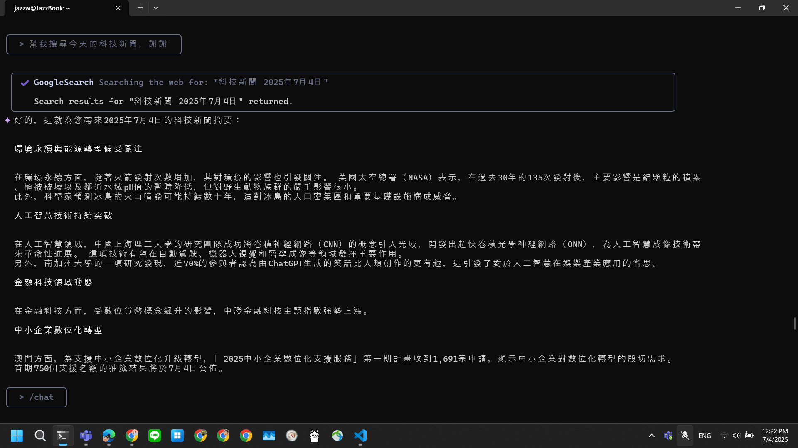
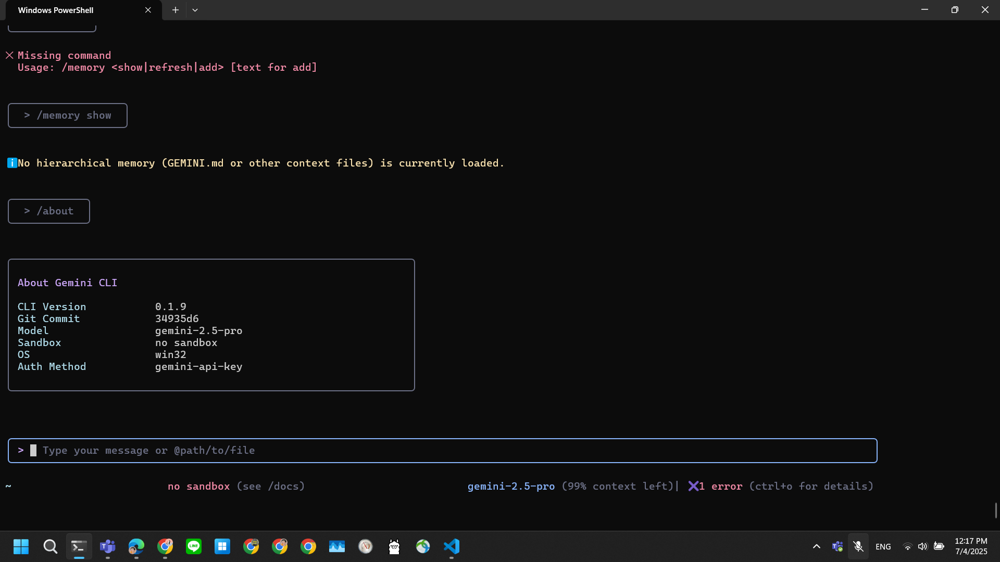
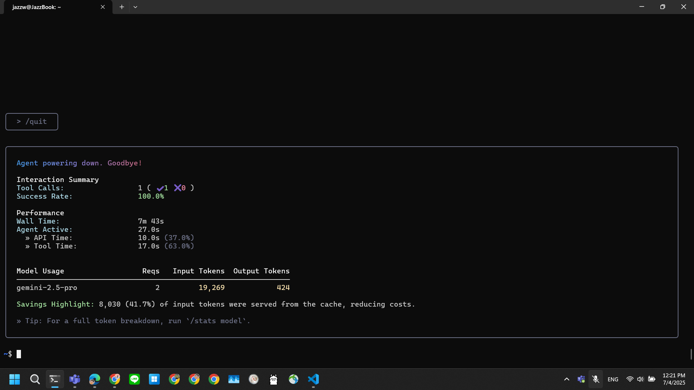

# Gemini CLI

- Git Repo
  - https://github.com/google-gemini/gemini-cli
- News
  - 2025-06-25: [Gemini CLI: your open-source AI agents](https://blog.google/technology/developers/introducing-gemini-cli-open-source-ai-agent/)
  - 2025-06-26: [Gemini CLI：你的開源 AI 代理](https://blog.google/intl/zh-tw/products/cloud/gemini-cli-your-open-source-ai-agent/)

## 2025-06-25

- See the news from [LargitData's LinkedIn Post](https://www.linkedin.com/feed/update/urn:li:activity:7343622985636827136/)

> Google 你這不要臉的傢伙，連 Claude Code 都抄，不過看在免費的份上，只好原諒你了！😤 
>
> Google 即將推出 Gemini CLI，a.k.a. Claude Code 的 Gemini 版本。🚀 
> 
> 💰 最大賣點 ，只需使用 Google 帳戶登入，即可獲得：
> 
> - Gemini 2.5 Pro 模型，含 100 萬 token 的超大上下文視窗
> - 每分鐘 60 次請求，每日最多 1,000 次請求
> 
> 代表幾乎完全免費！
>
> ⭐ Gemini CLI 還提供以下功能：
> 
> 🧠 智慧程式碼理解：深度理解程式碼，提供debug和最佳化建議
> 🔧 系統整合：透過自然語言直接操作檔案和執行系統命令
> 🔍 即時網路搜尋：內建 Google 搜尋功能！
> 🎛️ 高度可客製化：支援MCP、自訂提示和 GEMINI .md (連這也抄)
> 🤖 自動化整合：支援非同步呼叫，完美整合現有的工作流程
> 
> 好啦，大廠都下來卷了，猜猜我們的獨角獸 Cursor 還有多少光景好活？！😏 

- 看起來蠻值得花點時間測試一下。

## 2025-07-04

- ( 2025-07-04 12:13:19 )
- 環境：
  - Windows 11 Home x86_64
- 安裝：
```bash
~$ npm install -g @google/gemini-cli

added 432 packages in 23s
```
- 確認：
```bash
~$ which gemini
/c/Users/jazzw/scoop/apps/nvm/current/nodejs/nodejs/gemini
~$ gemini --help
Options:
  -m, --model                    Model      [string] [default: "gemini-2.5-pro"]
  -p, --prompt                   Prompt. Appended to input on stdin (if any).
                                                                        [string]
  -s, --sandbox                  Run in sandbox?                       [boolean]
      --sandbox-image            Sandbox image URI.                     [string]
  -d, --debug                    Run in debug mode?   [boolean] [default: false]
  -a, --all_files                Include ALL files in context?
                                                      [boolean] [default: false]
      --show_memory_usage        Show memory usage in status bar
                                                      [boolean] [default: false]
  -y, --yolo                     Automatically accept all actions (aka YOLO
                                 mode, see
                                 https://www.youtube.com/watch?v=xvFZjo5PgG0 for
                                 more details)?       [boolean] [default: false]
      --telemetry                Enable telemetry? This flag specifically
                                 controls if telemetry is sent. Other
                                 --telemetry-* flags set specific values but do
                                 not enable telemetry on their own.    [boolean]
      --telemetry-target         Set the telemetry target (local or gcp).
                                 Overrides settings files.
                                              [string] [choices: "local", "gcp"]
      --telemetry-otlp-endpoint  Set the OTLP endpoint for telemetry. Overrides
                                 environment variables and settings files.
                                                                        [string]
      --telemetry-log-prompts    Enable or disable logging of user prompts for
                                 telemetry. Overrides settings files.  [boolean]
  -c, --checkpointing            Enables checkpointing of file edits
                                                      [boolean] [default: false]
  -v, --version                  Show version number                   [boolean]
  -h, --help                     Show help                             [boolean]
~$ gemini -v
0.1.9
```
- 實測互動：
  - 
  - 
  - 
- 初步感想：
  - Autocompletion 不像 Aider 可以用 TAB 自動補齊 `/{command}`，也許還有特定的 hotkey 要研究文件才會知道。