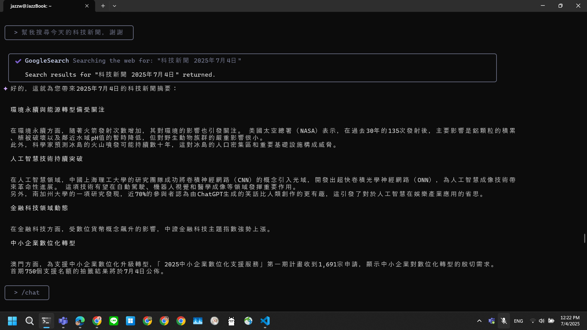
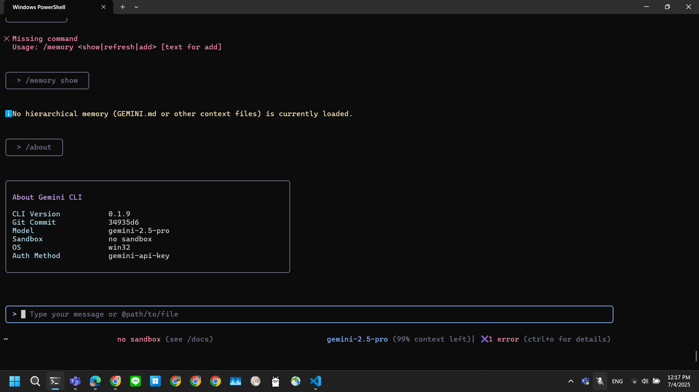
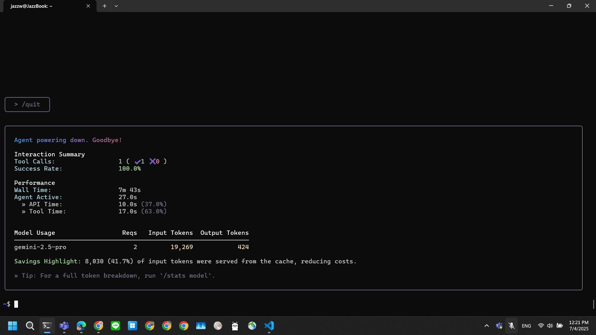
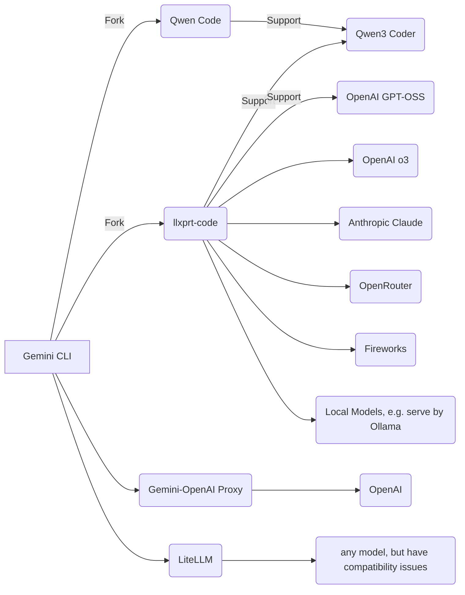

# Gemini CLI

- Git Repo
  - https://github.com/google-gemini/gemini-cli
- News
  - 2025-06-25: [Gemini CLI: your open-source AI agents](https://blog.google/technology/developers/introducing-gemini-cli-open-source-ai-agent/)
  - 2025-06-26: [Gemini CLI：你的開源 AI 代理](https://blog.google/intl/zh-tw/products/cloud/gemini-cli-your-open-source-ai-agent/)

## 2025-06-25

- See the news from [LargitData's LinkedIn Post](https://www.linkedin.com/feed/update/urn:li:activity:7343622985636827136/)

> Google 你這不要臉的傢伙，連 Claude Code 都抄，不過看在免費的份上，只好原諒你了！😤
>
> Google 即將推出 Gemini CLI，a.k.a. Claude Code 的 Gemini 版本。🚀
>
> 💰 最大賣點 ，只需使用 Google 帳戶登入，即可獲得：
>
> - Gemini 2.5 Pro 模型，含 100 萬 token 的超大上下文視窗
> - 每分鐘 60 次請求，每日最多 1,000 次請求
>
> 代表幾乎完全免費！
>
> ⭐ Gemini CLI 還提供以下功能：
>
> 🧠 智慧程式碼理解：深度理解程式碼，提供debug和最佳化建議
> 🔧 系統整合：透過自然語言直接操作檔案和執行系統命令
> 🔍 即時網路搜尋：內建 Google 搜尋功能！
> 🎛️ 高度可客製化：支援MCP、自訂提示和 GEMINI .md (連這也抄)
> 🤖 自動化整合：支援非同步呼叫，完美整合現有的工作流程
>
> 好啦，大廠都下來卷了，猜猜我們的獨角獸 Cursor 還有多少光景好活？！😏

- 看起來蠻值得花點時間測試一下。

## 2025-07-04

- ( 2025-07-04 12:13:19 )
- 參考：
  - 2025-06-27: 🌟 Gemini CLI 初探：讓 Gemini 進入你的終端機
  - https://vocus.cc/article/685dd5edfd897800010b06d3
- 環境：
  - Windows 11 Home x86_64
- 安裝：
```bash
~$ npm install -g @google/gemini-cli

added 432 packages in 23s
```
- 確認：
```bash
~$ which gemini
/c/Users/jazzw/scoop/apps/nvm/current/nodejs/nodejs/gemini
~$ gemini --help
Options:
  -m, --model                    Model      [string] [default: "gemini-2.5-pro"]
  -p, --prompt                   Prompt. Appended to input on stdin (if any).
                                                                        [string]
  -s, --sandbox                  Run in sandbox?                       [boolean]
      --sandbox-image            Sandbox image URI.                     [string]
  -d, --debug                    Run in debug mode?   [boolean] [default: false]
  -a, --all_files                Include ALL files in context?
                                                      [boolean] [default: false]
      --show_memory_usage        Show memory usage in status bar
                                                      [boolean] [default: false]
  -y, --yolo                     Automatically accept all actions (aka YOLO
                                 mode, see
                                 https://www.youtube.com/watch?v=xvFZjo5PgG0 for
                                 more details)?       [boolean] [default: false]
      --telemetry                Enable telemetry? This flag specifically
                                 controls if telemetry is sent. Other
                                 --telemetry-* flags set specific values but do
                                 not enable telemetry on their own.    [boolean]
      --telemetry-target         Set the telemetry target (local or gcp).
                                 Overrides settings files.
                                              [string] [choices: "local", "gcp"]
      --telemetry-otlp-endpoint  Set the OTLP endpoint for telemetry. Overrides
                                 environment variables and settings files.
                                                                        [string]
      --telemetry-log-prompts    Enable or disable logging of user prompts for
                                 telemetry. Overrides settings files.  [boolean]
  -c, --checkpointing            Enables checkpointing of file edits
                                                      [boolean] [default: false]
  -v, --version                  Show version number                   [boolean]
  -h, --help                     Show help                             [boolean]
~$ gemini -v
0.1.9
```
- 實測互動：
  - 
  - 
  - 
```
╭────────────╮
│  > /tools  │
╰────────────╯

ℹ Available Gemini CLI tools:

    - ReadFolder
    - ReadFile
    - SearchText
    - FindFiles
    - Edit
    - WriteFile
    - WebFetch
    - ReadManyFiles
    - Shell
    - Save Memory
    - GoogleSearch
```

- 初步感想：
  - Autocompletion 不像 Aider 可以用 TAB 自動補齊 `/{command}`，也許還有特定的 hotkey 要研究文件才會知道。
  - 相較於 Aider，Gemini CLI 只支援單一模型。
  - 相較於 Aider，目前 Aider 比較缺乏的部份應該就是 `/tools` 跟 `/mcp` 這兩塊吧～
    - Tools: 這部份理論上應該是 Model 本身是否支援 `Tool Calling`，但我有點不確定為什麼 Gemini 2.5 Pro 可以明確列出工具列表。其他支援 Tool 的模型(e.g. `Qwen 2.5`)並沒有
    - MCP: 雖然有人已經寫了讓 Aider 支援MCP 的外掛，但還是期待 Aider 有朝一日可以把這段補起來。
  - Aider 有實作 `cache` 來減少 token 用量，gemini-cli 看起來也有實作這一塊，不過<mark>僅限於 API Key 認證用戶</mark>。直接使用 Gmail OAuth 認證跟使用 Google Code Assistant 的用戶，還不支援快取節費(Token Caching and Cost Optimization)。當然科技大廠短期內應該就是砸錢養用量。先開放免費使用，養套殺策略。日久見人心，使用者會用腳投票。
    - 參考：
      - https://github.com/google-gemini/gemini-cli/blob/main/docs/troubleshooting.md
      > Q: Why don't I see <mark>cached token</mark> counts in my stats output?
      > A: Cached token information is only displayed when cached tokens are being used. <mark>This feature is available for **API key** users (Gemini API key or Vertex AI) but not for **OAuth** users (Google Personal/Enterprise accounts) at this time</mark>, as the Code Assist API does not support cached content creation. You can still view your total token usage with the `/stats` command.
      - https://github.com/google-gemini/gemini-cli/blob/main/docs/telemetry.md
      > gemini_cli.api_response: This event occurs upon receiving a response from Gemini API.
      > - Attributes:
      >   - model
      >     - status_code
      >     - duration_ms
      >     - error (optional)
      >     - input_token_count
      >     - output_token_count
      >     - <mark>cached_content_token_count</mark>
      >     - thoughts_token_count
      >     - tool_token_count
      >     - response_text (if applicable)
      - https://github.com/google-gemini/gemini-cli/blob/main/docs/cli/token-caching.md
      > **Token Caching and Cost Optimization**
      > Gemini CLI automatically optimizes API costs through token caching when using API key authentication (Gemini API key or Vertex AI). This feature reuses previous system instructions and context to reduce the number of tokens processed in subsequent requests.
      >
      > - **Token caching is available for:**
      >   - API key users (Gemini API key)
      >   - Vertex AI users (with project and location setup)
      >
      > - **Token caching is not available for:**
      >   - OAuth users (Google Personal/Enterprise accounts) - the Code Assist API does not support cached content creation at this time
      >
      > You can view your token usage and cached token savings using the `/stats` command. When cached tokens are available, they will be displayed in the stats output.
- 商業策略觀察：
  - `Github Copilot` vs `Google Code Assistant`
  - `Claude Code` vs `Gemini CLI`

## 2025-08-20

- Gemini CLI for GitHub Actions
  - https://www.linkedin.com/feed/update/urn:li:activity:7358848236998041601/
- 2025-08-06:
  - Meet your new AI coding teammate: Gemini CLI GitHub Actions
  - https://blog.google/technology/developers/introducing-gemini-cli-github-actions/
  - https://github.com/google-github-actions/run-gemini-cli

## 2025-08-21

- 2025-06-29:
  - Conquering Google Login for Gemini CLI on Headless Servers
  - https://medium.com/@fourdollars/conquering-google-login-for-gemini-cli-on-headless-servers-3e9d2649790f
- 2025-07-05:
  - Gemini CLI in GCP Cloud Shell with Google login 小記
  - https://sakananote2.blogspot.com/2025/07/gemini-cli-in-gcp-cloud-shell-with.html

## 2025-08-26

- 看別人比較 `Claude Code` 跟 `Gemini CLI`
- 觀點一：讓 `Claude Code` 跟 `Gemini CLI` 合作
  - 有點類似交叉詰問，先把需求定義清楚以後，再讓他們實作，並互相 Code Review。
  - 有人建議用 MCP 的方式來讓兩個模型合作，蠻有趣的作法。
  - Jun 27, 2025-06-27:
    - https://blog.metamirror.io/claude-code-v-gemini-cli-e144feafbcf2
- 觀點二：`Claude Code` 的 Code Quality 跟 User Experience 比較好。
  - 2025-07-02:
    - https://composio.dev/blog/gemini-cli-vs-claude-code-the-better-coding-agent
    - (同文轉貼) https://dev.to/composiodev/i-burnt-10m-tokens-to-compare-claude-code-and-gemini-cli-here-is-what-i-found-out-2e9k
- 觀點三：`Gemini CLI` 的 Context Windows 比較大，支援「多模態」，已經整合 MCP Tool，免費額度
  - 2025-07-09:
    - Claude Code vs Gemini CLI: Which One’s the Real Dev Co-Pilot?
    - https://milvus.io/blog/claude-code-vs-gemini-cli-which-ones-the-real-dev-co-pilot.md
  - **3. Code Quality vs Speed**

    | **Feature** | **Gemini CLI** | **Claude Code** | **Notes** |
    | --- |  --- |  --- |  --- |
    | **Coding speed** | 8.5/10 | 7.2/10 | Gemini generates code faster |
    | **Coding quality** | 7.8/10 | 9.1/10 | Claude generates higher quality code |
    | **Error handling** | 7.5/10 | 8.8/10 | Claude is better at error handling |
    | **Context understanding** | 9.2/10 | 7.9/10 | Gemini has longer memory |
    | **Multilingual support** | 8.9/10 | 8.5/10 | Both are excellent |

  - **6. Feature Comparison Overview**

    | **Feature** | **Claude Code** | **Gemini CLI** |
    | --- |  --- |  --- |
    | Context Window Length | 200K tokens | 1M tokens |
    | Multimodal Support | Limited | Powerful (images, PDFs, etc.) |
    | Code Understanding | Excellent | Excellent |
    | Tool Integration | Basic | Rich (MCP Servers) |
    | Security | Enterprise-grade | Standard |
    | Free Requests | Limited | 60/min, 1000/day |
  - 2025-07-09:
    - Gemini-CLI vs Claude-Code：工作流時代的開端
    - https://hkmci.com/zh-hant/blog/gemini-cli-vs-claude-code-workflow-era/?nab=0
    - 在深入比較前，我們先釐清一個關鍵差異：
      - `Claude Code` 是一款專注於編程支援的<mark>代理式編碼工具（Agentic **Coding** Tool）</mark>，核心能力是在命令列介面（CLI，Command Line Interface）中協助使用者撰寫與優化程式碼，最直接的路徑就能將提示詞（prompt）傳送給模型。
      - `Gemini CLI` 擁有 Gemini 2.5 Pro 的強大模型，也能在終端機（terminal）操作 AI 協助編碼、編程，但它的定位為<mark>代理式工作流工具（Agentic **Workflow** Tool）</mark>，程式撰寫只是其眾多能力中的一環，更重要的是，它能協助使用者自動化複雜的日常工作流程，成為全面的數位助理。

## 2025-10-09

- 緣起：
  - 因為看到 Github Spec Kit 支援 Claude Code, Gemini CLI 卻沒有支援 Aider
  - 回到先前想研究 Gemini CLI 是否支援其他 Local LLM
- 相關討論：
  - Open AI API compatible ? #1974
    - https://github.com/google-gemini/gemini-cli/discussions/1974
      - https://huggingface.co/engineofperplexity/gemini-openai-proxy/tree/main
      - https://docs.litellm.ai/docs/tutorials/litellm_gemini_cli
      - https://github.com/acoliver/llxprt-code
  - Use with any OpenAI compatible API model, including local models #2665
    - https://github.com/google-gemini/gemini-cli/issues/2665
  - Add support for local/offline language models (Ollola, LM Studio, etc.) #5938
    - https://github.com/google-gemini/gemini-cli/issues/5938
- 初步結論：
  - <mark>Gemini CLI 針對 Gemini 模型做優化</mark>
  - 看到一個 Workaround 是設定環境變數
    - https://github.com/google-gemini/gemini-cli/issues/2665#issuecomment-3020545758

## 2025-10-13

- Gemini for Google Cloud > Documentation > Guides > Gemini CLI
  - https://cloud.google.com/gemini/docs/codeassist/gemini-cli
- Hands-on with Gemini CLI
  - https://codelabs.developers.google.com/gemini-cli-hands-on


```mermaid
flowchart LR
    A[Gemini CLI] -->|Fork| B(Qwen Code)
    A -->|Fork| C(llxprt-code)
    B -->|Support| D(Qwen3 Coder)
    C -->|Support| D(Qwen3 Coder)
    C -->|Support| E(OpenAI GPT-OSS)
    A --> F(Gemini-OpenAI Proxy)
    F --> G(OpenAI)
    A --> H(LiteLLM) --> I(any model, but have compatibility issues)
    C --> J(OpenAI o3)
    C --> K(Anthropic Claude)
    C --> L(OpenRouter)
    C --> M(Fireworks)
    C --> N(Local Models, e.g. serve by Ollama)
```

## 2025-10-27

- 緣起：
  - 想知道 Gemini CLI 是否類似 Aider 會把 Chat History 存起來？
- 方法：
  - 問 DeepWiki
  - https://deepwiki.com/search/where-did-gemini-cli-store-his_fd93f653-8a88-40e4-bf00-de9203676ca4?mode=fast
<table><tr><td>Q:</td><td>
<!-- add your Prompt bellow-->
where did gemini cli store history?
</td></tr><tr><td>A:</td><td>
<!-- add Chatbot Response bellow-->
The Gemini CLI stores history in two different locations depending on the type of history:

## Shell Command History

Shell commands executed via the `!` prefix or shell mode are stored in a project-specific directory: [1](#0-0) 

**Location:** `~/.gemini/tmp/<project_hash>/shell_history` [1](#0-0) 

The `<project_hash>` is a unique identifier generated from your project's root path, which prevents conflicts between different projects. [1](#0-0) 

## Chat Conversation History

Chat checkpoints saved via the `/chat save` command are stored in: [2](#0-1) 

**Default locations:**
- Linux/macOS: `~/.gemini/tmp/<project_hash>/`
- Windows: `C:\Users\<YourUsername>\.gemini\tmp\<project_hash>\` [2](#0-1) 

When you run `/chat list`, the CLI scans these specific directories to find available checkpoints. [2](#0-1) 

## Notes

These manually saved chat checkpoints are different from automatic checkpoints created before file modifications (which are covered in the Checkpointing documentation). [3](#0-2)  The shell command history is managed separately and persists across sessions for each project.<cite />

Wiki pages you might want to explore:
- [Tools and File Operations (google-gemini/gemini-cli)](/wiki/google-gemini/gemini-cli#3.3)

### Citations

**File:** docs/get-started/configuration.md (L581-584)
```markdown
- **Location:** `~/.gemini/tmp/<project_hash>/shell_history`
  - `<project_hash>` is a unique identifier generated from your project's root
    path.
  - The history is stored in a file named `shell_history`.
```

**File:** docs/cli/commands.md (L29-34)
```markdown
      - **Details on Checkpoint Location:** The default locations for saved chat
        checkpoints are:
        - Linux/macOS: `~/.gemini/tmp/<project_hash>/`
        - Windows: `C:\Users\<YourUsername>\.gemini\tmp\<project_hash>\`
        - When you run `/chat list`, the CLI only scans these specific
          directories to find available checkpoints.
```

**File:** docs/cli/commands.md (L35-38)
```markdown
        - **Note:** These checkpoints are for manually saving and resuming
          conversation states. For automatic checkpoints created before file
          modifications, see the
          [Checkpointing documentation](../cli/checkpointing.md).
```
</td></tr></table>
<table><tr><td>Q:</td><td>
<!-- add your Prompt bellow-->
can gemini cli output to stdout?
</td></tr><tr><td>A:</td><td>
<!-- add Chatbot Response bellow-->
Yes, Gemini CLI can output to stdout, particularly in **headless/non-interactive mode**. [1](#1-0) 

## How It Works

When you run Gemini CLI with the `--prompt` flag or pipe input via stdin, it operates in non-interactive mode and writes responses directly to stdout: [2](#1-1) 

```bash
gemini --prompt "What is machine learning?"
# or
echo "Explain this code" | gemini
```

The implementation in `runNonInteractive()` writes content events directly to `process.stdout`: [3](#1-2) 

## Output Formats

You have two output format options:

### 1. Text Output (Default)
Standard human-readable output written directly to stdout as the model generates it: [3](#1-2) 

### 2. JSON Output
Structured output with response, statistics, and metadata, buffered and written once at the end: [4](#1-3) 

You can enable JSON output with:
```bash
gemini -p "Your prompt" --output-format json
```

The JSON format includes the response text, model usage stats, tool execution metrics, and error information if applicable. [5](#1-4) 

## Configuration

The output format can be configured via:
- Command-line flag: `--output-format <format>` (values: `text` or `json`) [6](#1-5) 
- Settings file: `output.format` setting [7](#1-6) 

## Notes

The stdout output is designed to be pipe-friendly and handles EPIPE errors gracefully when the receiving process closes early. [8](#1-7)  This makes it suitable for scripting, automation, and integration with other command-line tools.<cite />

Wiki pages you might want to explore:
- [Tools and File Operations (google-gemini/gemini-cli)](/wiki/google-gemini/gemini-cli#3.3)

### Citations

**File:** docs/cli/headless.md (L1-6)
```markdown
# Headless Mode

Headless mode allows you to run Gemini CLI programmatically from command line
scripts and automation tools without any interactive UI. This is ideal for
scripting, automation, CI/CD pipelines, and building AI-powered tools.

```

**File:** docs/cli/headless.md (L45-57)
```markdown
Use the `--prompt` (or `-p`) flag to run in headless mode:

```bash
gemini --prompt "What is machine learning?"
```

### Stdin Input

Pipe input to Gemini CLI from your terminal:

```bash
echo "Explain this code" | gemini
```
```

**File:** docs/cli/headless.md (L90-134)
```markdown
The JSON output follows this high-level structure:

```json
{
  "response": "string", // The main AI-generated content answering your prompt
  "stats": {
    // Usage metrics and performance data
    "models": {
      // Per-model API and token usage statistics
      "[model-name]": {
        "api": {
          /* request counts, errors, latency */
        },
        "tokens": {
          /* prompt, response, cached, total counts */
        }
      }
    },
    "tools": {
      // Tool execution statistics
      "totalCalls": "number",
      "totalSuccess": "number",
      "totalFail": "number",
      "totalDurationMs": "number",
      "totalDecisions": {
        /* accept, reject, modify, auto_accept counts */
      },
      "byName": {
        /* per-tool detailed stats */
      }
    },
    "files": {
      // File modification statistics
      "totalLinesAdded": "number",
      "totalLinesRemoved": "number"
    }
  },
  "error": {
    // Present only when an error occurred
    "type": "string", // Error type (e.g., "ApiError", "AuthError")
    "message": "string", // Human-readable error description
    "code": "number" // Optional error code
  }
}
```
```

**File:** packages/cli/src/nonInteractiveCli.ts (L52-58)
```typescript
      // Handle EPIPE errors when the output is piped to a command that closes early.
      process.stdout.on('error', (err: NodeJS.ErrnoException) => {
        if (err.code === 'EPIPE') {
          // Exit gracefully if the pipe is closed.
          process.exit(0);
        }
      });
```

**File:** packages/cli/src/nonInteractiveCli.ts (L126-131)
```typescript
          if (event.type === GeminiEventType.Content) {
            if (config.getOutputFormat() === OutputFormat.JSON) {
              responseText += event.value;
            } else {
              process.stdout.write(event.value);
            }
```

**File:** packages/cli/src/nonInteractiveCli.ts (L183-189)
```typescript
          if (config.getOutputFormat() === OutputFormat.JSON) {
            const formatter = new JsonFormatter();
            const stats = uiTelemetryService.getMetrics();
            process.stdout.write(formatter.format(responseText, stats));
          } else {
            process.stdout.write('\n'); // Ensure a final newline
          }
```

**File:** docs/get-started/configuration.md (L128-131)
```markdown
- **`output.format`** (string):
  - **Description:** The format of the CLI output.
  - **Default:** `"text"`
  - **Values:** `"text"`, `"json"`
```

**File:** docs/get-started/configuration.md (L715-722)
```markdown
- **`--output-format <format>`**:
  - **Description:** Specifies the format of the CLI output for non-interactive
    mode.
  - **Values:**
    - `text`: (Default) The standard human-readable output.
    - `json`: A machine-readable JSON output.
  - **Note:** For structured output and scripting, use the
    `--output-format json` flag.
```

</td></tr></table>

## 2025-11-16

- 2025-10-22
  - Gemini CLI Tips & Tricks
  - https://addyo.substack.com/p/gemini-cli-tips-and-tricks
  > ~30 pro-tips for effectively using Gemini CLI for agentic coding
- 2025-10-29
  - Introducing the Jules extension for Gemini CLI
  - https://developers.googleblog.com/en/introducing-the-jules-extension-for-gemini-cli/
- 2025-10-31
  - Master multi-tasking with the Jules extension for Gemini CLI
  - https://cloud.google.com/blog/topics/developers-practitioners/master-multi-tasking-with-the-jules-extension-for-gemini-cli
- 2025-10-31
  - BigQuery Data Analytics with Gemini CLI — Part 1
  - https://medium.com/google-cloud/bigquery-data-analytics-with-gemini-cli-part-1-bb692697016a

## 2025-12-20

- 想測試一下 Gemini CLI 怎麼整合 jira-mcp-server
  - MCP Server
    - https://www.npmjs.com/package/mcp-jira-server
    ```bash
    ~$ npx -y mcp-jira-server
    ```
- 參考文件
  - MCP servers with the Gemini CLI
    - https://geminicli.com/docs/tools/mcp-server/
  - Install GitHub MCP Server in Google Gemini CLI
    - https://github.com/github/github-mcp-server/blob/main/docs/installation-guides/install-gemini-cli.md
- 參考影片
  - Gemini CLI + ANY MCP Server — Step‑by‑Step Tutorial
    - https://www.youtube.com/watch?v=FE1LChbgFEw

## 2025-12-21

- 根據 https://www.npmjs.com/package/mcp-jira-server 的說明，直接修改 `~/.gemini/settings.json`
  - 記得把 `JIRA_BASE_URL` 跟 `JIRA_PAT` 改成正確的設定，重新啟動 Gemini CLI，就可以實驗看看是否正確。
```diff
~$ diff -Naur ~/.gemini/settings.json.old ~/.gemini/settings.json
--- /c/Users/jazzw/.gemini/settings.json.old    2025-12-26 19:07:35.406468200 +0800
+++ /c/Users/jazzw/.gemini/settings.json        2025-12-26 19:11:21.339870800 +0800
@@ -3,5 +3,31 @@
     "auth": {
       "selectedType": "gemini-api-key"
     }
+  },
+  "mcpServers": {
+    "jira": {
+      "command": "npx",
+      "args": [
+        "-y",
+        "mcp-jira-server"
+      ],
+      "env": {
+        "JIRA_BASE_URL": "https://jira.domain.com",
+        "JIRA_PAT": "your-personal-access-token-here"
+      }
+    }
+  },
+  "general": {
+    "previewFeatures": true,
+    "vimMode": false,
+    "sessionRetention": {
+      "enabled": true
+    }
+  },
+  "output": {
+    "format": "text"
+  },
+  "ui": {
+    "showMemoryUsage": true
   }
 }
```
- 實測：
```bash
~$ gemini

 ███            █████████  ██████████ ██████   ██████ █████ ██████   █████ █████
░░░███         ███░░░░░███░░███░░░░░█░░██████ ██████ ░░███ ░░██████ ░░███ ░░███
  ░░░███      ███     ░░░  ░███  █ ░  ░███░█████░███  ░███  ░███░███ ░███  ░███
    ░░░███   ░███          ░██████    ░███░░███ ░███  ░███  ░███░░███░███  ░███
     ███░    ░███    █████ ░███░░█    ░███ ░░░  ░███  ░███  ░███ ░░██████  ░███
   ███░      ░░███  ░░███  ░███ ░   █ ░███      ░███  ░███  ░███  ░░█████  ░███
 ███░         ░░█████████  ██████████ █████     █████ █████ █████  ░░█████ █████
░░░            ░░░░░░░░░  ░░░░░░░░░░ ░░░░░     ░░░░░ ░░░░░ ░░░░░    ░░░░░ ░░░░░

Tips for getting started:
1. Ask questions, edit files, or run commands.
2. Be specific for the best results.
3. Create GEMINI.md files to customize your interactions with Gemini.
4. /help for more information.

> /mcp list

Configured MCP servers:

🟢 jira - Ready (12 tools)
  Tools:
  - jira_add_comment
  - jira_assign_issue
  - jira_create_issue
  - jira_delete_issue
  - jira_get_comments
  - jira_get_current_user
  - jira_get_issue
  - jira_get_issue_types
  - jira_get_project
  - jira_get_projects
  - jira_search_issues
  - jira_update_issue


╭──────────────────────────────────────────────────────────────────────────────────────────────────────────────────────────────────────────────────────────╮
│ You are running Gemini CLI in your home directory. It is recommended to run in a project-specific directory.                                             │
╰──────────────────────────────────────────────────────────────────────────────────────────────────────────────────────────────────────────────────────────╯


 Using: 1 MCP server
╭──────────────────────────────────────────────────────────────────────────────────────────────────────────────────────────────────────────────────────────╮
│ >   Type your message or @path/to/file                                                                                                                   │
╰──────────────────────────────────────────────────────────────────────────────────────────────────────────────────────────────────────────────────────────╯
 ~                                                 no sandbox (see /docs)                                                 Auto (Gemini 3) /model | 183.7 MB
```

## 2026-02-11

<table><tr style="background-color:lightyellow;"><td>Q:</td><td>
where will Gemini CLI look for GEMINI_API_KEY? environment variable? .env file?
</td></tr></table>

The **Gemini CLI** is designed to be highly flexible with where it looks for your `GEMINI_API_KEY`. It follows a specific "look-up" hierarchy, checking both standard environment variables and various `.env` file locations.

### 1. Direct Environment Variables

The CLI first checks your active shell session for the `GEMINI_API_KEY` variable. This is the most common way to provide the key.

* **Linux/macOS:** `export GEMINI_API_KEY="your_key_here"`
* **Windows (PowerShell):** `$env:GEMINI_API_KEY="your_key_here"`
* **Windows (Command Prompt):** `set GEMINI_API_KEY=your_key_here`

### 2. `.env` File Search Logic

If the variable isn't found in your shell session, the CLI automatically scans for `.env` files. It uses a **bottom-up search** strategy:

1. **Current Directory:** It looks for a `.env` file in your current working directory.
2. **Parent Directories:** If not found, it searches upwards through parent directories until it hits the project root (indicated by a `.git` folder) or your home directory.
3. **Global/User Path:** Finally, it checks for a `.env` file in your home directory at:
* `~/.gemini/.env` (Recommended for global CLI use)
* `~/.env`


---

### Configuration Hierarchy (Precedence)

If you have keys in multiple places, the CLI follows this order of importance (highest to lowest):

| Priority | Source | Best For... |
| --- | --- | --- |
| **1 (Highest)** | **Command-Line Arguments** | One-off overrides (e.g., `--model`). |
| **2** | **Environment Variables** | Active CI/CD pipelines or temporary sessions. |
| **3** | **Project Settings** (`.gemini/settings.json`) | Project-specific configurations. |
| **4** | **Project `.env` file** | Local development secrets. |
| **5 (Lowest)** | **User Settings** (`~/.gemini/settings.json`) | Global defaults and themes. |

---

### Pro-Tips for Setup

* **Recommendation:** For a seamless experience across all your projects, create a file at `~/.gemini/.env` and add `GEMINI_API_KEY="your_actual_key"`.
* **Security:** If you use a `.env` file in a project folder, **always** add `.env` to your `.gitignore` to prevent accidentally pushing your secrets to GitHub.
* **Verification:** You can check if the CLI is seeing your key by running:
```bash
gemini --stats

```


(This usually confirms your connection status and current model access).

Would you like me to show you how to automate the loading of these keys for a specific terminal like Zsh or Bash?

<table><tr style="background-color:lightyellow;"><td>Q:</td><td>
is there a way to check which API key is gemini-cli currently using if I have multiple different GEMINI_API_KEY defined in .env of different folders?
</td></tr></table>

When you have nested `.env` files or multiple keys spread across your system, it can definitely feel like a game of "which key is it anyway?"

Because the CLI searches from the **current directory upward**, it will always pick the one "closest" to where your terminal is currently located.

Here are the best ways to verify which key is active:

### 1. The Direct Command (Recommended)

The most reliable way to see exactly what the CLI is "seeing" without actually running a model prompt is to use the diagnostic flag:

```bash
gemini --info

```

*Note: Depending on your specific version of the CLI, if `--info` isn't available, try `gemini --version` or `gemini config list`.*

### 2. The "Echo" Check

Since the CLI usually prioritizes your shell's environment variables over `.env` files, you should first check if a key is "hardcoded" into your session:

* **macOS/Linux:** `echo $GEMINI_API_KEY`
* **Windows:** `echo %GEMINI_API_KEY%`

**If this returns a value**, the CLI is likely using this key regardless of what is in your `.env` files.

---

### 3. Debugging the Path Hierarchy

If you want to visualize which `.env` file is being snatched up, you can use the `findup` logic manually to see which one is closest:

| Current Directory | Does `.env` exist? | Action |
| --- | --- | --- |
| `~/projects/app/src/` | No | Move up... |
| `~/projects/app/` | **Yes** | **CLI uses this key.** |
| `~/` | Yes | Ignored (higher level). |

### 4. Temporary Overrides

If you are worried about the wrong key being used, you can force the CLI to use a specific key for just one command without changing your files:

```bash
GEMINI_API_KEY="your_specific_key" gemini "How's the weather?"

```

---

### Quick Tip: Identifying the Key

Since API keys are sensitive, the CLI won't usually print the whole string. However, you can usually tell which is which by looking at the **last 4 characters**.

> **Friendly Reminder:** If you're switching between "Production" and "Development" keys frequently, it's often safer to name your keys specifically in your `.env` (like `PROD_KEY`) and then manually export the one you need: `export GEMINI_API_KEY=$PROD_KEY`.

Would you like me to help you write a small shell script that prints the last 4 characters of the active key so you can identify it instantly?

<table><tr style="background-color:lightyellow;"><td>實測</td><td>

1. `gemini --info` 不存在

```bash
~$ gemini --info
Unknown argument: info
```

2. `gemini --version` 只能顯示版本

```bash
~$ gemini --version
0.28.0
```

3. `gemini config list` 會進入 `interactive mode` 然後呼叫 `CLI Help Agent`

```bash
~/git/snippet$ gemini config list

 ███            █████████  ██████████ ██████   ██████ █████ ██████   █████ █████
░░░███         ███░░░░░███░░███░░░░░█░░██████ ██████ ░░███ ░░██████ ░░███ ░░███
  ░░░███      ███     ░░░  ░███  █ ░  ░███░█████░███  ░███  ░███░███ ░███  ░███
    ░░░███   ░███          ░██████    ░███░░███ ░███  ░███  ░███░░███░███  ░███
     ███░    ░███    █████ ░███░░█    ░███ ░░░  ░███  ░███  ░███ ░░██████  ░███
   ███░      ░░███  ░░███  ░███ ░   █ ░███      ░███  ░███  ░███  ░░█████  ░███
 ███░         ░░█████████  ██████████ █████     █████ █████ █████  ░░█████ █████
░░░            ░░░░░░░░░  ░░░░░░░░░░ ░░░░░     ░░░░░ ░░░░░ ░░░░░    ░░░░░ ░░░░░


Authenticated with gemini-api-key /auth

Tips for getting started:
1. Ask questions, edit files, or run commands.
2. Be specific for the best results.
3. Create GEMINI.md files to customize your interactions with Gemini.
4. /help for more information.

ℹ Positional arguments now default to interactive mode. To run in non-interactive mode, use the --prompt (-p) flag.

ℹ Waiting for MCP servers to initialize... Slash commands are still available and prompts will be queued.
▀▀▀▀▀▀▀▀▀▀▀▀▀▀▀▀▀▀▀▀▀▀▀▀▀▀▀▀▀▀▀▀▀▀▀▀▀▀▀▀▀▀▀▀▀▀▀▀▀▀▀▀▀▀▀▀▀▀▀▀▀▀▀▀▀▀▀▀▀▀▀▀▀▀▀▀▀▀▀▀▀▀▀▀▀▀▀▀▀▀▀▀▀▀▀▀▀▀▀▀▀▀▀▀▀▀▀▀▀▀▀▀▀▀▀▀▀▀▀▀▀▀▀▀▀▀▀▀▀▀▀▀▀▀▀▀▀▀▀▀▀▀▀▀▀▀▀▀▀▀▀▀▀▀▀▀
 > config list
▄▄▄▄▄▄▄▄▄▄▄▄▄▄▄▄▄▄▄▄▄▄▄▄▄▄▄▄▄▄▄▄▄▄▄▄▄▄▄▄▄▄▄▄▄▄▄▄▄▄▄▄▄▄▄▄▄▄▄▄▄▄▄▄▄▄▄▄▄▄▄▄▄▄▄▄▄▄▄▄▄▄▄▄▄▄▄▄▄▄▄▄▄▄▄▄▄▄▄▄▄▄▄▄▄▄▄▄▄▄▄▄▄▄▄▄▄▄▄▄▄▄▄▄▄▄▄▄▄▄▄▄▄▄▄▄▄▄▄▄▄▄▄▄▄▄▄▄▄▄▄▄▄▄▄▄
╭──────────────────────────────────────────────────────────────────────────────────────────────────────────────────────────────────────────────────────────╮
│ ✓  CLI Help Agent Delegating to agent 'cli_help'                                                                                                         │
│                                                                                                                                                          │
│ Subagent cli_help Finished                                                                                                                               │
│                                                                                                                                                          │
│ Termination Reason:                                                                                                                                      │
│  GOAL                                                                                                                                                    │
│                                                                                                                                                          │
│ Result:                                                                                                                                                  │
│ {                                                                                                                                                        │
│   "answer": "The Gemini CLI configuration can be viewed and modified using the /settings command, which opens an interactive settings editor.            │
│ Additionally, settings are stored in settings.json files at the following locations:\n\n- User settings: ~/.gemini/settings.json\n- Workspace settings:  │
│ your-project/.gemini/settings.json\n\nWorkspace settings override user settings. The documentation provides a detailed reference of all available        │
│ settings.",                                                                                                                                              │
│   "sources": [                                                                                                                                           │
│     "cli/settings.md"                                                                                                                                    │
│   ]                                                                                                                                                      │
│ }                                                                                                                                                        │
│                                                                                                                                                          │
╰──────────────────────────────────────────────────────────────────────────────────────────────────────────────────────────────────────────────────────────╯
╭──────────────────────────────────────────────────────────────────────────────────────────────────────────────────────────────────────────────────────────╮
│ ✓  ReadFolder .                                                                                                                                          │
│                                                                                                                                                          │
│ Listed 21 item(s). (5 ignored)                                                                                                                           │
╰──────────────────────────────────────────────────────────────────────────────────────────────────────────────────────────────────────────────────────────╯
```

4. 在 `gemini config list` 執行 `CLI Help Agent` 過程中，確認 `$GEMINI_API_KEY` 環境變數優先

</td></tr></table>

## 2026-06-23

<table><tr style="background-color:lightgreen;"><td>Tool:</td><td>
Google Search - AI Mode
</td></tr><tr style="background-color:lightyellow;"><td>Q:</td><td>
Gemini CLI 與 Antigravity CLI 的差異
</td></tr><tr><td>A:</td><td>

## Gemini CLI vs Antigravity CLI

Antigravity CLI 是 Google 推出用來全面取代舊版 Gemini CLI 的新世代工具。 兩者最核心的本質差異在於，舊版 Gemini CLI 定位為「對話式的終端機 AI 助手」（偏向 Vibe Coding）；而新版 Antigravity CLI 則是「Agent（代理人）導向的開發平台」，專門為了多工編排、背景自動化與大型重構而設計。 [1, 2, 3, 4, 5]

Google 在 Google I/O 2026 正式推出 Antigravity 2.0，並宣布舊版的 Gemini CLI 於 2026 年 6 月 18 日 停止對一般消費者開放，全面強制用戶遷移至 Antigravity CLI（指令改為 `agy`）。 [2, 3, 6]

這兩個命令列工具有以下幾項核心差異：

核心底層與架構
-------

-   開發語言與速度： 舊版 Gemini CLI 執行速度較一般；新版 Antigravity CLI 改用 Go 語言重新打造，在終端機的執行速度與回應效能上顯著提升。 [1, 3]
-   共用核心 Runtime (Harness)： Antigravity CLI 與 Antigravity 桌面版共用同一個 Agent 執行緒底層。當桌面版的 Agent 能力升級（如自動排程、自主衍生子代理人），CLI 端的 AI 代理人能力也會同步自動升級。 [1]

任務編排與多 Agent 能力
---------------

-   多工處理： 舊版 Gemini CLI 在執行大型代碼重構或複雜研究時，終端機會被鎖死，開發者需要手動開多個 `tmux` 視窗來切換。
-   異步平行排程： Antigravity CLI 內建多 Agent 編排功能。當你交付任務後，它會自動在背景將任務拆分給多個子代理（Dynamic Subagents）平行執行（例如同時修改多個專案 Repo），而主終端機不會被鎖死。 [1]

專案設定與工作區邏輯
----------

專案初始化與結構設定進行了全面重構，具體對照如下： [6]

| 功能維度 [6, 7] | 舊版 Gemini CLI (Legacy) | 新版 Antigravity CLI (`agy`) |
| --- |  --- |  --- |
| 執行指令 | `gemini` | `agy` |
| 環境初始化 | 手動輸入 `/init` 觸發 | 使用 `agy init` 初始化（自動載入專案規則） |
| 工作區規則檔案 | 僅讀取單一 `GEMINI.md` | 使用 `.agents/rules/` 目錄（支援多檔案規則） |
| 自訂技能 (Skills) | 全域存在 `~/.gemini/gemini-cli/skills/` | 支援專案本地 `.agents/skills/` 與全域設定 |
| 工具協定 (MCP) | 僅支援全域 MCP 設定檔 | 支援專案本地獨立的 `.agents/mcp_config.json` |

模型與權杖 (Token) 特性
----------------

-   搭配模型： Antigravity CLI 預設導入最新代的 Gemini 3.5 Flash 模型，反應速度極快，不過部分開發者評論其思維較急躁，需搭配精細的 Prompt 指引。 [2, 8]
-   權杖上限差異： 根據開發者反饋，舊版 Gemini CLI 的 Token 輸出限制較為寬鬆（適合長篇大論的思路探討）；而 Antigravity CLI 為了追求「快狠準」的 Agent 執行效率，單次輸出的 Token 上限感官上較窄。 [9, 10]

如果你目前仍在使用舊的工作流程，請儘速將專案環境與 Skill 腳本遷移至 `agy` 體系，以避免既有的指令失效。 [3, 11]
如果想了解更多細節，想請問你目前有打算將特定的舊專案腳本遷移過去，還是想了解如何配置新版 `.agents` 目錄底下的 Skills 或是 MCP 工具呢？
[1] [https://medium.com](https://medium.com/@simon3458/google-io-2026-antigravity-cli-cb19b42706a6)
[2] [https://www.youtube.com](https://www.youtube.com/watch?v=vTsadVEDKPE)
[3] [https://pcrookie.com](https://pcrookie.com/google-antigravity-2-intro/)
[4] [https://www.youtube.com](https://www.youtube.com/watch?v=24e_L19fxvA)
[5] [https://zhuanlan.zhihu.com](https://zhuanlan.zhihu.com/p/2040316906180241378)
[6] [https://lukehou.com](https://lukehou.com/tutorials/gemini-cli-to-antigravity-migration-checklist)
[7] [https://www.evanlin.com](https://www.evanlin.com/antigravity-cli/)
[8] [https://www.threads.com](https://www.threads.com/@mengqiutu/post/DSUi0I5CTHp/antigravity-%E5%92%8C-gemini-cli-%E7%9A%84%E9%A1%8D%E5%BA%A6%E6%98%AF%E5%88%86%E9%96%8B%E8%A8%88%E7%AE%97%E7%9A%84antigravity%E5%85%8D%E8%B2%BB7%E5%A4%A9%E5%88%B7%E6%96%B0%E4%BB%98%E8%B2%BB%E7%B4%84-5-%E5%B0%8F%E6%99%82%E5%88%B7%E6%96%B0%E5%8F%AF%E7%94%A8%E6%A8%A1%E5%9E%8B%E5%8C%85%E5%90%AB-claude-code-)
[9] [https://www.reddit.com](https://www.reddit.com/r/googlecloud/comments/1qvs1dd/choosing_antigravity_or_gemini_cli/?tl=zh-hant)
[10] [https://www.reddit.com](https://www.reddit.com/r/GeminiCLI/comments/1tuqr05/switched_to_antigravitycli_goodbye_geminicli/?tl=zh-hant)
[11] [https://www.facebook.com](https://www.facebook.com/mukispace/posts/%E6%88%91%E5%AF%A6%E5%9C%A8%E6%90%9E%E4%B8%8D%E6%87%82-gemini-cli-%E5%92%8C-antigravity-cli-%E5%B7%AE%E5%9C%A8%E5%93%AA-/1430942695715476/)

</td></tr>
</table>

> [!NOTE]
> 由於 Google 在 2026 年 5 月 19 日宣布全面淘汰個人版的 `gemini-cli`，並強制要求所有人在 **2026 年 6 月 18 日** 前全數遷移至 `agy` (Antigravity CLI)。                [[1](https://developers.googleblog.com/an-important-update-transitioning-gemini-cli-to-antigravity-cli/)]
> -   這意味著原先 Gemini CLI 的**數十萬名個人開發者與企業用戶**，已在這一個月內被迫全數轉換為 Antigravity CLI 的下載量。