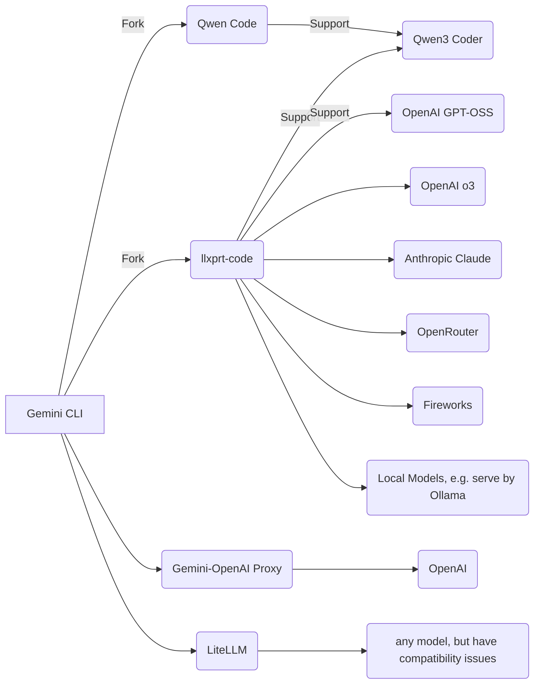

# Gemini CLI

- Git Repo
  - https://github.com/google-gemini/gemini-cli
- News
  - 2025-06-25: [Gemini CLI: your open-source AI agents](https://blog.google/technology/developers/introducing-gemini-cli-open-source-ai-agent/)
  - 2025-06-26: [Gemini CLIï¼šä½ çš„é–‹æº AI 代ç†](https://blog.google/intl/zh-tw/products/cloud/gemini-cli-your-open-source-ai-agent/)

## 2025-06-25

- See the news from [LargitData's LinkedIn Post](https://www.linkedin.com/feed/update/urn:li:activity:7343622985636827136/)

> Google 你這ä¸è¦è‡‰çš„傢伙，連 Claude Code 都抄，ä¸é看在å…費的份上，åªå¥½åŸè«’你了ï¼ğŸ˜¤
>
> Google å³å°‡æ¨å‡º Gemini CLI，a.k.a. Claude Code çš„ Gemini 版本。🚀
>
> 💰 æœ€å¤§è³£é» ï¼Œåªéœ€ä½¿ç”¨ Google 帳戶登入，å³å¯ç²å¾—：
>
> - Gemini 2.5 Pro 模å‹ï¼Œå« 100 è¬ token 的超大上下文視窗
> - æ¯åˆ†é˜ 60 次請求，æ¯æ—¥æœ€å¤š 1,000 次請求
>
> 代表幾ä¹å®Œå…¨å…è²»ï¼
>
> â­ Gemini CLI é‚„æ供以下功能：
>
> 🧠 智慧程å¼ç¢¼ç†è§£ï¼šæ·±åº¦ç†è§£ç¨‹å¼ç¢¼ï¼Œæä¾›debug和最佳化建議
> 🔧 系統整åˆï¼šé€é自然èªè¨€ç›´æ¥æ“作檔案和執行系統命令
> 🔠å³æ™‚網路æœå°‹ï¼šå…§å»º Google æœå°‹åŠŸèƒ½ï¼
> ğŸ›ï¸ 高度å¯å®¢è£½åŒ–：支æ´MCPã€è‡ªè¨‚æ示和 GEMINI .md (連這也抄)
> 🤖 自動化整åˆï¼šæ”¯æ´éåŒæ­¥å‘¼å«ï¼Œå®Œç¾æ•´åˆç¾æœ‰çš„工作æµç¨‹
>
> 好啦，大廠都下來å·äº†ï¼ŒçŒœçŒœæˆ‘們的ç¨è§’ç¸ Cursor 還有多少光景好活？ï¼ğŸ˜

- 看起來蠻值得花é»æ™‚間測試一下。

## 2025-07-04

- ( 2025-07-04 12:13:19 )
- åƒè€ƒï¼š
  - 2025-06-27: 🌟 Gemini CLI åˆæ¢ï¼šè®“ Gemini 進入你的終端機
  - https://vocus.cc/article/685dd5edfd897800010b06d3
- 環境：
  - Windows 11 Home x86_64
- 安è£ï¼š
```bash
~$ npm install -g @google/gemini-cli

added 432 packages in 23s
```
- 確èªï¼š
```bash
~$ which gemini
/c/Users/jazzw/scoop/apps/nvm/current/nodejs/nodejs/gemini
~$ gemini --help
Options:
  -m, --model                    Model      [string] [default: "gemini-2.5-pro"]
  -p, --prompt                   Prompt. Appended to input on stdin (if any).
                                                                        [string]
  -s, --sandbox                  Run in sandbox?                       [boolean]
      --sandbox-image            Sandbox image URI.                     [string]
  -d, --debug                    Run in debug mode?   [boolean] [default: false]
  -a, --all_files                Include ALL files in context?
                                                      [boolean] [default: false]
      --show_memory_usage        Show memory usage in status bar
                                                      [boolean] [default: false]
  -y, --yolo                     Automatically accept all actions (aka YOLO
                                 mode, see
                                 https://www.youtube.com/watch?v=xvFZjo5PgG0 for
                                 more details)?       [boolean] [default: false]
      --telemetry                Enable telemetry? This flag specifically
                                 controls if telemetry is sent. Other
                                 --telemetry-* flags set specific values but do
                                 not enable telemetry on their own.    [boolean]
      --telemetry-target         Set the telemetry target (local or gcp).
                                 Overrides settings files.
                                              [string] [choices: "local", "gcp"]
      --telemetry-otlp-endpoint  Set the OTLP endpoint for telemetry. Overrides
                                 environment variables and settings files.
                                                                        [string]
      --telemetry-log-prompts    Enable or disable logging of user prompts for
                                 telemetry. Overrides settings files.  [boolean]
  -c, --checkpointing            Enables checkpointing of file edits
                                                      [boolean] [default: false]
  -v, --version                  Show version number                   [boolean]
  -h, --help                     Show help                             [boolean]
~$ gemini -v
0.1.9
```
- 實測互動：
  - 
  - 
  - 
```
╭────────────╮
│  > /tools  │
╰────────────╯

ℹ Available Gemini CLI tools:

    - ReadFolder
    - ReadFile
    - SearchText
    - FindFiles
    - Edit
    - WriteFile
    - WebFetch
    - ReadManyFiles
    - Shell
    - Save Memory
    - GoogleSearch
```

- åˆæ­¥æ„Ÿæƒ³ï¼š
  - Autocompletion ä¸åƒ Aider å¯ä»¥ç”¨ TAB 自動補齊 `/{command}`，也許還有特定的 hotkey è¦ç ”究文件æ‰æœƒçŸ¥é“。
  - 相較於 Aider，Gemini CLI åªæ”¯æ´å–®ä¸€æ¨¡å‹ã€‚
  - 相較於 Aiderï¼Œç›®å‰ Aider 比較缺ä¹çš„部份應該就是 `/tools` è·Ÿ `/mcp` 這兩塊å§ï½
    - Tools: 這部份ç†è«–上應該是 Model 本身是å¦æ”¯æ´ `Tool Calling`，但我有é»ä¸ç¢ºå®šç‚ºä»€éº¼ Gemini 2.5 Pro å¯ä»¥æ˜ç¢ºåˆ—å‡ºå·¥å…·åˆ—è¡¨ã€‚å…¶ä»–æ”¯æ´ Tool 的模å‹(e.g. `Qwen 2.5`)並沒有
    - MCP: 雖然有人已經寫了讓 Aider 支æ´MCP 的外æ›ï¼Œä½†é‚„是期待 Aider 有æœä¸€æ—¥å¯ä»¥æŠŠé€™æ®µè£œèµ·ä¾†ã€‚
  - Aider 有實作 `cache` 來減少 token 用é‡ï¼Œgemini-cli 看起來也有實作這一塊，ä¸é<mark>僅é™æ–¼ API Key èªè­‰ç”¨æˆ¶</mark>。直æ¥ä½¿ç”¨ Gmail OAuth èªè­‰è·Ÿä½¿ç”¨ Google Code Assistant 的用戶，還ä¸æ”¯æ´å¿«å–節費(Token Caching and Cost Optimization)。當然科技大廠短期內應該就是砸錢養用é‡ã€‚先開放å…費使用，養套殺策略。日久見人心，使用者會用腳投票。
    - åƒè€ƒï¼š
      - https://github.com/google-gemini/gemini-cli/blob/main/docs/troubleshooting.md
      > Q: Why don't I see <mark>cached token</mark> counts in my stats output?
      > A: Cached token information is only displayed when cached tokens are being used. <mark>This feature is available for **API key** users (Gemini API key or Vertex AI) but not for **OAuth** users (Google Personal/Enterprise accounts) at this time</mark>, as the Code Assist API does not support cached content creation. You can still view your total token usage with the `/stats` command.
      - https://github.com/google-gemini/gemini-cli/blob/main/docs/telemetry.md
      > gemini_cli.api_response: This event occurs upon receiving a response from Gemini API.
      > - Attributes:
      >   - model
      >     - status_code
      >     - duration_ms
      >     - error (optional)
      >     - input_token_count
      >     - output_token_count
      >     - <mark>cached_content_token_count</mark>
      >     - thoughts_token_count
      >     - tool_token_count
      >     - response_text (if applicable)
      - https://github.com/google-gemini/gemini-cli/blob/main/docs/cli/token-caching.md
      > **Token Caching and Cost Optimization**
      > Gemini CLI automatically optimizes API costs through token caching when using API key authentication (Gemini API key or Vertex AI). This feature reuses previous system instructions and context to reduce the number of tokens processed in subsequent requests.
      >
      > - **Token caching is available for:**
      >   - API key users (Gemini API key)
      >   - Vertex AI users (with project and location setup)
      >
      > - **Token caching is not available for:**
      >   - OAuth users (Google Personal/Enterprise accounts) - the Code Assist API does not support cached content creation at this time
      >
      > You can view your token usage and cached token savings using the `/stats` command. When cached tokens are available, they will be displayed in the stats output.
- 商業策略觀察：
  - `Github Copilot` vs `Google Code Assistant`
  - `Claude Code` vs `Gemini CLI`

## 2025-08-20

- Gemini CLI for GitHub Actions
  - https://www.linkedin.com/feed/update/urn:li:activity:7358848236998041601/
- 2025-08-06:
  - Meet your new AI coding teammate: Gemini CLI GitHub Actions
  - https://blog.google/technology/developers/introducing-gemini-cli-github-actions/
  - https://github.com/google-github-actions/run-gemini-cli

## 2025-08-21

- 2025-06-29:
  - Conquering Google Login for Gemini CLI on Headless Servers
  - https://medium.com/@fourdollars/conquering-google-login-for-gemini-cli-on-headless-servers-3e9d2649790f
- 2025-07-05:
  - Gemini CLI in GCP Cloud Shell with Google login å°è¨˜
  - https://sakananote2.blogspot.com/2025/07/gemini-cli-in-gcp-cloud-shell-with.html

## 2025-08-26

- 看別人比較 `Claude Code` 跟 `Gemini CLI`
- 觀é»ä¸€ï¼šè®“ `Claude Code` è·Ÿ `Gemini CLI` åˆä½œ
  - 有é»é¡ä¼¼äº¤å‰è©°å•ï¼Œå…ˆæŠŠéœ€æ±‚定義清楚以後，å†è®“他們實作，並互相 Code Review。
  - 有人建議用 MCP çš„æ–¹å¼ä¾†è®“兩個模å‹åˆä½œï¼Œè »æœ‰è¶£çš„作法。
  - Jun 27, 2025-06-27:
    - https://blog.metamirror.io/claude-code-v-gemini-cli-e144feafbcf2
- 觀é»äºŒï¼š`Claude Code` çš„ Code Quality è·Ÿ User Experience 比較好。
  - 2025-07-02:
    - https://composio.dev/blog/gemini-cli-vs-claude-code-the-better-coding-agent
    - (åŒæ–‡è½‰è²¼) https://dev.to/composiodev/i-burnt-10m-tokens-to-compare-claude-code-and-gemini-cli-here-is-what-i-found-out-2e9k
- 觀é»ä¸‰ï¼š`Gemini CLI` çš„ Context Windows 比較大，支æ´ã€Œå¤šæ¨¡æ…‹ã€ï¼Œå·²ç¶“æ•´åˆ MCP Tool，å…è²»é¡åº¦
  - 2025-07-09:
    - Claude Code vs Gemini CLI: Which One’s the Real Dev Co-Pilot?
    - https://milvus.io/blog/claude-code-vs-gemini-cli-which-ones-the-real-dev-co-pilot.md
  - **3\. Code Quality vs Speed**

    | **Feature** | **Gemini CLI** | **Claude Code** | **Notes** |
    | --- |  --- |  --- |  --- |
    | **Coding speed** | 8.5/10 | 7.2/10 | Gemini generates code faster |
    | **Coding quality** | 7.8/10 | 9.1/10 | Claude generates higher quality code |
    | **Error handling** | 7.5/10 | 8.8/10 | Claude is better at error handling |
    | **Context understanding** | 9.2/10 | 7.9/10 | Gemini has longer memory |
    | **Multilingual support** | 8.9/10 | 8.5/10 | Both are excellent |

  - **6\. Feature Comparison Overview**

    | **Feature** | **Claude Code** | **Gemini CLI** |
    | --- |  --- |  --- |
    | Context Window Length | 200K tokens | 1M tokens |
    | Multimodal Support | Limited | Powerful (images, PDFs, etc.) |
    | Code Understanding | Excellent | Excellent |
    | Tool Integration | Basic | Rich (MCP Servers) |
    | Security | Enterprise-grade | Standard |
    | Free Requests | Limited | 60/min, 1000/day |
  - 2025-07-09:
    - Gemini-CLI vs Claude-Code：工作æµæ™‚代的開端
    - https://hkmci.com/zh-hant/blog/gemini-cli-vs-claude-code-workflow-era/?nab=0
    - 在深入比較å‰ï¼Œæˆ‘們先é‡æ¸…一個關éµå·®ç•°ï¼š
      - `Claude Code` 是一款專注於編程支æ´çš„<mark>代ç†å¼ç·¨ç¢¼å·¥å…·ï¼ˆAgentic **Coding** Tool）</mark>，核心能力是在命令列介é¢ï¼ˆCLI，Command Line Interface）中å”助使用者撰寫與優化程å¼ç¢¼ï¼Œæœ€ç›´æ¥çš„路徑就能將æ示è©ï¼ˆprompt）傳é€çµ¦æ¨¡å‹ã€‚
      - `Gemini CLI` æ“有 Gemini 2.5 Pro 的強大模å‹ï¼Œä¹Ÿèƒ½åœ¨çµ‚端機（terminal）æ“作 AI å”助編碼ã€ç·¨ç¨‹ï¼Œä½†å®ƒçš„定ä½ç‚º<mark>代ç†å¼å·¥ä½œæµå·¥å…·ï¼ˆAgentic **Workflow** Tool）</mark>，程å¼æ’°å¯«åªæ˜¯å…¶çœ¾å¤šèƒ½åŠ›ä¸­çš„一環，更é‡è¦çš„是，它能å”助使用者自動化複雜的日常工作æµç¨‹ï¼Œæˆç‚ºå…¨é¢çš„數ä½åŠ©ç†ã€‚

## 2025-10-09

- 緣起：
  - 因為看到 Github Spec Kit æ”¯æ´ Claude Code, Gemini CLI å»æ²’æœ‰æ”¯æ´ Aider
  - å›åˆ°å…ˆå‰æƒ³ç ”究 Gemini CLI 是å¦æ”¯æ´å…¶ä»– Local LLM
- 相關è¨è«–：
  - Open AI API compatible ? #1974
    - https://github.com/google-gemini/gemini-cli/discussions/1974
      - https://huggingface.co/engineofperplexity/gemini-openai-proxy/tree/main
      - https://docs.litellm.ai/docs/tutorials/litellm_gemini_cli
      - https://github.com/acoliver/llxprt-code
  - Use with any OpenAI compatible API model, including local models #2665
    - https://github.com/google-gemini/gemini-cli/issues/2665
  - Add support for local/offline language models (Ollola, LM Studio, etc.) #5938
    - https://github.com/google-gemini/gemini-cli/issues/5938
- åˆæ­¥çµè«–：
  - <mark>Gemini CLI é‡å° Gemini 模å‹åšå„ªåŒ–</mark>
  - 看到一個 Workaround 是設定環境變數
    - https://github.com/google-gemini/gemini-cli/issues/2665#issuecomment-3020545758

## 2025-10-13

- Gemini for Google Cloud > Documentation > Guides > Gemini CLI
  - https://cloud.google.com/gemini/docs/codeassist/gemini-cli
- Hands-on with Gemini CLI
  - https://codelabs.developers.google.com/gemini-cli-hands-on



## 2025-10-27

- 緣起：
  - æƒ³çŸ¥é“ Gemini CLI 是å¦é¡ä¼¼ Aider 會把 Chat History 存起來？
- 方法：
  - å• DeepWiki
  - https://deepwiki.com/search/where-did-gemini-cli-store-his_fd93f653-8a88-40e4-bf00-de9203676ca4?mode=fast
<table><tr><td>Q:</td><td>
<!-- add your Prompt bellow-->
where did gemini cli store history?
</td></tr><tr><td>A:</td><td>
<!-- add Chatbot Response bellow-->
The Gemini CLI stores history in two different locations depending on the type of history:

## Shell Command History

Shell commands executed via the `!` prefix or shell mode are stored in a project-specific directory: [1](#0-0) 

**Location:** `~/.gemini/tmp/<project_hash>/shell_history` [1](#0-0) 

The `<project_hash>` is a unique identifier generated from your project's root path, which prevents conflicts between different projects. [1](#0-0) 

## Chat Conversation History

Chat checkpoints saved via the `/chat save` command are stored in: [2](#0-1) 

**Default locations:**
- Linux/macOS: `~/.gemini/tmp/<project_hash>/`
- Windows: `C:\Users\<YourUsername>\.gemini\tmp\<project_hash>\` [2](#0-1) 

When you run `/chat list`, the CLI scans these specific directories to find available checkpoints. [2](#0-1) 

## Notes

These manually saved chat checkpoints are different from automatic checkpoints created before file modifications (which are covered in the Checkpointing documentation). [3](#0-2)  The shell command history is managed separately and persists across sessions for each project.<cite />

Wiki pages you might want to explore:
- [Tools and File Operations (google-gemini/gemini-cli)](/wiki/google-gemini/gemini-cli#3.3)

### Citations

**File:** docs/get-started/configuration.md (L581-584)
```markdown
- **Location:** `~/.gemini/tmp/<project_hash>/shell_history`
  - `<project_hash>` is a unique identifier generated from your project's root
    path.
  - The history is stored in a file named `shell_history`.
```

**File:** docs/cli/commands.md (L29-34)
```markdown
      - **Details on Checkpoint Location:** The default locations for saved chat
        checkpoints are:
        - Linux/macOS: `~/.gemini/tmp/<project_hash>/`
        - Windows: `C:\Users\<YourUsername>\.gemini\tmp\<project_hash>\`
        - When you run `/chat list`, the CLI only scans these specific
          directories to find available checkpoints.
```

**File:** docs/cli/commands.md (L35-38)
```markdown
        - **Note:** These checkpoints are for manually saving and resuming
          conversation states. For automatic checkpoints created before file
          modifications, see the
          [Checkpointing documentation](../cli/checkpointing.md).
```
</td></tr></table>
<table><tr><td>Q:</td><td>
<!-- add your Prompt bellow-->
can gemini cli output to stdout?
</td></tr><tr><td>A:</td><td>
<!-- add Chatbot Response bellow-->
Yes, Gemini CLI can output to stdout, particularly in **headless/non-interactive mode**. [1](#1-0) 

## How It Works

When you run Gemini CLI with the `--prompt` flag or pipe input via stdin, it operates in non-interactive mode and writes responses directly to stdout: [2](#1-1) 

```bash
gemini --prompt "What is machine learning?"
# or
echo "Explain this code" | gemini
```

The implementation in `runNonInteractive()` writes content events directly to `process.stdout`: [3](#1-2) 

## Output Formats

You have two output format options:

### 1. Text Output (Default)
Standard human-readable output written directly to stdout as the model generates it: [3](#1-2) 

### 2. JSON Output
Structured output with response, statistics, and metadata, buffered and written once at the end: [4](#1-3) 

You can enable JSON output with:
```bash
gemini -p "Your prompt" --output-format json
```

The JSON format includes the response text, model usage stats, tool execution metrics, and error information if applicable. [5](#1-4) 

## Configuration

The output format can be configured via:
- Command-line flag: `--output-format <format>` (values: `text` or `json`) [6](#1-5) 
- Settings file: `output.format` setting [7](#1-6) 

## Notes

The stdout output is designed to be pipe-friendly and handles EPIPE errors gracefully when the receiving process closes early. [8](#1-7)  This makes it suitable for scripting, automation, and integration with other command-line tools.<cite />

Wiki pages you might want to explore:
- [Tools and File Operations (google-gemini/gemini-cli)](/wiki/google-gemini/gemini-cli#3.3)

### Citations

**File:** docs/cli/headless.md (L1-6)
```markdown
# Headless Mode

Headless mode allows you to run Gemini CLI programmatically from command line
scripts and automation tools without any interactive UI. This is ideal for
scripting, automation, CI/CD pipelines, and building AI-powered tools.

```

**File:** docs/cli/headless.md (L45-57)
```markdown
Use the `--prompt` (or `-p`) flag to run in headless mode:

```bash
gemini --prompt "What is machine learning?"
```

### Stdin Input

Pipe input to Gemini CLI from your terminal:

```bash
echo "Explain this code" | gemini
```
```

**File:** docs/cli/headless.md (L90-134)
```markdown
The JSON output follows this high-level structure:

```json
{
  "response": "string", // The main AI-generated content answering your prompt
  "stats": {
    // Usage metrics and performance data
    "models": {
      // Per-model API and token usage statistics
      "[model-name]": {
        "api": {
          /* request counts, errors, latency */
        },
        "tokens": {
          /* prompt, response, cached, total counts */
        }
      }
    },
    "tools": {
      // Tool execution statistics
      "totalCalls": "number",
      "totalSuccess": "number",
      "totalFail": "number",
      "totalDurationMs": "number",
      "totalDecisions": {
        /* accept, reject, modify, auto_accept counts */
      },
      "byName": {
        /* per-tool detailed stats */
      }
    },
    "files": {
      // File modification statistics
      "totalLinesAdded": "number",
      "totalLinesRemoved": "number"
    }
  },
  "error": {
    // Present only when an error occurred
    "type": "string", // Error type (e.g., "ApiError", "AuthError")
    "message": "string", // Human-readable error description
    "code": "number" // Optional error code
  }
}
```
```

**File:** packages/cli/src/nonInteractiveCli.ts (L52-58)
```typescript
      // Handle EPIPE errors when the output is piped to a command that closes early.
      process.stdout.on('error', (err: NodeJS.ErrnoException) => {
        if (err.code === 'EPIPE') {
          // Exit gracefully if the pipe is closed.
          process.exit(0);
        }
      });
```

**File:** packages/cli/src/nonInteractiveCli.ts (L126-131)
```typescript
          if (event.type === GeminiEventType.Content) {
            if (config.getOutputFormat() === OutputFormat.JSON) {
              responseText += event.value;
            } else {
              process.stdout.write(event.value);
            }
```

**File:** packages/cli/src/nonInteractiveCli.ts (L183-189)
```typescript
          if (config.getOutputFormat() === OutputFormat.JSON) {
            const formatter = new JsonFormatter();
            const stats = uiTelemetryService.getMetrics();
            process.stdout.write(formatter.format(responseText, stats));
          } else {
            process.stdout.write('\n'); // Ensure a final newline
          }
```

**File:** docs/get-started/configuration.md (L128-131)
```markdown
- **`output.format`** (string):
  - **Description:** The format of the CLI output.
  - **Default:** `"text"`
  - **Values:** `"text"`, `"json"`
```

**File:** docs/get-started/configuration.md (L715-722)
```markdown
- **`--output-format <format>`**:
  - **Description:** Specifies the format of the CLI output for non-interactive
    mode.
  - **Values:**
    - `text`: (Default) The standard human-readable output.
    - `json`: A machine-readable JSON output.
  - **Note:** For structured output and scripting, use the
    `--output-format json` flag.
```

</td></tr></table>

## 2025-11-16

- 2025-10-22
  - Gemini CLI Tips & Tricks
  - https://addyo.substack.com/p/gemini-cli-tips-and-tricks
  > ~30 pro-tips for effectively using Gemini CLI for agentic coding
- 2025-10-29
  - Introducing the Jules extension for Gemini CLI
  - https://developers.googleblog.com/en/introducing-the-jules-extension-for-gemini-cli/
- 2025-10-31
  - BigQuery Data Analytics with Gemini CLI — Part 1
  - https://medium.com/google-cloud/bigquery-data-analytics-with-gemini-cli-part-1-bb692697016a
