# json-schema-generator

> Generates draft v4 schema from a local file or a remote JSON url.

- NPM
  - https://www.npmjs.com/package/json-schema-generator
- Git Repo
  - https://github.com/krg7880/json-schema-generator

## 2025-09-06

- 需求：從 JSON 檔案資料轉成 JSON Schema 定義

<table><tr><td>Q:</td><td>
<!-- add your Prompt bellow-->
are there command line tool to convert JSON file to JSON Schema?
</td></tr><tr><td>A:</td><td>
<!-- add Chatbot Response bellow-->
Yes, there are several command-line tools available to convert a JSON file into a JSON Schema. These tools typically work by analyzing the structure and data types within one or more sample JSON documents and then inferring a schema that would validate them.

### Popular Command-Line Tools

There are a few key options you can consider, depending on your environment and needs.

* **`json-schema-generator` (NPM Package)**: This is a popular tool for Node.js environments. It's easy to install via npm and provides a straightforward command-line interface. You can pipe a JSON file to it or specify an input file directly. The tool analyzes the JSON and outputs a draft of a schema. 

* **`quicktype`**: While `quicktype` is best known for generating code from JSON, it also has a feature to generate JSON Schema. It's a versatile tool that can be used on the command line to infer a schema from a JSON file or a directory of sample files.

* **`json-cli` (Python/Docker)**: This is a robust, multi-functional tool with a range of features beyond just schema generation, including validation, formatting, and diffing. You can use it to build a schema from a JSON instance, and it can be run directly from a Docker container, making it easy to use in various environments without a complex setup.
</td></tr></table>

- 備註：找不到 `json-cli` 這個 python 套件。（幻覺？）

## 2025-11-23

- 安裝：
```bash
~/Downloads$ npm install -g json-schema-generator
```
- 範例輸入：
```json
{
    "title": "fresh fruit schema v1",
    "type": "object",
    "required": ["skin", "colors", "taste"],
    "properties": {
        "colors": {
            "type": "array",
            "minItems": 1,
            "uniqueItems": true,
            "items": {
                "type": "string"
            }
        },
        "skin": {
            "type": "string"
        },
        "taste": {
            "type": "number",
            "minimum": 5
        }
    }
}
```
- 範例輸出：
```bash
~/Downloads$ json-schema-generator sample.json
Node
{
  "$schema": "http://json-schema.org/draft-04/schema#",
  "description": "",
  "type": "object",
  "properties": {
    "title": {
      "type": "string",
      "minLength": 1
    },
    "type": {
      "type": "string",
      "minLength": 1
    },
    "required": {
      "type": "array",
      "items": {
        "required": [],
        "properties": {}
      }
    },
    "properties": {
      "type": "object",
      "properties": {
        "colors": {
          "type": "object",
          "properties": {
            "type": {
              "type": "string",
              "minLength": 1
            },
            "minItems": {
              "type": "number"
            },
            "uniqueItems": {
              "type": "boolean"
            },
            "items": {
              "type": "object",
              "properties": {
                "type": {
                  "type": "string",
                  "minLength": 1
                }
              },
              "required": [
                "type"
              ]
            }
          },
          "required": [
            "type",
            "minItems",
            "uniqueItems",
            "items"
          ]
        },
        "skin": {
          "type": "object",
          "properties": {
            "type": {
              "type": "string",
              "minLength": 1
            }
          },
          "required": [
            "type"
          ]
        },
        "taste": {
          "type": "object",
          "properties": {
            "type": {
              "type": "string",
              "minLength": 1
            },
            "minimum": {
              "type": "number"
            }
          },
          "required": [
            "type",
            "minimum"
          ]
        }
      },
      "required": [
        "colors",
        "skin",
        "taste"
      ]
    }
  },
  "required": [
    "title",
    "type",
    "required",
    "properties"
  ]
}
```
- 狀況：用 STDIN 的作法反而沒有結果
```bash
~/Downloads$ cat sample.json | json-schema-generator
Node
```
- 雖然可以生成 JSON Schema，但原本我想要的結果是類似 PySpark 那種有階層的輸出。
  - 替代方案：
    - 用 `jq` 直接生成
    - https://stackoverflow.com/a/43380040
    ```bash
    ~/Downloads$ cat ~/bin/jq-schema
    #!/bin/bash
    SOURCE_FILE=$1
    ##-- https://stackoverflow.com/a/43380040
    ##-- Posted by peak, modified by community. See post 'Timeline' for change history
    ##-- Retrieved 2025-11-23, License - CC BY-SA 4.0

    jq 'paths(scalars) | map(tostring) | join(".")' $SOURCE_FILE
    ```
    ```bash
    ~/Downloads$ jq-schema sample.json
    "title"
    "type"
    "required.0"
    "required.1"
    "required.2"
    "properties.colors.type"
    "properties.colors.minItems"
    "properties.colors.uniqueItems"
    "properties.colors.items.type"
    "properties.skin.type"
    "properties.taste.type"
    "properties.taste.minimum"
    ```
    - 用 python 生成
    - https://stackoverflow.com/a/43379886
    ```bash
    ~/Downloads$ show_struct.py sample.json
    .properties
    .properties.colors
    .properties.colors.items
    .properties.colors.items.type -- string
    .properties.colors.minItems -- 1
    .properties.colors.type -- array
    .properties.colors.uniqueItems -- True
    .properties.skin
    .properties.skin.type -- string
    .properties.taste
    .properties.taste.minimum -- 5
    .properties.taste.type -- number
    .required -- (Array of 3 elements)
    .required[] -- colors .. taste (3 unique values)
    .title -- fresh fruit schema v1
    .type -- object
    ```

### HAR 的 JSON Schema

```bash
~/git/snippet$ json-schema-generator ~/Downloads/sample.har
Node
{
  "$schema": "http://json-schema.org/draft-04/schema#",
  "description": "",
  "type": "object",
  "properties": {
    "log": {
      "type": "object",
      "properties": {
        "version": {
          "type": "string",
          "minLength": 1
        },
        "creator": {
          "type": "object",
          "properties": {
            "name": {
              "type": "string",
              "minLength": 1
            },
            "version": {
              "type": "string",
              "minLength": 1
            }
          },
          "required": [
            "name",
            "version"
          ]
        },
        "pages": {
          "type": "array",
          "uniqueItems": true,
          "minItems": 1,
          "items": {
            "required": [
              "startedDateTime",
              "id",
              "title"
            ],
            "properties": {
              "startedDateTime": {
                "type": "string",
                "minLength": 1
              },
              "id": {
                "type": "string",
                "minLength": 1
              },
              "title": {
                "type": "string",
                "minLength": 1
              },
              "pageTimings": {
                "type": "object",
                "properties": {
                  "onContentLoad": {
                    "type": "number"
                  },
                  "onLoad": {
                    "type": "number"
                  }
                },
                "required": [
                  "onContentLoad",
                  "onLoad"
                ]
              }
            }
          }
        },
        "entries": {
          "type": "array",
          "uniqueItems": true,
          "minItems": 1,
          "items": {
            "required": [
              "_connectionId",
              "_priority",
              "_resourceType",
              "connection",
              "pageref",
              "serverIPAddress",
              "startedDateTime",
              "time"
            ],
            "properties": {
              "_connectionId": {
                "type": "string",
                "minLength": 1
              },
              "_initiator": {
                "type": "object",
                "properties": {
                  "type": {
                    "type": "string",
                    "minLength": 1
                  },
                  "stack": {
                    "type": "object",
                    "properties": {
                      "callFrames": {
                        "type": "array",
                        "uniqueItems": true,
                        "minItems": 1,
                        "items": {
                          "required": [
                            "functionName",
                            "scriptId",
                            "url",
                            "lineNumber",
                            "columnNumber"
                          ],
                          "properties": {
                            "functionName": {
                              "type": "string",
                              "minLength": 1
                            },
                            "scriptId": {
                              "type": "string",
                              "minLength": 1
                            },
                            "url": {
                              "type": "string",
                              "minLength": 1
                            },
                            "lineNumber": {
                              "type": "number"
                            },
                            "columnNumber": {
                              "type": "number"
                            }
                          }
                        }
                      },
                      "parent": {
                        "type": "object",
                        "properties": {
                          "description": {
                            "type": "string",
                            "minLength": 1
                          },
                          "callFrames": {
                            "type": "array",
                            "uniqueItems": true,
                            "minItems": 1,
                            "items": {
                              "required": [
                                "functionName",
                                "scriptId",
                                "url",
                                "lineNumber",
                                "columnNumber"
                              ],
                              "properties": {
                                "functionName": {
                                  "type": "string",
                                  "minLength": 1
                                },
                                "scriptId": {
                                  "type": "string",
                                  "minLength": 1
                                },
                                "url": {
                                  "type": "string",
                                  "minLength": 1
                                },
                                "lineNumber": {
                                  "type": "number"
                                },
                                "columnNumber": {
                                  "type": "number"
                                }
                              }
                            }
                          }
                        },
                        "required": [
                          "description",
                          "callFrames"
                        ]
                      }
                    },
                    "required": [
                      "callFrames",
                      "parent"
                    ]
                  }
                },
                "required": [
                  "type",
                  "stack"
                ]
              },
              "_priority": {
                "type": "string",
                "minLength": 1
              },
              "_resourceType": {
                "type": "string",
                "minLength": 1
              },
              "cache": {
                "type": "object",
                "properties": {},
                "required": []
              },
              "connection": {
                "type": "string",
                "minLength": 1
              },
              "pageref": {
                "type": "string",
                "minLength": 1
              },
              "request": {
                "type": "object",
                "properties": {
                  "method": {
                    "type": "string",
                    "minLength": 1
                  },
                  "url": {
                    "type": "string",
                    "minLength": 1
                  },
                  "httpVersion": {
                    "type": "string",
                    "minLength": 1
                  },
                  "headers": {
                    "type": "array",
                    "uniqueItems": true,
                    "minItems": 1,
                    "items": {
                      "required": [
                        "name",
                        "value"
                      ],
                      "properties": {
                        "name": {
                          "type": "string",
                          "minLength": 1
                        },
                        "value": {
                          "type": "string",
                          "minLength": 1
                        }
                      }
                    }
                  },
                  "queryString": {
                    "type": "array",
                    "items": {
                      "required": [],
                      "properties": {}
                    }
                  },
                  "cookies": {
                    "type": "array",
                    "items": {
                      "required": [],
                      "properties": {}
                    }
                  },
                  "headersSize": {
                    "type": "number"
                  },
                  "bodySize": {
                    "type": "number"
                  }
                },
                "required": [
                  "method",
                  "url",
                  "httpVersion",
                  "headers",
                  "queryString",
                  "cookies",
                  "headersSize",
                  "bodySize"
                ]
              },
              "response": {
                "type": "object",
                "properties": {
                  "status": {
                    "type": "number"
                  },
                  "statusText": {
                    "type": "string"
                  },
                  "httpVersion": {
                    "type": "string",
                    "minLength": 1
                  },
                  "headers": {
                    "type": "array",
                    "uniqueItems": true,
                    "minItems": 1,
                    "items": {
                      "required": [
                        "name",
                        "value"
                      ],
                      "properties": {
                        "name": {
                          "type": "string",
                          "minLength": 1
                        },
                        "value": {
                          "type": "string",
                          "minLength": 1
                        }
                      }
                    }
                  },
                  "cookies": {
                    "type": "array",
                    "items": {
                      "required": [],
                      "properties": {}
                    }
                  },
                  "content": {
                    "type": "object",
                    "properties": {
                      "size": {
                        "type": "number"
                      },
                      "mimeType": {
                        "type": "string",
                        "minLength": 1
                      },
                      "text": {
                        "type": "string",
                        "minLength": 1
                      }
                    },
                    "required": [
                      "size",
                      "mimeType",
                      "text"
                    ]
                  },
                  "redirectURL": {
                    "type": "string"
                  },
                  "headersSize": {
                    "type": "number"
                  },
                  "bodySize": {
                    "type": "number"
                  },
                  "_transferSize": {
                    "type": "number"
                  },
                  "_error": {},
                  "_fetchedViaServiceWorker": {
                    "type": "boolean"
                  }
                },
                "required": [
                  "status",
                  "statusText",
                  "httpVersion",
                  "headers",
                  "cookies",
                  "content",
                  "redirectURL",
                  "headersSize",
                  "bodySize",
                  "_transferSize",
                  "_fetchedViaServiceWorker"
                ]
              },
              "serverIPAddress": {
                "type": "string",
                "minLength": 1
              },
              "startedDateTime": {
                "type": "string",
                "minLength": 1
              },
              "time": {
                "type": "number"
              },
              "timings": {
                "type": "object",
                "properties": {
                  "blocked": {
                    "type": "number"
                  },
                  "dns": {
                    "type": "number"
                  },
                  "ssl": {
                    "type": "number"
                  },
                  "connect": {
                    "type": "number"
                  },
                  "send": {
                    "type": "number"
                  },
                  "wait": {
                    "type": "number"
                  },
                  "receive": {
                    "type": "number"
                  },
                  "_blocked_queueing": {
                    "type": "number"
                  },
                  "_workerStart": {
                    "type": "number"
                  },
                  "_workerReady": {
                    "type": "number"
                  },
                  "_workerFetchStart": {
                    "type": "number"
                  },
                  "_workerRespondWithSettled": {
                    "type": "number"
                  }
                },
                "required": [
                  "blocked",
                  "dns",
                  "ssl",
                  "connect",
                  "send",
                  "wait",
                  "receive",
                  "_blocked_queueing",
                  "_workerStart",
                  "_workerReady",
                  "_workerFetchStart",
                  "_workerRespondWithSettled"
                ]
              }
            }
          }
        }
      },
      "required": [
        "version",
        "creator",
        "pages",
        "entries"
      ]
    }
  },
  "required": [
    "log"
  ]
}
```

![](https://img.plantuml.biz/plantuml/png/xHlBZjisy1uW_x1mUsow3T1JJYbQ15XWiIZYRN8e5WOjZMrc9TAXg4tTelzUaf9jFVWOsfBY5AkJpHdEW_FKI7fRI2BafuApbo_-UVdYwchsVP5i82UpDrUpZPJRDzVN6lggMlsHY_LrAiXAllhfv-jgxRlP3sPZ2aKYw5PIplJcUbNkjg3_ykKdI6Izk1Ly2q9IA1J8i5MB6LyV_pbs6e1jjm4yWIWgxetL1gL22ihMHqe6c5Ds2smjDmhZzH7oRmDhbWWWaWiduQw8NZ4Da94S-ii1MNtoTcNs7SZvZ9f_srnd0ZwNL42gTlrfKzebOtFvmM67BLdtJ_EW2H62x3f6A1dzNCADX5plawA4dlNtmDTj2AsNkvPpwtUb3rD54wI_4GdtjA-i9fjQ5YML6SpQom_TW_BvauMr1GTXTR_T-ovMQJGPh-gW9cEd_KqTfY9dFVD01jWJyThDe73sAsSIcBpbn76QBMwip9SWPZQilXOrXm58znTjtBmHOb7NAt0Vzj2pcoytEHA9uYqi1hcaLB98E6FAfrHklB7bZCLMK2wetDbW0WfUYWJkjJvz-96q1QYTNi3A0Yb0g6nzy_ilQQeO53QCOFwJUlcyJDS-cScImO8oAgcj3-ZmF2yNr5H2SUfMBAoSNK6pJnamUKImT-k8rDEW9IJBtWdL5NZH_77PmGn4QGVR6RCTF4S4Tx12YQ-1kYgPSU0xIqlKGwxwQbiMw22M8WlYP9J1NPNaGwW9pygStRahmlxgHd273iuRQkJMoGJHqH7Hs12CZUDbZv86hODfBbvIxHiNBsJ3EMDazJGj4SnRxZuyUn_O0tI2tFge4YvKXuFCgVvKNj531t1d2X0AzZXdmxkQtzRekjEICLXx37PK_TahXQb11XTLXmmclXOPz9XwP3PWQv91HjGbWuUlJGOTNP_qvQzHXbvCdJ8ROckLsHIROCscY2Ihhr2kCpHZQjTbIOwiPPSbT5njQycEAZ1eGMBht8cYX50222VNIryXmsR5LXb3rn8tNczeSP3M3d0fWLAWALAmHx33hV8EDl-Hrgc40LNtdvYfZsyYCjrCe3LecOnjGf9DY1rw2X6q8URi6nEbIQUpUb0r6KDzA50u-kg1nZyvo0t736f76W1vI-lOpFK3nm_kPrOJ2G4aLJ8W1F3U4U3l131t0E7E7rdRh0_XMWXF92kx8zhZvMwZqUspy-5d2occRyFsQzxUeDBxguWLsnr4UBDoGR6RLyAUwz5nFeZsb06qJ3X_zFhTDwzXdPNcz6_Cqu7u1uHBdku683vKYrYNGNUD2XSGVtOFHulVqy9M2fppQJskwZUtd1M3DN-k9boMc62ATxEAz3tyvPbETdFiSmFnt41OH7Xk88vYZTX0_FzBQrAzZ8BGS9YdteMtpBOO1gPjdaT0ESqzGuaUex0tudpH8v7q9lrnf74unrdJjS9Pt6l1SiThDmSKSn9sg7tmPlTR9QWIDf5_lByTfvX-6osddVX22iAA5OZnE80GrRj0BeGLo6G3wGTAvY2UQ08VkNZqpTmFqYmvpu2mSNlikiqBDchZjDh-HdgVayEUVtOZZl6VI0EVrjjtNw-RRAxvrLuTbc5kZhYq4nlzHTrbnfD76ESLtPIDTCjLO2QwyNJhaVyuCWCRvv2_43gEn2eT0NqQgTBKRhTGjuCbu2Pv9t3vOfBNN2U3CHcyLwdPyOXk60RlT5QUG0qzYKa_KhcPWvJPsLbXgBA-pr7kBEFE4_v8zyIg9zhyyOBrU8JF8hmEwpUnbiSK_FQ2ypE5_S-ZyHqcFtmvrH3syALQSwtwQggvil_yORzK2sjuLtmjFCq7UlgdmbQORvNPzPU1_m40)

```plantuml
@startjson
{
  "$schema": "http://json-schema.org/draft-04/schema#",
  "description": "",
  "type": "object",
  "properties": {
    "log": {
      "type": "object",
      "properties": {
        "version": {
          "type": "string",
          "minLength": 1
        },
        "creator": {
          "type": "object",
          "properties": {
            "name": {
              "type": "string",
              "minLength": 1
            },
            "version": {
              "type": "string",
              "minLength": 1
            }
          },
          "required": [
            "name",
            "version"
          ]
        },
        "pages": {
          "type": "array",
          "uniqueItems": true,
          "minItems": 1,
          "items": {
            "required": [
              "startedDateTime",
              "id",
              "title"
            ],
            "properties": {
              "startedDateTime": {
                "type": "string",
                "minLength": 1
              },
              "id": {
                "type": "string",
                "minLength": 1
              },
              "title": {
                "type": "string",
                "minLength": 1
              },
              "pageTimings": {
                "type": "object",
                "properties": {
                  "onContentLoad": {
                    "type": "number"
                  },
                  "onLoad": {
                    "type": "number"
                  }
                },
                "required": [
                  "onContentLoad",
                  "onLoad"
                ]
              }
            }
          }
        },
        "entries": {
          "type": "array",
          "uniqueItems": true,
          "minItems": 1,
          "items": {
            "required": [
              "_connectionId",
              "_priority",
              "_resourceType",
              "connection",
              "pageref",
              "serverIPAddress",
              "startedDateTime",
              "time"
            ],
            "properties": {
              "_connectionId": {
                "type": "string",
                "minLength": 1
              },
              "_initiator": {
                "type": "object",
                "properties": {
                  "type": {
                    "type": "string",
                    "minLength": 1
                  },
                  "stack": {
                    "type": "object",
                    "properties": {
                      "callFrames": {
                        "type": "array",
                        "uniqueItems": true,
                        "minItems": 1,
                        "items": {
                          "required": [
                            "functionName",
                            "scriptId",
                            "url",
                            "lineNumber",
                            "columnNumber"
                          ],
                          "properties": {
                            "functionName": {
                              "type": "string",
                              "minLength": 1
                            },
                            "scriptId": {
                              "type": "string",
                              "minLength": 1
                            },
                            "url": {
                              "type": "string",
                              "minLength": 1
                            },
                            "lineNumber": {
                              "type": "number"
                            },
                            "columnNumber": {
                              "type": "number"
                            }
                          }
                        }
                      },
                      "parent": {
                        "type": "object",
                        "properties": {
                          "description": {
                            "type": "string",
                            "minLength": 1
                          },
                          "callFrames": {
                            "type": "array",
                            "uniqueItems": true,
                            "minItems": 1,
                            "items": {
                              "required": [
                                "functionName",
                                "scriptId",
                                "url",
                                "lineNumber",
                                "columnNumber"
                              ],
                              "properties": {
                                "functionName": {
                                  "type": "string",
                                  "minLength": 1
                                },
                                "scriptId": {
                                  "type": "string",
                                  "minLength": 1
                                },
                                "url": {
                                  "type": "string",
                                  "minLength": 1
                                },
                                "lineNumber": {
                                  "type": "number"
                                },
                                "columnNumber": {
                                  "type": "number"
                                }
                              }
                            }
                          }
                        },
                        "required": [
                          "description",
                          "callFrames"
                        ]
                      }
                    },
                    "required": [
                      "callFrames",
                      "parent"
                    ]
                  }
                },
                "required": [
                  "type",
                  "stack"
                ]
              },
              "_priority": {
                "type": "string",
                "minLength": 1
              },
              "_resourceType": {
                "type": "string",
                "minLength": 1
              },
              "cache": {
                "type": "object",
                "properties": {},
                "required": []
              },
              "connection": {
                "type": "string",
                "minLength": 1
              },
              "pageref": {
                "type": "string",
                "minLength": 1
              },
              "request": {
                "type": "object",
                "properties": {
                  "method": {
                    "type": "string",
                    "minLength": 1
                  },
                  "url": {
                    "type": "string",
                    "minLength": 1
                  },
                  "httpVersion": {
                    "type": "string",
                    "minLength": 1
                  },
                  "headers": {
                    "type": "array",
                    "uniqueItems": true,
                    "minItems": 1,
                    "items": {
                      "required": [
                        "name",
                        "value"
                      ],
                      "properties": {
                        "name": {
                          "type": "string",
                          "minLength": 1
                        },
                        "value": {
                          "type": "string",
                          "minLength": 1
                        }
                      }
                    }
                  },
                  "queryString": {
                    "type": "array",
                    "items": {
                      "required": [],
                      "properties": {}
                    }
                  },
                  "cookies": {
                    "type": "array",
                    "items": {
                      "required": [],
                      "properties": {}
                    }
                  },
                  "headersSize": {
                    "type": "number"
                  },
                  "bodySize": {
                    "type": "number"
                  }
                },
                "required": [
                  "method",
                  "url",
                  "httpVersion",
                  "headers",
                  "queryString",
                  "cookies",
                  "headersSize",
                  "bodySize"
                ]
              },
              "response": {
                "type": "object",
                "properties": {
                  "status": {
                    "type": "number"
                  },
                  "statusText": {
                    "type": "string"
                  },
                  "httpVersion": {
                    "type": "string",
                    "minLength": 1
                  },
                  "headers": {
                    "type": "array",
                    "uniqueItems": true,
                    "minItems": 1,
                    "items": {
                      "required": [
                        "name",
                        "value"
                      ],
                      "properties": {
                        "name": {
                          "type": "string",
                          "minLength": 1
                        },
                        "value": {
                          "type": "string",
                          "minLength": 1
                        }
                      }
                    }
                  },
                  "cookies": {
                    "type": "array",
                    "items": {
                      "required": [],
                      "properties": {}
                    }
                  },
                  "content": {
                    "type": "object",
                    "properties": {
                      "size": {
                        "type": "number"
                      },
                      "mimeType": {
                        "type": "string",
                        "minLength": 1
                      },
                      "text": {
                        "type": "string",
                        "minLength": 1
                      }
                    },
                    "required": [
                      "size",
                      "mimeType",
                      "text"
                    ]
                  },
                  "redirectURL": {
                    "type": "string"
                  },
                  "headersSize": {
                    "type": "number"
                  },
                  "bodySize": {
                    "type": "number"
                  },
                  "_transferSize": {
                    "type": "number"
                  },
                  "_error": {},
                  "_fetchedViaServiceWorker": {
                    "type": "boolean"
                  }
                },
                "required": [
                  "status",
                  "statusText",
                  "httpVersion",
                  "headers",
                  "cookies",
                  "content",
                  "redirectURL",
                  "headersSize",
                  "bodySize",
                  "_transferSize",
                  "_fetchedViaServiceWorker"
                ]
              },
              "serverIPAddress": {
                "type": "string",
                "minLength": 1
              },
              "startedDateTime": {
                "type": "string",
                "minLength": 1
              },
              "time": {
                "type": "number"
              },
              "timings": {
                "type": "object",
                "properties": {
                  "blocked": {
                    "type": "number"
                  },
                  "dns": {
                    "type": "number"
                  },
                  "ssl": {
                    "type": "number"
                  },
                  "connect": {
                    "type": "number"
                  },
                  "send": {
                    "type": "number"
                  },
                  "wait": {
                    "type": "number"
                  },
                  "receive": {
                    "type": "number"
                  },
                  "_blocked_queueing": {
                    "type": "number"
                  },
                  "_workerStart": {
                    "type": "number"
                  },
                  "_workerReady": {
                    "type": "number"
                  },
                  "_workerFetchStart": {
                    "type": "number"
                  },
                  "_workerRespondWithSettled": {
                    "type": "number"
                  }
                },
                "required": [
                  "blocked",
                  "dns",
                  "ssl",
                  "connect",
                  "send",
                  "wait",
                  "receive",
                  "_blocked_queueing",
                  "_workerStart",
                  "_workerReady",
                  "_workerFetchStart",
                  "_workerRespondWithSettled"
                ]
              }
            }
          }
        }
      },
      "required": [
        "version",
        "creator",
        "pages",
        "entries"
      ]
    }
  },
  "required": [
    "log"
  ]
}
@endjson
```

- 用 Python 生成的 `jq` schema 字串
```bash
~/git/snippet$ json-schema ~/Downloads/sample.har | sed 's# -- .*##'
.log
.log.creator
.log.creator.name
.log.creator.version
.log.entries
.log.entries[]
.log.entries[]._connectionId
.log.entries[]._initiator
.log.entries[]._initiator.stack
.log.entries[]._initiator.stack.callFrames
.log.entries[]._initiator.stack.callFrames[]
.log.entries[]._initiator.stack.callFrames[].columnNumber
.log.entries[]._initiator.stack.callFrames[].functionName
.log.entries[]._initiator.stack.callFrames[].lineNumber
.log.entries[]._initiator.stack.callFrames[].scriptId
.log.entries[]._initiator.stack.callFrames[].url
.log.entries[]._initiator.stack.parent
.log.entries[]._initiator.stack.parent.callFrames
.log.entries[]._initiator.stack.parent.callFrames[]
.log.entries[]._initiator.stack.parent.callFrames[].columnNumber
.log.entries[]._initiator.stack.parent.callFrames[].functionName
.log.entries[]._initiator.stack.parent.callFrames[].lineNumber
.log.entries[]._initiator.stack.parent.callFrames[].scriptId
.log.entries[]._initiator.stack.parent.callFrames[].url
.log.entries[]._initiator.stack.parent.description
.log.entries[]._initiator.type
.log.entries[]._priority
.log.entries[]._resourceType
.log.entries[].cache
.log.entries[].connection
.log.entries[].pageref
.log.entries[].request
.log.entries[].request.bodySize
.log.entries[].request.cookies
.log.entries[].request.headers
.log.entries[].request.headersSize
.log.entries[].request.headers[]
.log.entries[].request.headers[].name
.log.entries[].request.headers[].value
.log.entries[].request.httpVersion
.log.entries[].request.method
.log.entries[].request.queryString
.log.entries[].request.queryString[]
.log.entries[].request.queryString[].name
.log.entries[].request.queryString[].value
.log.entries[].request.url
.log.entries[].response
.log.entries[].response._error
.log.entries[].response._fetchedViaServiceWorker
.log.entries[].response._transferSize
.log.entries[].response.bodySize
.log.entries[].response.content
.log.entries[].response.content.mimeType
.log.entries[].response.content.size
.log.entries[].response.content.text
.log.entries[].response.cookies
.log.entries[].response.headers
.log.entries[].response.headersSize
.log.entries[].response.headers[]
.log.entries[].response.headers[].name
.log.entries[].response.headers[].value
.log.entries[].response.httpVersion
.log.entries[].response.redirectURL
.log.entries[].response.status
.log.entries[].response.statusText
.log.entries[].serverIPAddress
.log.entries[].startedDateTime
.log.entries[].time
.log.entries[].timings
.log.entries[].timings._blocked_queueing
.log.entries[].timings._workerFetchStart
.log.entries[].timings._workerReady
.log.entries[].timings._workerRespondWithSettled
.log.entries[].timings._workerStart
.log.entries[].timings.blocked
.log.entries[].timings.connect
.log.entries[].timings.dns
.log.entries[].timings.receive
.log.entries[].timings.send
.log.entries[].timings.ssl
.log.entries[].timings.wait
.log.pages
.log.pages[]
.log.pages[].id
.log.pages[].pageTimings
.log.pages[].pageTimings.onContentLoad
.log.pages[].pageTimings.onLoad
.log.pages[].startedDateTime
.log.pages[].title
.log.version
```