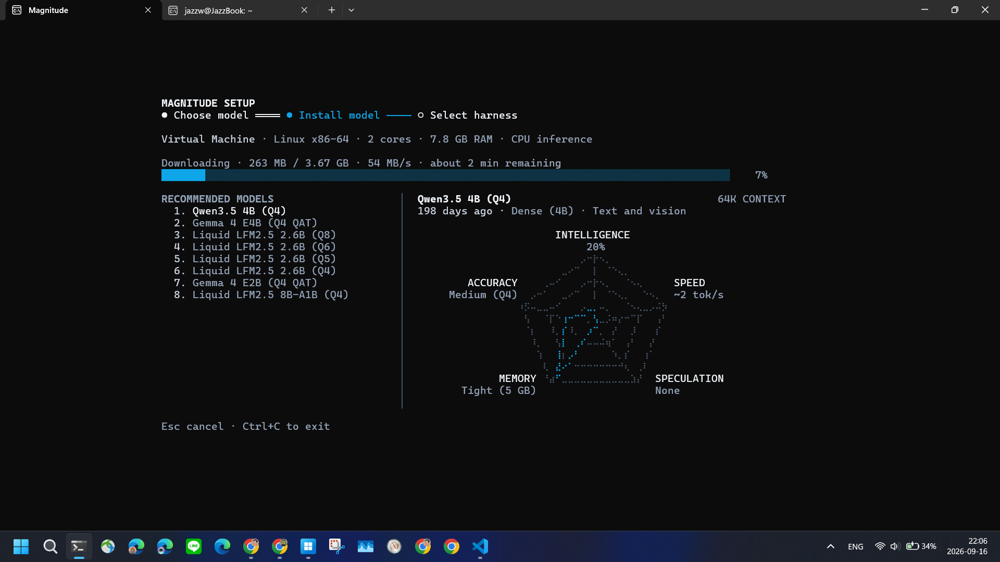
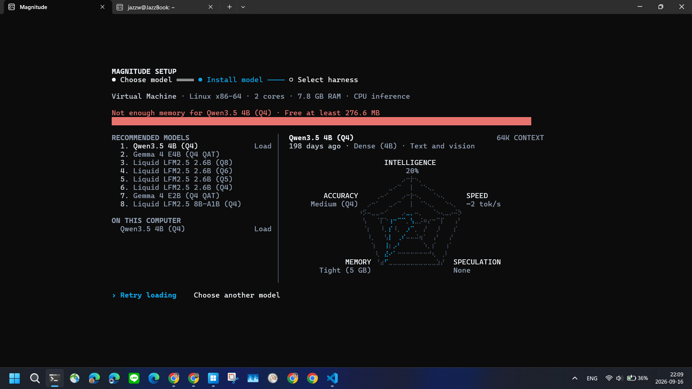

# Magnitude

- Git Repo
  - https://github.com/magnitudedev/magnitude
- Website
  - https://magnitude.dev/

> [!NOTE]
> Open source local inference engine. It runs models on the hardware you already have, whether that's a Mac, an NVIDIA or AMD GPU, or just a CPU. Plug it into Pi, OpenCode, Hermes, OpenClaw, Codex, Claude Code, Oh My Pi, and Cline.

## 2026-09-16

- 緣起：
  - 印象先前看過 LinkedIn，今天再次在 2026-09-16 的 Daily Dose of DS 電子報 **Easiest Way to Run Agent Harnesses Using Local Models** 看到 Magnitude

- Tool: Pi Agent + llama.cpp/Qwen3.5-9B.Q4_K_M

> [!QUESTION]
> 根據 https://github.com/magnitudedev/magnitude 撰寫一篇中文技術簡介，包括如何 step-by-step 測試，經 /skill:speak-human-tw 潤飾詞句後，存到 `magnitude.md`

## Magnitude 技術簡介

### 一、概述

**Magnitude** 是一個開源的本地模型推理引擎，旨在讓你能夠充分利用你現有的硬體設備，運行最佳的本地 AI 模型。無論是搭載 Apple Silicon 的 Mac、配備 NVIDIA 或 AMD GPU 的電腦，甚至是純 CPU 環境，Magnitude 都能適配。

#### 核心特性

- **硬體感知**：自動分析你的硬體規格，評估適合運行的模型
- **智能推薦**：根據速度、準確性、智能程度和記憶體使用率，為你推薦最佳模型
- **端到端優化**：內建猜測性解碼（speculative decoding）等技術，針對你的硬體進行完整優化
- **輕鬆設定**：只需一條命令即可開始使用
- **完全免費**：無需支付 token 費用、API 金鑰或受到速率限制
- **隱私保護**：模型、提示詞和文件完全保留在本地，完全離線運作
- **按需加載**：模型按需加載，閒置或記憶體不足時自動卸載
- **開源免費**：遵循 Apache 2.0 授權，可自由修改

#### 支援的代理工具

Magnitude 可與以下 AI 開發工具整合：
- ==**Pi** / **OpenCode**==
- **Hermes** / **OpenClaw**
- **Codex** / **Claude Code**
- ==**Oh My Pi**== / **Cline**

### 二、系統要求

#### 作業系統支援

| 平台 | 狀態 |
|------|------|
| macOS | ✅ 完全支援 |
| Linux | ✅ 完全支援 |
| Windows (WSL) | ✅ 透過 WSL 支援 |

#### 硬體支援

| 硬體類型 | 狀態 |
|----------|------|
| Apple Silicon | ✅ 完全優化 |
| NVIDIA GPU | ✅ 完全支援 |
| AMD GPU | ✅ 完全支援 |
| CPU (純 CPU) | ✅ 完全支援 |

> **注意**：沒有固定的最低硬體要求。Magnitude 會自動分析你的硬體並推薦適合運行的模型。更大的記憶體容量允許運行更大規模的模型。

### 三、安裝步驟

#### 方法一：手動安裝

```bash
## 1. 安裝 CLI 工具
npm i -g @magnitudedev/cli

## 2. 執行設定指令
magnitude setup
```

#### 方法二：自動安裝（推薦）

將以下指令發送給你的 AI 代理工具：

```text
Set up local models for me with the Magnitude CLI. Install it with `npm i -g @magnitudedev/cli` (or my package manager), then run `magnitude docs onboarding` and follow the instructions.
```

你的 AI 代理將自動完成以下操作：
1. 分析你的硬體規格
2. 介紹最適合的本地模型
3. 下載你選擇的模型
4. 自動切換到本地模型運行

### 四、Step-by-Step 測試指南

#### 步驟 1：驗證安裝

```bash
## 確認 CLI 已正確安裝
magnitude --version

## 預期輸出類似：
## magnitude-cli/1.0.0 linux-x64 node-v20.18.0
```

#### 步驟 2：硬體分析

```bash
## 執行硬體分析
magnitude setup

## 此指令會：
## - 分析你的 CPU、GPU 和記憶體
## - 評估頻寬
## - 計算每個模型預估的 tokens/秒 (tok/s)
## - 根據速度、準確性、智能程度和記憶體使用率進行排名
```

#### 步驟 3：選擇並下載模型

```bash
## 列出所有可用的模型
magnitude models list

## 選擇一個模型進行下載（例如：Llama 3.1 8B）
magnitude models download "meta-llama/Llama-3.1-8B"

## 或使用自動推薦
magnitude models recommend
```

#### 步驟 4：驗證模型運行

```bash
## 測試模型是否可正常運行
magnitude models test "meta-llama/Llama-3.1-8B"

## 或直接運行模型
magnitude run "meta-llama/Llama-3.1-8B"

## 輸入測試提示詞，例如：
## "請用中文介紹什麼是氣候變化。"
```

#### 步驟 5：連接 AI 代理

```bash
## 連接 Pi 或其他支援的代理
magnitude connect --harness pi

## 或查看可用的整合選項
magnitude connect --help
```

#### 步驟 6：測試完整工作流

```bash
## 執行完整的測試工作流
magnitude test workflow

## 此測試會驗證：
## - 模型載入和卸載
## - 推理速度
## - 記憶體使用
## - API 連線
```

#### 步驟 7：監控效能

```bash
## 查看當前運行的模型和資源使用
magnitude status

## 監控效能指標
magnitude monitor

## 輸出範例：
## ├── 模型：meta-llama/Llama-3.1-8B
## ├── 狀態：運行中
## ├── 速度：~45 tokens/秒
## ├── 記憶體使用：6.2 GB / 16 GB
## └── GPU 使用率：23%
```

#### 步驟 8：測試離線功能

```bash
## 斷開網路後測試模型（模型已下載後無需網路）
## 1. 停止網路連線
## 2. 執行：magnitude run "meta-llama/Llama-3.1-8B"
## 3. 確認模型仍能正常運行

## 這驗證了：
## - 模型已完整下載
## - 無需持續網路連線
## - 完全離線運作能力
```

### 五、常見問題解答

#### Q1: Magnitude 是什麼？
**A**: Magnitude 是一個開源的推理服務器，針對你現有的硬體設計。它會分析你的硬體、推薦適合的模型，然後下載、優化並運行這些模型。你可以將其連接到任何 AI 代理工具。

#### Q2: Magnitude 如何知道我的硬體能運行什麼模型？
**A**: Magnitude 會分析你的晶片、記憶體和頻寬，然後為目錄中的每個模型估算適配程度和 tokens/秒數。接著根據速度、準確性、智能程度和記憶體使用率進行排名，讓你自行選擇。

#### Q3: 需要多少硬體資源？
**A**: 沒有固定的最低要求。Magnitude 會分析你的硬體並推薦適合運行的模型。更多的記憶體意味著可以運行更大規模的模型。

#### Q4: 設定後需要維護嗎？
**A**: 不需要。Magnitude 在背景中運行，當你的代理需要時自動加載模型，閒置或記憶體緊張時自動卸載。你的代理可以在任何時候透過 CLI 安裝或切換模型。

#### Q5: Magnitude 安全嗎？
**A**: 是的。提示詞、文件和模型都保留在你的本地機器上。模型下載完成後，無需網路連線即可運行，確保了完全隱私和安全。

### 六、資源與支援

- 📖 **官方文件**：https://docs.magnitude.dev
- 🔧 **CLI 參考**：https://docs.magnitude.dev/reference
- 💬 **Discord 社群**：https://discord.gg/EHt48pPWdC
- 🐛 **問題回報**：https://github.com/magnitudedev/magnitude/issues

### 七、授權

Magnitude 遵循 [Apache License 2.0](https://github.com/magnitudedev/magnitude/blob/main/LICENSE) 授權條款。

### 快速開始命令總結

```bash
## 快速開始（3 個命令）
npm i -g @magnitudedev/cli
magnitude setup
magnitude models recommend

## 測試模型
magnitude run "meta-llama/Llama-3.1-8B"

## 連接代理（以 Pi 為例）
magnitude connect --harness pi
```

現在，Magnitude 已準備好為你的硬體提供最佳的本地 AI 體驗！

-----

## 實測

- 使用 Github Codespace 2 core, 8 GB RAM, 32 GB storage 做純 CPU 的評測
```bash
~$ blank init
  ✓ Codespaces usage for this repository is paid for by jazzwang
? Choose Machine Type: 2 cores, 8 GB RAM, 32 GB storage
friendly-space-invention-976p7xpqr29454

~$ blank ssh
Welcome to Ubuntu 24.04.4 LTS (GNU/Linux 6.8.0-1064-azure x86_64)

 * Documentation:  https://help.ubuntu.com
 * Management:     https://landscape.canonical.com
 * Support:        https://ubuntu.com/pro

The programs included with the Ubuntu system are free software;
the exact distribution terms for each program are described in the
individual files in /usr/share/doc/*/copyright.

Ubuntu comes with ABSOLUTELY NO WARRANTY, to the extent permitted by
applicable law.

@jazzwang ➜ /tmp $ df -h .
Filesystem      Size  Used Avail Use% Mounted on
/dev/sdb1        44G  2.8G   39G   7% /tmp
```
- 安裝並做評測
```
@jazzwang ➜ /tmp $ npm i -g @magnitudedev/cli
@jazzwang ➜ /tmp $ magnitude setup
```

- 失敗：記憶體不夠，看樣子要改開 4 core, 16 GB RAM 的才跑得動 Qwen3.5 4B (Q4) 但是評測的結果每秒只能 2 token 應該會蠻慢的。
```
Not enough memory for Qwen3.5 4B (Q4) · Free at least 276.6 MB
```

