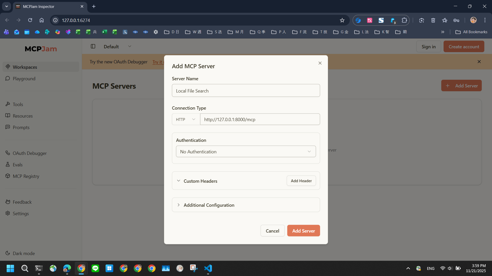
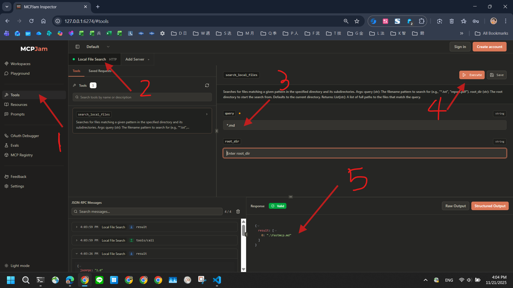
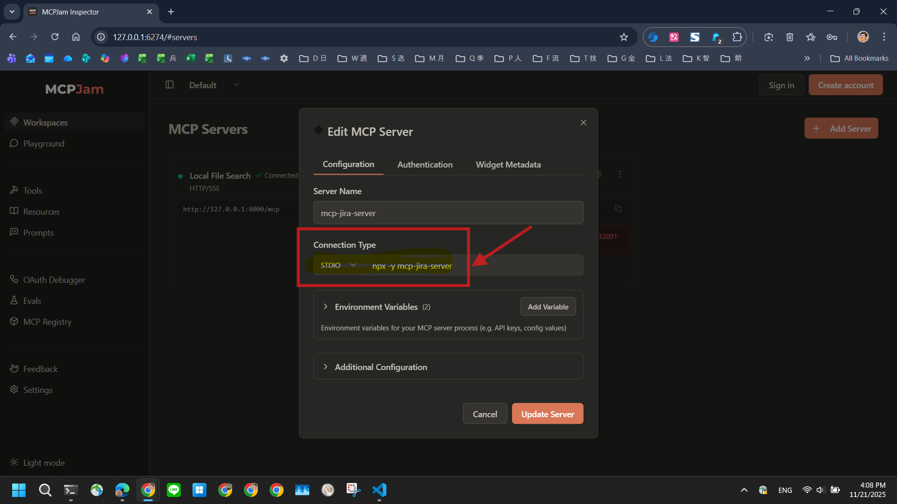
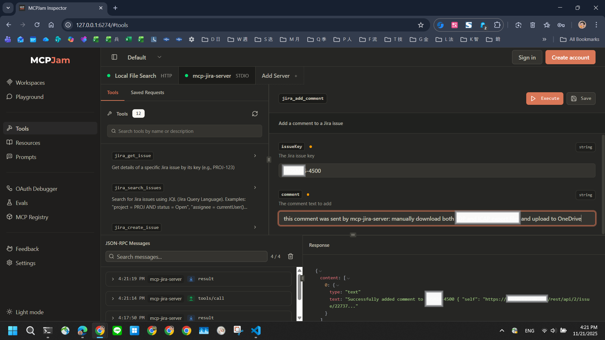

# MCP Inspector

- Git Repo
  - https://github.com/MCPJam/inspector
- Website
  - https://www.mcpjam.com/

## 2025-10-15

- 緣起：
  - learn from https://github.com/microsoft/markitdown/tree/main/packages/markitdown-mcp#debugging
- 文件：
  - https://modelcontextprotocol.io/docs/tools/inspector
- 實作：
  - https://www.npmjs.com/package/@modelcontextprotocol/inspector
- 相關工具 - `MCPJam inspector`
  - https://github.com/MCPJam/inspector
    > MCPJam inspector is an open source testing platform for MCP servers. It’s a great place to start evaluating an MCP server by inspecting the protocol handshake and getting a deterministic list of tools, resources, prompts from the server.
    - 微軟贊助的
    - https://www.mcpjam.com/
    > MCP Testing Platform - Playground to test and debug MCP servers
    - 支援 OpenAI Apps SDK
    > 🎉 Open AI Apps SDK support now in beta!
    > Start up the MCPJam inspector in beta:
    > ```
    > npx @mcpjam/inspector@beta
    > ```
    > [](https://github.com/MCPJam/inspector/blob/main/client/public/apps_sdk_pizza.png)

## 2025-11-21

- 實測：
```bash
~/git/snippet/js/mcpjam$ npx @mcpjam/inspector@beta
Need to install the following packages:
@mcpjam/inspector@1.1.9
Ok to proceed? (y)

███╗   ███╗ ██████╗██████╗     ██╗ █████╗ ███╗   ███╗
████╗ ████║██╔════╝██╔══██╗    ██║██╔══██╗████╗ ████║
██╔████╔██║██║     ██████╔╝    ██║███████║██╔████╔██║
██║╚██╔╝██║██║     ██╔═══╝██   ██║██╔══██║██║╚██╔╝██║
██║ ╚═╝ ██║╚██████╗██║    ╚█████╔╝██║  ██║██║ ╚═╝ ██║
╚═╝     ╚═╝ ╚═════╝╚═╝     ╚════╝ ╚═╝  ╚═╝╚═╝     ╚═╝

────────────────────────────────────────────────────────────────────────────────
ℹ️  No specific port requested, using fixed default port 6274
✅ Default port 6274 is available
✅ 🌐 Browser opened at http://127.0.0.1:6274
serveStatic: root path './public' is not found, are you sure it's correct?
serveStatic: root path './public' is not found, are you sure it's correct?
serveStatic: root path './public' is not found, are you sure it's correct?
serveStatic: root path './public' is not found, are you sure it's correct?
serveStatic: root path './public' is not found, are you sure it's correct?
┌─────────────────────────┐
│ 🚀 Inspector Launched   │
├─────────────────────────┤
│ http://127.0.0.1:6274   │
└─────────────────────────┘
<-- GET /
--> GET / 200 10ms
<-- GET /assets/index-CcuLcnHr.js
--> GET /assets/index-CcuLcnHr.js 200 2ms
<-- GET /assets/index-CkVlXlr4.css
--> GET /assets/index-CkVlXlr4.css 200 2ms
<-- GET /api/mcp/registry/servers?limit=100
<-- GET /api/mcp-cli-config
--> GET /api/mcp-cli-config 200 2ms
<-- GET /api/mcp/servers
--> GET /api/mcp/servers 200 1ms
```
- 實驗一：連線 Local 的 `fastmcp` MCP Server
  - 新增採用 HTTP 協定 fastmcp 寫的 MCP Server
  - 
  - 選 `Tool` 會看到該 MCP Server 支援哪些 Tool，並且可以測試不同參數的結果
  - 
- 實驗二：
  - 從 MCP Registry 新增 `mcp-jira-server`
    - 
  - 因為是 Local MCP Server，所以照指示在本機上跑 `npx -y mcp-jira-server`
    ```
    ~$ npx -y mcp-jira-server
    Jira MCP Server running on stdio (not configured - JIRA_BASE_URL and JIRA_PAT required)
    ```
  - 在界面上設定好 `JIRA_BASE_URL` 跟 `JIRA_PAT`，就可以使用 MCPJam 查詢 Jira Issue, 下 JQL 或者留 comment 到特定 ticket
  - 實測可以透過 MCPJam 界面直接留 comment 到指定的 Jira Ticket
    - 
- 關閉 MCPJam
  ```bash
  <-- POST /api/mcp/tools/execute
  --> POST /api/mcp/tools/execute 200 5s

  🛑 Shutting down gracefully...
  ────────────────────────────────────────────────────────────────────────────────
  ⚠️  Shutdown signal received...
  ⏳ Stopping MCP Inspector server
  ℹ️  Cleaning up resources...
  ✅ Server stopped gracefully
  ────────────────────────────────────────────────────────────────────────────────

  ~/git/snippet/js/mcpjam$
  ```