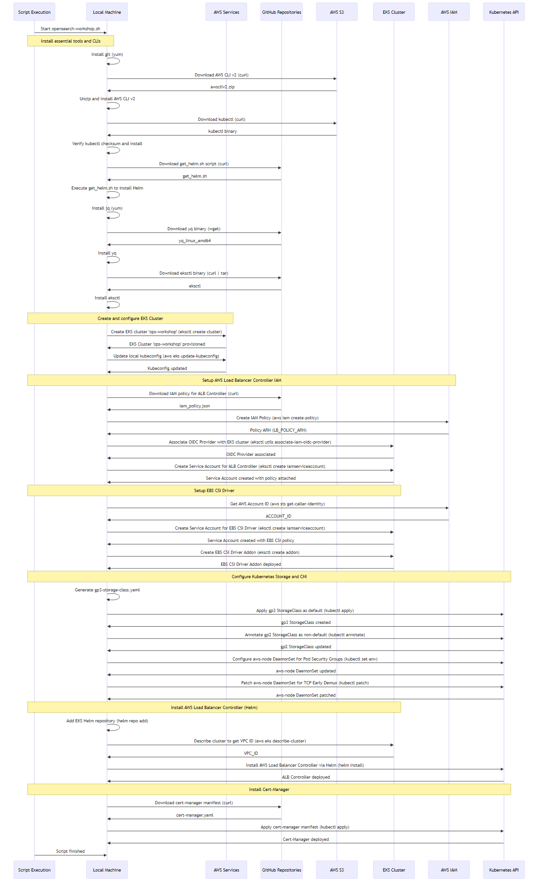

# mermaid-cli

- Git Repo
  - 

## 安裝 Install

- 在 Windows 11 上測試，已使用 `scoop install nvm` 安裝 `nvm`
```bash
~/git/snippet/js/mermaid-cli$ nvm list

  * 22.17.0 (Currently using 64-bit executable)
```
- 使用 `npm` 安裝 `mermaid-cli`
```
~$ npm install -g @mermaid-js/mermaid-cli
npm warn deprecated puppeteer@23.11.1: < 24.9.0 is no longer supported

added 409 packages in 4m
npm notice
npm notice New major version of npm available! 10.9.2 -> 11.5.2
npm notice Changelog: https://github.com/npm/cli/releases/tag/v11.5.2
npm notice To update run: npm install -g npm@11.5.2
npm notice
~$ 
```
- 驗證：
```bash
~/git/snippet/js/mermaid-cli$ which mmdc
/c/Users/jazzw/scoop/apps/nvm/current/nodejs/nodejs/mmdc
```
- Create A PNG With A Dark Theme And Transparent Background
```
~$  mmdc -i input.mmd -o output.png -t dark -b transparent
```
```bash
~/git/snippet/js/mermaid-cli$ mmdc -i opensearch-workshop.mmd -o opensearch-workshop.png -t dark -b transparent
Generating single mermaid chart
```
- 由於預設的解析度是 `800 x 600` 對於一些比較長的 mermaid diagram 產出的 `png`顯示的字型可能會模糊掉。目前沒有找到自動判斷長寬比例的作法。
```bash
~/git/snippet/js/mermaid-cli$ mmdc -h
Usage: cli [options]

Options:
  -V, --version                                   output the version number
  -t, --theme [theme]                             Theme of the chart (choices: "default", "forest", "dark", "neutral", default: "default")
  -w, --width [width]                             Width of the page (default: 800)
  -H, --height [height]                           Height of the page (default: 600)
  -i, --input <input>                             Input mermaid file. Files ending in .md will be treated as Markdown and all charts (e.g. ```mermaid
                                                  (...)``` or :::mermaid (...):::) will be extracted and generated. Use `-` to read from stdin.
  -o, --output [output]                           Output file. It should be either md, svg, png, pdf or use `-` to output to stdout. Optional. Default:
                                                  input + ".svg"
  -a, --artefacts [artefacts]                     Output artefacts path. Only used with Markdown input file. Optional. Default: output directory
  -e, --outputFormat [format]                     Output format for the generated image. (choices: "svg", "png", "pdf", default: Loaded from the output file
                                                  extension)
  -b, --backgroundColor [backgroundColor]         Background color for pngs/svgs (not pdfs). Example: transparent, red, '#F0F0F0'. (default: "white")
  -c, --configFile [configFile]                   JSON configuration file for mermaid.
  -C, --cssFile [cssFile]                         CSS file for the page.
  -I, --svgId [svgId]                             The id attribute for the SVG element to be rendered.
  -s, --scale [scale]                             Puppeteer scale factor (default: 1)
  -f, --pdfFit                                    Scale PDF to fit chart
  -q, --quiet                                     Suppress log output
  -p --puppeteerConfigFile [puppeteerConfigFile]  JSON configuration file for puppeteer.
  --iconPacks <icons...>                          Icon packs to use, e.g. @iconify-json/logos. These should be Iconify NPM packages that expose a icons.json
                                                  file, see https://iconify.design/docs/icons/json.html. These will be downloaded from https://unkpg.com
                                                  when needed. (default: [])
  -h, --help                                      display help for command
```
- 但初步發現 width (`-w`) 對字型的影響比較大。而且實際上生成的 `png` 可能還有 margin 邊界留白，所以不會完全遵守指定的寬跟高。
  - 如果希望 `png` 字體夠大，可以設定 `1024` 像素以上當寬 `width`，然後先指定兩倍當高 `height`，再觀察生成的 `png` 圖檔寬跟高的比例來調整。
- 實驗結果：
```bash
~/git/snippet/js/mermaid-cli$ mmdc -w 1200 -H 2000 -i opensearch-workshop.mmd -o opensearch-workshop.png
Generating single mermaid chart
```
