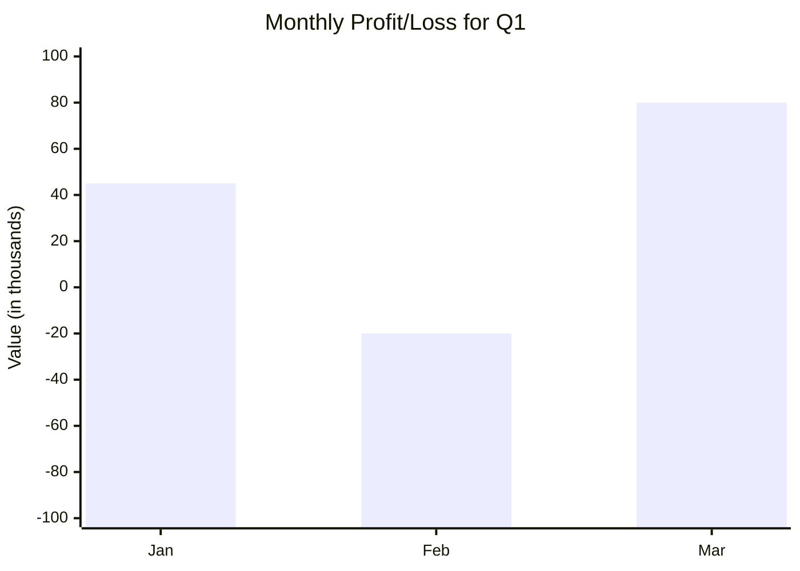

- 實驗 mermaid.js 能否顯示負數，不過這種顯示方式有點不直覺 :(
  - x 軸應該是畫在 0
<table><tr><td>Q:</td><td>
<!-- add your Prompt bellow-->
is it possible to show both positive and negative value using mermaid.js bar chart syntax? if yes, could you give me an example?
</td></tr><tr><td>A:</td><td>
<!-- add Chatbot Response bellow-->
Yes, it is **possible** to show both positive and negative values using the new **Mermaid.js XY Chart** syntax for a bar chart.

The axis will automatically adjust to display the zero line, with positive bars extending in one direction (e.g., up for a vertical chart) and negative bars extending in the opposite direction (e.g., down).

Here is an example of the Mermaid.js syntax for a bar chart with both positive and negative values:

-----

### Example Explanation

| Line of Code | Description |
| :--- | :--- |
| `xychart` | Declares the start of an XY chart (which includes bar charts). |
| `title "..."` | Sets the title of the chart. |
| `x-axis [...]` | Defines the labels for the categories on the **x-axis**. |
| `y-axis "..." -100 --> 100` | Defines the title and the explicit **range** for the **y-axis**, which must include the min and max of your data. |
| `bar [45, -20, 80]` | The data series for the bar chart. |
| **45** (Jan) | A **positive** value, which will be above the zero line. |
| **-20** (Feb) | A **negative** value, which will be below the zero line. |
| **80** (Mar) | A **positive** value, which will be above the zero line. |
</td></tr></table>
