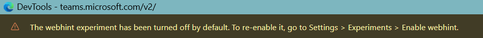

# Webhint

- Git Repo
  - https://github.com/webhintio/hint
- Website
  - https://webhint.io/

## 2026-07-07

> Use webhint to improve your website
> webhint helps you improve your site's accessibility, speed, cross-browser compatibility, and more by checking your code for best practices and common errors.

- 文件上寫 Try it
```bash
$ npx hint https://webhint.io
```
- 實測：
```bash
~/git/snippet/js/webhint$ npx hint https://webhint.io
Need to install the following packages:
hint@7.1.13
Ok to proceed? (y) 
Using the built-in configuration.
Visit https://webhint.io/docs/user-guide/ to learn how to create your own configuration.
✖ Finishing...
You can view the HTML report in "C:\Users\jazzw\git\snippet\js\webhint\hint-report\https-webhint-io.html"
compat-api/html            1 warning
ssllabs                    2 warnings
content-type               9 warnings
http-compression           4 warnings   10 hints
no-disallowed-headers      18 warnings
strict-transport-security  18 errors
x-content-type-options     18 errors
http-cache                 37 warnings  4 hints
× Found a total of 36 errors, 71 warnings, 14 hints and 0 informations
```
- 緣起：
  - 在 Edge DevTool 看到這個置頂通知
  - 

<table><tr style="background-color:lightgreen;"><td>Tool:</td><td>
Google Search - AI Mode
</td></tr><tr style="background-color:lightyellow;"><td>Q:</td><td>
what is webhint experiment shown in DevTool?
</td></tr><tr><td>A:</td><td>

The webhint experiment in browser Developer Tools (DevTools) is an integration of [webhint](https://webhint.io/), an open-source linting engine designed to help you improve your website's code quality and best practices. [1, 2, 3, 4, 5] 

When you enable this experimental feature, DevTools automatically runs background checks on the site you are viewing. It then provides real-time, actionable feedback across several critical development areas. [3, 6] 

### What webhint Scans For

* Accessibility (a11y): Finds missing ARIA labels, poor color contrast, and invalid HTML structures that break screen readers.
* Cross-Browser Compatibility: Flags modern CSS or JavaScript features that might fail to render properly on older or alternative browsers.
* Performance: Catches oversized code bundles, missing image dimensions, or unoptimized assets slowing down the page.
* Security: Highlights unsafe third-party links, missing HTTP headers, and vulnerabilities in your scripts.
* PWA Readiness: Evaluates if your site meets Progressive Web App criteria, like proper manifest files and service workers. [6, 7, 8, 9, 10] 

### How It Changes Your DevTools Interface

Once enabled, the webhint experiment changes how issues are presented in your workspace: [11] 

   1. The Issues Tab: Instead of digging through errors manually, categorized warnings and errors from webhint automatically populate your [DevTools Issues panel](https://learn.microsoft.com/en-us/microsoft-edge/devtools/whats-new/2020/06/devtools) along with documentation on how to fix them. [3, 6] 
   2. Wavy Underlines in Elements: It adds visual text editors' behavior directly into the DOM tree. Wavy underlines will appear under specific lines of code in the Elements panel to highlight broken code chunks. You can shift-click them to read the warning. [3, 11] 

### Availability

While webhint is available as an individual extension for Google Chrome and Mozilla Firefox, it is natively baked into Microsoft Edge DevTools as a core built-in experiment. [3, 8, 12] 

If you are trying to clean up your workspace or run a custom scan, let me know:

* Which browser (Edge or Chrome) you are working in?
* Whether you want instructions to turn this experiment off or configure a custom scan?

[1] https://webhint.io
[2] [https://webhint.io](https://webhint.io/docs/user-guide/extensions/extension-browser/)
[3] [https://webhint.io](https://webhint.io/docs/user-guide/extensions/extension-browser/)
[4] [https://webhint.io](https://webhint.io/docs/user-guide/)
[5] [https://learn.microsoft.com](https://learn.microsoft.com/en-us/microsoft-edge/test-and-automation/webhint)
[6] [https://learn.microsoft.com](https://learn.microsoft.com/en-us/microsoft-edge/devtools/whats-new/2020/06/devtools)
[7] [https://www.youtube.com](https://www.youtube.com/watch?v=5qNxiBrOk1U&t=203)
[8] [https://hacks.mozilla.org](https://hacks.mozilla.org/2019/09/webhint-in-firefox-devtools-improve-compatibility-accessibility-and-more/)
[9] [https://codoid.com](https://codoid.com/ai-testing/ai-assistant-in-chrome-devtools-guide-for-testers/)
[10] [https://learn.microsoft.com](https://learn.microsoft.com/zh-tw/microsoft-edge/test-and-automation/test-and-automation)
[11] [https://github.com](https://github.com/MicrosoftEdge/MSEdgeExplainers/blob/main/DevTools/webhint/explainer.md)
[12] [https://webhint.io](https://webhint.io/docs/user-guide/extensions/extension-browser/)

</td></tr>
</table>

- Webhint for Browser
  - Edge - 內建
  - Chrome or Firefox - 靠 Extension 來安裝
  - https://webhint.io/docs/user-guide/extensions/extension-browser/
- Webhint for VS Code
  - Webhint Visual Studio Code extension
  - https://webhint.io/docs/user-guide/extensions/vscode-webhint/
- 題外話:
  - 在文件上看到這是一個 OpenJS Foundation project
  - https://openjsf.org/

> [!hint]
> If you want more control over what gets activated, create a local `.hintrc` file to configure `webhint`.