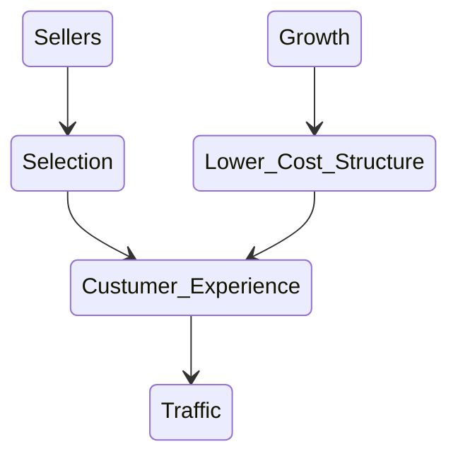

- https://explore.skillbuilder.aws/learn/course/1099/aws-partner-cloud-economics-accreditation

-----

[TOC]

-----

## Course Outline
### Module 0: Course Introduction

- Business value
  - Introduction to business value
  - Cost savings
  - Staff productivity
  - Operational resilience
  - Business agility
- Cloud Financial Management
- Migration Portfolio Assessment (MPA) tool
  - Introduction to MPA tool
  - Conducting a Cost Savings analysis with MPA

### Module 1: Introduction to Business Value

- Cloud Economics
  - Business value (TCO)
  - Cloud Financial Management
- Why cloud economics
  - 2x win rate
  - 5x revenue growth
  - 20-days faster sales cycle
- Cloud Value framework
  - Cost saving (TCO) -- typical focus
    - The financial benefits of moving to the cloud
    - expect 51% lower cost
    - example: Samsung
  - Staff productivity
    - The efficiency gained from reducing or eliminating tasks no longer needed with the cloud
    - grater 62% productivity
    - example: AdRoll
      - $3M in staffing costs
  - Operational resilience
    - The benefit from improved availability and security
    - more uptime, less downtime
    - example: MedStar Health
      - from 2 hour to less than 5 minutes per month
  - Business agility
    - Being able to respond faster and experiment more
    - response faster
    - example: Aon
      - compute the risk from 10 hours to 10 minutes

### Module 2: Cost Savings

- Cost saving analysis
  - compare on-premises and cloud
  - make it clear about the scope of cost
    - performance
  - 20~40% lower cores on AWS
- Consumption-based Model
  - Floor space
  - Power and Cooling
  - Back end infrastructure
- AWS Pricing Model
- AWS Flywheel

[](https://mermaid.live/edit#eyJjb2RlIjoic3RhdGVEaWFncmFtLXYyXG4gICAgU2VsbGVycyAtLT4gU2VsZWN0aW9uXG4gICAgU2VsZWN0aW9uIC0tPiBDdXN0dW1lcl9FeHBlcmllbmNlXG4gICAgQ3VzdHVtZXJfRXhwZXJpZW5jZSAtLT4gVHJhZmZpY1xuXG4gICAgR3Jvd3RoIC0tPiBMb3dlcl9Db3N0X1N0cnVjdHVyZVxuICAgIExvd2VyX0Nvc3RfU3RydWN0dXJlIC0tPiBDdXN0dW1lcl9FeHBlcmllbmNlIiwibWVybWFpZCI6IntcbiAgXCJ0aGVtZVwiOiBcImRlZmF1bHRcIlxufSIsInVwZGF0ZUVkaXRvciI6ZmFsc2UsImF1dG9TeW5jIjp0cnVlLCJ1cGRhdGVEaWFncmFtIjpmYWxzZX0)

- migration challenges for Customers
  - Migration-related cost
    - Sunk Cost
      - depreciation 折舊
        - 資料中心四年前建的，預計 20 年折舊
        - sunk cost = 40M
        - 1 年
      - recovery value - 賣掉資產可以變現多少
    - cost of migration and decommissioning
      - MPA Tool
```
         Cost saving
----------------------------- = ROI (Return on investment)
 Sunk cost + Migration Costs
```
  - shifting to OPEX models
  - Lack of cloud readiness
    - Huaman Factor
    - Application
      - application dependencies
      - what application can be translate easily?
  - Entrenched IT organization
    - job security of IT
- Stakeholders
  - DevOps - Application developers
  - IT support team
  - Procurement team
  - CFO/CIO/Investors
- Traditional IT
  - Buy
  - Build
  - Manage
  - Refresh

- Perceived IT costs
  - Server Costs = Hardware + Software
  - Storage Costs
  - Network costs
  - IT Labor costs
- Actual IT cost
  - Server Costs = Hardware + Software + Facilities cost (Space/Power/Cooling)
  - Storage Costs = Hardware + Software (backup) + Facilities cost
  - Network costs = Hardware + Software + Facilities cost
  - IT Labor costs
  - Extra = Project planning, legal, contractors, managed services, training, cost of capital
  - Operational resilience and business agility
    - cost of delays
    - risk premium
    - competitive abilities
    - governance
- What works
  - include all stakeholders for cost analysis
  - get support from leadership
  - use realistic usage percentages (%)
  - add cost/value to business-value, e.g. agility and risk
- What to avoid
  - focus on pricing and discounts
  - apples-to-apples comparisons of machines
  - fail o capture the true costs of IT - decisions based on an unchecked cost analysis
  - cost savings discussion late in decision-making process
- Best practices
  - remember power/cooling
- Engagement process
  - Kick-off
  - Data collection (2-4 weeks)
  - Initial assessment
  - Q & A (~ 1 week)
  - Full assessment
  - Iterate and finalize ( ~ 1 week)
  - Customer report out
- **TSO Logic** -- available for certified partner
- **Migration Portfolio Assessment (MPA)** Tool

### Module 3: Staff Productivity

- ( 2021-11-29 16:16:38 )
- Tactical (戰術的, undifferentiated) vs Strategic (differentiated)
- Benchmark: Staff Productivity
  - 2x VM managed by per administrator
  - 1.8x TBs managed by per administrator
  - 43.4% reduction in total incidents
- ( 2021-11-29 16:22:30 )
- Typical functions:
  - Server / Network / Storage
    - involves managing hardware infrastructure
    - Server: Time spent installing, upgrading, and removing hardware is reduced by up to half
    - Network: Time spent on network planning and forecasting to provision hardware is greatly reduced
    - Storage: Time spent on supporting physical arrays is eliminated
  - Application
    - roles such as data base administrators, AppDev, QA, and support functions
    - Time spent coding, testing, and supporting business apps is greatly reduced
  - Facilities
    - facilities management for customers who have an on-premises data center
    - Time spent managing power and cooling systems are eliminated
  - Security
    - ensures infrastructure meets compliance, regulatory, and corporate standards
    - Penetration testing, vulnerability scanning, and security audits are greatly improved

### Module 4: Operational Resilience

- ( 2021-11-29 16:31:36 )
- Operational Resilience = uptime and Security
  - 1.25B to 2.5B downtime cost (Fortune 100)
- These downtime costs include:
  - Third-party fees
  - Equipment replacement
  - After-the-fact incidental costs
  - Recovery activities and costs
  - Detection costs associated with initial discovery and subsequent investigation
  - Unproductive IT staff and end-user costs
  - Lost revenue -28.2%
  - Business disruption costs - 34.6%
- ( 2021-11-29 16:40:19 )
- 4 Keystones
  - Operations
    - Human errors, configuration errors, procedural errors, and common place accidents
    - Leverages automation, manages services end to end, monitors API access
  - Security
    - Malware, network attacks, unpatched applications, poor or limited authentication
    - shared responsibility of Customer and AWS
    - Uses AWS automation and tools, and provides AWS Identity and Access Management (IAM)
  - Software
    - Resource exhaustion, computational errors, inadequate monitoring, or failed upgrades
      - resource exhaustion
      - computational or logic errors -- blue/green deployment
      - inadequate monitoring
      - failed upgrades
    - automates continuous integration and delivery workflow, runs smaller code deployments
  - Infrastructure
    - Hardware failures, natural disasters, power outages, volumetric attacks
      - hardware failure of servers
      - natural disaster
      - power outage
      - Volumetric attack (DDoS)
    - Enables customers to run applications and failovers across multiple AZs and Regions

### Module 5: Business Agility
### Module 6: Cloud Financial Management
### Module 7: Introduction to Migration Portfolio Assessment (MPA)
### Module 8: Cost savings with MPA
### AWS Cloud Economics: End of Course Assessment
