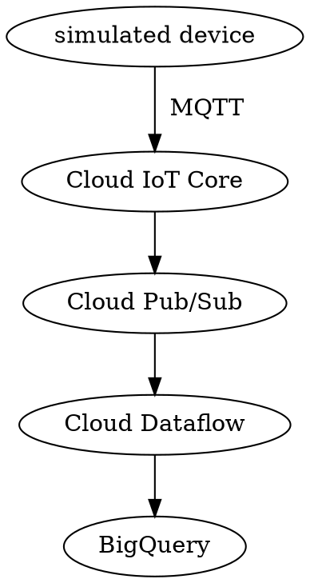

# Building an IoT Analytics Pipeline on Google Cloud

## 2020-10-10

### Overview

- https://google.qwiklabs.com/focuses/605?parent=catalog
- Building an IoT Analytics Pipeline on Google Cloud

- Cloud IoT Core
    - https://cloud.google.com/iot-core
    - Message Queue Telemetry Transport (MQTT)
    - two major components:
        - **device manager**
        - **protocol bridge**

### What You'll Learn

- In this lab
    - Connect and manage MQTT-based devices using Cloud IoT Core (using **simulated devices**)
    - Ingest a stream of information from **Cloud IoT** Core using **Cloud Pub/Sub**.
    - Process the IoT data using **Cloud Dataflow**.
    - Analyze the IoT data using **BigQuery**.



### Prerequisites

- https://console.cloud.google.com/apis/library
- enabled APIs
    - Cloud IoT API
        - https://console.cloud.google.com/apis/library/cloudiot.googleapis.com
    - Cloud Pub/Sub API
        - https://console.cloud.google.com/apis/library/pubsub.googleapis.com
    - Dataflow API
        - https://console.cloud.google.com/apis/library/dataflow.googleapis.com

- ( 2020-10-11 12:06:17 )
    - https://stackoverflow.com/questions/43101353/how-can-one-use-gcloud-to-enable-apis
    - https://cloud.google.com/endpoints/docs/openapi/enable-api#gcloud

```
$ gcloud services list --available      # 查看目前可用的 API 服務
$ gcloud services list --enabled        # 查看目前已經啟用的 API 服務
$ gcloud services enable SERVICE_NAME   # 啟用指定的 API 服務
$ gcloud services enable SERVICE_NAME   # 啟用指定的 API 服務
```

- ( 2020-10-11 12:14:00 )
```
gcloud services enable cloudiot.googleapis.com
gcloud services enable pubsub.googleapis.com
gcloud services enable dataflow.googleapis.com
```

### Related Qwiklabs

- [ ] [BigQuery: Qwik Start - Console](https://www.qwiklabs.com/focuses/1145?parent=catalog)
- [ ] [Weather Data in BigQuery](https://www.qwiklabs.com/focuses/609?parent=catalog)
- [ ] [Dataflow: Qwik Start - Templates](https://www.qwiklabs.com/focuses/1101?parent=catalog)
- [ ] [Internet of Things: Qwik Start](https://www.qwiklabs.com/focuses/1771?parent=catalog)

## 2020-10-11

### Create a Cloud Pub/Sub topic

- ( 2020-10-11 09:17:03 ) 

```shell
SYNOPSIS
    gcloud pubsub topics create TOPIC [TOPIC ...] [--labels=[KEY=VALUE,...]]
        [--message-storage-policy-allowed-regions=[REGION,...]]
        [--topic-encryption-key=TOPIC_ENCRYPTION_KEY
          : --topic-encryption-key-keyring=TOPIC_ENCRYPTION_KEY_KEYRING
          --topic-encryption-key-location=TOPIC_ENCRYPTION_KEY_LOCATION
          --topic-encryption-key-project=TOPIC_ENCRYPTION_KEY_PROJECT]
        [GCLOUD_WIDE_FLAG ...]
DESCRIPTION
    Creates one or more Cloud Pub/Sub topics.
```

- ( 2020-10-11 12:43:36 )

```shell
SYNOPSIS
    gcloud pubsub topics get-iam-policy TOPIC [--filter=EXPRESSION]
        [--limit=LIMIT] [--page-size=PAGE_SIZE] [--sort-by=[FIELD,...]]
        [GCLOUD_WIDE_FLAG ...]
DESCRIPTION
    Get the IAM policy for a Cloud Pub/Sub Topic.
```

```
SYNOPSIS
    gcloud pubsub topics set-iam-policy TOPIC POLICY_FILE
        [GCLOUD_WIDE_FLAG ...]
DESCRIPTION
    Set the IAM policy for a Cloud Pub/Sub Topic.
EXAMPLES
    The following command will read an IAM policy defined in a JSON file 'policy.json' and set it for a topic with identifier 'my-topic'
        $ gcloud pubsub topics set-iam-policy my-topic policy.json
        See https://cloud.google.com/iam/docs/managing-policies for details
        of the policy file format and contents.
```
- ( 2020-10-11 12:47:15 ) **NOTE:**
    - https://cloud.google.com/iam/docs/managing-policies 重新導向了～
    - 詳細的格式說明可以看 https://cloud.google.com/iam/docs/reference/rest/v1/Policy

- ( 2020-10-11 12:52:04 ) 手動操作後產生的 policy output

```
$ gcloud pubsub topics get-iam-policy iotlab --format json
{
  "bindings": [
    {
      "members": [
        "serviceAccount:cloud-iot@system.gserviceaccount.com"
      ],
      "role": "roles/pubsub.subscriber"
    }
  ],
  "etag": "*** (hidden) ***",
  "version": 1
}
```

### Create a BigQuery dataset

- ( 2020-10-11 13:04:16 )
- Q: 有沒有 BigQuery 的 `gcloud` 指令呢？
- A: 對應是 `bq` 指令
    - https://cloud.google.com/bigquery/docs/bq-command-line-tool
- ( 2020-10-11 13:10:32 ) 建立 Dataset 的 `bq` 指令
    - https://cloud.google.com/bigquery/docs/datasets#bq

```
bq mk new_dataset
bq mk -d --data_location=EU new_dataset
```

- ( 2020-10-11 13:12:59 ) 查詢 Dataset 的 `bq` 指令
    - https://cloud.google.com/bigquery/docs/listing-datasets#bq

```
bq mk new_dataset.new_table
bq --dataset_id=new_dataset mk table
bq mk --table mydataset.mytable qtr:STRING,sales:FLOAT,year:STRING
```

- ( 2020-10-11 13:17:02 ) 建立資料集 `iotlabdataset` 資料表 `sensordata`
- ( 2020-10-11 13:19:30 ) 設定資料表 Schema
    - timestamp, set the field's Type to TIMESTAMP.
    - device, set the field's Type to STRING.
    - temperature, set the field's Type to FLOAT.
- ( 2020-10-11 13:23:36 ) 設定資料表 Schema 的指令
    - https://cloud.google.com/bigquery/docs/schemas

```
bq mk iotlabdataset
bq mk --table iotlabdataset.sensordata timestamp:TIMESTAMP,device:STRING,temperature:FLOAT
```

### Create a cloud storage bucket

- ( 2020-10-11 13:24:52 ) 建立 cloud storage bucket 的指令
    - https://cloud.google.com/storage/docs/creating-buckets#storage-create-bucket-gsutil

```
gsutil mb gs://BUCKET_NAME
```

- ( 2020-10-11 13:26:25 ) 文件裡提到要設定 `Default storage class` 是 `Multi-regional`
    - https://cloud.google.com/storage/docs/storage-classes#available_storage_classes

```
gsutil mb gs://${PROJECT_ID}-bucket
```

### Set up a Cloud Dataflow Pipeline

- ( 2020-10-11 21:31:49 ) 照著網頁操作後，點選下方「對等指令列」的結果：
```
gcloud dataflow jobs run iotlabflow \
--gcs-location gs://dataflow-templates-us-central1/latest/PubSub_to_BigQuery \
--region us-central1 \
--max-workers 2 --worker-machine-type n1-standard-1 \
--staging-location gs://${PROJECT_ID}-bucket/tmp/ \
--parameters inputTopic=projects/${PROJECT_ID}/topics/iotlab,outputTableSpec=${PROJECT_ID}::iotlabdataset.sensordata
```

### Prepare your compute engine VM

- ( 2020-10-11 21:35:31 ) 

### Configure Cloud IoT Core

- ( 2020-10-11 21:37:32 )

```
gcloud beta iot registries create iotlab-registry \
   --project=${PROJECT_ID} \
   --region=${MY_REGION} \
   --event-notification-config=topic=projects/${PROJECT_ID}/topics/iotlab
```

### All-in-One script

- 2b3a
- c0f7
- 9532
- bb0e

```shell
# 0.1 啟用相依 API 服務
gcloud services enable cloudiot.googleapis.com
gcloud services enable pubsub.googleapis.com
gcloud services enable dataflow.googleapis.com
# 0.2 取得目前的 Project ID
PROJECT_ID=$(gcloud config get-value project)
# 1.1 建立 PubSub Topic
gcloud pubsub topics create iotlab
gcloud pubsub topics list
# 1.2 建立 PubSub IAM policy file
cat > iotlab.json << EOF
{
  "bindings": [
    {
      "members": [
        "serviceAccount:cloud-iot@system.gserviceaccount.com"
      ],
      "role": "roles/pubsub.publisher"
    }
  ],
  "version": 1
}
EOF
# 1.3 設定 PubSub IAM policy
gcloud pubsub topics set-iam-policy iotlab iotlab.json
# 1.4 驗證 PubSub IAM policy
gcloud pubsub topics get-iam-policy iotlab
# 2.1 建立 BigQuery 資料集 iotlabdataset
bq mk iotlabdataset
# 2.2 建立 BigQuery 資料表 sensordata
bq mk --table iotlabdataset.sensordata timestamp:TIMESTAMP,device:STRING,temperature:FLOAT
# 3. 建立 Cloud Storage Bucket
gsutil mb gs://${PROJECT_ID}-bucket
# 4. 建立 Dataflow Pipeline
gcloud dataflow jobs run iotlabflow \
--gcs-location gs://dataflow-templates-us-central1/latest/PubSub_to_BigQuery \
--region us-central1 \
--max-workers 2 --worker-machine-type n1-standard-1 \
--staging-location gs://${PROJECT_ID}-bucket/tmp/ \
--parameters inputTopic=projects/${PROJECT_ID}/topics/iotlab,outputTableSpec=${PROJECT_ID}::iotlabdataset.sensordata
# 5. 連線進 GCE iot-device-simulator 虛擬機器
gcloud compute ssh iot-device-simulator
```
- ( 2020-10-11 22:33:33 ) `Prepare your compute engine VM` 以後的步驟，不太能自動化。
```
PROJECT_ID=$(gcloud config get-value project)
export MY_REGION=us-central1
gcloud beta iot registries create iotlab-registry \
   --project=$PROJECT_ID \
   --region=$MY_REGION \
   --event-notification-config=topic=projects/$PROJECT_ID/topics/iotlab

cd $HOME/training-data-analyst/quests/iotlab/
openssl req -x509 -newkey rsa:2048 -keyout rsa_private.pem \
    -nodes -out rsa_cert.pem -subj "/CN=unused"

gcloud beta iot devices create temp-sensor-buenos-aires \
  --project=$PROJECT_ID \
  --region=$MY_REGION \
  --registry=iotlab-registry \
  --public-key path=rsa_cert.pem,type=rs256

gcloud beta iot devices create temp-sensor-istanbul \
  --project=$PROJECT_ID \
  --region=$MY_REGION \
  --registry=iotlab-registry \
  --public-key path=rsa_cert.pem,type=rs256

cd $HOME/training-data-analyst/quests/iotlab/
wget https://pki.google.com/roots.pem

python cloudiot_mqtt_example_json.py \
   --project_id=$PROJECT_ID \
   --cloud_region=$MY_REGION \
   --registry_id=iotlab-registry \
   --device_id=temp-sensor-buenos-aires \
   --private_key_file=rsa_private.pem \
   --message_type=event \
   --algorithm=RS256 > buenos-aires-log.txt 2>&1 &

python cloudiot_mqtt_example_json.py \
   --project_id=$PROJECT_ID \
   --cloud_region=$MY_REGION \
   --registry_id=iotlab-registry \
   --device_id=temp-sensor-istanbul \
   --private_key_file=rsa_private.pem \
   --message_type=event \
   --algorithm=RS256
```
- ( 2020-10-11 22:40:36 ) Cloud IoT Core 支援 `MQTT` 跟 `HTTP`
    - https://cloud.google.com/iot/docs/concepts/protocols?hl=zh-tw