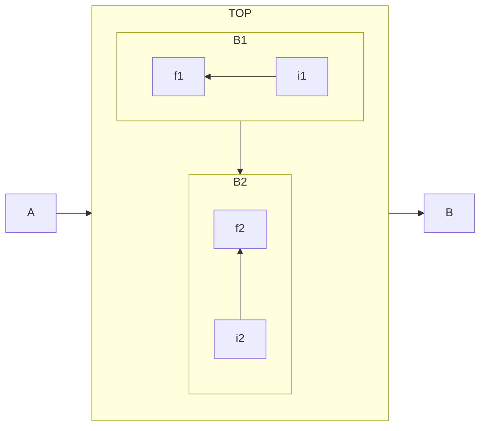
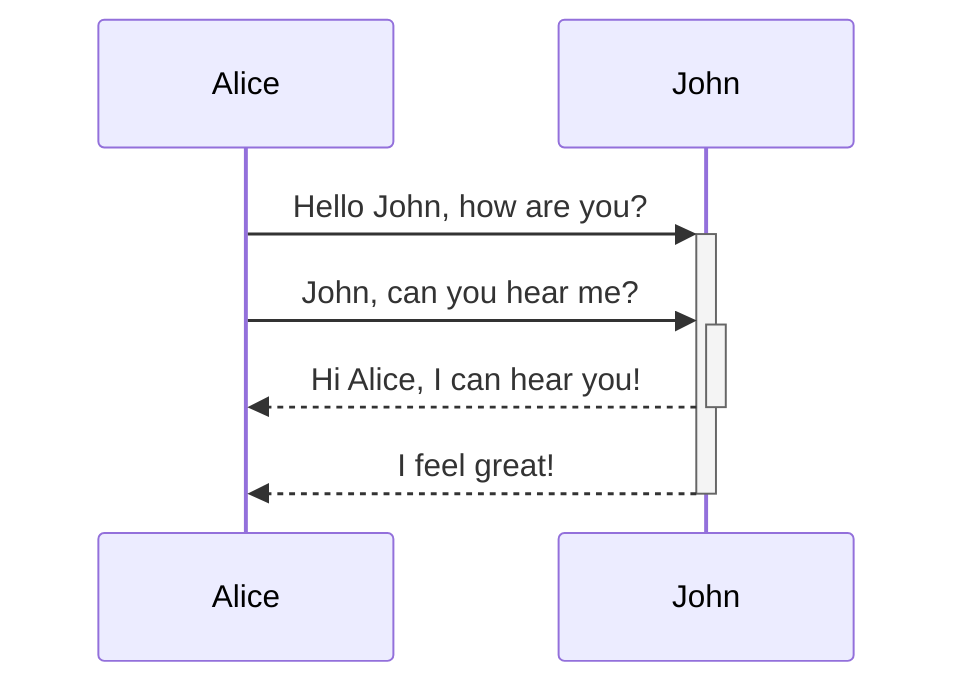
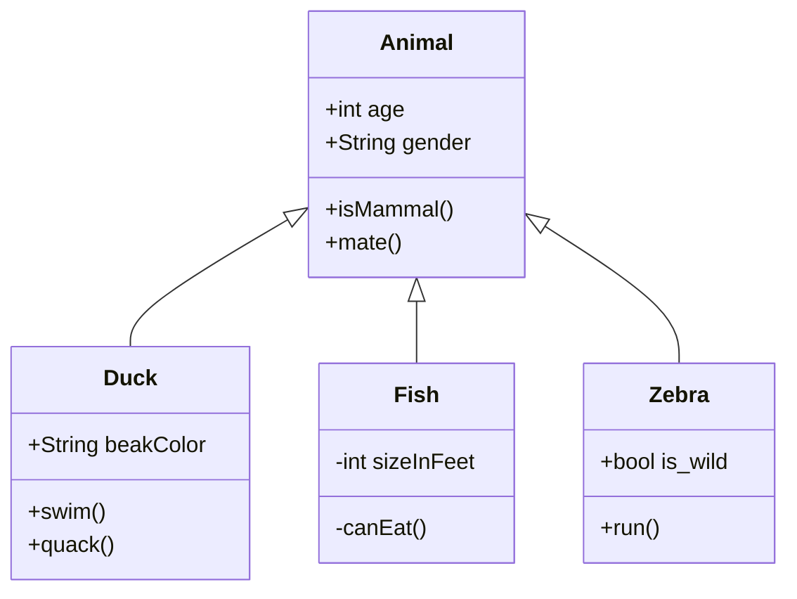
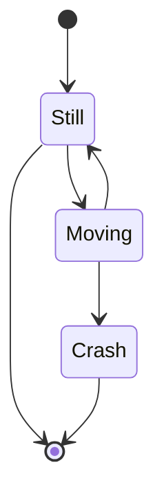
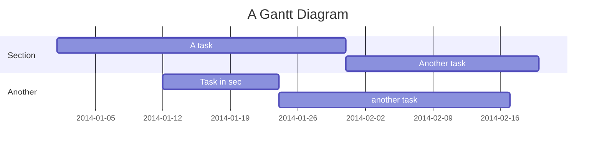
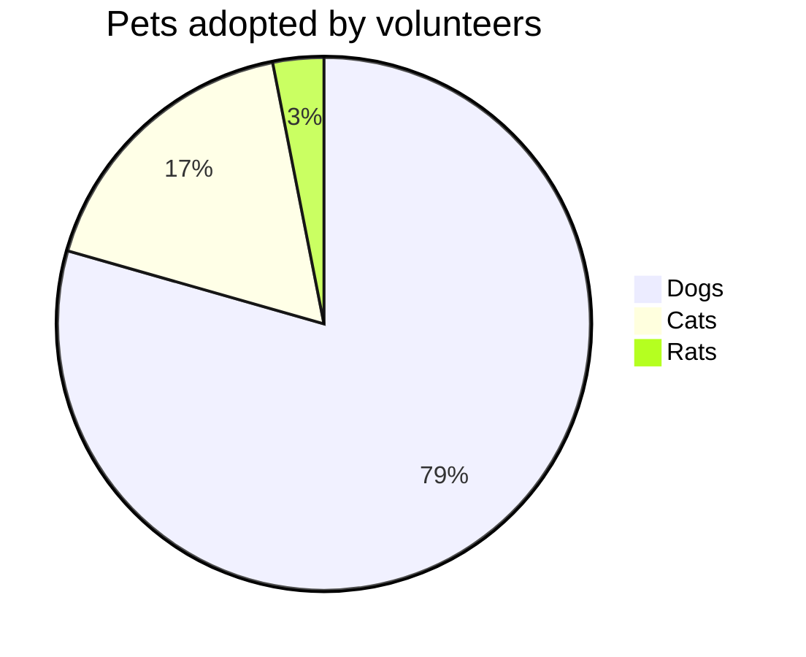
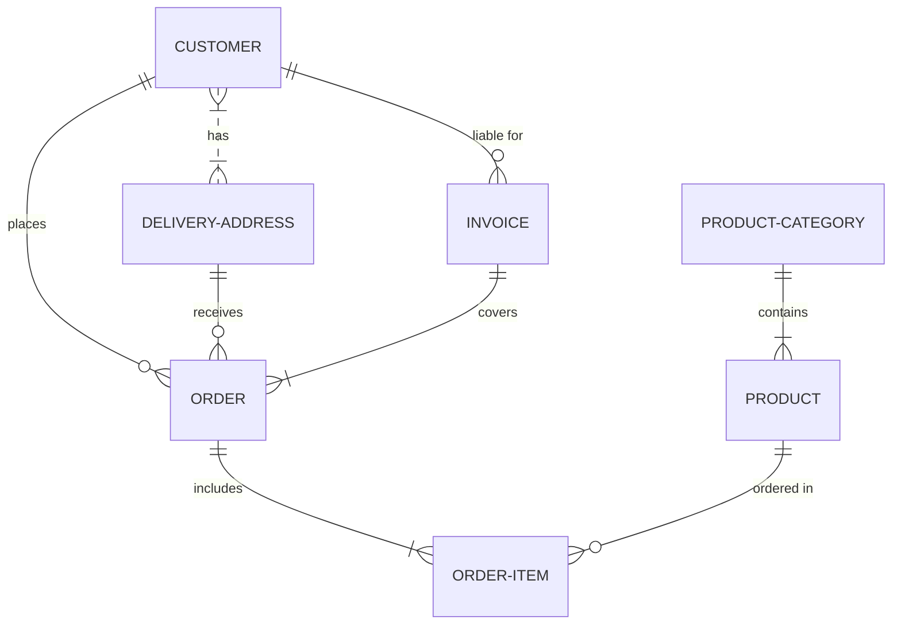
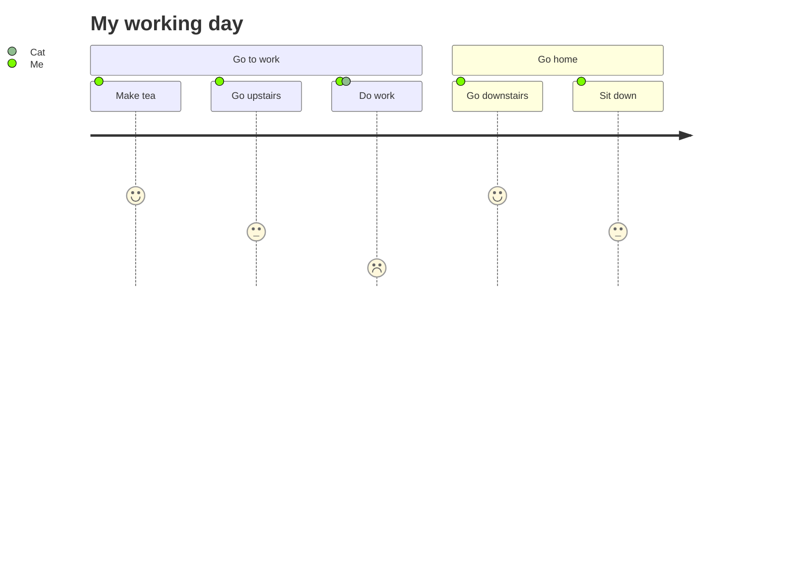

# Mermaid

[TOC]

## 緣起

以前喜歡用 [Trac](https://trac.edgewall.org/) 並且搭配它的 [Graphviz](https://graphviz.org/) 擴充元件。這樣就可以在 Wiki 裡面直接鑲嵌 [Graphviz](https://graphviz.org/) 語法，然後靠後端的指令產生對應的圖片。好處是能**版本控制**圖片的內容，其次是用語法就可以產生圖片。

隨著撰寫筆記的習慣從 Wiki 語法轉變成 Markdown 語法，漸漸地也不再需要用 VPS 自架靜態網站，Github 或 Gitlab 都已經提供很好的 Markdown 支援，不過用 Markdown 直接繪圖倒是仍有些不方便。

先前曾經試了一下 [Gravizo](http://www.gravizo.com/) 或 [PlantUML](https://plantuml.com/)，不過在使用上仍舊還需要習慣一下。

- ( 2021-11-21 11:50:24 ) 原本想找看看有沒有比較簡單的方法可以在 Markdown 裡面畫個簡易的金字塔。目前看起來只有找到 d3.js 的實作

<iframe>

</iframe>

## 歷史

網路上有許多可以透過 javascript 產生 UML 圖或者類似 graphviz 圖的工具。
- [PlantUML](https://plantuml.com/) 就提供了直接產生多種 UML 圖的服務，也算是裡面看過支援種類最廣的一個實作。
  - [UMLGraph](https://www.spinellis.gr/umlgraph/) 相對支援的種類就少一些
- [Viz.js](http://viz-js.com/) 看起來則提供了很不錯的 Grpahviz 支援
  - 原始碼：https://github.com/mdaines/viz.js
  - 不過這個 git repo 已經設為 Archived (代表不再活躍維護)
  - CDN: https://cdnjs.com/libraries/viz.js/2.1.2
- [Gravizo](http://www.gravizo.com/) 的服務。
  - 優點：Github 也可以直接鑲嵌
  - 缺點：每張圖都有「Gravizo」的 Logo

## 範例

### 流程圖 Flow Chart

- 語法：



- 使用 Live Editor 並取得 Markdown 連結：

```

```

- 結果：

[](https://mermaid.live/edit/#eyJjb2RlIjoiZmxvd2NoYXJ0IExSXG4gIHN1YmdyYXBoIFRPUFxuICAgIGRpcmVjdGlvbiBUQlxuICAgIHN1YmdyYXBoIEIxXG4gICAgICAgIGRpcmVjdGlvbiBSTFxuICAgICAgICBpMSAtLT5mMVxuICAgIGVuZFxuICAgIHN1YmdyYXBoIEIyXG4gICAgICAgIGRpcmVjdGlvbiBCVFxuICAgICAgICBpMiAtLT5mMlxuICAgIGVuZFxuICBlbmRcbiAgQSAtLT4gVE9QIC0tPiBCXG4gIEIxIC0tPiBCMiIsIm1lcm1haWQiOiJ7XG4gIFwidGhlbWVcIjogXCJkYXJrXCJcbn0iLCJ1cGRhdGVFZGl0b3IiOmZhbHNlLCJhdXRvU3luYyI6dHJ1ZSwidXBkYXRlRGlhZ3JhbSI6ZmFsc2V9)

### 序列圖 Sequence Diagram

- 語法：



- 結果：

[](https://mermaid.live/edit/#eyJjb2RlIjoic2VxdWVuY2VEaWFncmFtXG4gICAgQWxpY2UtPj4rSm9objogSGVsbG8gSm9obiwgaG93IGFyZSB5b3U_XG4gICAgQWxpY2UtPj4rSm9objogSm9obiwgY2FuIHlvdSBoZWFyIG1lP1xuICAgIEpvaG4tLT4-LUFsaWNlOiBIaSBBbGljZSwgSSBjYW4gaGVhciB5b3UhXG4gICAgSm9obi0tPj4tQWxpY2U6IEkgZmVlbCBncmVhdCFcbiAgICAgICAgICAgICIsIm1lcm1haWQiOnsidGhlbWUiOiJkZWZhdWx0In0sInVwZGF0ZUVkaXRvciI6ZmFsc2UsImF1dG9TeW5jIjp0cnVlLCJ1cGRhdGVEaWFncmFtIjpmYWxzZX0)

### 類別圖 Class Diagram

- 語法：



- 結果：

[](https://mermaid.live/edit/#eyJjb2RlIjoiY2xhc3NEaWFncmFtXG4gICAgQW5pbWFsIDx8LS0gRHVja1xuICAgIEFuaW1hbCA8fC0tIEZpc2hcbiAgICBBbmltYWwgPHwtLSBaZWJyYVxuICAgIEFuaW1hbCA6ICtpbnQgYWdlXG4gICAgQW5pbWFsIDogK1N0cmluZyBnZW5kZXJcbiAgICBBbmltYWw6ICtpc01hbW1hbCgpXG4gICAgQW5pbWFsOiArbWF0ZSgpXG4gICAgY2xhc3MgRHVja3tcbiAgICAgICtTdHJpbmcgYmVha0NvbG9yXG4gICAgICArc3dpbSgpXG4gICAgICArcXVhY2soKVxuICAgIH1cbiAgICBjbGFzcyBGaXNoe1xuICAgICAgLWludCBzaXplSW5GZWV0XG4gICAgICAtY2FuRWF0KClcbiAgICB9XG4gICAgY2xhc3MgWmVicmF7XG4gICAgICArYm9vbCBpc193aWxkXG4gICAgICArcnVuKClcbiAgICB9XG4gICAgICAgICAgICAiLCJtZXJtYWlkIjoie1xuICBcInRoZW1lXCI6IFwiZGVmYXVsdFwiXG59IiwidXBkYXRlRWRpdG9yIjpmYWxzZSwiYXV0b1N5bmMiOnRydWUsInVwZGF0ZURpYWdyYW0iOmZhbHNlfQ)

### 狀態圖 State Diagram

- 語法：



- 結果：

[](https://mermaid.live/edit#eyJjb2RlIjoic3RhdGVEaWFncmFtLXYyXG4gICAgWypdIC0tPiBTdGlsbFxuICAgIFN0aWxsIC0tPiBbKl1cbiAgICBTdGlsbCAtLT4gTW92aW5nXG4gICAgTW92aW5nIC0tPiBTdGlsbFxuICAgIE1vdmluZyAtLT4gQ3Jhc2hcbiAgICBDcmFzaCAtLT4gWypdXG4gICAgICAgICAgICAiLCJtZXJtYWlkIjoie1xuICBcInRoZW1lXCI6IFwiZGVmYXVsdFwiXG59IiwidXBkYXRlRWRpdG9yIjpmYWxzZSwiYXV0b1N5bmMiOnRydWUsInVwZGF0ZURpYWdyYW0iOmZhbHNlfQ)

### 甘特圖 Gantt Diagram

- 語法：



- 結果：

[](https://mermaid.live/edit#eyJjb2RlIjoiZ2FudHRcbiAgICB0aXRsZSBBIEdhbnR0IERpYWdyYW1cbiAgICBkYXRlRm9ybWF0ICBZWVlZLU1NLUREXG4gICAgc2VjdGlvbiBTZWN0aW9uXG4gICAgQSB0YXNrICAgICAgICAgICA6YTEsIDIwMTQtMDEtMDEsIDMwZFxuICAgIEFub3RoZXIgdGFzayAgICAgOmFmdGVyIGExICAsIDIwZFxuICAgIHNlY3Rpb24gQW5vdGhlclxuICAgIFRhc2sgaW4gc2VjICAgICAgOjIwMTQtMDEtMTIgICwgMTJkXG4gICAgYW5vdGhlciB0YXNrICAgICAgOiAyNGRcbiAgICAgICAgICAgICIsIm1lcm1haWQiOiJ7XG4gIFwidGhlbWVcIjogXCJkZWZhdWx0XCJcbn0iLCJ1cGRhdGVFZGl0b3IiOmZhbHNlLCJhdXRvU3luYyI6dHJ1ZSwidXBkYXRlRGlhZ3JhbSI6ZmFsc2V9)

### 圓餅圖 Pie Chart

- 語法：



- 結果：

[](https://mermaid.live/edit#eyJjb2RlIjoicGllIHRpdGxlIFBldHMgYWRvcHRlZCBieSB2b2x1bnRlZXJzXG4gICAgXCJEb2dzXCIgOiAzODZcbiAgICBcIkNhdHNcIiA6IDg1XG4gICAgXCJSYXRzXCIgOiAxNVxuICAgICAgICAgICAgIiwibWVybWFpZCI6IntcbiAgXCJ0aGVtZVwiOiBcImRlZmF1bHRcIlxufSIsInVwZGF0ZUVkaXRvciI6ZmFsc2UsImF1dG9TeW5jIjp0cnVlLCJ1cGRhdGVEaWFncmFtIjpmYWxzZX0)

### 資料庫 ER 分析 ER Diagram

- 語法：



- 結果：

[](https://mermaid.live/edit#eyJjb2RlIjoiZXJEaWFncmFtXG4gICAgICAgICAgQ1VTVE9NRVIgfXwuLnx7IERFTElWRVJZLUFERFJFU1MgOiBoYXNcbiAgICAgICAgICBDVVNUT01FUiB8fC0tb3sgT1JERVIgOiBwbGFjZXNcbiAgICAgICAgICBDVVNUT01FUiB8fC0tb3sgSU5WT0lDRSA6IFwibGlhYmxlIGZvclwiXG4gICAgICAgICAgREVMSVZFUlktQUREUkVTUyB8fC0tb3sgT1JERVIgOiByZWNlaXZlc1xuICAgICAgICAgIElOVk9JQ0UgfHwtLXx7IE9SREVSIDogY292ZXJzXG4gICAgICAgICAgT1JERVIgfHwtLXx7IE9SREVSLUlURU0gOiBpbmNsdWRlc1xuICAgICAgICAgIFBST0RVQ1QtQ0FURUdPUlkgfHwtLXx7IFBST0RVQ1QgOiBjb250YWluc1xuICAgICAgICAgIFBST0RVQ1QgfHwtLW97IE9SREVSLUlURU0gOiBcIm9yZGVyZWQgaW5cIlxuICAgICAgICAgICAgIiwibWVybWFpZCI6IntcbiAgXCJ0aGVtZVwiOiBcImRlZmF1bHRcIlxufSIsInVwZGF0ZUVkaXRvciI6ZmFsc2UsImF1dG9TeW5jIjp0cnVlLCJ1cGRhdGVEaWFncmFtIjpmYWxzZX0)

### Git Flow

- 語法：


- 結果：

[](https://mermaid.live/edit#eyJjb2RlIjoiZ2l0R3JhcGg6XG5vcHRpb25zXG57XG4gICAgXCJub2RlU3BhY2luZ1wiOiAxNTAsXG4gICAgXCJub2RlUmFkaXVzXCI6IDEwXG59XG5lbmRcbmNvbW1pdFxuYnJhbmNoIG5ld2JyYW5jaFxuY2hlY2tvdXQgbmV3YnJhbmNoXG5jb21taXRcbmNvbW1pdFxuY2hlY2tvdXQgbWFzdGVyXG5jb21taXRcbmNvbW1pdFxubWVyZ2UgbmV3YnJhbmNoXG5cbiAgICAgICAgICAgICIsIm1lcm1haWQiOiJ7XG4gIFwidGhlbWVcIjogXCJkZWZhdWx0XCJcbn0iLCJ1cGRhdGVFZGl0b3IiOmZhbHNlLCJhdXRvU3luYyI6dHJ1ZSwidXBkYXRlRGlhZ3JhbSI6ZmFsc2V9)

### User Journey

- 語法：



- 結果：

[](https://mermaid.live/edit#eyJjb2RlIjoiICBqb3VybmV5XG4gICAgdGl0bGUgTXkgd29ya2luZyBkYXlcbiAgICBzZWN0aW9uIEdvIHRvIHdvcmtcbiAgICAgIE1ha2UgdGVhOiA1OiBNZVxuICAgICAgR28gdXBzdGFpcnM6IDM6IE1lXG4gICAgICBEbyB3b3JrOiAxOiBNZSwgQ2F0XG4gICAgc2VjdGlvbiBHbyBob21lXG4gICAgICBHbyBkb3duc3RhaXJzOiA1OiBNZVxuICAgICAgU2l0IGRvd246IDM6IE1lXG4gICAgICAiLCJtZXJtYWlkIjoie1xuICBcInRoZW1lXCI6IFwiZGVmYXVsdFwiXG59IiwidXBkYXRlRWRpdG9yIjpmYWxzZSwiYXV0b1N5bmMiOnRydWUsInVwZGF0ZURpYWdyYW0iOmZhbHNlfQ)