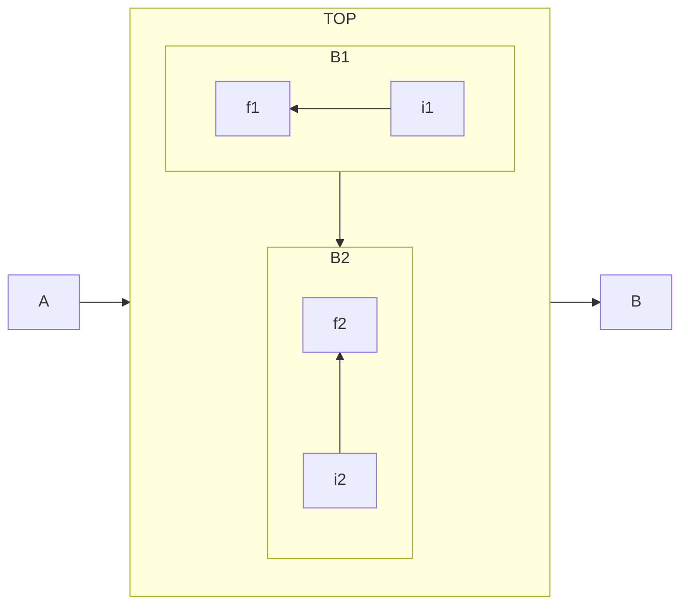

# Mermaid

[TOC]

## 緣起

以前喜歡用 [Trac](https://trac.edgewall.org/) 並且搭配它的 [Graphviz](https://graphviz.org/) 擴充元件。這樣就可以在 Wiki 裡面直接鑲嵌 [Graphviz](https://graphviz.org/) 語法，然後靠後端的指令產生對應的圖片。好處是能**版本控制**圖片的內容，其次是用語法就可以產生圖片。

隨著撰寫筆記的習慣從 Wiki 語法轉變成 Markdown 語法，漸漸地也不再需要用 VPS 自架靜態網站，Github 或 Gitlab 都已經提供很好的 Markdown 支援，不過用 Markdown 直接繪圖倒是仍有些不方便。

先前曾經試了一下 [Gravizo](http://www.gravizo.com/) 或 [PlantUML](https://plantuml.com/)，不過在使用上仍舊還需要習慣一下。

- ( 2021-11-21 11:50:24 ) 原本想找看看有沒有比較簡單的方法可以在 Markdown 裡面畫個簡易的金字塔。目前看起來只有找到 d3.js 的實作

<iframe>

</iframe>

## 歷史

網路上有許多可以透過 javascript 產生 UML 圖或者類似 graphviz 圖的工具。
- [PlantUML](https://plantuml.com/) 就提供了直接產生多種 UML 圖的服務，也算是裡面看過支援種類最廣的一個實作。
  - [UMLGraph](https://www.spinellis.gr/umlgraph/) 相對支援的種類就少一些
- [Viz.js](http://viz-js.com/) 看起來則提供了很不錯的 Grpahviz 支援
  - 原始碼：https://github.com/mdaines/viz.js
  - 不過這個 git repo 已經設為 Archived (代表不再活躍維護)
  - CDN: https://cdnjs.com/libraries/viz.js/2.1.2
- [Gravizo](http://www.gravizo.com/) 的服務。
  - 優點：Github 也可以直接鑲嵌
  - 缺點：每張圖都有「Gravizo」的 Logo

## 範例

### 流程圖

- 語法：

- 使用 Live Editor 並取得 Markdown 連結：
```

```
- 結果
[](https://mermaid.live/edit/#eyJjb2RlIjoiZmxvd2NoYXJ0IExSXG4gIHN1YmdyYXBoIFRPUFxuICAgIGRpcmVjdGlvbiBUQlxuICAgIHN1YmdyYXBoIEIxXG4gICAgICAgIGRpcmVjdGlvbiBSTFxuICAgICAgICBpMSAtLT5mMVxuICAgIGVuZFxuICAgIHN1YmdyYXBoIEIyXG4gICAgICAgIGRpcmVjdGlvbiBCVFxuICAgICAgICBpMiAtLT5mMlxuICAgIGVuZFxuICBlbmRcbiAgQSAtLT4gVE9QIC0tPiBCXG4gIEIxIC0tPiBCMiIsIm1lcm1haWQiOiJ7XG4gIFwidGhlbWVcIjogXCJkYXJrXCJcbn0iLCJ1cGRhdGVFZGl0b3IiOmZhbHNlLCJhdXRvU3luYyI6dHJ1ZSwidXBkYXRlRGlhZ3JhbSI6ZmFsc2V9)