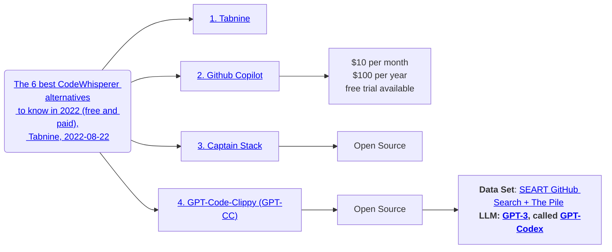

```mermaid
graph LR
    A("<a href='https://www.tabnine.com/blog/codewhisperer-alternatives/'>The 6 best CodeWhisperer alternatives<br/> to know in 2022 (free and paid),<br/> Tabnine, 2022-08-22</a>")
    B["<a href='https://www.tabnine.com/pricing'>1. Tabnine</a>"]
    C["<a href='https://github.com/features/copilot'>2. Github Copilot</a>"]
    C-->Z["$10 per month<br>$100 per year<br/>free trial available"]
    D["<a href='https://github.com/hieunc229/copilot-clone'>3. Captain Stack</a>"]
    D-->YX["Open Source"]
    E["<a href='https://github.com/CodedotAl/gpt-code-clippy'>4. GPT-Code-Clippy (GPT-CC)</a>"]
    E-->X["Open Source"]
    X-->W["<b>Data Set</b>: <a href='https://the-eye.eu/public/AI/training_data/code_clippy_data/code_clippy_dedup_data/'>SEART GitHub Search + The Pile</a> <br><b>LLM</>: <a href='https://arxiv.org/abs/2005.14165'>GPT-3</a>, called <a href='https://arxiv.org/abs/2107.03374'>GPT-Codex</a>"]
    A-->B;
    A-->C;
    A-->D;
    A-->E;
```