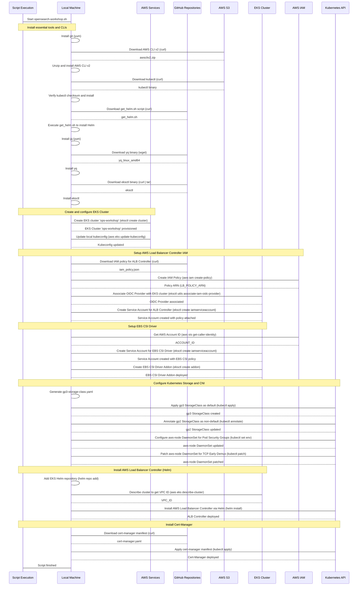

> #### aider chat started at 2025-08-24 18:49:09
> C:\Users\jazzw\.local\bin\aider --no-auto-commits --no-gitignore --model gemini/gemini-2.5-flash-preview-05-20 --chat-history-file opensearch-workshop.md -m /ask could you create a sequence diagram of opensearch-workshop.sh using mermaid.js syntax? explain those steps if possible. opensearch-workshop.sh  
> Aider v0.86.1  
> Model: gemini/gemini-2.5-flash-preview-05-20 with whole edit format  
> Git repo: .git with 0 files  
> Repo-map: using 4096 tokens, auto refresh  
> Added opensearch-workshop.sh to the chat.  

#### could you create a sequence diagram of opensearch-workshop.sh using mermaid.js syntax? explain those steps if possible.  

Here is a sequence diagram of the `opensearch-workshop.sh` script using Mermaid.js syntax, followed by an explanation of the steps:

### Explanation of Steps:

1.  **Install Essential Tools and CLIs**:
    *   The script begins by installing `git` using `yum`.
    *   It then downloads and installs the AWS Command Line Interface (CLI) v2 from an AWS S3 bucket.
    *   `kubectl`, the Kubernetes command-line tool, is downloaded from an Amazon EKS S3 bucket, its checksum is verified, and it's made executable and added to the system's PATH.
    *   `helm`, the Kubernetes package manager, is installed by downloading and executing its official installation script from GitHub.
    *   `jq` (a JSON processor) and `yq` (a YAML processor) are installed via `yum` and `wget` respectively, to aid in command-line parsing.
    *   Finally, `eksctl`, a CLI for Amazon EKS, is downloaded from GitHub and installed.

2.  **Create and Configure EKS Cluster**:
    *   The script uses `eksctl` to create an Amazon EKS cluster named `ops-workshop` with a specified Kubernetes version, region, availability zones, and node group configuration (r6i.2xlarge instances).
    *   After the cluster is created, `aws eks update-kubeconfig` is run to configure the local `kubectl` to connect to the newly created EKS cluster.

3.  **Setup AWS Load Balancer Controller IAM**:
    *   An IAM policy required by the AWS Load Balancer Controller is downloaded from GitHub.
    *   This policy is then created in AWS IAM using `aws iam create-policy`.
    *   `eksctl` is used to associate an IAM OIDC (OpenID Connect) provider with the EKS cluster, which is necessary for Kubernetes service accounts to assume IAM roles.
    *   An IAM service account named `aws-load-balancer-controller` is created in the `kube-system` namespace of the EKS cluster, and the previously created IAM policy is attached to it. This allows the controller to make AWS API calls on behalf of the cluster.

4.  **Setup EBS CSI Driver**:
    *   The AWS account ID is retrieved using `aws sts get-caller-identity`.
    *   An IAM service account named `ebs-csi-controller-sa` is created for the Amazon EBS CSI (Container Storage Interface) driver, and the `AmazonEBSCSIDriverPolicy` is attached to it. This enables the driver to manage EBS volumes.
    *   The `aws-ebs-csi-driver` addon is then deployed to the EKS cluster, leveraging the created service account.

5.  **Configure Kubernetes Storage and CNI**:
    *   A Kubernetes `StorageClass` definition for `gp3` (General Purpose SSD) volumes is created locally and applied to the cluster, making `gp3` the default storage class.
    *   The existing `gp2` storage class is explicitly annotated to *not* be the default.
    *   The `aws-node` DaemonSet (which manages the Amazon VPC CNI plugin) is updated to enforce standard Pod Security Groups.
    *   A patch is applied to the `aws-node` DaemonSet to disable TCP Early Demux, which can be beneficial for certain network configurations.

6.  **Install AWS Load Balancer Controller (Helm)**:
    *   The official EKS Helm repository is added to the local Helm configuration.
    *   The VPC ID of the EKS cluster is extracted by querying the cluster details using `aws eks describe-cluster`.
    *   The AWS Load Balancer Controller is then installed into the `kube-system` namespace using Helm, configured with the cluster name, region, VPC ID, and the pre-created service account.

7.  **Install Cert-Manager**:
    *   The manifest file for `cert-manager` (a tool for automating certificate management in Kubernetes) is downloaded from its GitHub releases page.
    *   This manifest is then applied to the Kubernetes cluster using `kubectl apply`, deploying `cert-manager`.

> Tokens: 1.3k sent, 1.9k received. Cost: \$0.0051 message, \$0.0051 session. 