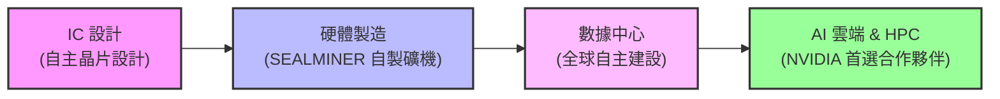
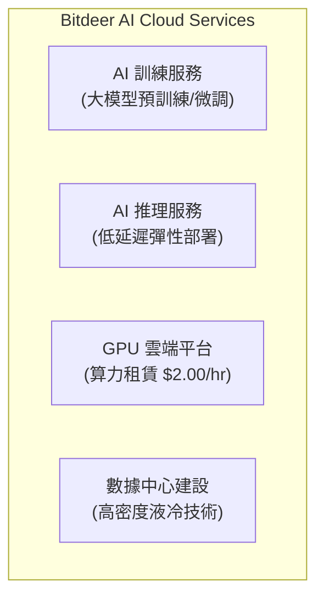
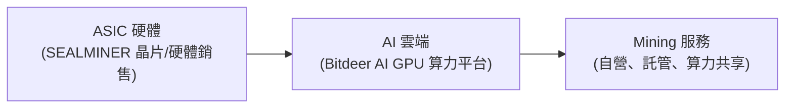
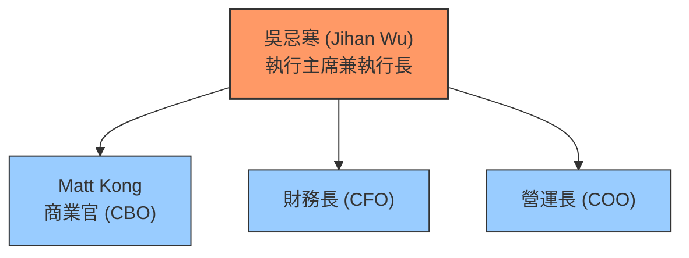

- 緣起：LinkedIn 上有 Bitdeer 的人想加我好友，所以嘗試了解一下這是什麼公司
- Tool: Pi Agent (https://pi.dev) + llama.cpp/Qwen3.5-9B:32K, google/gemini-3.5-flash

## 比特小鹿 (Bitdeer) 企業分析報告

### 執行摘要

比特小鹿 (Bitdeer Technologies Group, 股票代號：BTDR) 是一家在新加坡註冊、於納斯達克上市的高性能計算與比特幣 mining 技術公司。公司由吳忌寒 (Jihan Wu) 於 2013 年創立，2021 年從比特大陸 (Bitmain) 分拆獨立，2023 年透過 SPAC 合併完成上市。

---

### (A) 資金來源 Analysis

#### 融資歷程

| 時間 | 融資方式 | 金額 | 投資者/機構 | 估值/備註 |
|------|----------|------|-------------|------------|
| 2021 年 4 月 | 種子資金 | $12M | Genimous | 技術授權/捐贈 |
| 2023 年 4 月 | SPAC IPO | $50M | Blue Safari Group Acquisition Corp | 估值 $12B, 3.3x EV/Revenue |
| 2023 年 8 月 | 私募配售 | $150M | B. Riley Financial | 上市後股權融資 |
| 2024 年 5 月 | 私募配售 | $150M | Tether | PIPE 融資，非 VC |
| 2024 年 8 月 | 可轉換債券 | $150M | - | 上市後可轉換債券 |
| 2024 年 11 月 | 可轉換債券 | $360M | - | PIPE 融資 |
| 2025 年 4 月 | PIPE - II | $32M | Tether | 最新融資輪次 |

#### 總計融資
- **累計融資額**: 約 $1.5B+ (2024-2026 年間可轉換債券)
- **主要資金來源**: Tether 為最大單一投資者
- **資本結構**: 混合股權與債務融資

---

### (B) 現有債務 Analysis

#### 債務結構 (截至 2025 年 12 月 31 日)

| 項目 | 金額 (USD) | 備註 |
|------|-----------|------|
| **現金及等價物** | $149.4M | |
| **加密貨幣** | $83.1M | |
| **借款/債務** | $1,000M | |
| **衍生負債** | $501.1M | 主要來自可轉換債券的認股權證 |
| **長期債務** | $89.0M | 2025 財年 |

#### 債務變動趨勢

| 日期 | 現金及等價物 | 借款 | 淨現金狀況 |
|------|-------------|------|------------|
| 2023 年 12 月 31 日 | $476.3M | $208.1M | 正現金 |
| 2024 年 12 月 31 日 | $476.3M | $208.1M | 正現金 |
| 2025 年 12 月 31 日 | $149.4M | $1,000M | 負現金 |

#### 債務還款狀況
- **2024 年 8 月可轉換債券**: 已於 2025 年 12 月 31 日完全贖回和註銷
- **2025 年 9 月 30 日**: 仍有 $672.5M 衍生負債

#### 財務健康評估
⚠️ **風險警示**: 
- 債務規模顯著增加，負債率上升
- 營運活動現金流出，顯示現金燃燒
- 高度依賴加密貨幣價格波動和 mining 收入

---

### (C) 競爭對手 Analysis

#### 主要競爭對手分類

##### 1. Bitcoin Mining 營運競爭對手

| 公司 | 股票代號 | Hashrate (EH/s) | 核心優勢 |
|------|----------|-----------------|----------|
| **Bitdeer** | BTDR | **78.1** | 垂直整合能力、ASIC 設計 |
| Marathon Digital | MARA | 66.4 | 規模化 mining 營運 |
| CleanSpark | CLSK | 47.3 | 礦場分散化策略 |
| Riot Platforms | Riot | ~35 | 礦業資產持有 |

**Bitdeer 市場地位**: 目前為全球最大比特幣 mining 公司，Hashrate 超越 MARA 達 11.7 EH/s

##### 2. Mining Hardware 競爭對手

| 公司 | 主要產品 | 市場地位 |
|------|----------|----------|
| **Bitmain** | Antminer 系列 | 市佔率最高，垂直整合 |
| **MicroBT** | WhatsMiner 系列 | 價格競爭力強 |
| **Canaan** | 部分 ASIC 產品 | 較小規模 |
| **Bitdeer** | SEALMINER 系列 | 新進者，設計自主 |

##### 3. AI Cloud Computing 競爭對手

| 公司 | 核心服務 | 差異化優勢 |
|------|----------|------------|
| **CoreWeave** | AI 雲端平台 | NVIDIA 緊密合作 |
| **Lambda Research** | GPU 雲端 | 學術研究合作 |
| **其他 AI 雲提供商** | AI 訓練/推理 | 價格競爭力 |

##### 4. 競爭優勢矩陣

```mermaid
quadrantChart
    title 競爭優勢矩陣 (ASIC 設計 vs AI 雲端/Mining 規模)
    x-axis 弱 ASIC 設計 --> 強 ASIC 設計
    y-axis 弱 Mining/AI 雲端 --> 強 Mining/AI 雲端
    quadrant-1 領先者 (垂直整合)
    quadrant-2 技術先鋒 (硬體製造)
    quadrant-3 傳統參與者
    quadrant-4 營運與雲端巨頭
    Bitdeer (本體): [0.8, 0.85]
    Bitmain: [0.9, 0.4]
    Marathon: [0.3, 0.75]
    CoreWeave: [0.1, 0.9]
```

---

### (D) 核心市場競爭力 Analysis

#### 關鍵競爭優勢

##### 1. 垂直整合能力



**優勢分析**: 
- ✅ 減少供應鏈依賴
- ✅ 成本控制能力
- ✅ 快速產品迭代
- ✅ 利潤率優化

##### 2. 技術領先性

| 技術領域 | 競爭狀態 | 說明 |
|----------|----------|------|
| **ASIC 設計** | 領先 | SEALMINER 系列自主設計 |
| **AI 雲端** | 領先 | NVIDIA 首選雲提供商 (NCP) |
| **液冷技術** | 創新 | SEALMINER A3 Pro Hydro 等 |
| **電力效率** | 領先 | 高效能電力管理系統 |

##### 3. 全球佈局

| 區域 | 設施 | 優勢 |
|------|------|------|
| **美國** | 多個數據中心 | 接近客戶、電力資源 |
| **挪威** | 數據中心 | 綠能供應、稅收優惠 |
| **不丹** | 數據中心 | 潔淨能源、成本優勢 |
| **新加坡** | 總部 | 亞太樞紐 |

##### 4. 生態系統合作

- **NVIDIA**: 首選雲提供商 (NCP)
- **Tether**: 主要投資者
- **TSMC**: 先進製程代工
- **各大雲服務商**: 雲端合作夥伴

#### 競爭弱點

⚠️ **潛在風險**:
- 對加密貨幣價格波動高度敏感
- 電力供應依賴性
- 法規風險 (加密貨幣相關)
- 供應鏈限制 (GPU 和 mining rig)

---

### (E) 主要產品佈局

#### 1. SEALMINER 系列 (ASIC Mining Hardware)

##### 產品線

| 產品型號 | 特點 | 價格 (EUR) | 適用場景 |
|----------|------|------------|----------|
| **SEALMINER A4 Ultra** | 液冷、高效能 | ~€7,000+ | 大型 mining 設施 |
| **SEALMINER A4 Pro** | 空氣散熱、專業級 | ~€6,500+ | 商業 mining |
| **SEALMINER A3 Pro** | 液冷設計 | ~€5,000 | 中型設施 |
| **SEALMINER A2 Pro** | 入門級 | ~€3,700 | 小型礦場 |
| **SEALMINER DL1** | 液冷系列 | ~€8,000+ | 高效能需求 |

##### 技術特色
- 🔹 自主 ASIC 晶片設計
- 🔹 先進液冷技術
- 🔹 低噪音設計
- 🔹 遠程監控系統

#### 2. AI Cloud Platform (Bitdeer AI)

##### 核心服務



**硬體配置**:
- NVIDIA GB200 NVL72
- NVIDIA B200, H200
- NVIDIA H100

**定價策略**: AI 訓練低至 $2.00/小時

##### 服務優勢
- ✅ 全棧 AI 解決方案
- ✅ 全球數據中心佈局
- ✅ NVIDIA 認證合作夥伴
- ✅ 企業級服務等級

#### 3. Mining Infrastructure Services

##### 服務類型

| 服務 | 說明 | 收入模式 |
|------|------|----------|
| **Self-Mining** | 自有 mining 營運 | Hashrate 銷售 |
| **Hash Rate Sharing** | Hashrate 共享服務 | 分成模式 |
| **Hosting Services** | 客戶礦機托管 | 租金 + 電力費 |
| **Cloud Mining** | 雲端 mining 合約 | 合約銷售 |

#### 4. 數據中心服務

##### 數據中心特性

- **總 Hashrate**: ~78.1 EH/s
- **全球能源容量**: 多國分布
- **能源來源**: 混合 (化石燃料 + 綠能)
- **地理位置**: 美國、挪威、不丹

#### 產品矩陣圖



---

### (F) 關鍵利害關係人

#### 組織架構圖



#### 主要利害關係人

##### 1. 治理層

| 角色 | 姓名 | 背景/資歷 |
|------|------|-----------|
| **執行主席兼執行長** | 吳忌寒 (Jihan Wu) | 比特幣 mining 創始人，Bitmain 共同創辦人 |
| **商業官** | Matt Kong | 負責整體商業策略與營運 |
| **財務長** | - | 管理複雜的資本結構 |

##### 2. 主要投資者

| 投資者 | 持股比例/投資額 | 投資動機 |
|--------|-----------------|----------|
| **Tether** | $150M+ | 加密貨幣生態系參與 |
| **Blue Safari Group** | $50M (IPO) | SPAC sponsor |
| **B. Riley Financial** | $150M | 金融投資 |
| **Genimous** | $12M | 技術合作 |
| **Coatue Management** | 早期投資 | 風險投資 |

##### 3. 战略合作夥伴

| Company | 合作領域 | 合作價值 |
|---------|----------|----------|
| **NVIDIA** | AI 雲端 | 技術認證、優先支持 |
| **TSMC** | 晶片製造 | 先進製程代工 |
| **各大雲端服務商** | 雲端服務 | 客戶拓展 |

##### 4. 監管機構

| 機構 | 監管領域 | 影響程度 |
|------|----------|----------|
| **美國 SEC** | 股票上市、加密貨幣 | 高 |
| **新加坡金管會** | 公司註冊 | 中等 |
| **各國能源監管機構** | 電力使用 | 中等 |

##### 5. 生態系統參與者

- **礦機零售商**: 全球銷售網絡
- **電力供應商**: 數據中心電力合作
- **物流夥伴**: 設備運輸
- **金融機構**: 融資合作

---

### 綜合評估

#### 優勢 (Strengths)
1. ✅ **技術自主性**: ASIC 晶片自主設計
2. ✅ **垂直整合**: 從設計到營運完整價值鏈
3. ✅ **市場領導地位**: 全球最大 mining 公司
4. ✅ **全球佈局**: 多國數據中心
5. ✅ **AI 轉型**: 成功多元化到 AI 雲端

#### 劣勢 (Weaknesses)
1. ❌ **債務水平**: 債務規模顯著增加
2. ❌ **現金流量**: 營運現金流出
3. ❌ **依賴性**: 對加密貨幣價格敏感
4. ❌ **法規風險**: 加密貨幣法規不確定

#### 機會 (Opportunities)
1. 🚀 **AI 成長**: AI 計算需求爆發
2. 🚀 **綠色能源**: 利用清潔能源優勢
3. 🚀 **技術創新**: 液冷、效率提升
4. 🚀 **市場擴張**: 新興市場開發

#### 威脅 (Threats)
1. ⚠️ **加密貨幣監管**: 全球法規收緊
2. ⚠️ **電力成本**: 能源價格波動
3. ⚠️ **競爭加劇**: 大型雲服務商進入
4. ⚠️ **技術迭代**: ASIC 技術快速變革

---

### 結論

比特小鹿是一家具有技術自主性和垂直整合能力的市場領導者，成功從 mining 公司轉型為涵蓋 AI 雲端的多元化技術企業。然而，公司面臨債務增加、法規不確定和競爭加劇等挑戰。

**投資考量**: 需密切關注公司的債務管理、AI 業務成長和法規適應能力。

**關鍵監測指標**:
- Hashrate 成長率
- AI 雲端營收貢獻
- 債務償還進度
- 法規變化影響

---

### 資料來源

1. Bitdeer 官網 (https://www.bitdeer.com/)
2. Bitdeer 投資者關係 (https://ir.bitdeer.com/)
3. 納斯達克公告 (https://www.nasdaq.com/)
4. 美國 SEC 文件 (https://www.sec.gov/)
5. 業界分析報告與新聞

---

*報告生成日期：2026 年 1 月*
*資料時點：截至 2025 年 12 月 31 日*
