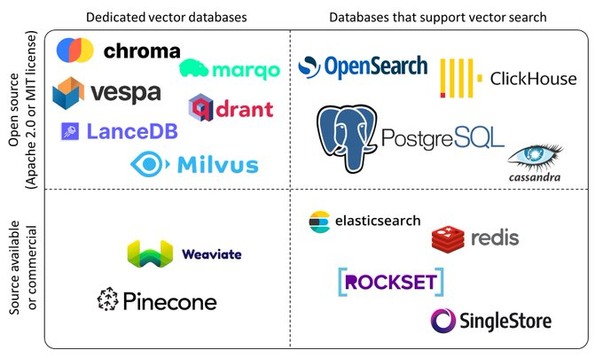

# DEVELOPMENT NOTES

[TOC]

## 2024-06-29

### Embedding Visualization

#### t-SNE (t-distributed stochastic neighbor embedding)

- https://en.wikipedia.org/wiki/T-distributed_stochastic_neighbor_embedding
    - scikit-learn, a popular machine learning library in Python implements t-SNE with both exact solutions and the Barnes-Hut approximation.
    - 從 https://www.kaggle.com/code/colinmorris/visualizing-embeddings-with-t-sne/notebook 可以看到 scikit-learn 有 t-SNE 的實作
    ```python
    from sklearn.manifold import TSNE
    ```
    - https://scikit-learn.org/stable/modules/generated/sklearn.manifold.TSNE.html
- https://lvdmaaten.github.io/tsne/
- https://towardsdatascience.com/neural-network-embeddings-explained-4d028e6f0526
    - https://github.com/lmcinnes/umap

### Vector Database

- 2024-06-29 22:01:08

- Goal #1: pgvector 安裝
    - Action #1: 用 docker-compose + Dockerfile 實作自動化
    - https://github.com/pgvector/pgvector?tab=readme-ov-file#installation
    - https://ithelp.ithome.com.tw/m/articles/10328071
- Goal #2: get started pgvector 使用
    - https://github.com/pgvector/pgvector?tab=readme-ov-file#getting-started
    - 範例裡給的是三維的向量。
    - https://github.com/pgvector/pgvector?tab=readme-ov-file#querying
    - 基本的 Query
- Questions:
    - Q1: 有 embedding 的 data type 嗎？
        - A: https://github.com/pgvector/pgvector?tab=readme-ov-file#getting-started 看起來就是 `vector`
    - Q2: 透過 Schema 設計能做到反查資料來源？(e.g. 若以某個網址為例)
    - Q3: PostgreSQL 可以靠 Role-based Access Control 或 fine-grained access control 控制查詢結果嗎？
        - https://www.postgresql.org/docs/current/ddl-rowsecurity.html
    - Q4: PostgreSQL 的加密 Encryption 與 稽核 Audit 是否有 Best Practice
        - https://www.enterprisedb.com/postgresql-best-practices-encryption-monitoring

### Ollama

- https://github.com/ollama/ollama

### vLLM

- https://github.com/vllm-project/vllm
- https://docs.vllm.ai/en/stable/

## 2024-06-30

### pgvector + pgvectorscale vs pinecone

- 本來想說來比較一下 pgvector 跟 pinecone 兩個效能會差多少呢？
- 2024-04-17 : [Pinecone vs. Postgres pgvector: For vector search, easy isn’t so easy](https://www.pinecone.io/blog/pinecone-vs-pgvector/)
    - 本文提到了一些 pgvector 的缺點，像是用 HNSW index 太耗費記憶體（所以成本太高）
- 2024-06-13: [Pgvector vs. Pinecone: Vector Database Performance and Cost Comparison](https://www.timescale.com/blog/pgvector-vs-pinecone/)
    - 結果六月 Timescale 開發了 [pgvectorscale](https://github.com/timescale/pgvectorscale)
- 2024-06-27: [PostgreSQL and Pgvector: Now Faster Than Pinecone, 75% Cheaper, and 100% Open Source](https://www.timescale.com/blog/pgvector-is-now-as-fast-as-pinecone-at-75-less-cost/)
    - 宣稱

- ANN-Benchmarks is a benchmarking environment for approximate nearest neighbor algorithms search
    - https://ann-benchmarks.com/
    - 實作: https://github.com/erikbern/ann-benchmarks/

### more fun stuff from TimeScale

- [How to Collapse Your Stack Using PostgreSQL for Everything](https://www.timescale.com/blog/how-to-collapse-your-stack-using-postgresql-for-everything/)
- https://github.com/timescale/timescaledb - 在 https://db-engines.com/en/system/PostgreSQL 只有列到 Document store, Graph DBMS, Spatial DBMS, Vector DBMS。TimeScale 讓 PostgreSQL 變成 time-series SQL database，挺有趣的。真的是「多模態 Multimodal 資料庫」，而且用 extension 的方式存在，確實有種讓 PostgreSQL 能適應各種應用場景的感覺。

## 2024-07-01~05

### more about Vector Database

- 看到一篇 [Christoph Bussler](https://www.real-programmer.com)(待過 Google Cloud Solution Architect) 寫的 [Vector Databases (are All The Rage)](https://medium.com/google-cloud/vector-databases-are-all-the-rage-872c888fa348)。整理了目前市面上出現的 Vector Database (當然很多是現有系統的 plugin/extension)，還拆解了向量資料型態、向量距離、怎麼建立索引，相似度搜尋的演算法，怎麼下查詢，怎麼做效能 Benchmark。
    - 經過先前的 Chatbot POC，我覺得對 Embedding 感覺還是很抽象。具體只知道不同的 LLM 產生的 Enbedding 也各有不同。
    - 看樣子要搞懂這每個環節裡的名詞，不是一件容易的事情。
    - 上次有把資料轉成 [Facebook AI Similarity Search (FAISS)](https://github.com/facebookresearch/faiss) 格式儲存，但具體該怎麼用，好難懂。
- https://superlinked.com/vector-db-comparison
    - 這篇文章裡講到的一個 Vector Database 比較表。算是初步可以拿來了解一些專有名詞
- https://x.com/YingjunWu/status/1667232357953466369 的二分法：開源、專用
    - 2023~2024 真是 Vectore Database 百家爭鳴啊！
    - 

### 測試 pgvector 的 docker image

- 參考 https://ithelp.ithome.com.tw/m/articles/10328071 給了一個 hint 可以找 docker image，文中使用 `ankane/pgvector`
- 看起來 `ankane/pgvector` 這個 image 是比較多人 STAR 的
```
jazz@docker:~$ docker search pgvector
NAME                                    DESCRIPTION                                     STARS               OFFICIAL            AUTOMATED
ankane/pgvector                         Open-source vector similarity search for P...   21                                      
tensorchord/pgvecto-rs                  Scalable Vector Search in Postgres. Revolu...   10                                      
pgvector/pgvector                       Open-source vector similarity search for P...   9                                       
riskledger/pgvector                     postgresql + pgvector                           1                                       
phidata/pgvector                                                                        1                                       
ramsrib/pgvector                        Extends the official postgres image with p...   1                                       
justintc/postgres-15.2-pgvector                                                         0                                       
execholdings/postgis-pgvector                                                           0                                       
mautrix100/timescale-pgvector                                                           0                                       
talentpairqa/postgis-pgvector-alpine    Extension of postgis-alpine image with pgv...   0                                       
davidcheung/postgres-pgvector           postgres with pgvector                          0                                       
rstocker99/pgvector13                                                                   0                                       
fantix/pgvector                                                                         0                                       
burakince/pgvector                      Docker image of pgvector enabled PostgresD...   0                                       
octoberlan/pgvector                                                                     0                                       
solmano/pgvector                                                                        0                                       
darren2046/pgvector                                                                     0                                       
ashwinc/pgvector                        https://github.com/pgvector/pgvector/blob/...   0                                       
zcemycl123/pgvector                     create extension vector for pgvector            0                                       
hannesmoser/cimg-postgres-13-pgvector   A CircleCI Postgres image with the pgvecto...   0                                       
huuthieu/pgvector                                                                       0                                       
tangibleai/pgvector                     Postgresql with pgvector                        0                                       
joshuasundance/postgis_pgvector         docker image for postgresql w/ postgis & p...   0                                       
flyjason/fly-pg-pgvector                Fork of https://github.com/fly-apps/postgr...   0                                       
chapvic/pgvectors                       PostgreSQL with pgvecto.rs plugin               0             
```

- 其實對 PostgreSQL 的 extension 安裝不熟，pgvector 專案只講到用 `make install`，難道說 PostgreSQL 沒有 extension repo 嗎？

### pgvector.rs

- https://github.com/tensorchord/pgvecto.rs
- `pgvecto.rs` is a Postgres extension that provides ==**vector similarity search**== functions. 

## 2024-11-12

### Convert HuggingFace model to GGUF format

- https://www.youtube.com/watch?v=jOEu0PE4ozM
- https://www.geeksforgeeks.org/how-to-convert-any-huggingface-model-to-gguf-file-format/

- 緣起：想拿來測 https://huggingface.co/infly/OpenCoder-8B-Instruct 的效果。

### pgai

- https://github.com/timescale/pgai

> A suite of tools to develop RAG, semantic search, and other AI applications more easily with PostgreSQL

### Google Gemini API

- 2024-11-08: Gemini is now accessible from the OpenAI Library
  - https://developers.googleblog.com/en/gemini-is-now-accessible-from-the-openai-library/

```python
from openai import OpenAI
client = OpenAI(
    api_key="gemini_api_key",
    base_url="https://generativelanguage.googleapis.com/v1beta/"
)


response = client.chat.completions.create(
    model="gemini-1.5-flash",
    n=1,
    messages=[
        {"role": "system", "content": "You are a helpful assistant."},
        {
            "role": "user",
            "content": "Explain to me how AI works"
        }
    ]
)

print(response.choices[0].message)
```

- 參加 Kaggle 5-day Generative AI course 剛好就會用到 Google Gemini API 的模型
- 2024-11-11: 
  - Day 1 - Prompting
  - https://www.kaggle.com/code/markishere/day-1-prompting
- 2024-11-12:
  - Day 2 - Classifying embeddings with Keras
  - https://www.kaggle.com/code/markishere/day-2-classifying-embeddings-with-keras
  - Day 2 - Embeddings and similarity scores
  - https://www.kaggle.com/code/markishere/day-2-embeddings-and-similarity-scores
  - Day 2 - Document Q&A with RAG
  - https://www.kaggle.com/code/markishere/day-2-document-q-a-with-rag
- 補充:
  - https://github.com/google-gemini/cookbook/blob/main/examples/Search_reranking_using_embeddings.ipynb
  - https://www.kaggle.com/code/colinmorris/visualizing-embeddings-with-t-sne
  - https://developers.google.com/machine-learning/crash-course/embeddings?hl=zh-tw

## 2024-11-13

### Model: Qwen2.5-Coder

- 本來昨天才看到 OpenCoder 
  - https://huggingface.co/infly/OpenCoder-8B-Instruct
- 今天阿里巴巴又釋出 Qwen2.5-Coder 
  - https://qwenlm.github.io/blog/qwen2.5-coder-family/
  - https://huggingface.co/Qwen/Qwen2.5-Coder-32B-Instruct
