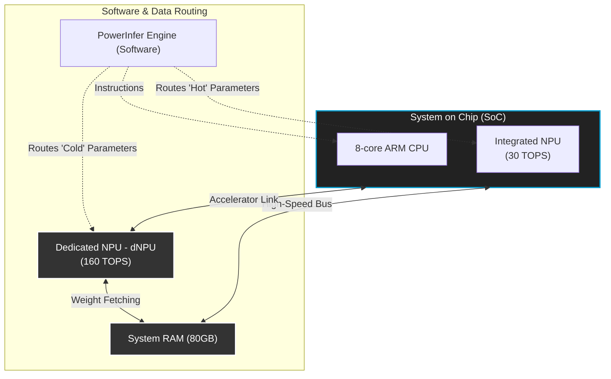

# Tiiny

- Website
  - https://tiiny.ai/

## 2026-03-30

- 緣起：
  - 看到 YouTube 影片 [This Shouldn’t Be Able to Run 120B Locally](https://www.youtube.com/watch?v=RkzCAaIV_cQ)
- 好奇這台 Portable 的硬體到底要賣多少錢 -- A: 早鳥價 USD$ 1,399 
  - https://www.kickstarter.com/projects/tiinyai/tiiny-ai-pocket-lab
- 看了一下架構，其實不是用 NVIDIA 的晶片，而是一個特殊的名詞 `dNPU`
- 其次，其核心競爭力來自於兩個專案：
  - https://huggingface.co/Tiiny/TurboSparse-Mixtral 
    - TurboSparse 基於 [Deja Vu: Contextual Sparsity for Efficient LLMs at Inference Time](https://proceedings.mlr.press/v202/liu23am.html) 主要是降低「激活參數」的數量，來達成生成加速的效果。
    - 論文：Turbo Sparse: Achieving LLM SOTA Performance with Minimal Activated Parameters
      - https://huggingface.co/papers/2406.05955
  - https://github.com/Tiiny-AI/PowerInfer
    - 感覺基於 TurboSparse 的調整，又在推論層做了一些調校，所以可以達到整體加速的效果。
- 有可能特別針對 NPU 的部份做一些整合，讓 CPU-GPU-NPU RAM+VRAM 在系統架構上找到一個平衡點，所以可以把 GPT-OSS 120B 塞進 SoC (ARM + NPU ) 並且協調好哪些要丟給 dNPU

Q: what is `dNPU` in this diagram?

A:
Based on the diagram provided, a **dNPU** (**Dedicated Neural Processing Unit**) is a specialized hardware component designed to accelerate AI workloads, specifically for running Large Language Models (LLMs) on edge devices.

In the context of this specific hardware architecture, here is how the dNPU functions:

### Hardware Specifications
According to the sidebar in the image, the dNPU is a powerhouse within this ultra-compact form factor:
* **Performance:** It delivers **160 TOPS** (Tera Operations Per Second).
* **Role:** It works alongside the standard **SoC** (System on Chip), which handles general processing (8-core CPU) and lower-intensity AI tasks (30 TOPS NPU).

### Functional Role in "PowerInfer"

The diagram illustrates a heterogeneous compute model where the dNPU is used to optimize LLM inference:
* **"Hot" vs. "Cold" Parameters:** The architecture (likely via the **PowerInfer** engine) splits the model's parameters. 
    * **Hot neurons** (those activated frequently) are offloaded to the **SoC**.
    * **Cold neurons** (less frequent activations) are managed by the **dNPU**.
* **Acceleration:** By offloading specific neural network computations to the dNPU, the device can run massive models (like the Qwen3-30B or GPT-OSS 120B mentioned in the performance table) that would typically be too heavy for a standard mobile processor alone.

### Why it Matters

Traditional NPUs integrated into mobile chips are often designed for light tasks like image enhancement or voice recognition. A **dNPU**—as shown here—is a "dedicated" expansion that provides the massive throughput required for high-speed text generation (reaching ~20 tokens/s for large models) while maintaining a low thermal design power (~30W TDP).

Does this clear up how it fits into the overall system architecture, or were you looking for more technical details on the TOPS performance?

Q: help me to create a system architecture diagram using mermaid.js which can help me understand the relationship between CPU (ARM), NPU, RAM and dNPU.

BTW, is the NPU within SoC similar to GPU?

A:

To help clarify the architecture shown in the diagram, I will first provide a Mermaid.js diagram and then answer your question regarding the difference between an NPU and a GPU.

### Part 1: System Architecture Diagram (Mermaid.js)

This diagram shows how the standard System-on-Chip (SoC) components—specifically the CPU, the integrated NPU, and shared system RAM—interface with the Dedicated Neural Processing Unit (dNPU). The interaction is based on how the "PowerInfer" engine in the infographic handles "Hot" versus "Cold" neural parameters.

Here is the Mermaid code:

#### Breakdown of the Connections:

1.  **System-on-Chip (SoC):** This is the heart of the system. In this specific diagram, it is likely an integrated ARM-based mobile or edge chip containing an **ARM CPU** for general computing and an **integrated NPU (iNPU)** (the "30 TOPS NPU" listed next to the SoC icon).
2.  **System RAM:** 80GB of high-speed memory. Both the SoC and the dNPU need fast access to this RAM to load large model parameters (weights).
3.  **Dedicated NPU (dNPU):** This is a separate, specialized chip (labeled "160 TOPS"). It connects to the primary SoC via a high-speed accelerator link (likely PCIe or a custom interconnect) to act as a massive compute offload engine. The Software layer (PowerInfer) intelligently sends the bulk of the neural calculations (the "cold" neurons) here, reserving the standard SoC NPU for "hot" or urgent operations.

***

### Part 2: Is the NPU within an SoC similar to a GPU?

**Conceptually and computationally, YES. Architecturally, NO.**

While both are specialized accelerators designed to offload work from the main CPU, they are optimized for fundamentally different types of math and memory access.

#### Why they are *SIMILAR* (Conceptual Level)

* **Specialization over Generalization:** Unlike a CPU, which is good at a wide variety of tasks (like managing an operating system, handling user input, and managing memory), both GPUs and NPUs are highly specialized to do only one thing very well: process massive amounts of data in parallel.
* **Parallel Processing:** Both are comprised of thousands of very simple arithmetic cores, allowing them to perform thousands of simultaneous operations.
* **The Math:** At their core, both AI/Machine Learning inference (NPUs) and 3D graphics rendering (GPUs) rely almost exclusively on massive, repetitive **Matrix Multiplication** and vector operations (Linear Algebra).

#### Why they are *DIFFERENT* (Architectural Level)

The difference lies in *how* they handle data and the precision of the calculations.

| Feature | Graphics Processing Unit (GPU) | Neural Processing Unit (NPU) |
| :--- | :--- | :--- |
| **Primary Goal** | Render complex 3D graphics and pixels. | Run deep learning (neural network) inference. |
| **Computational Core** | General Matrix Multiplication (GEMM) engines. Flexible and programmable, but less power-efficient. | Highly specialized Matrix Multiplication (MatMul) arrays (like Systolic Arrays). Extremely fast for neural net operations but less flexible. |
| **Precision** | Designed for high-precision floating-point arithmetic (like FP32 or FP16) to ensure realistic rendering and calculations. | Optimised for lower-precision integer or floating-point arithmetic (like INT8 or FP8). While lower precision, it is incredibly fast and crucial for large-scale AI without massive power draw. |
| **Flexibility** | **Very Flexible.** Can handle physics simulation, rendering, and (with CUDA or ROCm) general-purpose compute (GPGPU), including AI training. | **Fixed Function.** It can do Matrix multiplication incredibly well, but it can’t render graphics or run generic programs. It is tailored specifically for loading weights, performing activation functions, and outputting results. |
| **Efficiency (TOPS/W)** | High power consumption. | **Highly Efficient.** Because it cuts out graphics flexibility and focuses on low precision, it achieves vastly better energy efficiency (TOPS per Watt) than a GPU. |

### Summary for your Diagram

In the diagram you are looking at, the integrated **NPU** (30 TOPS) within the SoC is conceptually similar to an integrated GPU (iGPU) in that it provides some baseline acceleration. The dedicated **dNPU** (160 TOPS) is conceptually similar to a discreet graphics card (dGPU) in that it provides a massive leap in processing power specifically tailored for AI, allowing the system to handle tasks that an integrated solution could not.

Q: Who can be the provider of NPU and dNPU?

A: 
The hardware described in your diagram appears to be part of a specialized edge AI device, specifically the **Tiiny AI Pocket Lab**, which made headlines at **CES 2026** for being the smallest device capable of running 100B+ parameter LLMs locally.

The architecture relies on a "provider ecosystem" where general-purpose silicon (SoC) is paired with specialized AI accelerators (dNPU). Here is who typically provides these components:

### 1. The dNPU (Dedicated NPU) Provider
The term **dNPU** is specifically championed by **NXP Semiconductors** (following their 2025 acquisition of **Kinara**).
* **Key Provider:** **NXP** offers the **Ara series** (such as the Ara-1 and Ara240), which are marketed as **Discrete Neural Processing Units (DNPUs)**.
* **Why them?** These chips are designed to handle complex generative AI and LLM tasks that exceed the capabilities of standard integrated processors. They often connect via **PCIe** or **USB** to a host processor to provide the "160 TOPS" performance shown in your diagram.

### 2. The NPU (Within SoC) Providers
The "integrated" NPU (30 TOPS) mentioned in your diagram is usually part of a mobile or edge **System-on-Chip (SoC)**. Major providers include:
* **Qualcomm:** Their **Snapdragon 8 Series** (e.g., Gen 3 and Gen 4) features the Hexagon NPU, which is widely used in high-end smartphones for "PowerInfer-2" implementations.
* **Intel:** The **Core Ultra Series 3 (Panther Lake)**, launched in early 2026, integrates AI acceleration directly into the silicon for "AI PCs" and edge systems.
* **Apple:** Their **A-series** and **M-series** chips feature the "Neural Engine," though these are proprietary and typically not sold as standalone components for third-party devices.
* **Nordic Semiconductor:** Recently introduced the **nRF54L Series** with an integrated **Axon NPU** for ultra-low-power IoT devices.

### 3. The "PowerInfer" Ecosystem
The software framework mentioned in your image, **PowerInfer**, is a research-driven engine often associated with **SJTU (Shanghai Jiao Tong University)** and the **PowerInfer.ai** project. 
* While PowerInfer is a **software framework**, it is designed to work across hardware from **NVIDIA** (consumer GPUs like the RTX 4090) and mobile SoCs from **Qualcomm**.
* The specific "Tiiny" device in your diagram is a specialized integration—likely using an **ARM-based SoC** (potentially from Qualcomm or NXP) paired with a **discrete accelerator** (the dNPU).

### Summary Table: Who Provides What?

| Component | Common Providers (2026) | Role in your Diagram |
| :--- | :--- | :--- |
| **SoC (CPU + NPU)** | Qualcomm, Intel, NXP, Ambarella | Primary "Brain" and "Hot" neuron processing. |
| **dNPU (Discrete)** | **NXP (Kinara)**, Synaptics, Ambiq | High-performance "Cold" neuron offloading. |
| **RAM** | Samsung, Micron, SK Hynix | High-capacity (80GB) LPDDR5X storage for model weights. |
| **AI Framework** | PowerInfer / TurboSparse (Software) | The logic that splits tasks between the SoC and dNPU. |

If you are looking to source these for a project, **NXP** is currently the most prominent vendor using the "dNPU" branding for edge-ready discrete chips.