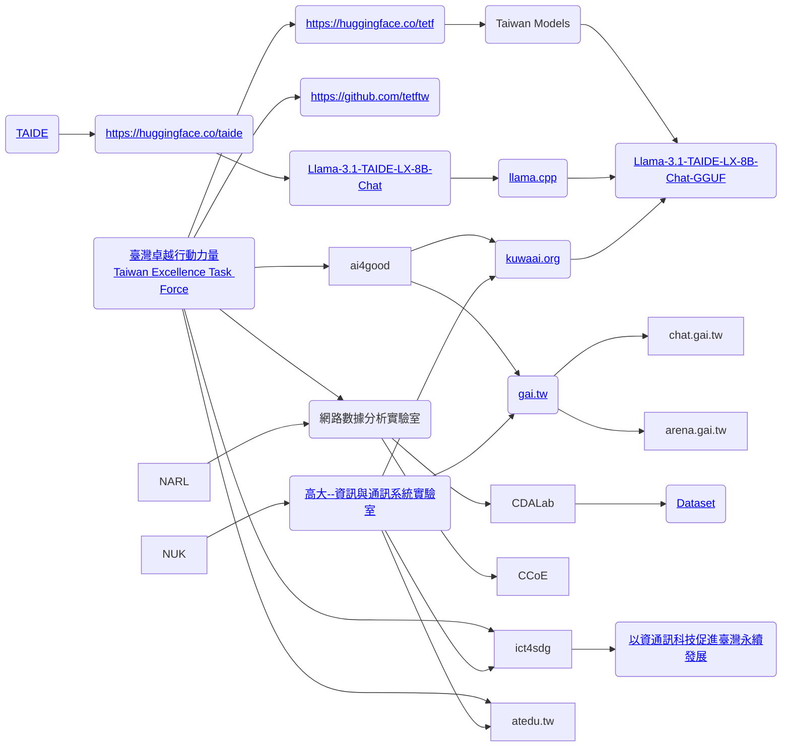

# TAIDE

## 2025-03-29

- 雖然曾關切 TAIDE 的歷史發展，不過沒真正拿來應用。今天來測試用 ollama 跑跑看。
- 剛好看到 TAIDE 的問答集裡提到 https://huggingface.co/tetf/Llama-3.1-TAIDE-LX-8B-Chat-GGUF
- 是可以用這個方式直接下載來跑
```bash
ollama run hf.co/tetf/Llama-3.1-TAIDE-LX-8B-Chat-GGUF:Q4_K_M
```
- 不過這樣的缺點是 model 名稱會很長，所以簡單做了個小微調
```bash
jazzw@JazzBook:~/git/snippet/go/ollama$ cat taide-lx-8b-chat-q4_k_m
FROM hf.co/tetf/Llama-3.1-TAIDE-LX-8B-Chat-GGUF:Q4_K_M
jazzw@JazzBook:~/git/snippet/go/ollama$ ollama create taide-lx-8b-chat:q4_k_m -f taide-lx-8b-chat-q4_k_m
gathering model components
pulling manifest ⠧
pulling 2ec5d4641b0e...  39% ▕███████████████████████████████████                                                         ▏ 2.0 GB/5.3 GB  1.7 MB/s  30m49s
```
- 等抓好就可以做測試啦 :P
- 抓太久，常常連線失敗，還是直接抓檔案
```bash
jazzw@JazzBook:~/git/snippet/go/ollama$ wget https://huggingface.co/tetf/Llama-3.1-TAIDE-LX-8B-Chat-GGUF/resolve/main/Llama-3.1-TAIDE-LX-8B-Chat-Q4_K_M.gguf
```
- 改一下 `taide-lx-8b-chat-q4_k_m` 的 Model file
```bash
jazzw@JazzBook:~/git/snippet/go/ollama$ cat taide-lx-8b-chat-q4_k_m
FROM Llama-3.1-TAIDE-LX-8B-Chat-Q4_K_M.gguf
```
- 用 Github codespace 下載到 ollama 看 model file
```bash
@jazzwang ➜ /workspaces/codespaces-blank (main) $ ollama pull hf.co/tetf/Llama-3.1-TAIDE-LX-8B-Chat-GGUF:Q4_K_M
pulling manifest ⠧ time=2025-03-29T11:17:10.734Z level=INFO source=download.go:176 msg="downloading 2ec5d4641b0e in 16 328 MB part(s)"
pulling manifest
pulling 2ec5d4641b0e... 100% ▕████████████████████████████████████████████████████████████████████████████████████████████▏ 5.3 GB                         tpulling manifest
pulling 2ec5d4641b0e... 100% ▕████████████████████████████████████████████████████████████████████████████████████████████▏ 5.3 GB
pulling manifest
pulling 2ec5d4641b0e... 100% ▕████████████████████████████████████████████████████████████████████████████████████████████▏ 5.3 GB
pulling manifest
pulling manifest
pulling 2ec5d4641b0e... 100% ▕████████████████████████████████████████████████████████████████████████████████████████████▏ 5.3 GB
pulling 948af2743fc7... 100% ▕████████████████████████████████████████████████████████████████████████████████████████████▏ 1.5 KB
pulling 6c0b08d96525... 100% ▕████████████████████████████████████████████████████████████████████████████████████████████▏   65 B
pulling 19dab2c82397... 100% ▕████████████████████████████████████████████████████████████████████████████████████████████▏  193 B
verifying sha256 digest
writing manifest
success
@jazzwang ➜ /workspaces/codespaces-blank (main) $ ollama list
NAME                                                 ID              SIZE      MODIFIED
hf.co/tetf/Llama-3.1-TAIDE-LX-8B-Chat-GGUF:Q4_K_M    15749d256c3f    5.3 GB    45 seconds ago
@jazzwang ➜ /workspaces/codespaces-blank (main) $ ollama show hf.co/tetf/Llama-3.1-TAIDE-LX-8B-Chat-GGUF:Q4_K_M --modelfile
# Modelfile generated by "ollama show"
# To build a new Modelfile based on this, replace FROM with:
# FROM hf.co/tetf/Llama-3.1-TAIDE-LX-8B-Chat-GGUF:Q4_K_M

FROM /home/codespace/.ollama/models/blobs/sha256-2ec5d4641b0e611801427931a8833eda7279c2f8e126b8ae2627966c9586b290
TEMPLATE """{{- if or .System .Tools }}<|start_header_id|>system<|end_header_id|>
{{- if .System }}

{{ .System }}
{{- end }}
{{- if .Tools }}

Cutting Knowledge Date: December 2023

When you receive a tool call response, use the output to format an answer to the orginal user question.

You are a helpful assistant with tool calling capabilities.
{{- end }}<|eot_id|>
{{- end }}
{{- range $i, $_ := .Messages }}
{{- $last := eq (len (slice $.Messages $i)) 1 }}
{{- if eq .Role "user" }}<|start_header_id|>user<|end_header_id|>
{{- if and $.Tools $last }}

Given the following functions, please respond with a JSON for a function call with its proper arguments that best answers the given prompt.

Respond in the format {"name": function name, "parameters": dictionary of argument name and its value}. Do not use variables.

{{ range $.Tools }}
{{- . }}
{{ end }}
Question: {{ .Content }}<|eot_id|>
{{- else }}

{{ .Content }}<|eot_id|>
{{- end }}{{ if $last }}<|start_header_id|>assistant<|end_header_id|>

{{ end }}
{{- else if eq .Role "assistant" }}<|start_header_id|>assistant<|end_header_id|>
{{- if .ToolCalls }}
{{ range .ToolCalls }}
{"name": "{{ .Function.Name }}", "parameters": {{ .Function.Arguments }}}{{ end }}
{{- else }}

{{ .Content }}
{{- end }}{{ if not $last }}<|eot_id|>{{ end }}
{{- else if eq .Role "tool" }}<|start_header_id|>ipython<|end_header_id|>

{{ .Content }}<|eot_id|>{{ if $last }}<|start_header_id|>assistant<|end_header_id|>

{{ end }}
{{- end }}
{{- end }}"""
PARAMETER stop <|start_header_id|>
PARAMETER stop <|end_header_id|>
PARAMETER stop <|eot_id|>

@jazzwang ➜ /workspaces/codespaces-blank (main) $
```
- 根據上述結果微調一下 model file
```bash
FROM Llama-3.1-TAIDE-LX-8B-Chat-Q4_K_M.gguf
TEMPLATE """{{- if or .System .Tools }}<|start_header_id|>system<|end_header_id|>
{{- if .System }}

{{ .System }}
{{- end }}
{{- if .Tools }}

Cutting Knowledge Date: December 2023

When you receive a tool call response, use the output to format an answer to the orginal user question.

You are a helpful assistant with tool calling capabilities.
{{- end }}<|eot_id|>
{{- end }}
{{- range $i, $_ := .Messages }}
{{- $last := eq (len (slice $.Messages $i)) 1 }}
{{- if eq .Role "user" }}<|start_header_id|>user<|end_header_id|>
{{- if and $.Tools $last }}

Given the following functions, please respond with a JSON for a function call with its proper arguments that best answers the given prompt.

Respond in the format {"name": function name, "parameters": dictionary of argument name and its value}. Do not use variables.

{{ range $.Tools }}
{{- . }}
{{ end }}
Question: {{ .Content }}<|eot_id|>
{{- else }}

{{ .Content }}<|eot_id|>
{{- end }}{{ if $last }}<|start_header_id|>assistant<|end_header_id|>

{{ end }}
{{- else if eq .Role "assistant" }}<|start_header_id|>assistant<|end_header_id|>
{{- if .ToolCalls }}
{{ range .ToolCalls }}
{"name": "{{ .Function.Name }}", "parameters": {{ .Function.Arguments }}}{{ end }}
{{- else }}

{{ .Content }}
{{- end }}{{ if not $last }}<|eot_id|>{{ end }}
{{- else if eq .Role "tool" }}<|start_header_id|>ipython<|end_header_id|>

{{ .Content }}<|eot_id|>{{ if $last }}<|start_header_id|>assistant<|end_header_id|>

{{ end }}
{{- end }}
{{- end }}"""
PARAMETER stop <|start_header_id|>
PARAMETER stop <|end_header_id|>
PARAMETER stop <|eot_id|>
```

## 2025-03-31

- ( 2025-03-31 11:40:27 )
- 嘗試視覺化 TAIDE 跟 TETF 之間的關係
