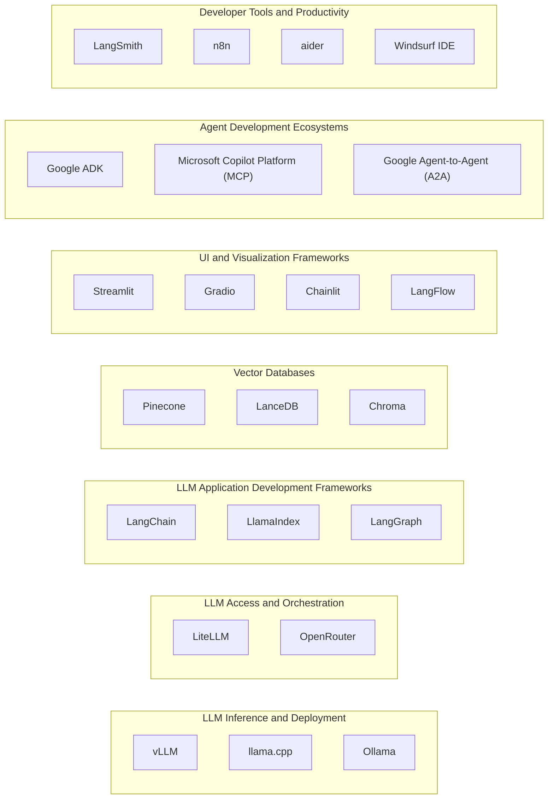

- 

```mermaid
graph LR
    subgraph A["LLM Inference and Deployment"]
        vLLM["vLLM"]
        llama_cpp["llama.cpp"]
        Ollama["Ollama"]
    end

    subgraph LLM Access and Orchestration
        LiteLLM["LiteLLM"]
        OpenRouter["OpenRouter"]
    end

    subgraph LLM Application Development Frameworks
        LangChain["LangChain"]
        LlamaIndex["LlamaIndex"]
        LangGraph["LangGraph"]
    end

    subgraph Vector Databases
        Pinecone["Pinecone"]
        LanceDB["LanceDB"]
        Chroma["Chroma"]
    end

    subgraph UI and Visualization Frameworks
        Streamlit["Streamlit"]
        Gradio["Gradio"]
        Chainlit["Chainlit"]
        LangFlow["LangFlow"]
    end

    subgraph Agent Development Ecosystems
        Google_ADK["Google ADK"]
        MCP["Microsoft Copilot Platform (MCP)"]
        Google_A2A["Google Agent-to-Agent (A2A)"]
    end

    subgraph Developer Tools and Productivity
        LangSmith["LangSmith"]
        n8n["n8n"]
        aider["aider"]
        Windsurf_IDE["Windsurf IDE"]
    end
```