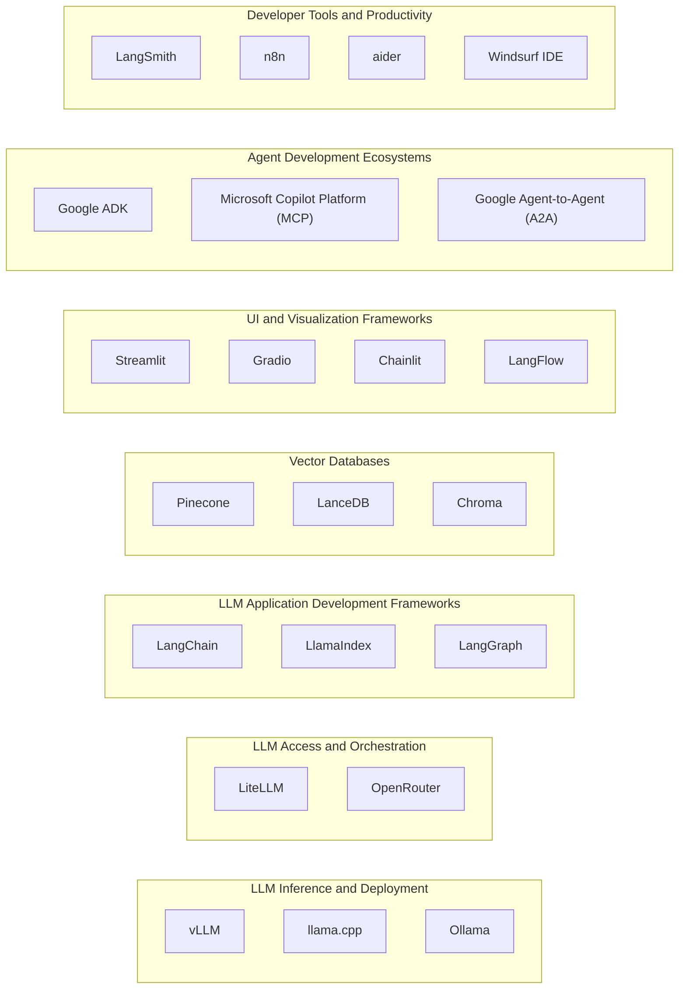

# LLM Technology Landscape

## 2025-04-13

- 

- 2025-04-13 12:13 PM
- https://g.co/gemini/share/5f13f897b845
<table><tr><td>Q:</td><td>
<!-- add your Prompt bellow-->
how to segment the following technologies: vLLM, LiteLLM, OpenRouter, Ollama, llama.cpp, LangChain, LlamaIndex, LangFlow, n8n, LangGraph, LangSmith, Pinecone, Chroma, Streamlit, Gradio, Chainlit, Google ADK, MCP, Google A2A, aider, windsurf.com?
</td></tr><tr><td>A:</td><td>
<!-- add Chatbot Response bellow-->
Okay, let's segment this final, *final* list, incorporating `windsurf.com`. Given that it's a website domain, it's highly unlikely to be a direct peer to the other software technologies in the context of LLM development. It most likely represents an external resource or a potential application area.

Here's the segmentation, with `windsurf.com` placed in a separate "External Resources/Applications" category:

**1. LLM Inference & Serving:** Technologies focused on running and serving large language models efficiently.

* **vLLM:** High-throughput and efficient **inference engine**, optimized for serving LLMs in production with a focus on speed and resource utilization.
* **Ollama:** User-friendly tool for **local execution and management of open-source LLMs**. Simplifies running models on personal hardware.
* **llama.cpp:** Low-level **inference library** written in C++, highly optimized for running LLMs on CPUs and resource-constrained environments. Often the backend for other tools.

**2. LLM API Aggregation & Abstraction:** Tools providing a unified way to interact with various LLM providers.

* **LiteLLM:** Offers a **consistent API interface** across different LLM providers (OpenAI, Anthropic, Google, etc.), simplifying model switching and multi-provider setups.
* **OpenRouter:** Acts as an **API aggregator and router**, providing access to a wide selection of models through a single endpoint, often optimizing for cost and latency.

**3. LLM Application Development Frameworks & Ecosystem:** Tools offering higher-level abstractions for building LLM-powered applications.

* **LangChain:** A comprehensive framework for **building complex LLM applications**, offering modules for data connection, prompt management, chains, agents, memory, and more.
* **LlamaIndex:** Specifically focused on **connecting LLMs with external data**. Excels at indexing, querying, and integrating knowledge from various sources (Retrieval-Augmented Generation - RAG), often using vector databases.
* **LangGraph:** A framework built on top of LangChain for **creating conversational agents as state machines**, enabling more structured and complex agent interactions.
* **LangFlow:** A **visual, no-code/low-code UI** for building LangChain applications, allowing users to create LLM flows and agents through a drag-and-drop interface.
* **Google ADK (Assuming Google AI Development Kit):** This would likely encompass a **suite of tools and libraries from Google** aimed at building AI applications, potentially including LLM integration, data handling, and deployment utilities. It might overlap with some functionalities of LangChain but be more tightly integrated with Google's AI services.
* **Google A2A (Assuming Google Agents as APIs):** This represents a paradigm shift towards deploying **AI agents as callable APIs**. While not a framework in the same vein as LangChain, it's a way of structuring and accessing complex LLM-powered functionalities. It might be built using underlying frameworks and could be integrated into other applications.

**4. Workflow Automation with LLM Integration:** Platforms enabling the integration of LLMs into broader automation workflows.

* **n8n:** A general-purpose **workflow automation platform** with nodes that can interact with LLMs (via APIs or integrations with frameworks like LangChain) and other tools.

**5. Observability & Evaluation:** Tools focused on monitoring and improving LLM applications.

* **LangSmith:** A platform built by the creators of LangChain for **debugging, testing, evaluating, and monitoring LLM applications**, providing insights into performance and allowing for systematic improvement.

**6. Vector Databases:** Specialized databases for storing and efficiently searching vector embeddings, crucial for semantic search and RAG.

* **Pinecone:** A **managed, cloud-native vector database** known for its speed and scalability, often used for production RAG applications.
* **Chroma:** An **open-source, in-memory embedding database** that is easy to get started with and integrates well with LangChain and LlamaIndex, suitable for development and smaller-scale deployments.

**7. User Interface (UI) & Interaction Frameworks:** Libraries for creating interactive interfaces or enhancing developer interaction with LLMs.

* **Streamlit:** An **open-source Python library** for easily creating interactive web apps for data science and machine learning, including LLM applications.
* **Gradio:** An **open-source Python library** specifically designed for quickly creating interactive interfaces for machine learning models, including LLMs.
* **Chainlit:** An **open-source Python framework** specifically built for creating conversational AI applications with a focus on features like streaming and user feedback.
* **aider:** A command-line tool for **AI-assisted pair programming**, allowing LLMs to help with code editing and potentially understanding code context.

**8. Model Management & Control Plane:** Tools and concepts related to the deployment, monitoring, and governance of AI models.

* **MCP (Assuming Model Control Plane):** This isn't a specific technology in the same way as the others, but rather a **conceptual layer or set of tools** for managing the lifecycle of AI models. It would likely involve model versioning, deployment strategies, monitoring, and potentially security and compliance. Google ADK and the infrastructure supporting Google A2A would likely incorporate elements of a Model Control Plane.

**9. External Resources/Applications (Likely unrelated to the core software stack):**

* **windsurf.com:** This is a **website domain** and likely represents information, products, or a community related to the sport of windsurfing. It doesn't fit into the software technology categories for LLM development. It might be a potential application area where LLMs could be used (e.g., for generating content about windsurfing, building a chatbot for enthusiasts), but it's not a core technology itself.

**Visual Segmentation (The Final, Final, Final Chapter):**

```
+-----------------------------------------------------+
| 4. Workflow Automation with LLM Integration         |
|    (n8n)                                           |
+-----------------------------------------------------+
| 3. LLM Application Development Frameworks & Ecosystem |
|    (LangChain, LlamaIndex, LangGraph, LangFlow,     |
|     Google ADK, Google A2A)                         |
+-----------------------------------------------------+
| 7. User Interface (UI) & Interaction Frameworks      |
|    (Streamlit, Gradio, Chainlit, aider)              |
+-----------------------------------------------------+
| 8. Model Management & Control Plane               |
|    (MCP - Conceptual, potentially part of Google ADK  |
|     and infrastructure for Google A2A)             |
+-----------------------------------------------------+
| 5. Observability & Evaluation                     |
|    (LangSmith)                                      |
+-----------------------------------------------------+
| 6. Vector Databases                               |
|    (Pinecone, Chroma)                              |
+-----------------------------------------------------+
| 2. LLM API Aggregation & Abstraction              |
|    (LiteLLM, OpenRouter)                           |
+-----------------------------------------------------+
| 1. LLM Inference & Serving                        |
|    (vLLM, Ollama, llama.cpp)                       |
+-----------------------------------------------------+
| 9. External Resources/Applications                |
|    (windsurf.com)                                  |
+-----------------------------------------------------+
```

This should be the definitive segmentation! It accounts for all the listed technologies, placing `windsurf.com` in its appropriate context as an external entity rather than a core LLM development tool. Enjoy your continued Sunday afternoon in Guanxi Township!
</td></tr></table>