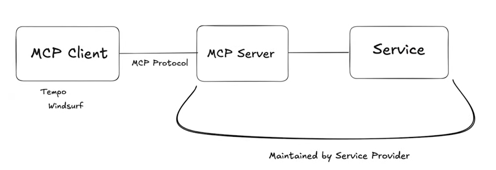

# Model Context Protocol (MCP)

- https://modelcontextprotocol.io/introduction

## 2025-03-15

### MCP 跟 aider 整合 -- `mcpm-aider`

- ( 2025-03-15 21:05:49 )
- 想法： `aider` 目前並沒有支援可以呼叫外部工具的作法，像是可否請 `aider` 的 `/ask` 模式做 web search 並彙整到 Markdown
- 搜尋：找到一個 YouTube 影片 [Use MCP Servers and Tools in Aider](https://www.youtube.com/watch?v=OM1h4YDPjRU) 提到他寫了一個工具，可以讓 `aider` 知道有 MCP Tool
  - 相關 Aider Github issues
    - https://github.com/Aider-AI/aider/issues/2525
    - https://github.com/Aider-AI/aider/issues/3314

### 初步理解 MCP 是什麼

- ( 2025-03-15 22:44:05 )
- 2025-03-15: [Model Context Protocol (MCP), clearly explained (why it matters)](https://www.youtube.com/watch?v=7j_NE6Pjv-E)

Key Points: 要點：

- MCP (Model ContextProtocol) is a standard that creates a unified layer between LLMs and external services/tools - LLMs by themselves are limited to text prediction and cannot perform meaningful tasks without tools - MCP solves the problem of connecting multiple tools to LLMs by creating a standardized communication protocol - The MCP ecosystem consists of clients (like Tempo, Windsurf, Cursor), the protocol, servers, and services

> - MCP（模型上下文協定）是一種在模型和外部服務/工具之間創建統一層的標準 - LLMs 本身僅限於文字預測，如果沒有工具則無法執行有意義的任務 - MCP 透過建立標準化通訊協定解決了將多個工具連接到 LLMs 的問題 - MCP 生態系統由客戶端（如 Tempo、Windsurf、Cursor）、協定、伺服器和服務組成

1) What are MCPs and why should you care?

> 1）什麼是 MCP？

MCPs are NOT some complex physics theory - they're simply STANDARDS that help LLMs connect to external tools and services.

> MCP 不是某種複雜的物理理論 - 它們只是幫助連接外部工具和服務的標準。

Think of them as universal translators between AI models and the tools they need to be truly useful.

> 可以將它們視為人工智慧模型與真正有用所需工具之間的通用轉換器。

This is HUGE for making AI assistants actually capable!

> 這對於讓人工智慧助理真正發揮其能力具有重大意義！

2) The Evolution of LLMs: From Text Prediction to Tool Use

> 2）LLMs的演變：從文字預測到工具使用

Stage 1: Basic LLMs can only predict text - Ask ChatGPT to send an email? "Sorry, I can't do that" - They're glorified text predictors (if I say "My big fat Greek..." it knows "wedding" comes next) - Limited to answering questions, not DOING things

> 第 1 階段：基本LLMs只能預測文本 - 要求 ChatGPT 發送電子郵件？ "抱歉，我做不到" - 它們是經過美化的文字預測器（如果我說「我的大胖子希臘...」它知道接下來是「婚禮」） - 僅限於回答問題，而非做事

3) The Current State: LLMs + Tools

> 3) 目前狀態：LLMs + 工具

Stage 2: LLMs connected to tools - Companies like Perplexity connect LLMs to search engines - This makes them more useful but creates problems - Each tool = different "language" the LLM must learn - Connecting multiple tools = engineering NIGHTMARE

> 第 2 階段：LLMs連接到工具 - Perplexity 等公司與搜尋引擎建立聯繫 - 這使得它們更有用，但也帶來了問題 - 每種工具 = 必須學習的不同"語言" - 連結多種工具 = 工程噩夢

This is why we don't have Jarvis-level assistants yet!

> 這就是我們還沒有賈維斯級助手的原因！


4) Enter MCPs: The Game-Changer

> 4）進入 MCP：遊戲規則改變者

MCPs create a UNIFIED LAYER between LLMs and external services.

> MCP 在與外部服務之間建立一個統一層。

Instead of your AI speaking 10 different "languages" to use 10 different tools, MCPs translate everything into ONE language.

> 您的 AI 不會說 10 種不同的「語言」來使用 10 種不同的工具，而是 MCP 將所有內容翻譯成一種語言。

Result? LLMs can easily access databases, APIs, and services without massive engineering headaches.

> 結果？可以輕鬆存取資料庫、API 和服務，而無需大量的工程麻煩。


5) The MCP Ecosystem Explained

> 5）MCP 生態系解析

The MCP system has 4 key components:

> MCP 系統有 4 個關鍵組件：

- MCP Client: User-facing apps like @tempoai, Windsurf, Cursor - Protocol: The standardized communication method - MCP Server: Translates between client and services - Service: The actual tool (database, search engine, etc.)

> - MCP 用戶端：面向使用者的應用程序，例如@tempoai、Windsurf、Cursor - 協定：標準化的通訊方法 - MCP 伺服器：在客戶端和服務之間進行轉換 - 服務：實際工具（資料庫、搜尋引擎等）

Brilliant move by Anthropic: SERVICES must build MCP servers!

> Anthropic 的妙招：SERVICES 必須建置 MCP 伺服器！



6) Why This Matters For Builders

> 6）為什麼這對開發者很重要

For technical folks: - Opportunity to build tools like MCP app stores - Easier integration between services - Less engineering headaches

> 對於技術人員： - 有機會建立 MCP 應用商店等工具 - 服務之間更容易集成 - 減少工程難題

For non-technical folks: - Watch closely as standards evolve - When standards finalize, new business opportunities will emerge - Think of MCPs as Lego pieces you'll stack to build powerful AI apps

> 對於非技術人員： - 密切關注標準的發展 - 標準最終確定後，將會出現新的商機 - 將 MCP 視為樂高積木，你可以將其堆疊起來以構建強大的 AI 應用程式

## 2025-04-02

- What is MCP? (Model Context Protocol) - A Primer
  - https://www.whatismcp.com/

## 2025-04-04

### Playwright MCP

- 從 David Chiu 的貼文看到新的 Microsoft Playwright MCP
  - https://www.linkedin.com/feed/update/urn:li:activity:7312033815755902976/
- 用 Claude Desktop 展示怎麼用 https://www.largitdata.com/course/252/
- Playwright MCP server
  - https://github.com/microsoft/playwright-mcp
- 看了一下影片，感覺還是有點模糊，畢竟我沒有訂閱 Claude 也沒有用 Claude Desktop
- 不過 MCP Client 可以是 VS Code 的 `Cline`，也可以是 `aider` 搭配 `mcpm-aider`
- 從 https://github.com/microsoft/playwright-mcp 的 README 看到 `code --add-mcp` 2k7
```bash
jazzw@JazzBook:~/git/snippet/js/chrome-devtools$ code --help
Visual Studio Code 1.99.0

Usage: code.exe [options][paths...]

To read output from another program, append '-' (e.g. 'echo Hello World | code.exe -')

Options
  -h --help                                  Print usage.
  --add-mcp <json>                           Adds a Model Context Protocol
                                             server definition to the user
                                             profile, or workspace or folder
                                             when used with --mcp-workspace.
                                             Accepts JSON input in the form
                                             '{"name":"server-name","command":...}
                                             '
```

## 2025-04-05

- ( 2025-04-05 18:24:59 )
- 剛好筆電也有用 `pnpm` 裝好 `npx`，那就來跑跑看怎麼用 VS Code 裝 `Playwright MCP server`
```bash
jazzw@JazzBook:~/git/snippet$ code --add-mcp '{"name":"playwright","command":"npx","args":["@playwright/mcp@latest"]}'
Added MCP servers: playwright
(node:11676) [DEP0168] DeprecationWarning: Uncaught N-API callback exception detected, please run node with option --force-node-api-uncaught-exceptions-policy=true to handle those exceptions properly.
(Use `Code --trace-deprecation ...` to show where the warning was created)
```
- 看起來這個 `code --add-mcp` 指令只能幫 `Github Copilot` 加 MCP Server
- ( 2025-04-05 18:33:57 )
- 試試看 `mcpm-aider` 的作法，首先參考 Playwright MCP Server 的 README 在 `~/AppData/Roaming/claude/claude_desktop_config.json` 加入 playwright MCP Server 的 JSON
```bash
jazzw@JazzBook:~$ cat ~/AppData/Roaming/claude/claude_desktop_config.json
{
  "mcpServers": {
    "mcpm": {
      "command": "mcpm",
      "args": [
        "mcp"
      ]
    },
    "playwright": {
      "command": "npx",
      "args": [
        "@playwright/mcp@latest"
      ]
    }
  }
}
```
- 確認 `mcpm-aider` 可以看到
```bash
jazzw@JazzBook:~/git/snippet$ mcpm-aider mcp &
[1] 2235
MCPM MCP Server running on stdio
```
```bash
jazzw@JazzBook:~$ mcpm-aider list
Your MCP Servers:

mcpm
  ✓ Enabled
  Command: mcpm
  Args: mcp
  Source: self

playwright
  ✓ Enabled
  Command: npx
  Args: @playwright/mcp@latest
  Source: local
```
- 實驗  
```bash
jazzw@JazzBook:~$ mcpm-aider toolprompt

# Available Tools

When this prompt is loaded, always say to the user EXACTLY THIS:
"I am aware of MCP Tools!"

## *Usage*
If you decide to call a function of a tool, please execute this bash command.
**Do not include unescaped ' or line breaks in <parameters as jsonstring>, because it is passed as a cli argument oneliner!**

```bash
mcpm-aider call <tool> <function> '<parameters as jsonstring>'
```
## *Example*
```bash
mcpm-aider call @calclavia/mcp-obsidian read_notes '{"paths": ["path/to/notes"]}'
```
## tool: mcpm

**ERROR**: spawn mcpm ENOENT

---
## tool: playwright

**ERROR**: spawn npx ENOENT
```
- 查了一下 `ENOENT` 的主因是找不到執行檔
```
Ah, that `ENOENT` error with `npx` usually means Node.js can't find the executable. It's like trying to call someone but their number's not in your contacts!
```
- 所以先試試用 `pnpm` 安裝 `@playwright/mcp` 跟 `@mcpm/cli`
```
jazzw@JazzBook:~$ pnpm install -g @playwright/mcp
jazzw@JazzBook:~$ pnpm install -g @mcpm/cli
```
- 雖然還搞不清楚 `pnpm` 跟 `npx`/`npm` 安裝的結果會差多少，不過實測了一下 `npx @playwright/mcp`，看起來會跑一個 background process 等在那邊，應該就是啟動了 MCP Server
```
jazzw@JazzBook:~$ npx @playwright/mcp
```
- 猜想 `pnpm` 跟 `uv` 有點類似的定位。看樣子可以用 `pnpm ls` 查安裝路徑。
```bash
jazzw@JazzBook:~$ pnpm -g ls
Legend: production dependency, optional only, dev only

C:\Users\jazzw\AppData\Local\pnpm\global\5

dependencies:
@mcpm/cli 1.6.2
@playwright/mcp 0.0.9
@pnp/cli-microsoft365 10.4.0
@poai/mcpm-aider 1.0.4
commander 13.1.0
subsrt 1.1.1
vtt-json 1.0.1
webvtt 0.0.2
jazzw@JazzBook:~$ npm -g ls
C:\Users\jazzw\scoop\persist\nodejs-lts\bin
└── (empty)
```