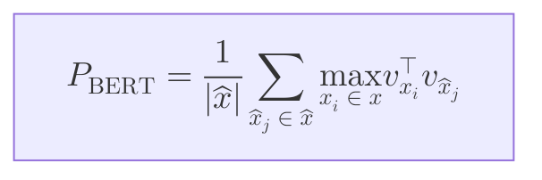
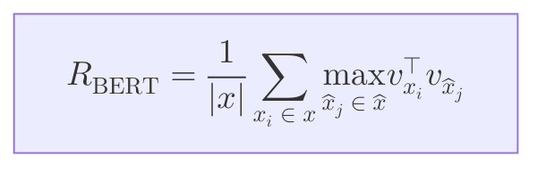
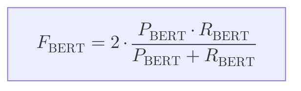
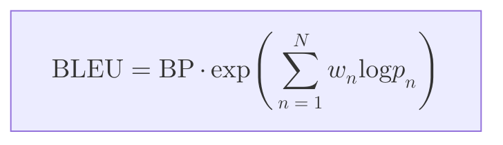

<table><tr style="background-color:lightgreen;"><td>Tool:</td><td>
Google Search - AI Mode
</td></tr><tr style="background-color:lightyellow;"><td>Q:</td><td>
What is BERTscore?
</td></tr><tr><td>A:</td><td>

BERTScore 是在 AI/ML（特別是自然語言處理 NLP 與大型語言模型 LLM）領域中，用來評估「文字生成品質」的一種現代化語義相似度指標。 [1, 2] 
與 FID 用於評估「影像」不同，BERTScore 專門用於評估「文字」（如機器翻譯、文本摘要、RAG 問答系統及對話生成）。它不再依賴字面上的死板匹配，而是比較文字背後的「語義」。 [1, 2, 3, 4] 

## 1. 為什麼需要 BERTScore？（對比傳統指標）

在傳統 NLP 中，我們常用 BLEU 或 ROUGE 來評估生成文字與標準答案（Reference）的接近程度： [1, 4] 

* 傳統指標的缺點：只看字面上的單字重疊（n-gram Overlap）。 [1, 5] 
* 例子：
* 標準答案："這隻貓在墊子上休息"
   * 模型生成："那隻小貓在毯子上睡眠"
   * 如果用 BLEU 或 ROUGE，因為「貓/小貓」、「墊子/毯子」、「休息/睡眠」字面不同，分數會非常低。 [4, 6] 
* BERTScore 的優勢：它能夠辨識出這兩句話的意思幾乎一樣，並給出極高的語義相似度分數。 [1, 4] 

## 2. BERTScore 的運作原理

BERTScore 利用了預訓練 Transformer 模型（如 BERT、RoBERTa）所產生的上下文特徵向量（Contextual Embeddings）： [1, 7] 

   1. 向量化（Embedding）：將「標準答案（Reference）」和「模型生成文字（Candidate）」的每個單字（Token），各自轉換為包含上下文語義的高維度向量。 [3, 7] 
   2. 計算相似度矩陣：計算標準答案中的每一個字，與生成文字中的每一個字之間的 餘弦相似度（Cosine Similarity），組合成一個矩陣。 [7, 8] 
   3. 貪婪匹配（Greedy Matching）：
   * 對於生成文字的每個字，去標準答案中找一個**最相似（分數最高）**的字配對。
      * 反之，對於標準答案的每個字，也去生成文字中找最相似的字配對。 [8] 
   4. 輸出三大指標：最後整合計算出 Precision（精準率）、Recall（召回率） 和 F1-Score。 [2, 7] 

## 3. 數學核心公式

給定標準答案句子 x（長度為 |x|）與模型生成句子 x̂（長度為 |x̂|），兩者單字向量分別為 $v_x$ 與 $v_{\hat{x}}$，其指標計算如下： [8] 

## 精準率 (Precision)

評估生成的內容有多少是正確的（以生成句子為基準）：

## 召回率 (Recall)

評估標準答案有多少內容被成功生成（以標準答案為基準）：

## F1 分數 (F1-Score)

綜合上述兩者的調和平均數（最常作為最終的評估指標）：

(註：實務上公式通常還會加入逆文本頻率變換 IDF 進行加權，並對分數進行縮放 Scaling 以便於閱讀)

## 4. 優缺點評估

| 優點 (Pros) | 缺點 (Cons) |
|---|---|
| 高度符合人類直覺：評分趨勢與人類專家的評審結果高度相關。 | 計算成本高：需要執行深度學習模型（BERT），速度比 BLEU 慢上百倍。 |
| 容忍同義詞與換照改寫：對換句話說（Paraphrase）的文字非常友善。 | 依賴預訓練模型：若使用的預訓練模型本身有偏見或不擅長某特定領域，會影響準確度。 |
| 捕捉語境：能分辨同字不同義（如「蘋果」手機 vs 水果「蘋果」）。 | 對極長文本不友善：受限於 BERT 的 Token 長度限制（通常為 512）。 |

## ✅ 總結

BERTScore 是一種基於深度學習特徵向量（Embedding-based）的文字語義相似度指標。它突破了傳統字面比對的限制，是現代 LLM 時代（如評估 GPT-4、Claude、RAG 檢索系統品質）非常重要且通用的自動化評測工具。 [2, 3, 5] 
如果您想知道如何在 Python 中使用 pip install bert-score 來快速實作評估，或者想了解它在 RAG（檢索增強生成） 中的具體應用，歡迎隨時詢問！

- [1] [https://galileo.ai](https://galileo.ai/blog/bert-score-explained-guide)
- [2] [https://www.youtube.com](https://www.youtube.com/watch?v=7AVjk2k8Mbs&t=3)
- [3] [https://medium.com](https://medium.com/@dewasheesh.rana/bertscore-vs-bleu-the-ultimate-guide-layman-pro-2025-edition-8dbdffc6143d)
- [4] [https://www.youtube.com](https://www.youtube.com/watch?v=R5mH8jMr0k0)
- [5] [https://milvus.io](https://milvus.io/ai-quick-reference/what-is-bertscore-or-other-embeddingbased-metrics-and-can-they-be-helpful-in-evaluating-the-similarity-between-a-generated-answer-and-a-reference-answer-or-source-text)
- [6] [https://www.youtube.com](https://www.youtube.com/watch?v=RTaZqGflrJ8&vl=en&t=215)
- [7] [https://zhanghaolin66.medium.com](https://zhanghaolin66.medium.com/bertscore-explained-embeddings-and-semantic-evaluation-b0d80b9de8d5)
- [8] [https://www.youtube.com](https://www.youtube.com/watch?v=-MjMjVJlSpI&t=2)
<tr style="background-color:lightyellow;"><td>Q:</td><td>
BLEU
</td></tr><tr><td>A:</td><td>
BLEU（Bilingual Evaluation Understudy，雙語評估輔助工具）是 AI/ML（特別是自然語言處理 NLP）領域中，最經典、最普及的自動文本評估指標。
它最初在 2002 年由 IBM 團隊提出，主要用於**機器翻譯（Machine Translation）**的品質評估，後來也被廣泛應用於影像描述生成（Image Captioning）等任務。

## 1. 核心核心概念：字面重疊度

BLEU 的核心思想非常簡單直接：「如果機器翻譯出來的句子，與人類翻譯的標準答案（Reference）重疊的單字或片語越多，代表品質越好。」

* 評分範圍：介於 0 到 1 之間（或寫成 0% 到 100%）。
* 分數解讀：分數越高越好。通常達到 0.4 (40%) 以上就被認為是高品質的翻譯。
* 計算基礎：基於 n-gram（多元組） 的精準率（Precision）。

## 2. BLEU 的兩大核心機制

為了防止模型「作弊」，BLEU 的計算包含兩個關鍵機制：

## ① 修改後的 n-gram 精準率（Modified n-gram Precision）

如果只看單字出現次數，模型只要重複列印同一個正確的字就能拿滿分（例如標準答案是 "The cat is on the mat"，模型生成 "the the the the the"，傳統精準率會是 100%）。

* 修正方法：一個單字在生成句子中被計入的次數，不能超過它在任意一組標準答案中出現的最大次數。在上例中，"the" 只能被算 2 次，分數便會大幅修正。
* 多字匹配：除了單個字（1-gram），BLEU 通常會同時計算連續 2 個字（2-gram）、3 個字（3-gram）和 4 個字（4-gram）的重疊度，並取幾何平均數。這用來評估句子的流暢度與語法正確性。

## ② 短句懲罰因子（Brevity Penalty, BP）

如果模型只生成極短的句子（例如只翻譯出一個非常有把握的單字 "The"），它的精準率會高達 100%，但這不是一個好翻譯。

* 修正方法：當模型生成的句子長度，短於標準答案的長度時，BLEU 會乘上一個小於 1 的懲罰係數（BP），直接扣分。

## 3. 數學公式簡化版

BLEU 的最終計算公式為：

* $p_n$：第 n-gram 的修改後精準率。
* $w_n$：權重，通常預設 N=4，且每個 $w_n = 0.25$（即均勻分配給 1-gram 到 4-gram），這也常被稱為 BLEU-4。
* BP：短句懲罰因子（當生成長度 ≥ 標準長度時，BP=1；反之則 BP < 1）。

## 4. 終極對比：BLEU vs BERTScore

既然前面提到了 BERTScore，這兩者在現代 AI 評估中形成了強烈對比：

| 特性 | BLEU (傳統指標) | BERTScore (現代指標) |
|---|---|---|
| 比對方式 | 字面精準匹配（字要一模一樣） | 語義向量匹配（換句話說也能辨識） |
| 計算速度 | 極快（純字串比對，幾毫秒完成） | 慢（需要載入深度學習模型運算） |
| 對同義詞 | ❌ 無法識別（"貓" 與 "小貓" 會被扣分） | 能夠識別，並給予高分 |
| 資源需求 | ❌ 零，不需要任何 GPU 或預訓練權重 | 高，需要依賴 BERT 類型的 LLM |

## ✅ 總結

BLEU 是一個基於字面 n-gram 精準率與短句懲罰的快速評估指標。雖然它無法理解語義，且對同義詞、換句話說的表達非常不友善，但因為它計算速度極快、結果客觀、不需依賴大型模型，至今依然是機器翻譯與文本生成領域不可或缺的基準（Baseline）指標。
如果您想了解如何使用 Python nltk 庫在 3 行程式碼內計算 BLEU，或者想知道它在特定任務（如程式碼生成 Code Generation）上的變體 CodeBLEU，歡迎隨時告訴我！

</td></tr>
<tr style="background-color:lightyellow;"><td>Q:</td><td>
ROUGE
</td></tr><tr><td>A:</td><td>

ROUGE（Recall-Oriented Understudy for Gisting Evaluation，面向召回率的摘要評估輔助工具）是 AI/ML 領域中，最常用於評估 **自動文本摘要（Text Summarization）與問答系統（QA）** 的經典自動化指標。 [1, 2, 3] 
它在 2004 年被提出，核心邏輯與 BLEU 非常相似，但有一個最大的核心差異：BLEU 偏重「精準率（Precision）」[1]，而 ROUGE 偏重「召回率（Recall）」。

## 1. 核心核心概念：它想捕捉什麼？

* BLEU（精準率）問的是：「機器生成的字，有多少比例是正確的？」
* ROUGE（召回率）問的是：「標準答案（Reference）裡的重點，機器成功捕捉到了多少？」 [4, 5] 

在文本摘要任務中，我們最怕模型遺漏關鍵資訊，因此「標準答案裡的字有沒有被涵蓋進去（召回率）」變得至關重要。

## 2. 常見的 ROUGE 變體

ROUGE 並不是單一指標，而是一組指標家族，最常在機器學習論文中看到的有以下三種： [6, 7, 8] 

## ① ROUGE-N（基於 n-gram）

計算機器生成文本與標準答案之間，連續 n 個字的重疊比例。

* ROUGE-1：評估**單字（1-gram）**的重疊度，主要看「核心單字」有沒有抓到。
* ROUGE-2：評估**連續兩個字（2-gram）**的重疊度，主要看「片語和流暢度」好不好。 [9] 

## ② ROUGE-L（基於最長公共子序列 Longest Common Subsequence） [10] 

找出兩句話中最長且順序相同的共同子序列（不需要連續）。

* 優點：它會自動辨識句子結構的相似度。如果最長公共子序列越長，代表兩句話的語法結構和敘述順序越接近。

## ③ ROUGE-S（基於跳字組合 Skip-Bigram） [11, 12] 
計算任意兩個字組成的字對（Bigram）在兩句話中出現的頻率，這兩個字之間可以插入其他字。 [13] 

* 例如：在 "貓 坐在 墊子上" 中，("貓", "墊子上") 也是一個有效的 Skip-Bigram。這允許句子在加入形容詞時依然能被偵測到關聯。

## 3. 舉個例子：如何計算 ROUGE-1？

假設：

* 標準答案 (Reference)："人工智慧 改變 世界"（共 3 個詞）
* 模型生成 (Candidate)："人工智慧 正在 改變 我們的 世界"（共 5 個詞）

我們來計算 ROUGE-1 的三種分數：

   1. Recall（召回率） = 重疊詞數 / 標準答案總詞數 = 3 / 3 = 1.0（標準答案的重點全部抓到了！）
   2. Precision（精準率） = 重疊詞數 / 生成文本總詞數 = 3 / 5 = 0.6（生成文本混入了其他贅字）
   3. F1-Score（綜合分數） = 2 * (P * R) / (P + R) = 2 * 0.6 / 1.6 = 0.75

(註：雖然 ROUGE 名稱叫 Recall-Oriented，但現代機器學習評測中，大家通常都直接看兩者結合的 F1-Score) [14, 15] 

## 4. 四大指標終極大考驗 (FID vs BERTScore vs BLEU vs ROUGE)

至此，我們已經聊完了 AI 領域最著名的四大模型評估指標，它們的定位非常清晰：

| 指標名稱 | 評估領域 | 核心本質 | 評估核心 |
|---|---|---|---|
| FID | 🖼️ 影像生成 | 特徵空間的高斯分佈距離 | 圖片的逼真度與多樣性 |
| BERTScore | ✍️ 文字生成 | LLM 語義向量相似度 | 換句話說、同義詞的深層語義 |
| BLEU | 🌐 機器翻譯 | 字面 n-gram 精準率 (Precision) [1] | 翻譯是否精準、有無講廢話 |
| ROUGE | 📝 文本摘要 | 字面 n-gram 召回率 (Recall) | 摘要是否完整、有無漏掉重點 |

## ✅ 總結

ROUGE 是一個以召回率為核心、基於字面重疊度的文本評估工具。它與 BLEU 是一對孿生兄弟，一個看守摘要的「完整性」（ROUGE），一個把關翻譯的「精準度」（BLEU）。 [16, 17] 
如果您想了解如何使用 Python 官方套件 rouge-score 來跑實驗，或者想知道更先進的 LLM 評估框架（如 Ragas 或 LLM-as-a-judge），請隨時告訴我！

- [1] [https://wandb.ai](https://wandb.ai/byyoung3/Generative-AI/reports/AI-scorers-Evaluating-AI-generated-text-with-ROUGE--VmlldzoxMDc0Mzc5OA)
- [2] [https://metricgate.com](https://metricgate.com/docs/rouge-score/)
- [3] [https://www.shedge.com](https://www.shedge.com/metrics/rouge-score/)
- [4] [https://medium.com](https://medium.com/@adnanmasood/recall-oriented-understudy-for-gisting-evaluation-rouge-the-unseen-metric-that-rules-ai-57efd9c287ae)
- [5] [https://www.flowhunt.io](https://www.flowhunt.io/glossary/rouge-score/)
- [6] [https://medium.com](https://medium.com/@adnanmasood/recall-oriented-understudy-for-gisting-evaluation-rouge-the-unseen-metric-that-rules-ai-57efd9c287ae)
- [7] [https://medium.com](https://medium.com/@priyankads/rouge-your-nlp-results-b2feba61053a)
- [8] [https://www.sciencedirect.com](https://www.sciencedirect.com/science/article/pii/S1877750325000481)
- [9] [https://www.linkedin.com](https://www.linkedin.com/pulse/rouge-evaluation-large-language-models-part-3a-akash-gautam-pfl9c)
- [10] [https://docs.pytorch.org](https://docs.pytorch.org/ignite/generated/ignite.metrics.RougeL.html)
- [11] [https://towardsdatascience.com](https://towardsdatascience.com/introduction-to-text-summarization-with-rouge-scores-84140c64b471/)
- [12] [https://medium.com](https://medium.com/@sthanikamsanthosh1994/understanding-bleu-and-rouge-score-for-nlp-evaluation-1ab334ecadcb)
- [13] [https://medium.com](https://medium.com/@sthanikamsanthosh1994/understanding-bleu-and-rouge-score-for-nlp-evaluation-1ab334ecadcb)
- [14] [https://www.educative.io](https://www.educative.io/answers/what-is-rouge-score)
- [15] [https://deepchecks.com](https://deepchecks.com/glossary/recall-oriented-understudy-for-gisting-evaluation-rouge/)
- [16] [https://medium.com](https://medium.com/@prabhatzade/rouge-score-a-complete-tutorial-for-evaluating-text-summarization-models-a3a146417118)
- [17] [https://fastgpt.io](https://fastgpt.io/en/faq/What-are-the-differences-between)

</td></tr>
</table>