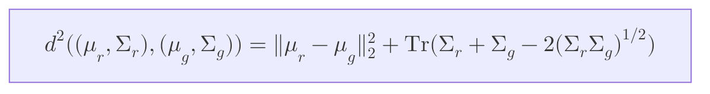

<table><tr style="background-color:lightgreen;"><td>Tool:</td><td>
Google Search - AI Mode
</td></tr><tr style="background-color:lightyellow;"><td>Q:</td><td>
FID 在 AI/ML 領域是什麼 distance?
</td></tr><tr><td>A:</td><td>
在 AI/ML（人工智慧與機器學習）領域中，FID 指的是 Fréchet Inception Distance（弗雷歇開端距離）。
它是一種用來評估生成模型（特別是 GANs 和擴散模型等圖像生成 AI）品質的核心指標。FID 分數越低，代表生成出來的圖片越逼真、越接近真實世界的水準。

## FID 的核心運作原理

FID 並不是直接去比對兩張圖片的像素，而是透過以下步驟來計算真實圖片集與生成圖片集之間的距離：

   1. 特徵提取：將真實圖片與生成圖片分別輸入進一個預訓練好的 Inception-v3 影像分類網路。
   2. 擷取高維特徵：拿掉網路最後的分類層，取出倒數第二層的特徵向量（通常是 2048 維），這些向量代表了圖片的抽象語義特徵（如紋理、結構、物件等）。
   3. 統計分佈建模：假設真實圖片特徵和生成圖片特徵各自符合一個多元高斯分佈（Multivariate Gaussian Distribution），並計算出各自的平均值向量（$\mu_r, \mu_g$）與共變異數矩陣（$\Sigma_r, \Sigma_g$）。
   4. 計算 Fréchet 距離：利用數學公式計算這兩個高斯分佈之間的 Fréchet 距離。

## 數學公式

在數學上，FID 的計算公式如下：

* $\mu_r, \mu_g$：真實與生成圖片特徵的平均值。
* $\Sigma_r, \Sigma_g$：真實與生成圖片特徵的共變異數矩陣。
* $\text{Tr}$：矩陣的跡（Trace，即主對角線元素之和）。

## 為什麼 FID 這麼重要？

* 比傳統指標更準確：傳統的 MSE 或 PSNR 只能做像素對像素的對比，無法衡量視覺上的「合理性」。FID 則能捕捉更高級的視覺特徵。
* 符合人類視覺感知：FID 的評分結果與人類肉眼判斷圖片好壞的趨勢高度一致。
* 能辨識「模式崩潰」：如果生成模型只會重複生成某幾種好看的圖片（Mode Collapse），FID 分數依然會因為「多樣性不足」而變高（變差）。

## ✅ 總結

FID 在 AI 領域代表 Fréchet Inception Distance。它透過比較真實圖片與生成圖片在 Inception 網路特徵空間中的高斯分佈差異，來量化生成圖像的品質與多樣性。分數越低，代表生成效果越完美。
倘若您正在實作相關模型，需要了解如何用 Python (PyTorch/TensorFlow) 計算 FID，或者想知道它與 IS (Inception Score) 的具體差異，請隨時告訴我！

</td></tr>
</table>
