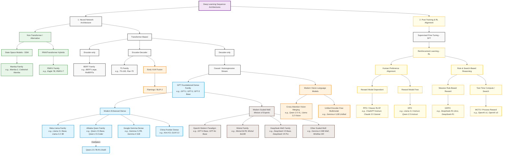

# Model Lineage

```mermaid
graph TD
    %% Styling Definitions
    classDef default fill:#f9f9f9,stroke:#333,stroke-width:2px;
    classDef dense fill:#e1f5fe,stroke:#0288d1,stroke-width:2px;
    classDef moe fill:#efebe9,stroke:#5d4037,stroke-width:2px;
    classDef alternative fill:#e8f5e9,stroke:#388e3c,stroke-width:2px;
    classDef vlm fill:#fff3e0,stroke:#f57c00,stroke-width:2px;
    classDef rl fill:#fffde7,stroke:#fbc02d,stroke-width:2px;
    classDef root fill:#f3e5f5,stroke:#7b1fa2,stroke-width:3px;

    %% Root Node
    Root[Deep Learning Sequence Architectures]:::root

    %% Main Branches
    Root --> Arch[1. Neural Network Architecture]
    Root --> PostTrain[2. Post-Training & RL Alignment]:::rl

    %% ============================================================
    %% 1. NEURAL NETWORK ARCHITECTURE BRANCH
    %% ============================================================
    Arch --> Trans[Transformer-Based]
    Arch --> NonTrans[Non-Transformer / Alternative]:::alternative

    %% Alternative Architectures
    NonTrans --> SSM[State Space Models - SSM]:::alternative
    SSM --> Mamba[Mamba Family <br/><i>e.g., Mamba-2, Codestral-Mamba</i>]:::alternative
    NonTrans --> RNN_Hybrid[RNN/Transformer Hybrids]:::alternative
    RNN_Hybrid --> RWKV[RWKV Family <br/><i>e.g., Eagle 7B, RWKV-7</i>]:::alternative

    %% Transformer Sub-branches
    Trans --> Enc[Encoder-only]
    Trans --> EncDec[Encoder-Decoder]
    Trans --> Dec[Decoder-only]

    %% Encoder & Enc-Dec Families
    Enc --> BERT[BERT Family <br/><i>e.g., BERT-Large, RoBERTa</i>]
    EncDec --> T5[T5 Family <br/><i>e.g., T5-11B, Flan-T5</i>]
    EncDec --> VLM_Early[Early VLM Fusion]:::vlm
    VLM_Early --> Flamingo[Flamingo / BLIP-2]:::vlm

    %% Decoder-only Mastery (Causal Autoregressive Paradigm)
    Dec --> CLM[Causal / Autoregressive Stream]
    
    %% GPT Founders
    CLM --> GPT_Base[GPT Foundational Dense Family <br/><i>e.g., GPT-1, GPT-2, GPT-3 Base</i>]:::dense

    %% Modern Structural Splitting
    GPT_Base --> Modern_Dense[Modern Enhanced Dense]:::dense
    GPT_Base --> Modern_MoE[Modern Scaled MoE <br/><i>Mixture of Experts</i>]:::moe

    %% Modern Dense Families
    Modern_Dense --> Llama_Dense[Meta Llama Family <br/><i>e.g., Llama 3.1 Base, Llama 3.2 3B</i>]:::dense
    Modern_Dense --> Qwen_Dense[Alibaba Qwen Family <br/><i>e.g., Qwen 2.5 Base, Qwen 2.5-Coder</i>]:::dense
    Modern_Dense --> Gemma_Dense[Google Gemma Dense <br/><i>e.g., Gemma 2 27B, Gemma 4 31B</i>]:::dense
    Modern_Dense --> China_Dense[China Frontier Dense <br/><i>e.g., Kimi K3, GLM 5.3</i>]:::dense

    %% Modern MoE Families
    Modern_MoE --> OpenAI_MoE[OpenAI Modern Paradigm <br/><i>e.g., GPT-4 Base, GPT-4o Base</i>]:::moe
    Modern_MoE --> Mistral_MoE[Mistral Family <br/><i>e.g., Mixtral 8x7B, Mixtral 8x22B</i>]:::moe
    Modern_MoE --> DeepSeek_MoE[DeepSeek MoE Family <br/><i>e.g., DeepSeek V3 Base, DeepSeek V4 Pro</i>]:::moe
    Modern_MoE --> Global_MoE[Other Scaled MoE <br/><i>e.g., Gemma 4 26B MoE, MiniMax M3</i>]:::moe

    %% Modern VLM Integration
    CLM --> VLM_Modern[Modern Vision-Language Models]:::vlm
    VLM_Modern --> ViT_Native[Cross-Attention Vision Merging <br/><i>e.g., Qwen 2.5 VL, Llama 3.2 Vision</i>]:::vlm
    VLM_Modern --> Encoder_Free[Unified Encoder-Free Multimodal <br/><i>e.g., Gemma 4 12B Unified</i>]:::vlm

    %% ============================================================
    %% 2. POST-TRAINING & RL ALIGNMENT BRANCH
    %% ============================================================
    PostTrain --> SFT[Supervised Fine-Tuning - SFT]
    SFT --> RL_Core[Reinforcement Learning - RL]:::rl

    %% RL Paradigms
    RL_Core --> Preference_RL[Human Preference Alignment]:::rl
    RL_Core --> Reasoning_RL[Rule & Search-Based Reasoning]:::rl

    %% Human Preference Alignment
    Preference_RL --> Reward_Based[Reward Model Dependent]:::rl
    Reward_Based --> PPO[PPO / Classic RLHF <br/><i>e.g., ChatGPT-Instruct, Claude 3.5 Sonnet</i>]:::rl
    
    Preference_RL --> Reward_Free[Reward Model Free]:::rl
    Reward_Free --> DPO[DPO <br/><i>e.g., Llama 3.1 Instruct, Qwen 2.5 Instruct</i>]:::rl

    %% Reasoning & Rule-Based RL (o1 / R1 Paradigm)
    Reasoning_RL --> Massive_Rule[Massive Rule-Based Reward]:::rl
    Massive_Rule --> GRPO[GRPO <br/><i>e.g., DeepSeek-R1-Zero, DeepSeek-R1</i>]:::rl
    
    Reasoning_RL --> Test_Time_Compute[Test-Time Compute / Search]:::rl
    Test_Time_Compute --> MCTS[MCTS / Process Reward <br/><i>e.g., OpenAI o1, OpenAI o3</i>]:::rl

    %% ============================================================
    %% CROSS-LINKS (ARCH TO ALIGNMENT FRUITION)
    %% ============================================================
    Qwen_Dense -.->|Distillation| Qwen_Distill[Qwen-2.5-7B-R1-Distill]:::dense

    %% Legend Layer Configurations
    class Llama_3_1_Base,Qwen_2_5_Base,Gemma_2_27B,Qwen_Distill,Kimi_K3,GLM_5_3 dense;
    class GPT_4_Base,Mixtral_8x7B,DeepSeek_V3_Base,DeepSeek_V4_Pro,Gemma_4_26B_MoE,MiniMax_M3 moe;
    class Mamba,RWKV alternative;
    class Qwen_2_5_VL,Llama_3_2_Vision,Gemma_4_12B_Unified,Flamingo vlm;
```
