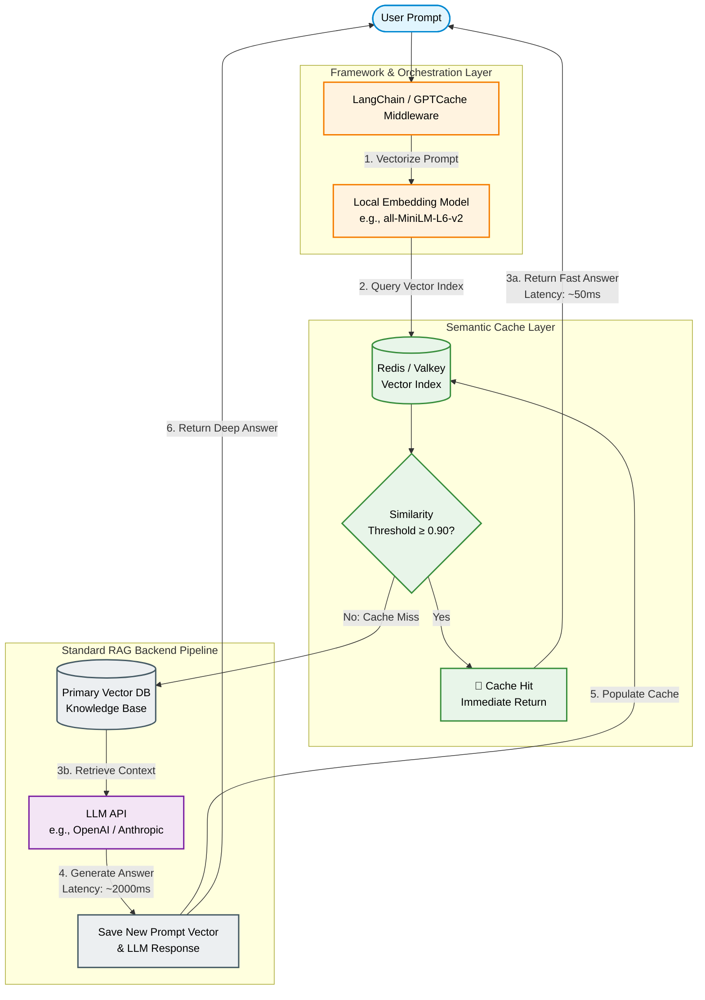
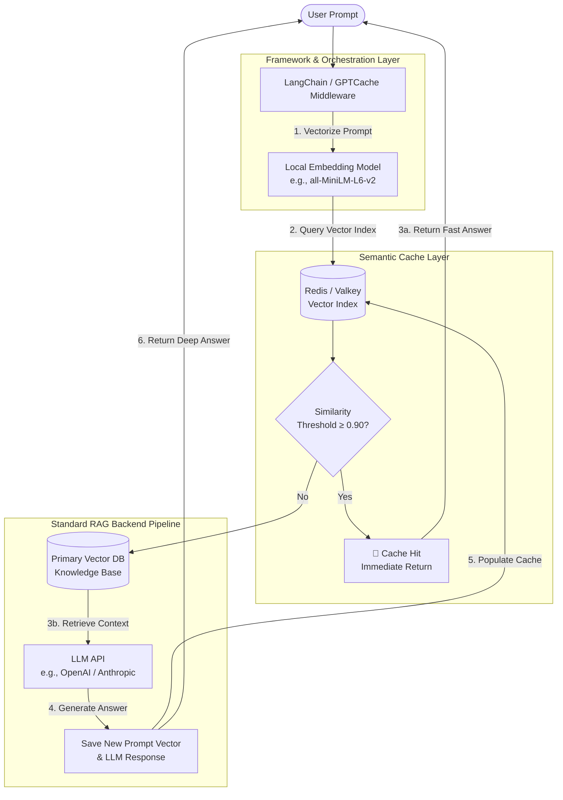

# Semantic Caching

<table><tr style="background-color:lightgreen;"><td>Tool:</td><td>
Google Search - AI Mode
</td></tr><tr style="background-color:lightyellow;"><td>Q:</td><td>
what is semantic cache strategy?
</td></tr><tr><td>A:</td><td>

## What is "Semantic Cache" strategy?

A semantic cache strategy is an advanced data-caching technique that stores and retrieves data based on the meaning and intent of a query, rather than relying on an exact string-matching key. It is heavily utilized in Generative AI, Large Language Model (LLM) workflows, and semantic search systems to drastically cut down API costs, reduce computational latency, and minimize duplicate backend processing. [1, 2, 3, 4] 

### How It Works

Traditional caches use exact-match keys (like a cryptographic hash of the query text). If a user asks "How is the weather in Paris?" and a second user asks "What is the weather like in Paris?", traditional caching treats them as entirely separate requests, resulting in a cache miss. [5, 6, 7] 
A semantic cache overrides this limitation using a multi-step workflow: [8] 

```
[ User Prompt ] ──> [ Embedding Model ] ──> [ Vector Database Lookup ] 
                                                   │
                          ┌────────────────────────┴────────────────────────┐
                 (Similarity ≥ Threshold)                               (Similarity < Threshold)
                          ▼                                                 ▼
                  [ CACHE HIT 🎉 ]                                   [ CACHE MISS ❌ ]
           Return Stored LLM Response                       Forward to LLM ──> Store Vector & Answer
```

   1. Input Vectorization: When a user inputs a query, the text is fed into a fast, lightweight embedding model to generate a numerical vector representation (a vector embedding) that captures the underlying intent. [4, 8] 
   2. Similarity Search: This vector is queried against a specialized [vector database](https://redis.io/docs/latest/develop/use-cases/semantic-cache/) (such as Redis, Valkey, Qdrant, or Pinecone) containing vectors of previously asked questions. [3, 8, 9] 
   3. Distance Calculation: The database calculates spatial mathematical metrics (like Cosine Similarity) to see how close the new prompt's intent is to historical ones. [1, 10] 
   4. The Threshold Gate:
   * Cache Hit: If the similarity score meets or exceeds a predefined threshold (typically between 0.85 and 0.95), the cache immediately delivers the stored historical response. The expensive LLM is bypassed entirely.
      * Cache Miss: If the similarity score is too low, the query flows to the LLM backend. The newly generated response and its corresponding prompt vector are then saved back to the cache for future use. [1, 3, 4, 8, 10] 
   
## Core Benefits

* Massive Cost Reductions: LLM providers bill heavily based on token usage. Intercepting paraphrased queries at the cache layer routinely slashes enterprise [LLM infrastructure bills by up to 50–86%](https://redis.io/blog/what-is-semantic-caching/). [3, 4, 11] 
* Sub-Second Latency: While a deep LLM model or Retrieval-Augmented Generation (RAG) pipeline can take multiple seconds to reason and output data, a vector cache hit typically responds within 50 to 100 milliseconds. [11, 12] 
* Guaranteed Consistency: It reduces the structural variability inherent to generative AI models. Paraphrased customer queries receive identical, pre-approved brand responses. [4, 11] 

## Critical Design Trade-offs

Implementing semantic caching requires balancing precision and performance: [13, 14, 15, 16] 

* The Threshold Dilemma: Setting the threshold too low (e.g., 0.75) causes the system to serve incorrect answers to loosely related questions. Setting it too high (e.g., 0.98) renders the cache ineffective because it starts demanding exact string matching. [1, 10, 17, 18, 19] 
* Data Freshness (TTL): Unlike static text, semantic data changes over time. Systems must deploy strict Time-To-Live (TTL) expiration rules to ensure users aren't served stale or outdated real-time data. [20, 21, 22, 23] 
* Security & Isolation: A production-grade semantic cache must maintain exact-hash boundaries around system contexts, user metadata, permissions, and tenant IDs to prevent leaking sensitive cache data between different users. [24] 

Would you like to explore a Python code example using an open-source framework to see how a semantic cache is built, or should we discuss how to select the right similarity threshold for your specific data?

[1] [https://redis.io](https://redis.io/blog/what-is-semantic-caching/)
[2] [https://www.catchpoint.com](https://www.catchpoint.com/blog/semantic-caching-what-we-measured-why-it-matters)
[3] [https://www.youtube.com](https://www.youtube.com/watch?v=vIgF4GP2n9w&t=184)
[4] [https://docs.aws.amazon.com](https://docs.aws.amazon.com/AmazonElastiCache/latest/dg/semantic-caching-overview.html)
[5] [https://zuplo.com](https://zuplo.com/blog/what-is-semantic-caching)
[6] [https://futureagi.com](https://futureagi.com/blog/what-is-semantic-caching-llms-2026/)
[7] [https://medium.com](https://medium.com/@_Ankit_Malviya/semantic-caching-a-deep-technical-dive-into-modern-llm-optimization-93a911bc6e0b)
[8] [https://arkapravasinha.medium.com](https://arkapravasinha.medium.com/supercharging-llm-applications-with-semantic-caching-boost-speed-cut-costs-and-maintain-accuracy-11f302464dff)
[9] [https://qdrant.tech](https://qdrant.tech/articles/semantic-cache-ai-data-retrieval/)
[10] [https://www.pgedge.com](https://www.pgedge.com/blog/semantic-caching-in-postgresql-a-hands-on-guide-to-pg_semantic_cache)
[11] [https://krishnakonar12.medium.com](https://krishnakonar12.medium.com/semantic-caching-a-practical-guide-to-smarter-faster-retrieval-systems-e98f023cb0e7)
[12] [https://medium.com](https://medium.com/@svosh2/semantic-cache-how-to-speed-up-llm-and-rag-applications-79e74ce34d1d)
[13] [https://redis.io](https://redis.io/blog/how-to-cache-semantic-search/)
[14] [https://www.zenml.io](https://www.zenml.io/llmops-database/semantic-caching-for-e-commerce-search-optimization)
[15] [https://www.elastic.co](https://www.elastic.co/search-labs/blog/elasticsearch-as-a-genai-caching-layer)
[16] [https://ieeexplore.ieee.org](https://ieeexplore.ieee.org/iel7/10488913/10488921/10489439.pdf)
[17] [https://www.youtube.com](https://www.youtube.com/watch?v=m_dNwtoxqd8&t=8)
[18] [https://www.getmaxim.ai](https://www.getmaxim.ai/articles/from-litellm-to-a-gateway-with-native-semantic-caching-a-migration-guide/)
[19] [https://redis.io](https://redis.io/blog/how-to-cache-semantic-search/)
[20] [https://www.youtube.com](https://www.youtube.com/watch?v=AtVTT_s8AGc&t=1)
[21] [https://www.youtube.com](https://www.youtube.com/watch?v=7vdFUJgGOSs&t=464)
[22] [https://www.sitepoint.com](https://www.sitepoint.com/prompt-compression-cache-tuning-llm-api-costs/)
[23] [https://www.thehoth.com](https://www.thehoth.com/blog/semantic-drift/)
[24] [https://www.truefoundry.com](https://www.truefoundry.com/blog/semantic-caching-llm-gateway)

</td></tr>
<tr style="background-color:lightyellow;"><td>Q:</td><td>
what are the common tech stack to implement semantic caching strategy, especially for RAG application?
</td></tr><tr><td>A:</td><td>

## Common Tech Stack of RAG with Semantic Caching

To implement a semantic caching strategy for a Retrieval-Augmented Generation (RAG) application, your tech stack needs components capable of generating text embeddings, performing ultra-fast vector similarity searches, and orchestrating the cache logic. [1] 
The industry has converged around three main architectural layers to handle this setup efficiently. [2, 3, 4] 

### 1. Dedicated Orchestration & Framework Layers

Instead of writing the mathematical lookup logic from scratch, developers use middleware frameworks specifically designed to intercept LLM prompts and handle the cache loop automatically.

* [GPTCache](https://github.com/zilliztech/GPTCache): The most popular open-source framework dedicated entirely to semantic caching. Built by Zilliz, it lets you customize your embedding models, similarity evaluation metrics, and storage backend with just a few lines of code. [5, 6, 7, 8, 9] 
* LangChain / [LlamaIndex](https://www.llamaindex.ai/): Both of these industry-standard RAG orchestration frameworks feature built-in, out-of-the-box abstractions for semantic caching (e.g., LangChain’s RedisSemanticCache or OpenSearchSemanticCache). [10, 11, 12] 

### 2. High-Performance Vector Storage Backends

Your cache requires a database that can handle sub-millisecond vector similarity computations. In a RAG application, developers often choose to use their existing primary vector database or spin up an ultra-fast, in-memory cache layer. [13] 

| Database Class [14, 15, 16, 17, 18] | Specific Technologies | Why It Is Used for Caching |
|---|---|---|
| In-Memory & Key-Value | Redis[](https://redis.io/docs/latest/develop/use-cases/semantic-cache/), Valkey, Dragonfly | The absolute gold standard for caching. Combines traditional text caching speed with native vector indexing (HNSW), offering sub-10ms response times. |
| Cloud Vector Native | Pinecone, Qdrant, Milvus | Ideal if your RAG pipeline already uses them. You can isolate a separate namespace or index exclusively for storing prompt-response vector pairs. |
| Relational / Extensions | PostgreSQL (pgvector) | Excellent if you want to minimize tech stack complexity by keeping your relational data, RAG knowledge base, and semantic cache in a single database. |

## 3. Embedding & Text Vectorization Models

You need a reliable model to convert incoming user prompts into semantic vectors. For caching, speed and low cost are more critical than massive parameter size.

* Local & Open Source: [Hugging Face Transformers](https://hugging face.co/) (specifically models like all-MiniLM-L6-v2 or bge-small-en-v1.5). Running these locally via ONNX Runtime or Hugging Face tokenizers eliminates network latency completely. [19] 
* Hosted APIs: [OpenAI's text-embedding-3-small](https://platform.openai.com/docs/guides/embeddings) or Cohere Embed. These are highly accurate, though they introduce a minor external network request before checking the cache. [20, 21, 22, 23] 

### Example Reference Architecture for RAG

In a production environment, a typical, highly optimized semantic cache tech stack is wired together like this:

```
[ User Prompt ] 
       │
       ▼
[ LangChain / GPTCache ] ───(Generates Vector via)───> [ Local HuggingFace Model ]
       │
       ├─► [ Redis Vector DB ] ──(Similarity ≥ 0.90?)──► [ CACHE HIT 🎉 ] ──► Return Saved Answer
       │
       └─► [ CACHE MISS ❌ ]
               │
               ▼
   [ Vector Search on Knowledge Base ] ──► [ LLM (OpenAI/Anthropic) ] ──► Save Pair to Redis & Return
```

Would you like to see a minimalist Python code snippet using LangChain and Redis to see how this is configured, or should we look at how to benchmark the latency difference between a cache hit and a cache miss?

[1] [https://medium.com](https://medium.com/@ahmed.mimilahlou/quickly-implement-your-first-rag-solution-using-python-and-pgvector-postgresql-a8ee82d70f8a)
[2] [https://www.sciencedirect.com](https://www.sciencedirect.com/science/article/pii/S0140366422002213)
[3] [https://www.linkedin.com](https://www.linkedin.com/pulse/flattening-why-tech-stacks-org-charts-collapsing-same-mike-mauricio-gdaue)
[4] [https://dl.acm.org](https://dl.acm.org/doi/10.1145/3626202.3637573)
[5] [https://arxiv.org](https://arxiv.org/html/2503.17603v1)
[6] [https://arxiv.org](https://arxiv.org/html/2502.03771v1)
[7] [https://builder.aws.com](https://builder.aws.com/content/2juMSXyaSX2qelT4YSdHBrW2D6s/bridging-the-efficiency-gap-mastering-llm-caching-for-next-generation-ai-part-2)
[8] [https://medium.com](https://medium.com/@tejas.patel_41715/build-a-rag-system-using-vertex-ai-embeddings-cf6bb2dfba9f)
[9] [https://milvus.io](https://milvus.io/blog/semantic-highlighting-model-for-rag-context-pruning-and-token-saving.md)
[10] [https://pub.towardsai.net](https://pub.towardsai.net/semantic-caching-in-generative-ai-chatbots-b134f116a50b)
[11] [https://www.linkedin.com](https://www.linkedin.com/pulse/langchain-primer-lakshya-prakash-agarwal-anx6e)
[12] [https://www.vitorsousa.com](https://www.vitorsousa.com/portfolio/rag/)
[13] [https://medium.com](https://medium.com/data-science/designing-rags-dbb9a7c1d729)
[14] [https://medium.com](https://medium.com/@yashpaddalwar/implementing-semantic-caching-in-rag-using-redis-for-faster-responses-b901bcc8324b)
[15] [https://www.linkedin.com](https://www.linkedin.com/pulse/local-ai-development-ollama-net-ratko-%C4%87osi%C4%87-cg2vf)
[16] [https://snyk.io](https://snyk.io/articles/rag-vs-cag-key-differences-in-ai-generation-strategies/)
[17] [https://www.dragonflydb.io](https://www.dragonflydb.io/guides/in-memory-databases)
[18] [https://dev.to](https://dev.to/aws-builders/aws-vector-databases-part-3-choosing-the-right-vector-database-on-aws-375m)
[19] [https://medium.com](https://medium.com/@amritsinghbist/deep-dive-into-langchain-models-the-core-of-ai-interactions-95d1278f64c6)
[20] [https://www.nextgensoft.io](https://www.nextgensoft.io/rag-development-company/)
[21] [https://medium.com](https://medium.com/@adnanmasood/embeddings-in-practice-a-research-implementation-guide-9dbf20961590)
[22] [https://medium.com](https://medium.com/@rkuma18/how-to-choose-the-perfect-embedding-model-for-your-rag-system-8fd902abf4cc)
[23] [https://habr.com](https://habr.com/en/articles/792390/)

</td></tr>
<tr style="background-color:lightyellow;"><td>Q:</td><td>
please use mermaid.js syntax to draw reference architecture instead
</td></tr><tr><td>A:</td><td>

Here is the optimized RAG semantic cache reference architecture rendered directly in native Mermaid.js syntax:



If you plan to paste this into your own documentation, here is the clean, unannotated code block you can copy directly into any Mermaid-compatible viewer (such as GitHub, Notion, or Live Editor):



Would you like to modify the diagram to show how user multi-tenancy / metadata filtering fits into the semantic cache lookups, or shall we move on to a Python implementation of this exact flow?

</td></tr>
</table>
