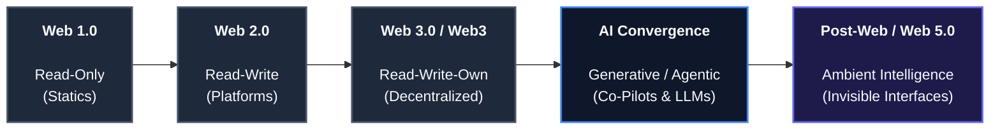

## From Web3, AI Convergance to Post-Web

> are there articles and diagram talking about the paradigm shift from web 1, web 2, web3, AI convergance to post-web?

Yes, countless tech analysis articles, academic papers, and architectural diagrams trace this exact macroeconomic paradigm shift. Tech consulting platforms and publications like [WSI World](https://www.wsiworld.com/blog/how-the-web-has-evolved) map this trajectory, detailing how the internet moved from static document delivery to AI-driven, post-browser ambient experiences. [1]
The transition from a decentralized data web (Web3) and an AI-heavy landscape into a unified "Post-Web" ecosystem is explained below, accompanied by a structural timeline diagram. [2]

## 🗺️ The Paradigm Shift Timeline

This diagram charts the core transformation across all five major phases of the web's evolution:

## 📊 Structural Breakdown of the Eras

To understand how these eras differ across core attributes, this technical matrix summarizes the architecture, user role, data control, and primary interaction layer of each paradigm shift: [1]

| Era [1, 3, 4, 5, 6, 7, 8, 9] | Core Theme | Technology Stack | User Role | Data Control |
| --- |  --- |  --- |  --- |  --- |
| Web 1.0 (1990s) | Read-Only | HTML, HTTP, Directory Indexes | Consumer | Completely Publisher-Owned |
| Web 2.0 (2000s) | Read-Write | Cloud, Mobile, Javascript, APIs | Creator | Centralized Tech Giants |
| Web 3.0 & Web3 (2010s-2020s) | Read-Write-Own | Blockchain, Smart Contracts, Edge | Stakeholder | Decentralized User Sovereignty |
| AI Convergence (Mid 2020s) | Generative Context | Large Language Models, RAG, Vector Databases | Director | AI Platform Synthesized |
| Post-Web (Late 2020s+) | Ambient Integration | Autonomous Agents, Spatial Computing, Neural APIs | Orchestrator | Zero-Knowledge Local & Edge Data |

## 🔬 Deep Dive: From AI Convergence to the Post-Web

The final jump from AI Convergence to the Post-Web marks the shift away from traditional web structures: [10]

### 1. AI Convergence: The Shift from Searching to Synthesizing [11]

Historically, navigating the web meant browsing multiple URLs to cross-reference data. In the AI Convergence phase, the primary interface transitions from a standard browser page to an interactive, conversational AI layer. Instead of clicking through links, AI dynamically aggregates, processes, and formats information from underlying data layers into real-time, custom-generated answers. [1, 12, 13, 14]

### 2. The Post-Web Era: The Death of the Browser

The "Post-Web" (often associated with conceptual frameworks like Web 5.0 or the Spatial Web) marks the absolute decentralization of internet interaction. [15]

-   Ambient Intelligence: The web ceases to be a destination you "visit" on a screen. It integrates into physical space via spatial computing, wearable smart devices, and IoT hardware.
-   Agentic Execution: Autonomous AI agents handle transaction protocols directly over decentralized ledgers (Web3) without human users ever seeing a website front-end.
-   Invisible UI: Apps and web domains dissolve into specialized APIs that talk directly to a user's local, personalized AI core, eliminating ad-heavy web interfaces. [3, 5, 16, 17, 18]

## 📚 Recommended Reading & Sourcing

To view detailed graphics, research breakdowns, and case studies regarding this evolution, review the following industry resources:

-   For Business Model Shifts: Read [The Paradigm Shift from Web2 to Web3 on LinkedIn](https://www.linkedin.com/pulse/navigating-business-transformation-paradigm-shift-from-donato-russo) to see how ownership and platform structures are mutating.
-   For Technical Definitions: Read the [VeChain Docs on Internet Evolution](https://docs.vechain.org/blockchain-basics/the-evolution-of-the-internet) to explore the technical underpinnings of decentralized trust networks.
-   For Future AI Impact: Review the breakdown by WSI World, which heavily emphasizes how AI-driven systems now filter, prioritize, and reshape modern information delivery. [1, 7, 8]

If you would like, I can help you map out a comprehensive system design architecture for a specific post-web application or provide the specific developer frameworks currently driving AI-to-Web3 interoperability. Which area would you like to explore next?

- [1] [https://www.wsiworld.com](https://www.wsiworld.com/blog/how-the-web-has-evolved)
- [2] [https://outlierventures.io](https://outlierventures.io/article/launching-the-post-web-base-camp-accelerator-program/)
- [3] [https://www.theknowledgeacademy.com](https://www.theknowledgeacademy.com/blog/web1-web2-web3-and-web-4/)
- [4] [https://www.youtube.com](https://www.youtube.com/watch?v=YsMzKuNN5f4&t=4)
- [5] [https://intetics.com](https://intetics.com/blog/the-evolution-of-the-internet-web-1-web-2-web-3-and-metaverse/)
- [6] [https://brave.com](https://brave.com/web3/versus-web1-and-web2/)
- [7] [https://docs.vechain.org](https://docs.vechain.org/blockchain-basics/the-evolution-of-the-internet)
- [8] [https://www.linkedin.com](https://www.linkedin.com/pulse/navigating-business-transformation-paradigm-shift-from-donato-russo)
- [9] [https://ieeexplore.ieee.org](https://ieeexplore.ieee.org/document/11379418/)
- [10] [https://outlierventures.io](https://outlierventures.io/article/launching-the-post-web-base-camp-accelerator-program/)
- [11] [https://www.youtube.com](https://www.youtube.com/watch?v=YsMzKuNN5f4&t=4)
- [12] [https://blog.seeburger.com](https://blog.seeburger.com/the-evolution-of-the-internet-web-1-0-web-2-0-web-3-0-web-4-0/)
- [13] [https://www.linkedin.com](https://www.linkedin.com/pulse/conversational-ai-future-web-design-thought-stephen-higgins-aoqmc)
- [14] [https://www.davydovconsulting.com](https://www.davydovconsulting.com/post/will-ai-overview-replace-google-search-results-ranking-as-we-know-it)
- [15] [https://outlierventures.io](https://outlierventures.io/article/launching-the-post-web-base-camp-accelerator-program/)
- [16] [https://blog.seeburger.com](https://blog.seeburger.com/the-evolution-of-the-internet-web-1-0-web-2-0-web-3-0-web-4-0/)
- [17] [https://medium.com](https://medium.com/antaeus-ar/you-wont-visit-websites-you-ll-walk-into-them-the-spatial-future-of-the-internet-728c103968b1)
- [18] [https://marcoluther.hashnode.dev](https://marcoluther.hashnode.dev/ai-agents-in-web3-the-future-of-decentralized-automation)