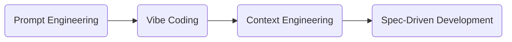

# Spec-Driven Development (SDD)

- 2025-09-02
  - Spec-driven development with AI: Get started with a new open source toolkit
  - https://github.blog/ai-and-ml/generative-ai/spec-driven-development-with-ai-get-started-with-a-new-open-source-toolkit/
- 2025-09-15
  - Diving Into Spec-Driven Development With GitHub Spec Kit
  - https://developer.microsoft.com/blog/spec-driven-development-spec-kit
- 2025-09-16
  - GitHub Spec Kit Experiment: 'A Lot of Questions'
  - https://visualstudiomagazine.com/articles/2025/09/16/github-spec-kit-experiment-a-lot-of-questions.aspx
