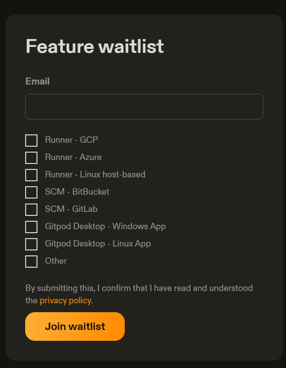

# Gitpod

## 2024-11-05

### CLI

- ( 2024-11-05 23:47:09 )
- 最近用 Github CLI 搭配 Github Codespace 用得蠻多的，好奇 Gitpod 是否也有 CLI 呢？
- 查了一下，確實有 Gitpod CLI
  - https://www.gitpod.io/docs/references/gitpod-cli

### CDE

- 不過也赫然發現 2024-10-01 起，Gitpod 多了一個 Flex 的新版本。
  - https://www.gitpod.io/blog/introducing-gitpod-flex
  - 現在開始主打 CDE (Cloud Development Environment)

### VDI

- 過去六年半，幾乎都在跟 VDI (Virtual Desktop Infrastructure) 攻防
  - https://www.gitpod.io/solutions/vdi - Gitpod 提出的 VDI Solution

### Dev Container

- Gitpod Flex 支援 Dev Container
  - https://www.gitpod.io/docs/flex/configuration/devcontainer/getting-started
- Gitpod Enterprise 以前是要設定 `.gitpod.yml`

### Gitpod Desktop

- https://www.gitpod.io/docs/flex/gitpod-desktop
- 看樣子 Gitpod Flex 主打的是可以在 Local 也跑跟雲一樣的 Dev Container
- 也因此，它需要 `Runner` 來取代 Docker Desktop
- 目前只有出 Mac Silicon 版本 Desktop，AWS 的 Runner
- 從 Feature Waitlist 看起來，GCP/Azure 與自建的 Linux K8s 應該要再一陣子。 

- ( 2024-11-06 00:04:25 )
- 想法：
  - 這個商業模式看起來是有機會，但群雄環伺之下，最後決定的還是「使用者」數量夠不夠形成足夠支撐起這個服務的經濟體。
  - Google 有 GCP CloudShell, Project IDX https://idx.dev/ 跟自建 CDE 的 [GCP Cloud Workstations](https://cloud.google.com/workstations/)
    - 我都有點好奇 IDX 能否搶到足夠的用戶
  - 微軟有 Github 這一個龐大的資源，Codespace 跟 Copilot 吸住了不少開發者。
  - AWS 以前就有 Cloud9。(至於 AWS CloudShell 因為只有 Web Console 實在太陽春，稱不上 Cloud Development Environment)
  - Gitpod 算在 Github Codespace 壯大前的佼佼者
  - Gitlab Enterprise 有 Workspaces - https://docs.gitlab.com/ee/user/workspace/
- 結論：
  - 生態系『破碎化』或者該說生態『多樣性』已是常態。