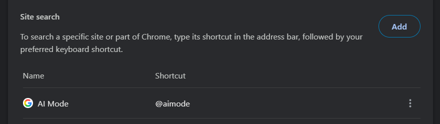

# Google Search AI Mode

## 2026-06-06

<table><tr style="background-color:lightgreen;"><td>Tool:</td><td>
Google Search AI Mode
</td></tr><tr style="background-color:lightyellow;"><td>Q:</td><td>
Google Search AI Mode 是否有公開 API 可以使用？
</td></tr><tr><td>A:</td><td>

## Google Search AI Mode API

Google 官方並沒有為「Search AI Mode（AI 模式）」釋出直接對應的獨立原生 API。
如果您在尋找如何開發出與 Google 搜尋 AI 模式具備相同效果（即時聯網、整合摘要、附帶來源連結與引用網址）的功能，目前市場上主要有兩種完全不同的實現途徑：

### 1. 官方正統解決方案：Gemini API 搭配「Google 搜尋 Grounding」
Google 官方提供的作法並非提供搜尋按鈕的 API，而是讓你在調用 Gemini API 時，強制開啟名為 [Grounding with Google Search](https://ai.google.dev/gemini-api/docs/google-search)（Google 搜尋實證技術）的工具功能。 [1, 2]

* 運作原理：當您的應用程式透過 API 傳送問題給 Gemini 時，Gemini 會在後台自主執行 Google 搜尋，撈取當前最新網頁，並結合搜尋結果生成有事實依據的回答。 [2, 3]
* 輸出內容：API 返回的 JSON 資料中，除了 AI 的文字回答外，還會包含 grounding_metadata（實證元數據）。裡面完整附帶了與 AI 模式相同的參考來源網站名稱、URL 連結以及引用段落索引（Citations）。 [1, 2]
* 如何使用：
* 快速測試：直接進入 Google AI Studio 後台，在右側的 Tools（工具）面板中將「Google Search」勾選開啟即可測試效果。
   * 企業級 / 程式開發：可透過 Google Cloud 的 Vertex AI 或 Google AI Studio 的 SDK，在 tools 參數中宣告 google_search_retrieval。 [4, 5, 6]

### 2. 第三方數據采集解決方案：Google AI Mode SERP API

如果您不需要讓 AI 去思考或生成，只是單純想要抓取（Scrape）使用者在 Google 網頁上使用「AI 模式」時所呈現的完整結構化資料，則需要仰遠第三方知名的 SERP（搜尋結果頁面）數據商。 [7, 8]

目前主流的搜尋爬蟲服務商已全數支援「Google AI Mode」的網頁解析：

| 服務商名稱 [8, 9, 10, 11] | 專屬 API 名稱 / 說明 | 輸出特點 |
|---|---|---|
| SerpApi | [Google AI Mode API](https://serpapi.com/google-ai-mode-api) | 將 AI 模式的聊天結果、巢狀引用網址轉換為乾淨的 JSON 格式輸出。 |
| SearchApi | [Google AI Mode API](https://www.searchapi.io/docs/google-ai-mode-api) | 支援傳入文字或圖片 URL，模擬真實地理位置獲取 AI 模式結果。 |
| Scrapingdog | [Google AI Mode API](https://docs.scrapingdog.com/google-ai-mode-api-documentation) | 解決代理 IP 輪轉問題，直接獲取 AI 模式的回答區塊（扣除 10 點數/次）。 |
| DataForSEO | DataForSEO SERP API | 專門用於監測自家品牌在 Google 新版 AI 模式中的能見度與 SEO 數據。 |

### 🛠️ 兩者該如何選擇？（Trade-offs）

* 如果您想要建構自己的 AI 聊天機器人（例如：企業客服、智慧助理）：
👉 請選擇「Gemini API + Grounding」。這是合規且最靈活的管道，AI 會根據你的 Prompt 與即時搜尋結果來回答。 [2, 4]
* 如果您要分析 SEO、監控品牌商譽，或分析 Google 官方 AI 針對某關鍵字給了哪些連結：
👉 請選擇「第三方 SERP API（如 SerpApi）」。因為它抓取到的是 Google 官方搜尋頁面上「一模一樣」的靜態 AI 模式輸出結果。 [8, 12]

如果您需要更進一步的協助，可以告訴我您預計開發的應用場景是什麼（例如：網頁爬蟲、Line 機器人、還是企業內部系統）？我可以直接為您提供對應的 Python 或 JavaScript 程式碼範例！

[1] [https://ai.google.dev](https://ai.google.dev/gemini-api/docs/google-search)
[2] [https://www.youtube.com](https://www.youtube.com/watch?v=1Ba0HQW2WP0&t=15)
[3] [https://www.ithome.com.tw](https://www.ithome.com.tw/news/163715)
[4] [https://www.youtube.com](https://www.youtube.com/watch?v=SJsozc0GXo8)
[5] [https://cloud.google.com](https://cloud.google.com/use-cases/free-ai-tools?hl=zh-TW)
[6] [https://www.meta-intelligence.tech](https://www.meta-intelligence.tech/insight-openclaw-api)
[7] [https://www.youtube.com](https://www.youtube.com/watch?v=xghtG-lGMk0)
[8] [https://www.youtube.com](https://www.youtube.com/watch?v=hpycALl1784&t=6)
[9] [https://serpapi.com](https://serpapi.com/blog/scrape-google-ai-mode-introducing-the-new-google-ai-mode-api/)
[10] [https://www.searchapi.io](https://www.searchapi.io/docs/google-ai-mode-api)
[11] [https://docs.scrapingdog.com](https://docs.scrapingdog.com/google-ai-mode-api-documentation)
[12] [https://serpapi.com](https://serpapi.com/google-ai-mode-api)

</td></tr>
<tr style="background-color:lightyellow;"><td>Q:</td><td>
有辦法設定 Chrome 自動搜尋 使用 Google AI Mode 嗎？
</td></tr><tr><td>A:</td><td>

## Chrome User-defined Search Engine

可以，你可以透過將 Google AI 模式的特殊參數網址新增至 Chrome 的「網站搜尋」設定中，並將其設為預設值，就能實現「網址列直接搜尋自動進入 AI 模式」的效果。 [1, 2]
請依照以下步驟在電腦版 Chrome 進行設定：

### 步驟一：進入 Chrome 搜尋引擎設定

   1. 開啟 Chrome 瀏覽器。
   2. 在網址列輸入 chrome://settings/searchEngines 並按下 Enter 鍵。
   3. 頁面將自動帶你進入 「網站搜尋」 的管理介面。 [2]

### 步驟二：手動新增 Google AI 模式

   1. 滾動至網頁下方的「網站搜尋」區塊，點選右側的 「新增」 按鈕。 [2]
   2. 在彈出的視窗中，精確填入 以下三個欄位資訊：
   * 搜尋引擎：Google AI Mode（或任何你喜歡的名稱）
      * 捷徑：ai
      * 以 URL 代替關鍵字（最關鍵）：複製並貼上後方這串包含專屬參數的網址：[1, 2]
      ```
      {google:baseURL}search?q=%s&udm=50
      ```
   3. 填寫完畢後，點選 「儲存」。 [2]

### 步驟三：將其設定為預設搜尋

   1. 在剛才新增的 Google AI Mode 項目右側，點擊 「三個點」（更多動作）圖示。
   2. 選擇 「設為預設」。

設定完成後，未來只要在 Chrome 頂部的網址列直接輸入任何關鍵字並按下 Enter，瀏覽器就不會再跳出傳統的搜尋網頁，而是直接自動以 Google AI 模式（帶有預設推理、思維與智慧回答的頁面）來處理你的搜尋請求。 [1]

如果你也常在手機上查找資料，想知道如何快速在 Android 或 iOS 上呼叫 AI 模式，或者遇到設定上的阻礙，請隨時告訴我！

[1] [https://www.fetnet.net](https://www.fetnet.net/content/cbu/tw/lifecircle/tech/2025/12/googleai.html)
[2] [https://techtarian.com](https://techtarian.com/google/set-the-google-ai-mode-as-default/)

</td></tr>
<tr><td>A:</td><td>

後來發現 Chrome 瀏覽器已經自動加了這個 `@aimode` 的搜尋引擎


</td></tr>
</table>

- 備註：
  - 有人寫了 Google Search AI Mode 的 Skill 跟 MCP
    - https://github.com/PleasePrompto/google-ai-mode-skill
    - https://github.com/PleasePrompto/google-ai-mode-mcp
  - 不過 Skill 的資安掃描有警告
    - Gen - High Risk
    - Snyk - Med Risk
> ```
> ◇  Security Risk Assessments ──────────────────────────────────────────╮
> │                                                                      │
> │                        Gen               Socket            Snyk      │
> │  google-ai-mode-skill  High Risk         0 alerts          Med Risk  │
> │                                                                      │
> │  Details: https://skills.sh/PleasePrompto/google-ai-mode-skill       │
> │                                                                      │
> ├──────────────────────────────────────────────────────────────────────╯
> ```