# Mermaid

[TOC]

## 緣起

以前喜歡用 [Trac](https://trac.edgewall.org/) 並且搭配它的 [Graphviz](https://graphviz.org/) 擴充元件。這樣就可以在 Wiki 裡面直接鑲嵌 [Graphviz](https://graphviz.org/) 語法，然後靠後端的指令產生對應的圖片。好處是能**版本控制**圖片的內容，其次是用語法就可以產生圖片。

隨著撰寫筆記的習慣從 Wiki 語法轉變成 Markdown 語法，漸漸地也不再需要用 VPS 自架靜態網站，Github 或 Gitlab 都已經提供很好的 Markdown 支援，不過用 Markdown 直接繪圖倒是仍有些不方便。

先前曾經試了一下 [Gravizo](http://www.gravizo.com/) 或 [PlantUML](https://plantuml.com/)，不過在使用上仍舊還需要習慣一下。

- ( 2021-11-21 11:50:24 ) 原本想找看看有沒有比較簡單的方法可以在 Markdown 裡面畫個簡易的金字塔。目前看起來只有找到 d3.js 的實作

<iframe>

</iframe>

## 歷史

網路上有許多可以透過 javascript 產生 UML 圖或者類似 graphviz 圖的工具。
- [PlantUML](https://plantuml.com/) 就提供了直接產生多種 UML 圖的服務，也算是裡面看過支援種類最廣的一個實作。
  - [UMLGraph](https://www.spinellis.gr/umlgraph/) 相對支援的種類就少一些
- [Viz.js](http://viz-js.com/) 看起來則提供了很不錯的 Grpahviz 支援
  - 原始碼：https://github.com/mdaines/viz.js
  - 不過這個 git repo 已經設為 Archived (代表不再活躍維護)
  - CDN: https://cdnjs.com/libraries/viz.js/2.1.2
- [Gravizo](http://www.gravizo.com/) 的服務。
  - 優點：Github 也可以直接鑲嵌
  - 缺點：每張圖都有「Gravizo」的 Logo

## 範例

### 流程圖 Flow Chart

- 語法：

```
flowchart LR
  subgraph TOP
    direction TB
    subgraph B1
        direction RL
        i1 -->f1
    end
    subgraph B2
        direction BT
        i2 -->f2
    end
  end
  A --> TOP --> B
  B1 --> B2
```

- 使用 Live Editor 並取得 Markdown 連結：

```

```

- 結果：

[](https://mermaid.live/edit/#eyJjb2RlIjoiZmxvd2NoYXJ0IExSXG4gIHN1YmdyYXBoIFRPUFxuICAgIGRpcmVjdGlvbiBUQlxuICAgIHN1YmdyYXBoIEIxXG4gICAgICAgIGRpcmVjdGlvbiBSTFxuICAgICAgICBpMSAtLT5mMVxuICAgIGVuZFxuICAgIHN1YmdyYXBoIEIyXG4gICAgICAgIGRpcmVjdGlvbiBCVFxuICAgICAgICBpMiAtLT5mMlxuICAgIGVuZFxuICBlbmRcbiAgQSAtLT4gVE9QIC0tPiBCXG4gIEIxIC0tPiBCMiIsIm1lcm1haWQiOiJ7XG4gIFwidGhlbWVcIjogXCJkYXJrXCJcbn0iLCJ1cGRhdGVFZGl0b3IiOmZhbHNlLCJhdXRvU3luYyI6dHJ1ZSwidXBkYXRlRGlhZ3JhbSI6ZmFsc2V9)

### 序列圖 Sequence Diagram

- 語法：

```
sequenceDiagram
    Alice->>+John: Hello John, how are you?
    Alice->>+John: John, can you hear me?
    John-->>-Alice: Hi Alice, I can hear you!
    John-->>-Alice: I feel great!
```

- 結果：

[](https://mermaid.live/edit/#eyJjb2RlIjoic2VxdWVuY2VEaWFncmFtXG4gICAgQWxpY2UtPj4rSm9objogSGVsbG8gSm9obiwgaG93IGFyZSB5b3U_XG4gICAgQWxpY2UtPj4rSm9objogSm9obiwgY2FuIHlvdSBoZWFyIG1lP1xuICAgIEpvaG4tLT4-LUFsaWNlOiBIaSBBbGljZSwgSSBjYW4gaGVhciB5b3UhXG4gICAgSm9obi0tPj4tQWxpY2U6IEkgZmVlbCBncmVhdCFcbiAgICAgICAgICAgICIsIm1lcm1haWQiOnsidGhlbWUiOiJkZWZhdWx0In0sInVwZGF0ZUVkaXRvciI6ZmFsc2UsImF1dG9TeW5jIjp0cnVlLCJ1cGRhdGVEaWFncmFtIjpmYWxzZX0)

### 類別圖 Class Diagram

- 語法：

```
classDiagram
    Animal <|-- Duck
    Animal <|-- Fish
    Animal <|-- Zebra
    Animal : +int age
    Animal : +String gender
    Animal: +isMammal()
    Animal: +mate()
    class Duck{
      +String beakColor
      +swim()
      +quack()
    }
    class Fish{
      -int sizeInFeet
      -canEat()
    }
    class Zebra{
      +bool is_wild
      +run()
    }
```

- 結果：

[](https://mermaid.live/edit/#eyJjb2RlIjoiY2xhc3NEaWFncmFtXG4gICAgQW5pbWFsIDx8LS0gRHVja1xuICAgIEFuaW1hbCA8fC0tIEZpc2hcbiAgICBBbmltYWwgPHwtLSBaZWJyYVxuICAgIEFuaW1hbCA6ICtpbnQgYWdlXG4gICAgQW5pbWFsIDogK1N0cmluZyBnZW5kZXJcbiAgICBBbmltYWw6ICtpc01hbW1hbCgpXG4gICAgQW5pbWFsOiArbWF0ZSgpXG4gICAgY2xhc3MgRHVja3tcbiAgICAgICtTdHJpbmcgYmVha0NvbG9yXG4gICAgICArc3dpbSgpXG4gICAgICArcXVhY2soKVxuICAgIH1cbiAgICBjbGFzcyBGaXNoe1xuICAgICAgLWludCBzaXplSW5GZWV0XG4gICAgICAtY2FuRWF0KClcbiAgICB9XG4gICAgY2xhc3MgWmVicmF7XG4gICAgICArYm9vbCBpc193aWxkXG4gICAgICArcnVuKClcbiAgICB9XG4gICAgICAgICAgICAiLCJtZXJtYWlkIjoie1xuICBcInRoZW1lXCI6IFwiZGVmYXVsdFwiXG59IiwidXBkYXRlRWRpdG9yIjpmYWxzZSwiYXV0b1N5bmMiOnRydWUsInVwZGF0ZURpYWdyYW0iOmZhbHNlfQ)

### 狀態圖 State Diagram

- 語法：

```
stateDiagram-v2
    [*] --> Still
    Still --> [*]
    Still --> Moving
    Moving --> Still
    Moving --> Crash
    Crash --> [*]
```

- 結果：

[](https://mermaid.live/edit#eyJjb2RlIjoic3RhdGVEaWFncmFtLXYyXG4gICAgWypdIC0tPiBTdGlsbFxuICAgIFN0aWxsIC0tPiBbKl1cbiAgICBTdGlsbCAtLT4gTW92aW5nXG4gICAgTW92aW5nIC0tPiBTdGlsbFxuICAgIE1vdmluZyAtLT4gQ3Jhc2hcbiAgICBDcmFzaCAtLT4gWypdXG4gICAgICAgICAgICAiLCJtZXJtYWlkIjoie1xuICBcInRoZW1lXCI6IFwiZGVmYXVsdFwiXG59IiwidXBkYXRlRWRpdG9yIjpmYWxzZSwiYXV0b1N5bmMiOnRydWUsInVwZGF0ZURpYWdyYW0iOmZhbHNlfQ)

### 甘特圖 Gantt Diagram

- 語法：

```
gantt
    title A Gantt Diagram
    dateFormat  YYYY-MM-DD
    section Section
    A task           :a1, 2014-01-01, 30d
    Another task     :after a1  , 20d
    section Another
    Task in sec      :2014-01-12  , 12d
    another task      : 24d
```

- 結果：

[](https://mermaid.live/edit#eyJjb2RlIjoiZ2FudHRcbiAgICB0aXRsZSBBIEdhbnR0IERpYWdyYW1cbiAgICBkYXRlRm9ybWF0ICBZWVlZLU1NLUREXG4gICAgc2VjdGlvbiBTZWN0aW9uXG4gICAgQSB0YXNrICAgICAgICAgICA6YTEsIDIwMTQtMDEtMDEsIDMwZFxuICAgIEFub3RoZXIgdGFzayAgICAgOmFmdGVyIGExICAsIDIwZFxuICAgIHNlY3Rpb24gQW5vdGhlclxuICAgIFRhc2sgaW4gc2VjICAgICAgOjIwMTQtMDEtMTIgICwgMTJkXG4gICAgYW5vdGhlciB0YXNrICAgICAgOiAyNGRcbiAgICAgICAgICAgICIsIm1lcm1haWQiOiJ7XG4gIFwidGhlbWVcIjogXCJkZWZhdWx0XCJcbn0iLCJ1cGRhdGVFZGl0b3IiOmZhbHNlLCJhdXRvU3luYyI6dHJ1ZSwidXBkYXRlRGlhZ3JhbSI6ZmFsc2V9)

### 圓餅圖 Pie Chart

- 語法：

```
pie title Pets adopted by volunteers
    "Dogs" : 386
    "Cats" : 85
    "Rats" : 15
```

- 結果：

[](https://mermaid.live/edit#eyJjb2RlIjoicGllIHRpdGxlIFBldHMgYWRvcHRlZCBieSB2b2x1bnRlZXJzXG4gICAgXCJEb2dzXCIgOiAzODZcbiAgICBcIkNhdHNcIiA6IDg1XG4gICAgXCJSYXRzXCIgOiAxNVxuICAgICAgICAgICAgIiwibWVybWFpZCI6IntcbiAgXCJ0aGVtZVwiOiBcImRlZmF1bHRcIlxufSIsInVwZGF0ZUVkaXRvciI6ZmFsc2UsImF1dG9TeW5jIjp0cnVlLCJ1cGRhdGVEaWFncmFtIjpmYWxzZX0)

### 資料庫 ER 分析 ER Diagram

- 語法：

```
erDiagram
          CUSTOMER }|..|{ DELIVERY-ADDRESS : has
          CUSTOMER ||--o{ ORDER : places
          CUSTOMER ||--o{ INVOICE : "liable for"
          DELIVERY-ADDRESS ||--o{ ORDER : receives
          INVOICE ||--|{ ORDER : covers
          ORDER ||--|{ ORDER-ITEM : includes
          PRODUCT-CATEGORY ||--|{ PRODUCT : contains
          PRODUCT ||--o{ ORDER-ITEM : "ordered in"
```

- 結果：

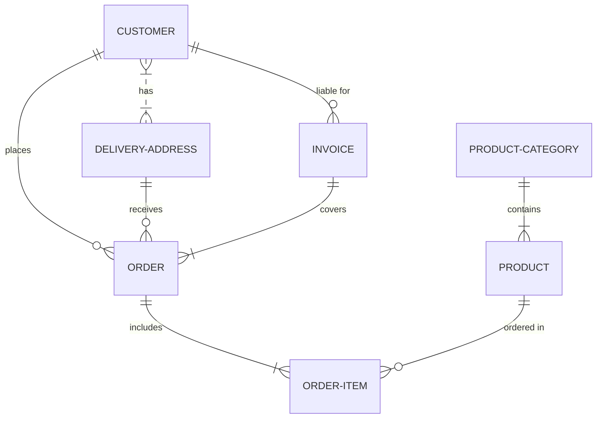


### Git Flow

- 語法：

```
gitGraph:
options
{
    "nodeSpacing": 150,
    "nodeRadius": 10
}
end
commit
branch newbranch
checkout newbranch
commit
commit
checkout master
commit
commit
merge newbranch
```

- 結果：


### User Journey

- 語法：

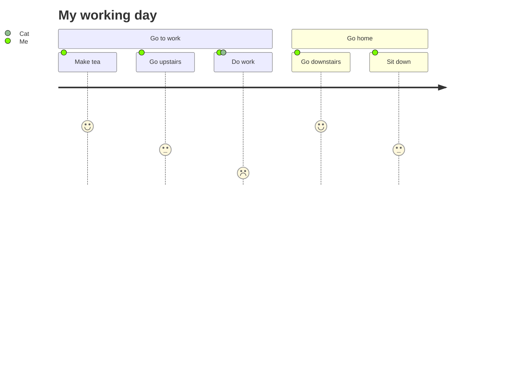

- 結果：

[](https://mermaid.live/edit#eyJjb2RlIjoiICBqb3VybmV5XG4gICAgdGl0bGUgTXkgd29ya2luZyBkYXlcbiAgICBzZWN0aW9uIEdvIHRvIHdvcmtcbiAgICAgIE1ha2UgdGVhOiA1OiBNZVxuICAgICAgR28gdXBzdGFpcnM6IDM6IE1lXG4gICAgICBEbyB3b3JrOiAxOiBNZSwgQ2F0XG4gICAgc2VjdGlvbiBHbyBob21lXG4gICAgICBHbyBkb3duc3RhaXJzOiA1OiBNZVxuICAgICAgU2l0IGRvd246IDM6IE1lXG4gICAgICAiLCJtZXJtYWlkIjoie1xuICBcInRoZW1lXCI6IFwiZGVmYXVsdFwiXG59IiwidXBkYXRlRWRpdG9yIjpmYWxzZSwiYXV0b1N5bmMiOnRydWUsInVwZGF0ZURpYWdyYW0iOmZhbHNlfQ)

## 2024-06-21

- 2022 年 2 月 14 日，Github 宣布 Markdown 檔案支援 Mermaid
- https://github.blog/2022-02-14-include-diagrams-markdown-files-mermaid/

- 2024-06-21 03:59:29
- 今天在看 Mermaid 官方文件時，發現又多了其他新的圖形種類

### 象限圖 Quadrant Chart

- 語法：
```
quadrantChart
    title Reach and engagement of campaigns
    x-axis Low Reach --> High Reach
    y-axis Low Engagement --> High Engagement
    quadrant-1 We should expand
    quadrant-2 Need to promote
    quadrant-3 Re-evaluate
    quadrant-4 May be improved
    Campaign A: [0.3, 0.6]
    Campaign B: [0.45, 0.23]
    Campaign C: [0.57, 0.69]
    Campaign D: [0.78, 0.34]
    Campaign E: [0.40, 0.34]
    Campaign F: [0.35, 0.78]
```
- 結果：

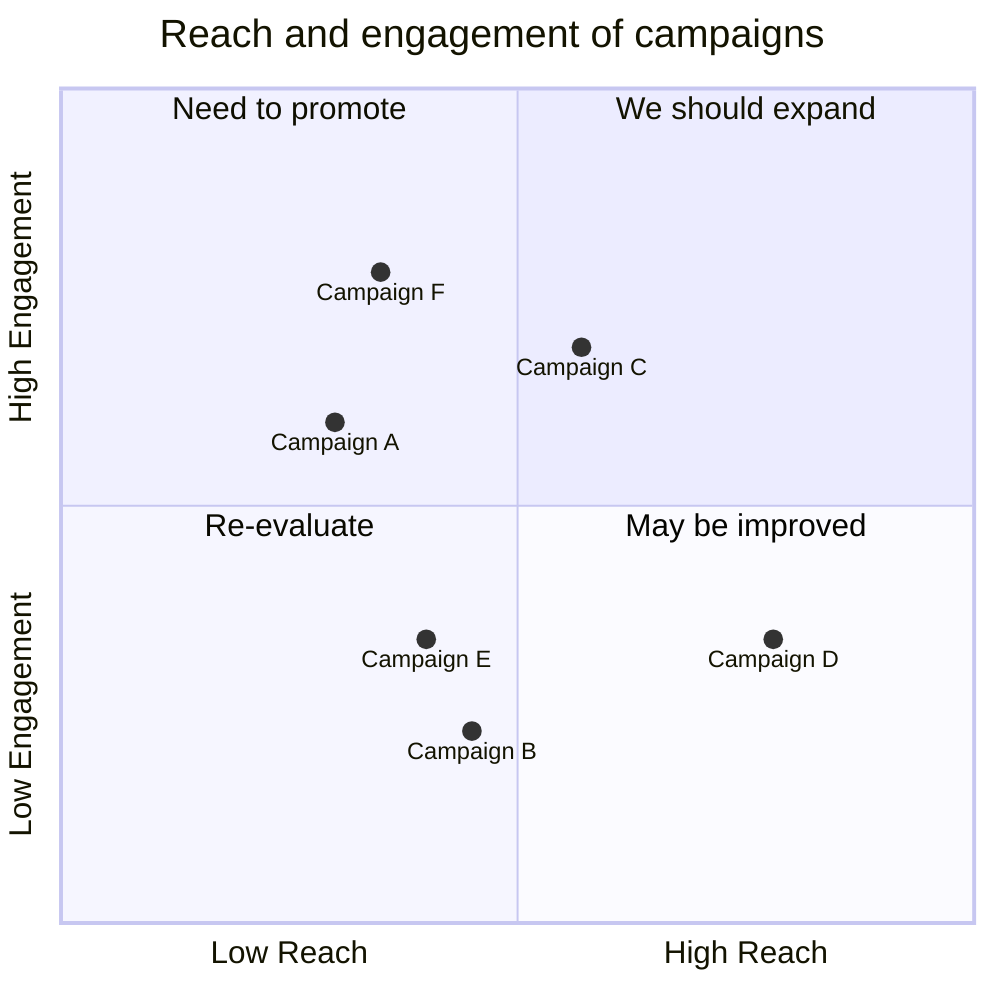

### 需求圖 Requirement Diagram

- 語法：
```
requirementDiagram

requirement test_req {
id: 1
text: the test text.
risk: high
verifymethod: test
}

element test_entity {
type: simulation
}

test_entity - satisfies -> test_req
```
- 結果：
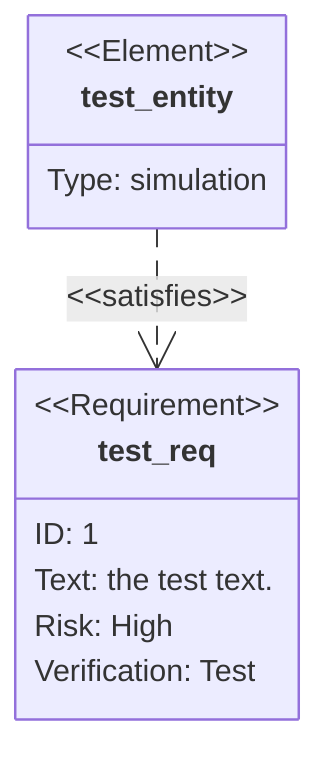
### C4 Diagrams

- 語法：
```
C4Context
  title System Context diagram for Internet Banking System
  Enterprise_Boundary(b0, "BankBoundary0") {
    Person(customerA, "Banking Customer A", "A customer of the bank, with personal bank accounts.")
    Person(customerB, "Banking Customer B")
    Person_Ext(customerC, "Banking Customer C", "desc")

    Person(customerD, "Banking Customer D", "A customer of the bank, <br/> with personal bank accounts.")

    System(SystemAA, "Internet Banking System", "Allows customers to view information about their bank accounts, and make payments.")

    Enterprise_Boundary(b1, "BankBoundary") {

      SystemDb_Ext(SystemE, "Mainframe Banking System", "Stores all of the core banking information about customers, accounts, transactions, etc.")

      System_Boundary(b2, "BankBoundary2") {
        System(SystemA, "Banking System A")
        System(SystemB, "Banking System B", "A system of the bank, with personal bank accounts. next line.")
      }

      System_Ext(SystemC, "E-mail system", "The internal Microsoft Exchange e-mail system.")
      SystemDb(SystemD, "Banking System D Database", "A system of the bank, with personal bank accounts.")

      Boundary(b3, "BankBoundary3", "boundary") {
        SystemQueue(SystemF, "Banking System F Queue", "A system of the bank.")
        SystemQueue_Ext(SystemG, "Banking System G Queue", "A system of the bank, with personal bank accounts.")
      }
    }
  }

  BiRel(customerA, SystemAA, "Uses")
  BiRel(SystemAA, SystemE, "Uses")
  Rel(SystemAA, SystemC, "Sends e-mails", "SMTP")
  Rel(SystemC, customerA, "Sends e-mails to")

  UpdateElementStyle(customerA, $fontColor="red", $bgColor="grey", $borderColor="red")
  UpdateRelStyle(customerA, SystemAA, $textColor="blue", $lineColor="blue", $offsetX="5")
  UpdateRelStyle(SystemAA, SystemE, $textColor="blue", $lineColor="blue", $offsetY="-10")
  UpdateRelStyle(SystemAA, SystemC, $textColor="blue", $lineColor="blue", $offsetY="-40", $offsetX="-50")
  UpdateRelStyle(SystemC, customerA, $textColor="red", $lineColor="red", $offsetX="-50", $offsetY="20")

  UpdateLayoutConfig($c4ShapeInRow="3", $c4BoundaryInRow="1")
```
- 結果：
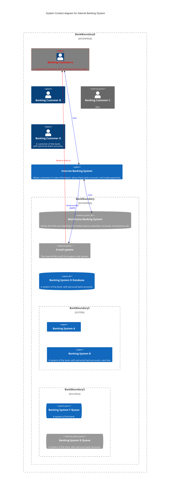

### 心智圖 

- 語法：

```
mindmap
  root((mindmap))
    Origins
      Long history
      ::icon(fa fa-book)
      Popularisation
        British popular psychology author Tony Buzan
    Research
      On effectiveness<br/>and features
      On Automatic creation
        Uses
            Creative techniques
            Strategic planning
            Argument mapping
    Tools
      Pen and paper
      Mermaid
```

- 結果：

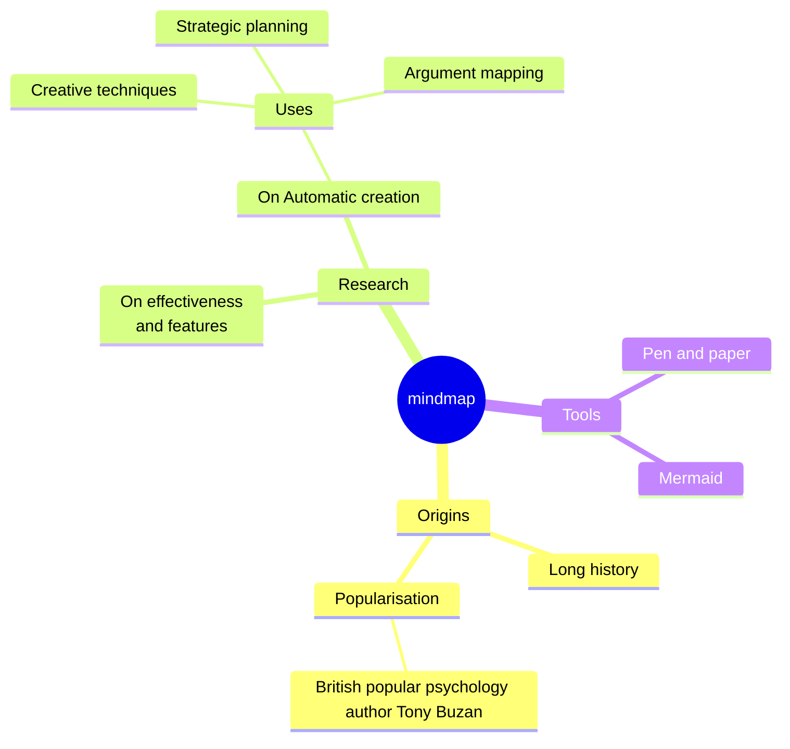

### 時間軸 Timeline Diagram

- 語法：

```
timeline
    title History of Social Media Platform
    2002 : LinkedIn
    2004 : Facebook
         : Google
    2005 : Youtube
    2006 : Twitter
```

- 結果：

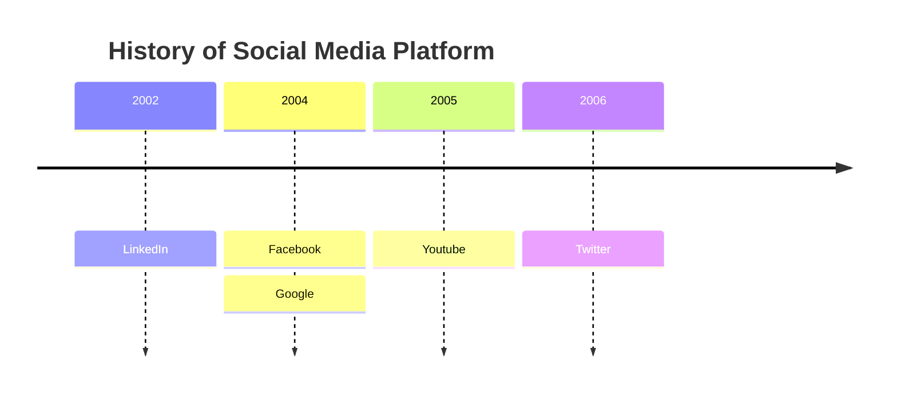

### ZenUML 外部整合

- https://zenuml.com/ 是一個 Sequence Diagram 線上服務
- 語法:
```
zenuml
    title Annotators
    @Actor Alice
    @Database Bob
    Alice->Bob: Hi Bob
    Bob->Alice: Hi Alice
```
- 結果:
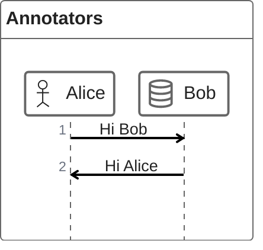

### 桑基圖 Sankey Diagram (常用在展示資料流量)

- 語法：

```
---
config:
  sankey:
    showValues: false
---
sankey-beta

Agricultural 'waste',Bio-conversion,124.729
Bio-conversion,Liquid,0.597
Bio-conversion,Losses,26.862
Bio-conversion,Solid,280.322
Bio-conversion,Gas,81.144
Biofuel imports,Liquid,35
Biomass imports,Solid,35
Coal imports,Coal,11.606
Coal reserves,Coal,63.965
Coal,Solid,75.571
District heating,Industry,10.639
District heating,Heating and cooling - commercial,22.505
District heating,Heating and cooling - homes,46.184
Electricity grid,Over generation / exports,104.453
Electricity grid,Heating and cooling - homes,113.726
Electricity grid,H2 conversion,27.14
Electricity grid,Industry,342.165
Electricity grid,Road transport,37.797
Electricity grid,Agriculture,4.412
Electricity grid,Heating and cooling - commercial,40.858
Electricity grid,Losses,56.691
Electricity grid,Rail transport,7.863
Electricity grid,Lighting & appliances - commercial,90.008
Electricity grid,Lighting & appliances - homes,93.494
Gas imports,Ngas,40.719
Gas reserves,Ngas,82.233
Gas,Heating and cooling - commercial,0.129
Gas,Losses,1.401
Gas,Thermal generation,151.891
Gas,Agriculture,2.096
Gas,Industry,48.58
Geothermal,Electricity grid,7.013
H2 conversion,H2,20.897
H2 conversion,Losses,6.242
H2,Road transport,20.897
Hydro,Electricity grid,6.995
Liquid,Industry,121.066
Liquid,International shipping,128.69
Liquid,Road transport,135.835
Liquid,Domestic aviation,14.458
Liquid,International aviation,206.267
Liquid,Agriculture,3.64
Liquid,National navigation,33.218
Liquid,Rail transport,4.413
Marine algae,Bio-conversion,4.375
Ngas,Gas,122.952
Nuclear,Thermal generation,839.978
Oil imports,Oil,504.287
Oil reserves,Oil,107.703
Oil,Liquid,611.99
Other waste,Solid,56.587
Other waste,Bio-conversion,77.81
Pumped heat,Heating and cooling - homes,193.026
Pumped heat,Heating and cooling - commercial,70.672
Solar PV,Electricity grid,59.901
Solar Thermal,Heating and cooling - homes,19.263
Solar,Solar Thermal,19.263
Solar,Solar PV,59.901
Solid,Agriculture,0.882
Solid,Thermal generation,400.12
Solid,Industry,46.477
Thermal generation,Electricity grid,525.531
Thermal generation,Losses,787.129
Thermal generation,District heating,79.329
Tidal,Electricity grid,9.452
UK land based bioenergy,Bio-conversion,182.01
Wave,Electricity grid,19.013
Wind,Electricity grid,289.366
```

- 結果：

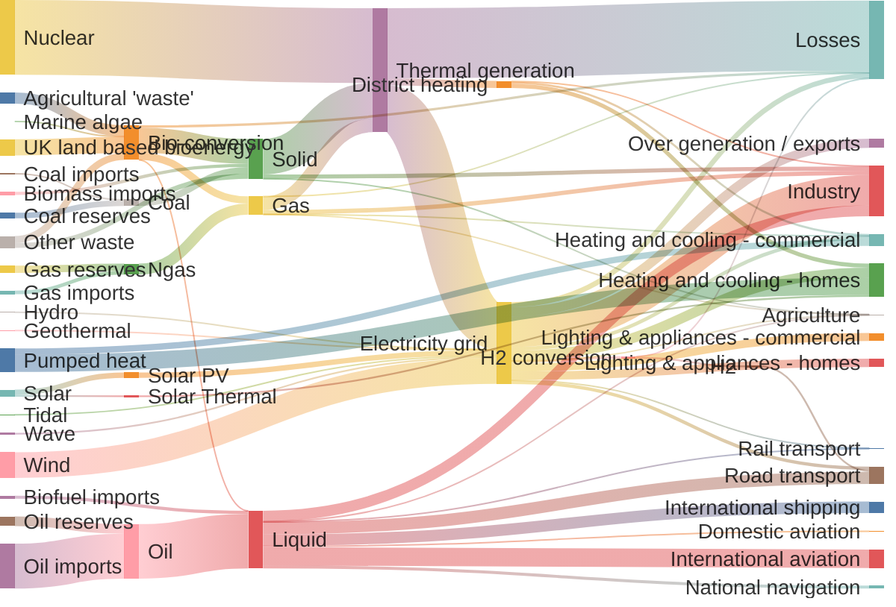

### XY Chart

- 語法：

```
xychart-beta
    title "Sales Revenue"
    x-axis [jan, feb, mar, apr, may, jun, jul, aug, sep, oct, nov, dec]
    y-axis "Revenue (in $)" 4000 --> 11000
    bar [5000, 6000, 7500, 8200, 9500, 10500, 11000, 10200, 9200, 8500, 7000, 6000]
    line [5000, 6000, 7500, 8200, 9500, 10500, 11000, 10200, 9200, 8500, 7000, 6000]
```

- 結果：

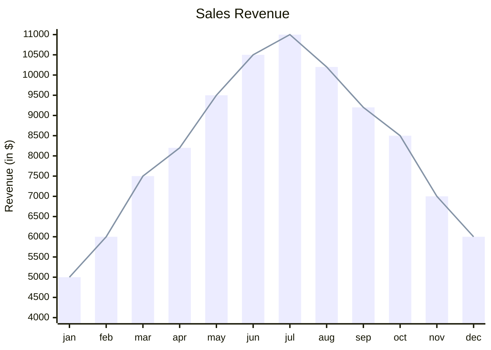

- 這用在 Markdown 寫投影片，應該蠻好用的

### 方塊圖 Block Diagrams

- 語法：
```
block-beta
columns 1
  db(("DB"))
  blockArrowId6<["&nbsp;&nbsp;&nbsp;"]>(down)
  block:ID
    A
    B["A wide one in the middle"]
    C
  end
  space
  D
  ID --> D
  C --> D
  style B fill:#969,stroke:#333,stroke-width:4px
```
- 結果：
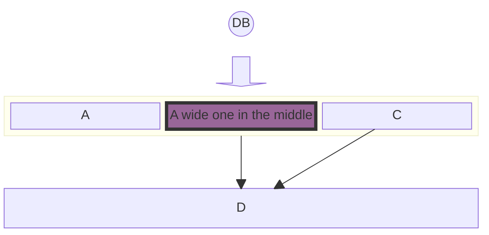

## 2024-06-24

- 測試 Flow Chat 的 subgraph styling

```diff
--- flowchart.org	2024-06-24 16:54:35.000000000 +0800
+++ flowchart.new	2024-06-24 16:53:43.000000000 +0800
@@ -10,5 +10,6 @@
         i2 -->f2
     end
   end
+  style TOP fill:#FFFF00,stroke-width:0px
   A --> TOP --> B
   B1 --> B2
```
- 結果：對比上面的範例，會發現 TOP 這個 subgraph 顏色變成深黃色
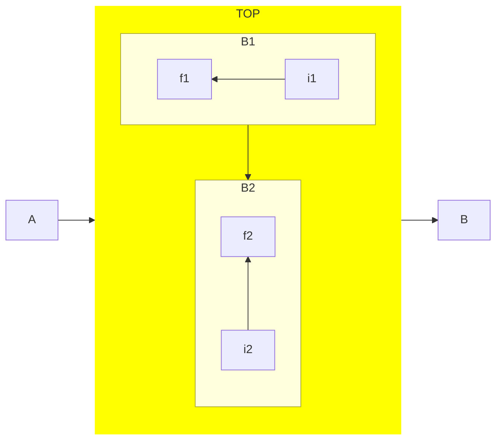