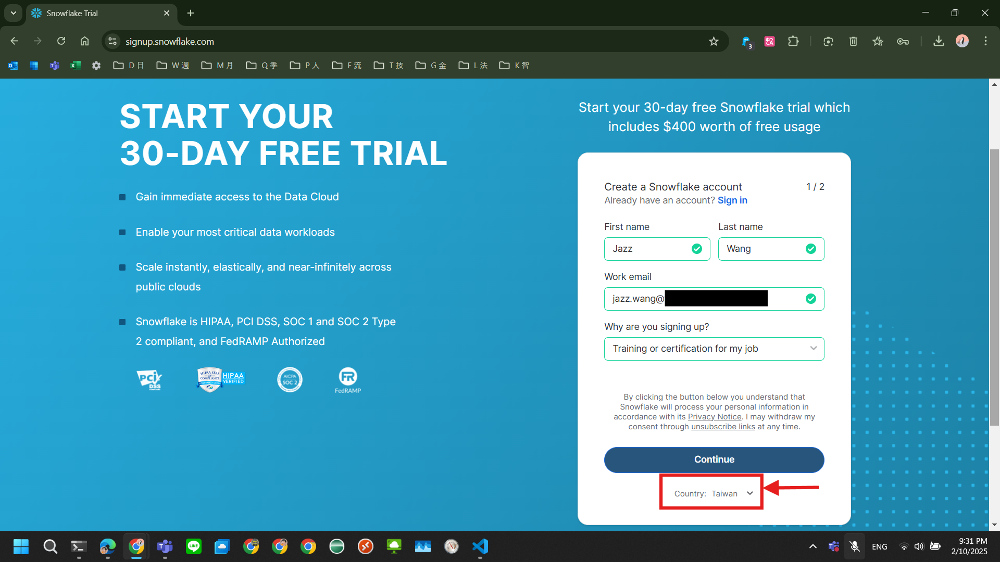
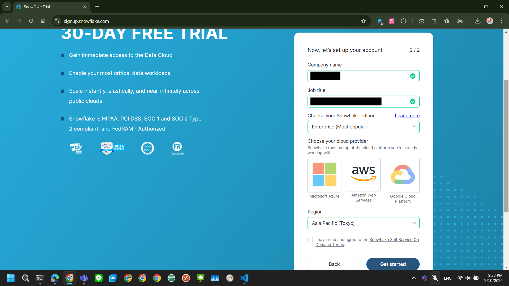
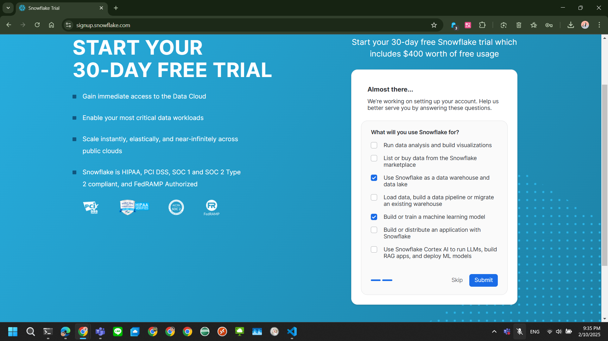
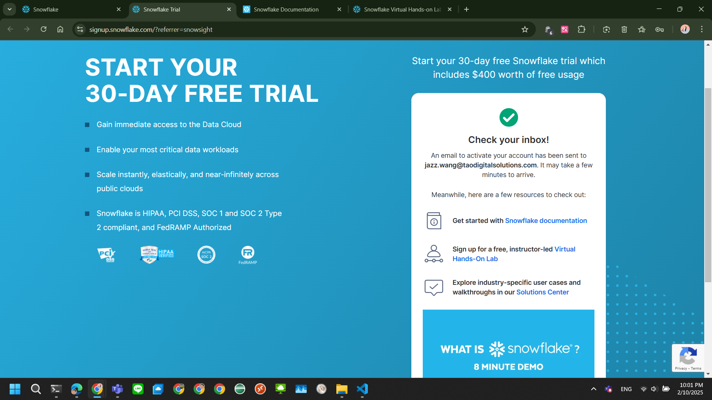

# 30-day free Snowflake trial

- https://signup.snowflake.com/

Start your 30-day free Snowflake trial which includes $400 worth of free usage

- Gain immediate access to the Data Cloud
- Enable your most critical data workloads
- Scale instantly, elastically, and near-infinitely across public clouds
- Snowflake is HIPAA, PCI DSS, SOC 1 and SOC 2 Type 2 compliant, and FedRAMP Authorized

- Get started with [Snowflake documentation](https://docs.snowflake.com/en/)
- Sign up for a free, instructor-led [Virtual Hands-On Lab](https://www.snowflake.com/virtual-hands-on-lab/?utm_cta=self-service-trial-thank-you-vhol)
- Explore industry-specific user cases and walkthroughs in our [Solutions Center](https://developers.snowflake.com/solutions/)

## Upcoming Virtual Hands-On Labs (APJ timezone)

- FROM Zero to Snowflake in 90 Minutes
  - 26 February 2025 - 2:00 PM AEDT | 4:00 PM NZDT | 11:00 AM SGT | 8:30 AM IST
  - https://www.snowflake.com/webinar/virtual-hands-on-labs/from-zero-to-snowflake-in-90-minutes-apac-20250226/
  The GitHub link is
  - https://github.com/Snowflake-Labs/sf-samples/blob/main/samples/tasty_bytes/FY25_Zero_To_Snowflake/tb_introduction.sql

JH
Jonathan Hughes
11:09 AM
Can I ensure my data is only in Pacific region?

Gary North
11:09 AM
Yes - we do not replicate data across clouds or between regions.

https://docs.snowflake.com/en/user-guide/intro-regions

Gary North
11:12 AM
You have the ability to replicate data acrosa clouds and/or regions if you wish.    A further common question that follows on is usually how we handle LLM calls.... the usual approach is that an LLM lives entirely within the Snowflake environment.  No prompts are sent outside of Snowflake, or to third parties etc.  By default we keep AI running within regions an d your AWS/Azure instance

SA
Suma Aithal
11:10 AM
how does snowflake handle failovers?
GN
Gary North
11:13 AM
https://docs.snowflake.com/en/user-guide/account-replication-intro

This will explain Failover in detail

KS
Kiruba Subramaniam
11:15 AM
Is snowflake for large size DB or can we implement for moderate size DB?
GN
Gary North
11:20 AM
Because you only pay for what you use we have customers running very small instances that they have a few GB of data and only use a few times each week with one user.   We only bill customers for Compute that is being run - if you run no queries, you pay nothing for Compute.
Storage is charged per TB per month.

We also have incredibly large customers with thousands of users and petabytes of data.  A very flexible platform.

The poresenter is going to demonastrate cost management.

GN
Gs Norjamaliah Hussin
11:16 AM
Can you share this recording to my email: jamaliah@map2u.com.my?
GN
Gary North
11:20 AM
Recordings will be sent to this session's registrered emails
JH
Jonathan Hughes
11:17 AM
So from your comment the LLM use is contained and secure. No security risk like in Chat GPT.
GN
Gary North
11:25 AM
Precisely - The LLM exists within the Region's Snowflake instance.  Snowflake customer data is not used to train the model.   IF the model is not in your region, but it has been released in the US you can configure your account to reach across region.  The prompt is answered within the securte environment and the model's provider has no access to our data.

Feel free to contact me on LInked In if you would like more details afterwards (linkedin.com/gaznorth I think). - such as DeepSeek recently being made available in our US instances.

Hemant Sharma
11:21 AM
How many Warehouse we can create in snowflake?
GN
Gary North
11:22 AM
As many as you would like - I have a customer with over 800 different warehouses

Mohammed Afzal Shariff
11:23 AM
How is warehouse sizing determined in Snowflake (XS, S, M, L, XL)? What are the thresholds or criteria for each size?
GN
Gary North
11:27 AM
As a rule an XS warehouse is capable of running most customers queries.  I use an XS warehouse over a trillion row table.   IF the query is particularly complex and slow you can double the warehouse size, and effectively half the execution time.  The cost should remain the same - there will be a slide.The real gain is if you are seeing spillage to disk - increasing the warehouse size canb eliminate the spillage and make a huge performance improvement (aka less cost)

Hemant Sharma
11:26 AM
Is there any AI incorporated in Snowflake to help us in different functionality?
GN
Gary North
11:29 AM
Yes - We have features that allow for Vector Embedding, intrerective chatbots with documents or data tables.  Agentic AI is in preview.   Document AI allows for documents to be read and converted into structured data tables, such as a thousand photos of receipts.
The best place to start with AI is our LLM Functions which you can run within your demo account - https://docs.snowflake.com/en/user-guide/snowflake-cortex/llm-functions

Kiruba Subramaniam
11:30 AM
Multi cluster is like RAC in ORacle?
GN
Gary North
11:34 AM
Similar but there is no admin overhead for you, we provide a pool of hot warehouses such that you can access a cluster, run a query and end the cluster.  There is no requirement to start Clusters up, and you you only pay for what you have used

Jonh Marris Cruz
11:31 AM
I'm planning to migrate to the cloud using Snowflake, and I have many stored procedures on my server. Is there a way to transfer them to Snowflake using AI within Snowflake itself?
GN
Gary North
11:34 AM
We recently made a tool available for such requirements - https://www.snowflake.com/en/migrate-to-the-cloud/snowconvert/

NIRAJ Shah
11:31 AM
can you explain QQueue time again
GN
Gary North
11:40 AM
You have a few config optionsfor Query Queueing.  You are not paying for a query whilst it is in a queue, and you can decide to have a query queue timeout - rarely of any use however.
The Warehouse can be configured to start a new cluster if the first cluster is fully utilised (the clusters o\bvious;ly multi-thread and hande many queries simultaneously anyway.
https://docs.snowflake.com/en/user-guide/warehouses-multicluster

Bhalsod Kalpan
11:35 AM
Logged in to my snowflake account and not finding any partner connection for Jira. How to connect with jira cloud to snowflake?
GN
Gary North
11:41 AM
We have a marketplace were partners publish such plugins as well as shared datasets.  Omnata have such a connector - https://app.snowflake.com/marketplace/listing/GZSUZ59IMS/omnata-omnata-jira-plugin

Kiruba Subramaniam
11:36 AM
its like run time we can change to multi cluster or do we need to setup before hand?
GN
Gary North
11:37 AM
A warehouse has a default, but you can change it immediately via the GUI, or programttaically within a script.  The change is immediate

Hemant Sharma
11:37 AM
Do we need to enable any setting to use Time Travel?
GN
Gary North
11:38 AM
There is a default 'days' parameter for the account.  This can be overidden at database, schema or table level.  the command is very straight forwards. https://docs.snowflake.com/en/user-guide/data-time-travel

Simon Rise
11:45 AM
Can I get the intro page of this Tasty Byte demo?
GN
Gary North
11:45 AM
https://github.com/Snowflake-Labs/sf-samples/blob/main/samples/tasty_bytes/FY25_Zero_To_Snowflake/tb_introduction.sql

Hemant Sharma
11:50 AM
Document AI is not visible at my end.
GN
Gary North
11:54 AM
https://docs.snowflake.com/user-guide/snowflake-cortex/document-ai/limitations#label-document-ai-availability
this is the availble regions/clouds

Ashok Kuruba
11:57 AM
Any specific data modeling  methodology recommendation needs to be followed in the SNOWFLAKE as part of the best practice to setup the new warehouse ?
GN
Gary North
11:58 AM
We support Snowflake and Datavault, as well as large flat tables.  (The name Snowflake has nothing to do with Start Schems and Snowflakes)

Warde Wynter
11:57 AM
suggestion ...For the hands on session, it would be good to ensure that users know how to navigate the menu options e.g. the screen shown by the presenter is different to what I see e.g. I don't see tabs
GN
Gary North
11:58 AM
Will feed back.   The tabs across the top are simply different worksheets.

Warde Wynter
12:02 PM
e.g. is it under data > Database
GN
Gary North
12:06 PM
It should be.   type SHOW DATABASES; and run that command and you should see that it actually exists

Kousuke Tachibana
12:08 PM
is Snowflake warehouse the synonym of cluster or working node in Spark context?
GN
Gary North
12:09 PM
Yes - I admit that the term 'warehouse' is a little confusing in a 'Data Warehouse' product.   But A Warehouse is Cluster  (memory/processor/local storage).  They are temporary - we keep a pool of them ready to use.

Warde Wynter
12:09 PM
unfortunently if anyone has issues creating/accessing tb_101, the rest of the session is not very helpful :-(
GN
Gary North
12:11 PM
Agreed - sorry.   The scripts are written such that if you run them from scratch they will work - if you had missed a step it should fix.   You can try selecting the entire script and running it all at once
