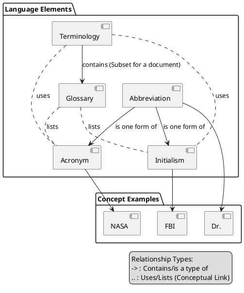

# Abbreviation

- 論文寫作：同樣是縮寫，abbreviation、acronym和initialism有何不同？
  - https://www.editage.com.tw/blog/research/difference-between-abbreviation.html

<table><tr><td>Q:</td><td>
<!-- add your Prompt bellow-->
abbreviation、acronym和initialism有何不同
</td></tr><tr><td>A:</td><td>
<!-- add Chatbot Response bellow-->
這三個術語都與縮短詞語有關，但在用法和發音上有細微的區別：

---

## 1. Abbreviation (縮寫)

**Abbreviation** 是最廣泛的通用術語，泛指任何將一個詞或短語縮短的表示方式。

* **特點：** 可以是任何形式的縮短。
* **發音：** 通常會讀出縮寫字母所代表的完整單詞。
* **例子：**
    * **Dr.** (Doctor, 醫生)
    * **etc.** (et cetera, 等等)
    * **Jan.** (January, 一月)
    * **Mr.** (Mister, 先生)

---

## 2. Acronym (首字母縮略詞 - 可拼讀)

**Acronym** 是由一個短語中每個單詞的**首字母**組成的，但它的關鍵特點是它可以**像一個新單詞一樣被拼讀出來**。

* **特點：** 必須由首字母組成，且能連起來發音。
* **發音：** 像一個單詞。
* **例子：**
    * **NASA** (National Aeronautics and Space Administration) - 讀作 /'næsə/
    * **NATO** (North Atlantic Treaty Organization) - 讀作 /'neɪtoʊ/
    * **RADAR** (Radio Detection and Ranging) - 讀作 /'reɪdɑːr/
    * **UAT** (User Acceptance Testing) - 許多人會將其讀作 /juːæt/

---

## 3. Initialism (首字母縮略詞 - 逐字母發音)

**Initialism** 也是由一個短語中每個單詞的**首字母**組成，但與 Acronym 不同，它的發音是**逐一讀出每個字母**。

* **特點：** 必須由首字母組成，且只能逐字母發音。
* **發音：** 逐一讀出每個字母。
* **例子：**
    * **DIT** (Development Independent Testing) - 讀作 /diː aɪ tiː/
    * **QAT** (Quality Assurance Testing) - 讀作 /kjuː eɪ tiː/
    * **FBI** (Federal Bureau of Investigation) - 讀作 /ɛf biː aɪ/
    * **USB** (Universal Serial Bus) - 讀作 /juː ɛs biː/

***

### 總結表格

| 術語 | 構成方式 | 發音方式 | 包含關係 | 範例 |
| :--- | :--- | :--- | :--- | :--- |
| **Abbreviation** (縮寫) | 任何縮短形式 | 讀完整單詞 | 最廣泛的總稱 | Dr., Jan., etc. |
| **Acronym** (可拼讀) | 首字母 | **像單詞一樣連讀** | 屬於 Abbreviation | NASA, NATO, UAT (常連讀) |
| **Initialism** (逐字母) | 首字母 | **逐一讀出字母** | 屬於 Abbreviation | DIT, QAT, FBI |

### 概念上的簡單理解

您可以這樣記：

* **Abbreviation** 是「大類」，所有的縮短詞都是它。
* **Acronym** 是「可拼讀」的首字母縮寫。
* **Initialism** 是「不可拼讀」的首字母縮寫。

因為 Initialism 和 Acronym **都**是用首字母構成的，所以在口語中，人們經常會將它們統稱為 **Acronym**（首字母縮略詞），但嚴格來說，發音方式是區分它們的關鍵。
</td></tr></table>

<table><tr><td>Q:</td><td>
<!-- add your Prompt bellow-->
could you visualize the relationship between Terminology, Glossary, Abbreviation, Acronym, Initialism using plantuml syntax?
</td></tr><tr><td>A:</td><td>
<!-- add Chatbot Response bellow-->
You absolutely can visualize those relationships using **PlantUML** syntax. The diagram below uses the PlantUML standard for a simple tree or hierarchy, highlighting the containment and classification structure.

Here is the PlantUML code, followed by an explanation of the relationships:

-----

## Relationship Breakdown

### 1\. The Domain of Words

  * **Terminology** is the highest-level concept. It represents the entire **system or collection of specialized words** within a specific field (e.g., all IT terms).
  * **Glossary** is a **subset** of Terminology. It is a specific **list** of terms and their definitions, usually found at the end of a particular document or book.

### 2\. The Abbreviation Hierarchy

  * **Abbreviation** is the general term for **any shortened form** of a word or phrase.
  * **Acronym** and **Initialism** are **two specific types** of Abbreviation, both created using the first letter of each word in a phrase.
      * **Acronym** is the type that is **pronounced as a single word** (e.g., NASA, NATO).
      * **Initialism** is the type that is **pronounced by spelling out each letter** (e.g., FBI, QAT).
</td></tr></table>

## 2025-11-16

| Abbreviation | Full Form | 中文 | Reference |
|--------------|-----------|------|-----------|
| FOMO | Fear of missing out | 錯失恐懼症 | https://en.wikipedia.org/wiki/Fear_of_missing_out |
