# US Healthcare PHI/PII Data Flow — Secondary Uses Across Domains

> 美國醫療院所蒐集的 HL7/PHI/PII 資料後續被應用在哪些不同領域？

## 主要參考來源

| 來源 | 年份 | 說明 |
|------|------|------|
| [Health Data in the Information Age (IOM/NRC)](https://www.ncbi.nlm.nih.gov/books/NBK236546/) | 1994 | 最早系統性列出所有健康資料使用者的報告 |
| [For the Record: Protecting Electronic Health Information (NRC)](https://www.ncbi.nlm.nih.gov/books/NBK233429/) | 1997 | 國家研究委員會報告，含資料流向圖 |
| [Promoting Health Protecting Privacy (CHCF)](https://www.chcf.org/wp-content/uploads/2017/12/PDF-conprimer.pdf) | 1999 | 加州健康照護基金會，含 Sample Data Flow 圖 |
| [Dr. Latanya Sweeney — theDataMap](https://thedatamap.org/maps.html) | 2010-2013 | Harvard Data Privacy Lab，最完整的資料流向地圖 |
| [HIPAA Privacy Rule — 45 CFR § 164.512](https://www.law.cornell.edu/cfr/text/45/164.512) | 2000+ | HIPAA 允許揭露 PHI 的法定情境 |
| [HL7 FHIR MedMorph Use Cases](http://hl7.org/fhir/us/medmorph/usecases.html) | 2020+ | HL7 FHIR 標準定義的公衛/研究資料交換用例 |
| [Clinical Data Reuse or Secondary Use (PMC)](https://pmc.ncbi.nlm.nih.gov/articles/PMC6239225/) | 2018 | 臨床資料二次利用的完整分類 |
| [Dr. Deborah Peel — Patient Privacy Rights](https://patientprivacyrights.org/) | 2004+ | 病患隱私倡議，揭露資料流向問題 |

---

## Mermaid.js 資料流向圖

```mermaid
graph TB
    %% ===== 資料源頭 =====
    HC["🏥 醫療院所<br/>(Hospitals, Clinics, Physicians)"]
    EHR["📋 電子健康紀錄 EHR/EMR<br/>(HL7 / FHIR / CDA)"]
    PHI["🔒 PHI / PII 資料<br/>姓名、地址、SSN、診斷碼<br/>處方、檢驗結果、帳單"]

    HC --> EHR --> PHI

    %% ===== 一級：臨床治療 (Treatment) =====
    subgraph CLINICAL["🩺 臨床治療 Clinical Care"]
        C1["其他醫療提供者<br/>(Specialists, Referrals)"]
        C2["藥局 Pharmacies"]
        C3["檢驗所 Labs"]
        C4["影像中心 Imaging Centers"]
        C5["長照/居家照護<br/>(Long-term Care)"]
    end

    %% ===== 二級：支付/保險 (Payment) =====
    subgraph INSURANCE["💰 金融保險 Financial & Insurance"]
        I1["健康保險公司<br/>(Health Insurers / HMOs)"]
        I2["人壽/失能保險<br/>(Life & Disability Insurers)"]
        I3["醫療資訊局 MIB<br/>(Medical Information Bureau)"]
        I4["理賠處理<br/>(Claims Processing / Clearinghouses)"]
        I5["自保雇主<br/>(Self-insured Employers under ERISA)"]
        I6["再保險公司<br/>(Reinsurance)"]
    end

    %% ===== 三級：政府與公衛 (Government & Public Health) =====
    subgraph GOV["🏛️ 政府與公衛 Government & Public Health"]
        G1["CDC 疾病管制<br/>(Disease Surveillance)"]
        G2["州立衛生部門<br/>(State Health Departments)"]
        G3["CMS 聯邦醫療保險<br/>(Medicare/Medicaid)"]
        G4["FDA 藥物不良反應<br/>(Adverse Event Reporting)"]
        G5["公衛登記<br/>(Cancer/Birth/Death Registries)"]
        G6["SAMHSA 藥物濫用<br/>(Substance Abuse)"]
        G7["國家衛生調查<br/>(NHCS, NAMCS, BRFSS)"]
    end

    %% ===== 四級：政策制定 (Policy Making) =====
    subgraph POLICY["📊 政策制定 Policy Making"]
        P1["HHS 衛生部<br/>(Health Policy Development)"]
        P2["國會/州議會<br/>(Legislative Analysis)"]
        P3["AHRQ 醫療品質研究<br/>(Quality & Cost Analysis)"]
        P4["精算分析<br/>(Actuarial Analysis)"]
        P5["健康不平等研究<br/>(Health Disparities)"]
    end

    %% ===== 五級：研究 (Research) =====
    subgraph RESEARCH["🔬 研究 Research"]
        R1["臨床試驗<br/>(Clinical Trials / IRB)"]
        R2["流行病學研究<br/>(Epidemiology)"]
        R3["藥廠 R&D<br/>(Pharmaceutical Companies)"]
        R4["學術機構<br/>(Universities / NIH)"]
        R5["健康服務研究<br/>(Health Services Research)"]
        R6["AI/機器學習模型<br/>(Predictive Analytics)"]
    end

    %% ===== 六級：雇主 (Employers) =====
    subgraph EMPLOYER["🏢 雇主 Employers"]
        E1["職前健檢<br/>(Pre-employment Physicals)"]
        E2["藥物檢測<br/>(Drug Testing)"]
        E3["職場安全/OSHA<br/>(Workplace Safety)"]
        E4["員工福利管理<br/>(Benefits Administration)"]
        E5["職業傷害/勞工賠償<br/>(Workers' Compensation)"]
    end

    %% ===== 七級：法律/執法 (Legal & Law Enforcement) =====
    subgraph LEGAL["⚖️ 法律與執法 Legal & Law Enforcement"]
        L1["律師/訴訟<br/>(Attorneys / Litigation)"]
        L2["法院命令<br/>(Court Orders / Subpoenas)"]
        L3["FBI / 執法機關<br/>(Law Enforcement)"]
        L4["醫療糾紛<br/>(Malpractice)"]
        L5["鑑識調查<br/>(Forensic Investigation)"]
    end

    %% ===== 八級：社會服務 (Social Services) =====
    subgraph SOCIAL["🤝 社會服務 Social Services"]
        S1["SSA 社會安全局<br/>(Disability Determinations)"]
        S2["社會福利<br/>(Welfare / Medicaid Eligibility)"]
        S3["退伍軍人事務部 VA"]
        S4["移民局 USCIS/INS"]
        S5["兒童保護服務<br/>(Child Protective Services)"]
    end

    %% ===== 九級：商業/行銷 (Commercial & Marketing) =====
    subgraph COMMERCIAL["📢 商業與行銷 Commercial & Marketing"]
        M1["處方分析公司<br/>(IMS Health / IQVIA)"]
        M2["藥品行銷<br/>(Pharma Marketing / DTC)"]
        M3["資料掮客<br/>(Data Brokers)"]
        M4["信用評估<br/>(Credit / Lending Decisions)"]
        M5["健康科技公司<br/>(Health Tech / Apps)"]
        M6["穿戴裝置公司<br/>(Wearables)"]
    end

    %% ===== 十級：品質認證 (Oversight & Accreditation) =====
    subgraph OVERSIGHT["✅ 品質認證與監管 Oversight"]
        O1["JCAHO / TJC<br/>(醫院評鑑)"]
        O2["NCQA<br/>(健保品質認證)"]
        O3["州立醫療委員會<br/>(Medical Boards)"]
        O4["反詐欺調查<br/>(Fraud Detection / OIG)"]
        O5["IRB 倫理審查<br/>(Institutional Review Board)"]
    end

    %% ===== 十一級：教育 (Education) =====
    subgraph EDU["🎓 教育訓練 Education"]
        ED1["醫學教育<br/>(Medical Schools)"]
        ED2["住院醫師訓練<br/>(Residency Programs)"]
        ED3["公衛教育<br/>(Public Health Training)"]
    end

    %% ===== 連線：PHI 流向各領域 =====
    PHI -->|"治療/轉介<br/>§164.506"| CLINICAL
    PHI -->|"支付/核保<br/>§164.506"| INSURANCE
    PHI -->|"公衛通報<br/>§164.512(b)"| GOV
    PHI -->|"政策分析<br/>(去識別化)"| POLICY
    PHI -->|"研究用途<br/>§164.512(i) / IRB"| RESEARCH
    PHI -->|"雇主揭露<br/>§164.512(b)"| EMPLOYER
    PHI -->|"法律程序<br/>§164.512(e)(f)"| LEGAL
    PHI -->|"政府計畫<br/>§164.512(k)"| SOCIAL
    PHI -->|"行銷/販售<br/>授權或去識別化"| COMMERCIAL
    PHI -->|"品質監管<br/>§164.512(d)"| OVERSIGHT
    PHI -->|"教育訓練<br/>(去識別化)"| EDU

    %% ===== 跨領域連線 =====
    I1 -.->|"保費精算"| P4
    I3 -.->|"承保評估"| I2
    G1 -.->|"政策建議"| P1
    R3 -.->|"藥品上市"| M2
    M1 -.->|"處方資料"| R3
    O4 -.->|"調查移送"| L3
    E5 -.->|"賠償訴訟"| L1
    G3 -.->|"支付稽核"| O4
    R6 -.->|"風險預測"| I1
    M3 -.->|"消費者資料"| M4

    %% ===== 樣式 =====
    classDef source fill:#ff6b6b,stroke:#c0392b,color:#fff,font-weight:bold
    classDef clinical fill:#74b9ff,stroke:#2980b9,color:#000
    classDef finance fill:#fdcb6e,stroke:#f39c12,color:#000
    classDef gov fill:#a29bfe,stroke:#6c5ce7,color:#000
    classDef policy fill:#dfe6e9,stroke:#636e72,color:#000
    classDef research fill:#55efc4,stroke:#00b894,color:#000
    classDef employer fill:#fab1a0,stroke:#e17055,color:#000
    classDef legal fill:#ffeaa7,stroke:#fdcb6e,color:#000
    classDef social fill:#81ecec,stroke:#00cec9,color:#000
    classDef commercial fill:#fd79a8,stroke:#e84393,color:#fff
    classDef oversight fill:#b2bec3,stroke:#636e72,color:#000
    classDef edu fill:#c7ecee,stroke:#22a6b3,color:#000

    class HC,EHR,PHI source
    class C1,C2,C3,C4,C5 clinical
    class I1,I2,I3,I4,I5,I6 finance
    class G1,G2,G3,G4,G5,G6,G7 gov
    class P1,P2,P3,P4,P5 policy
    class R1,R2,R3,R4,R5,R6 research
    class E1,E2,E3,E4,E5 employer
    class L1,L2,L3,L4,L5 legal
    class S1,S2,S3,S4,S5 social
    class M1,M2,M3,M4,M5,M6 commercial
    class O1,O2,O3,O4,O5 oversight
    class ED1,ED2,ED3 edu
```

---

## 各領域使用 PHI/PII 的詳細說明

### 1. 🩺 臨床治療 (Clinical Care) — HIPAA §164.506 TPO
- **資料類型**: 完整 PHI（診斷、處方、檢驗、影像）
- **法律依據**: Treatment, Payment, Operations (TPO) — 不需病患額外授權
- **HL7 標準**: CDA, FHIR (Patient, Encounter, MedicationRequest, DiagnosticReport)

### 2. 💰 金融保險 (Financial & Insurance)
- **健康保險**: 理賠審核、給付決定、利用審查 (Utilization Review)
- **人壽/失能保險**: 核保 (Underwriting)、保費計算、拒保決定
- **MIB**: 保險公司共享的編碼醫療資訊，用於防止詐欺投保
- **自保雇主 (ERISA)**: 聯邦法允許自保雇主存取員工理賠資料
- **信用決定**: 醫療債務影響信用評分

### 3. 🏛️ 政府與公衛 (Government & Public Health) — §164.512(b)
- **疾病監測**: 法定傳染病通報 (Mandatory Reporting)
- **登記資料**: 癌症登記、出生/死亡登記、疫苗接種登記
- **藥物監測**: FDA 不良事件通報 (VAERS, MedWatch)
- **國家調查**: NHCS, NAMCS, BRFSS 等全國健康調查
- **HL7 MedMorph**: 自動化公衛通報的 FHIR 實作指引

### 4. 📊 政策制定 (Policy Making)
- **資料形式**: 通常為去識別化 (De-identified) 或有限資料集 (Limited Data Set)
- **用途**: 醫療支出分析、健康不平等研究、立法影響評估
- **機構**: HHS, AHRQ, CBO, GAO, 州衛生部門
- **精算**: 保費費率制定、Medicare/Medicaid 預算預測

### 5. 🔬 研究 (Research) — §164.512(i)
- **臨床試驗**: 需 IRB 審查或 HIPAA 豁免 (Waiver)
- **流行病學**: 疾病模式、風險因子研究
- **藥廠 R&D**: 藥物療效、安全性、上市後監測 (Post-market Surveillance)
- **AI/ML**: 預測模型訓練（風險預測、早期診斷）
- **去識別化標準**: Safe Harbor（移除18項識別碼）或 Expert Determination

### 6. 🏢 雇主 (Employers)
- **職前健檢**: ADA 限制下的體檢/藥檢
- **職場安全**: OSHA 要求的工傷記錄
- **勞工賠償**: Workers' Compensation 理賠
- **ERISA 自保**: 可直接存取員工理賠資料

### 7. ⚖️ 法律與執法 (Legal & Law Enforcement) — §164.512(e)(f)
- **法院命令**: 傳票、搜索令
- **執法**: 犯罪調查、身份確認、嫌疑犯追蹤
- **醫療訴訟**: 醫療疏失、人身傷害案件
- **鑑識**: 死因調查、法醫鑑定

### 8. 🤝 社會服務 (Social Services) — §164.512(k)
- **SSA**: 失能判定 (Disability Determinations)
- **福利資格**: Medicaid/CHIP 資格審查
- **兒童保護**: 疑似虐兒通報
- **移民**: 移民健康檢查

### 9. 📢 商業與行銷 (Commercial & Marketing)
- **處方分析**: IMS Health (現 IQVIA) 購買藥局處方資料
- **藥品行銷**: 直接面向消費者廣告 (DTC)
- **資料掮客**: 編譯販售去識別化健康資料
- **HIPAA 限制**: 行銷需個人授權（§164.508），但有例外

### 10. ✅ 品質認證與監管 (Oversight) — §164.512(d)
- **醫院評鑑**: TJC (JCAHO) 品質審查
- **健保認證**: NCQA 健保品質評比
- **反詐欺**: OIG, FBI 醫療詐欺調查
- **醫療委員會**: 醫師執照審查

### 11. 🎓 教育訓練 (Education)
- **醫學教育**: 教學案例（通常去識別化）
- **住院醫師**: 臨床實作訓練中接觸 PHI

---

## Dr. Latanya Sweeney 的 theDataMap 重要發現

> **「HIPAA 隱私規則實施後，接收個人健康資料的實體類別數量增加了一倍以上。」**

- 1997 年 National Academy Press 版本的資料流向圖
- 2001 年 California HealthCare Foundation 版本
- 2010 年 Dr. Sweeney 的版本顯示資料接收者大幅增加
- 網址: https://thedatamap.org/maps.html （可能已離線，可透過 Wayback Machine 存取）

---

## 另見

- [NCBI — Confidentiality and Privacy of Personal Data](https://www.ncbi.nlm.nih.gov/books/NBK236546/) — 最完整的 PHI 使用者清單
- [45 CFR § 164.512 — HIPAA Permitted Disclosures](https://www.law.cornell.edu/cfr/text/45/164.512)
- [Patient Privacy Rights (Dr. Deborah Peel)](https://patientprivacyrights.org/)
- [Lawrence Gostin — Health Information Privacy (1995)](https://scholarship.law.georgetown.edu/facpub/752/)
