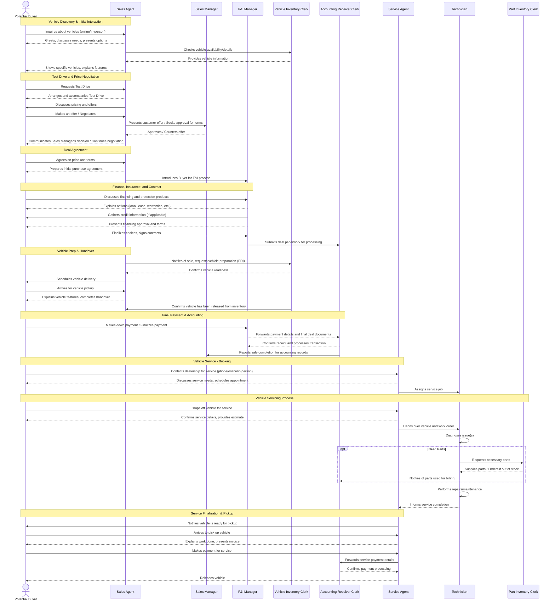

# 

- https://g.co/gemini/share/81da84f7c726
  - Due to limitation of [mermaid.js issue #458](https://github.com/mermaid-js/mermaid/issues/458)

```mermaid
sequenceDiagram
    actor PB as Potential Buyer
    participant SA as Sales Agent
    participant SM as Sales Manager
    participant FIM as F&I Manager
    participant VIC as Vehicle Inventory Clerk
    participant ARC as Accounting Receiver Clerk
    participant SVA as Service Agent
    participant TECH as Technician
    participant PIC as Part Inventory Clerk

    %% --- 1. Initial Contact & Vehicle Exploration ---
    Note over PB, SA: Vehicle Discovery & Initial Interaction
    PB->>SA: Inquires about vehicles (online/in-person)
    SA-->>PB: Greets, discusses needs, presents options
    SA->>VIC: Checks vehicle availability/details
    VIC-->>SA: Provides vehicle information
    SA-->>PB: Shows specific vehicles, explains features

    %% --- 2. Test Drive & Negotiation ---
    Note over PB, SA: Test Drive and Price Negotiation
    PB->>SA: Requests Test Drive
    SA-->>PB: Arranges and accompanies Test Drive
    SA->>PB: Discusses pricing and offers
    PB->>SA: Makes an offer / Negotiates
    SA->>SM: Presents customer offer / Seeks approval for terms
    SM-->>SA: Approves / Counters offer
    SA-->>PB: Communicates Sales Manager's decision / Continues negotiation

    %% --- 3. Deal Agreement & Initial Paperwork ---
    Note over PB, SA: Deal Agreement
    PB->>SA: Agrees on price and terms
    SA-->>PB: Prepares initial purchase agreement
    SA->>FIM: Introduces Buyer for F&I process

    %% --- 4. Finance & Insurance (F&I) Process ---
    Note over PB, FIM: Finance, Insurance, and Contract
    PB->>FIM: Discusses financing and protection products
    FIM-->>PB: Explains options (loan, lease, warranties, etc.)
    FIM->>PB: Gathers credit information (if applicable)
    FIM-->>PB: Presents financing approval and terms
    PB->>FIM: Finalizes choices, signs contracts
    FIM->>ARC: Submits deal paperwork for processing

    %% --- 5. Vehicle Preparation & Delivery ---
    Note over SA, PB: Vehicle Prep & Handover
    SA->>VIC: Notifies of sale, requests vehicle preparation (PDI)
    VIC-->>SA: Confirms vehicle readiness
    SA->>PB: Schedules vehicle delivery
    PB->>SA: Arrives for vehicle pickup
    SA-->>PB: Explains vehicle features, completes handover
    VIC->>SA: Confirms vehicle has been released from inventory

    %% --- 6. Payment & Accounting Finalization ---
    Note over PB, ARC: Final Payment & Accounting
    PB->>FIM: Makes down payment / Finalizes payment
    FIM-->>ARC: Forwards payment details and final deal documents
    ARC-->>FIM: Confirms receipt and processes transaction
    ARC->>SM: Reports sale completion for accounting records

    %% --- 7. Post-Sale: Service Booking ---
    Note over PB, SVA: Vehicle Service - Booking
    PB->>SVA: Contacts dealership for service (phone/online/in-person)
    SVA-->>PB: Discusses service needs, schedules appointment
    SVA->>TECH: Assigns service job

    %% --- 8. Vehicle Servicing ---
    Note over PB, PIC: Vehicle Servicing Process
    PB->>SVA: Drops off vehicle for service
    SVA-->>PB: Confirms service details, provides estimate
    SVA->>TECH: Hands over vehicle and work order
    TECH->>TECH: Diagnoses issue(s)
    opt Need Parts
        TECH->>PIC: Requests necessary parts
        PIC-->>TECH: Supplies parts / Orders if out of stock
        PIC->>ARC: Notifies of parts used for billing
    end
    TECH->>TECH: Performs repairs/maintenance
    TECH-->>SVA: Informs service completion

    %% --- 9. Service Completion, Payment & Pickup ---
    Note over PB, SVA: Service Finalization & Pickup
    SVA->>PB: Notifies vehicle is ready for pickup
    PB->>SVA: Arrives to pick up vehicle
    SVA-->>PB: Explains work done, presents invoice
    PB->>SVA: Makes payment for service
    SVA->>ARC: Forwards service payment details
    ARC-->>SVA: Confirms payment processing
    SVA-->>PB: Releases vehicle
```
