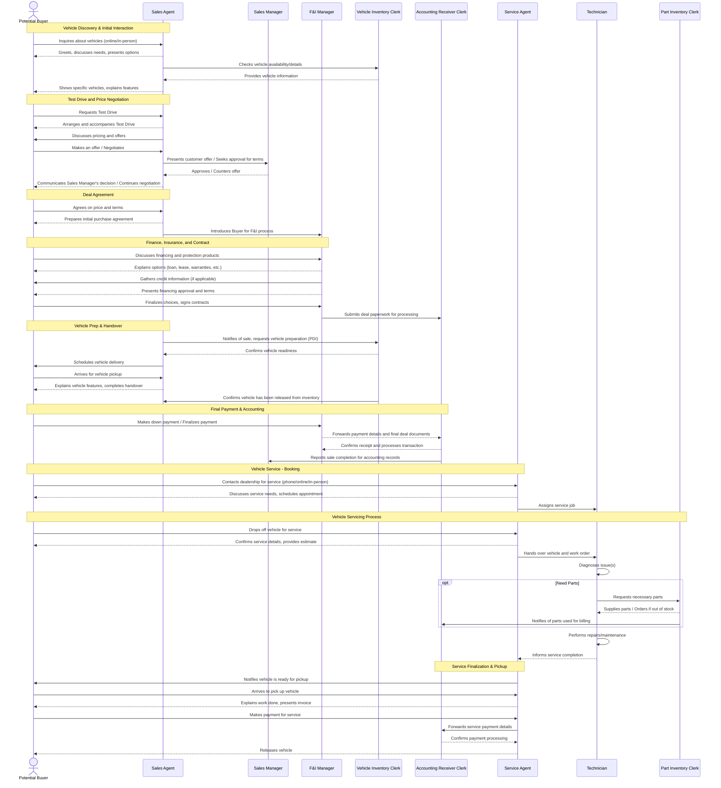
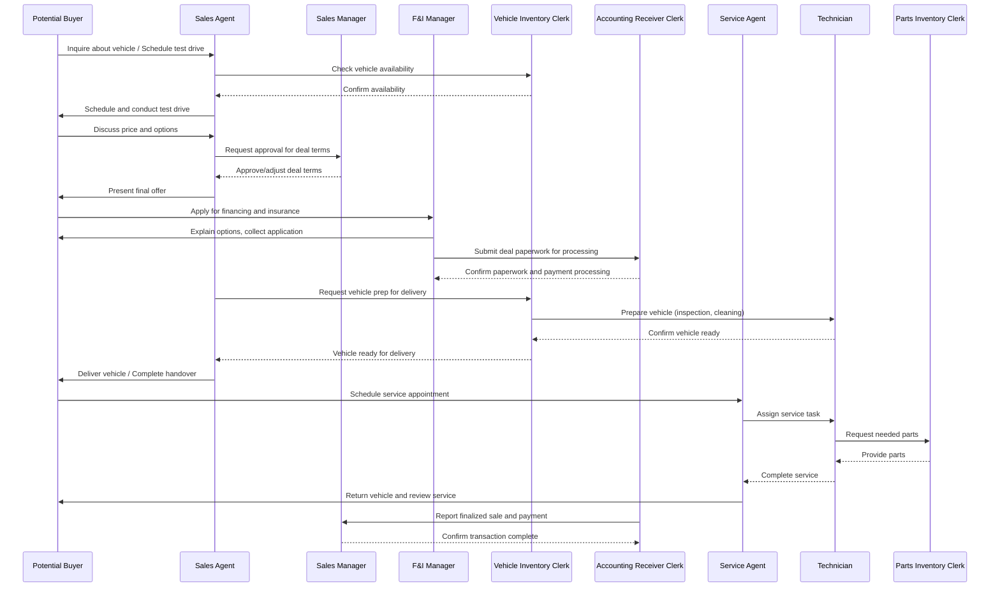

# Vehicle Dealership User Journey

## Gemini

> - Source: https://g.co/gemini/share/2b98458b29a1
> - Created with 2.5 Pro (preview) June 5, 2025 at 12:42 AM (2025-06-05T00:42:00+08:00)
>  - Due to limitation of [mermaid.js issue #458](https://github.com/mermaid-js/mermaid/issues/458)
>    I've correct the mermaid.js `note over` syntax error in Gemini's response.

<table><tr><td>Q:</td><td>
<!-- add your Prompt bellow-->
could you draw dealership user journey diagram using mermaid.js sequence diagram syntax to visualize the interaction between potential vehicle buyer, sales agent, sales manager, finance and insurance (F&I) manager, vehicle inventory clerk, accounting receiver clerk, service agent, technician and part inventory clerk?
</td></tr><tr><td>A:</td><td>
<!-- add Chatbot Response bellow-->
Okay, I can help you visualize that! Here's the Mermaid.js sequence diagram syntax for a dealership user journey. This diagram will show the interactions between the potential buyer and the various dealership roles you mentioned.

This diagram outlines the key interactions in a typical dealership journey. You can copy this syntax and use it with any tool that supports Mermaid.js to generate the visual sequence diagram.

Let me know if you'd like any specific part of this journey elaborated further or if you have other scenarios in mind!

</td></tr></table>

## Perplexity

> - Source: https://www.perplexity.ai/search/could-you-draw-dealership-user-bePPwCRNQxGrk1mtZsYjHA#0
> - Created: Wednesday, June 4, 2025 at 11:56:27 PM Taipei Standard Time = 2025-06-05T23:56:27+08:00

<table><tr><td>Q:</td><td>
<!-- add your Prompt bellow-->
could you draw dealership user journey diagram using mermaid.js sequence diagram syntax to visualize the interaction between potential vehicle buyer, sales agent, sales manager, finance and insurance (F\&I) manager, vehicle inventory clerk, accounting receiver clerk, service agent, technician and part inventory clerk?
</td></tr><tr><td>A:</td><td>
<!-- add Chatbot Response bellow-->
Here is a dealership user journey sequence diagram using Mermaid.js syntax. This diagram visualizes the key interactions between a potential vehicle buyer and the core dealership roles: Sales Agent, Sales Manager, Finance \& Insurance (F\&I) Manager, Vehicle Inventory Clerk, Accounting Receiver Clerk, Service Agent, Technician, and Parts Inventory Clerk. The flow covers the typical buyer journey from initial inquiry to post-sale service, based on industry-standard processes[^3][^6][^1].

**Explanation of Key Interactions:**

- The journey starts with the buyer reaching out to the sales agent, who coordinates with the inventory clerk to confirm vehicle availability and schedules a test drive[^3][^1].
- Negotiation involves the sales manager for deal approval, ensuring the buyer gets the best possible terms[^3].
- The F\&I manager assists the buyer with financing and insurance, working closely with the accounting receiver clerk to process paperwork and payments[^6].
- The vehicle inventory clerk and technician prepare the vehicle for delivery, after which the sales agent completes the handover[^3].
- Post-sale, the buyer interacts with the service agent for maintenance, involving the technician and parts inventory clerk as needed.
- The accounting receiver clerk finalizes the transaction and reports to the sales manager[^2].

This sequence diagram provides a comprehensive overview of the multi-departmental interactions that create a seamless dealership customer experience[^1][^4][^5].

⁂

[^1]: https://www.automotivemastermind.com/blog/uncategorized/how-to-create-a-seamless-dealership-customer-experience-from-online-to-in-store/
[^2]: https://www.rvda.org/App_Themes/RVDAMercury/docs/CareerCo%20Job%20Descriptions.pdf
[^3]: https://www.edmunds.com/car-buying/dealership-flow-chart-know-what-to-expect.html
[^4]: https://insight7.io/customer-journey-map-for-automotive-businesses/
[^5]: https://www.activengage.com/customer-journey-optimization-part-1/
[^6]: https://www.indeed.com/hire/job-description/finance-insurance-manager
[^7]: https://www.ey.com/en_gl/insights/automotive/why-human-interaction-remains-essential-to-the-car-buying-journey
[^8]: https://www.nngroup.com/articles/customer-journey-management/
[^9]: https://devsquad.com/blog/user-journey-mapping
[^10]: https://www.nice.com/info/mastering-the-user-journey-map-best-practices-and-examples

</td></tr></table>
