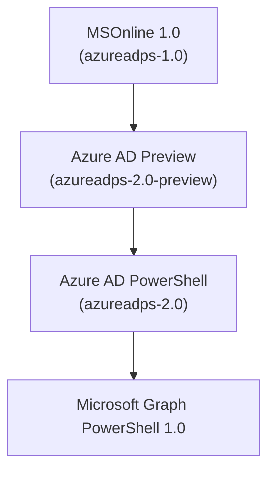

# MSOnline PowerShell Module

- PowerShell Gallery
  - https://www.powershellgallery.com/packages/MSOnline
- Document:
  - https://learn.microsoft.com/en-us/powershell/module/msonline/?view=azureadps-1.0


> 從名稱 `azureadps-1.0` 看起來，可能跟 Azure AD 有關。

```
       +-- Active Directory
      _+
 azureadps-1.0
 ^^^^^++**
 |     | |
 |     | +-- PowerShell 
 Azure Active Directory
```

> [!IMPORTANT]
> Azure AD and MSOnline PowerShell modules are deprecated as of March 30, 2024. To learn more, read the [deprecation update](https://techcommunity.microsoft.com/t5/microsoft-entra-blog/important-update-deprecation-of-azure-ad-powershell-and-msonline/ba-p/4094536). After this date, support for these modules are limited to migration assistance to Microsoft Graph PowerShell SDK and security fixes. The deprecated modules will continue to function through <mark>March, 30 2025</mark>.
> 
> We recommend migrating to [Microsoft Graph PowerShell](https://learn.microsoft.com/en-us/powershell/microsoftgraph/overview) to interact with Microsoft Entra ID (formerly Azure AD). For common migration questions, refer to the [Migration FAQ](https://learn.microsoft.com/en-us/powershell/azure/active-directory/migration-faq). *Note:* Versions 1.0.x of MSOnline may experience disruption after <mark>June 30, 2024</mark>.

## 2025-02-20

### 緣起

由於先後在兩個 Enterpise 等級的組織中，都遇到不允許使用 Microsoft Graph 的限制，所以問了一下 Bing Copilot 有沒有替代方案。

### Bing Copilot 建議

Yes, you can use the MSOnline or AzureAD PowerShell modules to fetch user information such as job title, email, and department. Here are examples for both:

#### Using MSOnline Module

1. **Install the MSOnline Module**:
   ```powershell
   Install-Module -Name MSOnline -Force
   ```

2. **Connect to MSOnline**:
   ```powershell
   Connect-MsolService
   ```

3. **Fetch User Information**:
   ```powershell
   Get-MsolUser -UserPrincipalName 'user@example.com' | Select-Object DisplayName, UserPrincipalName, Title, Department
   ```

#### Using AzureAD Module

1. **Install the AzureAD Module**:
   ```powershell
   Install-Module -Name AzureAD -Force
   ```

2. **Connect to AzureAD**:
   ```powershell
   Connect-AzureAD
   ```

3. **Fetch User Information**:
   ```powershell
   Get-AzureADUser -ObjectId 'user@example.com' | Select-Object DisplayName, UserPrincipalName, JobTitle, Department
   ```

#### Example Scripts

##### MSOnline Example

```powershell
# Install the MSOnline module
Install-Module -Name MSOnline -Force

# Connect to MSOnline
Connect-MsolService

# Fetch user information
$userPrincipalName = 'user@example.com'
$user = Get-MsolUser -UserPrincipalName $userPrincipalName | Select-Object DisplayName, UserPrincipalName, Title, Department

# Display user information
$user
```

##### AzureAD Example

```powershell
# Install the AzureAD module
Install-Module -Name AzureAD -Force

# Connect to AzureAD
Connect-AzureAD

# Fetch user information
$userPrincipalName = 'user@example.com'
$user = Get-AzureADUser -ObjectId $userPrincipalName | Select-Object DisplayName, UserPrincipalName, JobTitle, Department

# Display user information
$user
```

These scripts will help you retrieve user details without using Microsoft Graph [^1] [^2] [^3]. Let me know if you need more details or assistance with any of these steps!

[^1]: https://learn.microsoft.com/en-us/microsoft-365/enterprise/view-user-accounts-with-microsoft-365-powershell?view=o365-worldwide
[^2]: https://shellgeek.com/get-msoluser/
[^3]: https://learn.microsoft.com/en-us/exchange/recipients-in-exchange-online/manage-user-mailboxes/use-powershell-to-display-mailbox-information

### 實測

```powershell
Windows PowerShell
Copyright (C) Microsoft Corporation. All rights reserved.

Install the latest PowerShell for new features and improvements! https://aka.ms/PSWindows

PS C:\Users\jazzw> # Install the MSOnline module
PS C:\Users\jazzw> Install-Module -Name MSOnline -Force -Scope CurrentUser
WARNING: The version '1.1.183.81' of module 'MSOnline' is currently in use. Retry the operation after closing the applications.
PS C:\Users\jazzw>
PS C:\Users\jazzw> # Connect to MSOnline
PS C:\Users\jazzw> Connect-MsolService
PS C:\Users\jazzw>
PS C:\Users\jazzw> # Fetch user information
PS C:\Users\jazzw> $userPrincipalName = 'jazz.wang@******.com'
PS C:\Users\jazzw> $user = Get-MsolUser -UserPrincipalName $userPrincipalName | Select-Object DisplayName, UserPrincipalName, Title, Department
PS C:\Users\jazzw>
PS C:\Users\jazzw> # Display user information
PS C:\Users\jazzw> $user

DisplayName UserPrincipalName    Title      Department
----------- -----------------    -----      ----------
Wang, Jazz  Jazz.Wang@******.com *********  Engineering

PS C:\Users\jazzw>
```
- 搜尋了一下怎麼取得完整的欄位列表，看起來 `Format-List` cmdlet 縮寫 `FL` 可以列出回傳物件 Object 的內容
  - 參考：https://shellgeek.com/get-msoluser/
```
PS C:\Users\jazzw> Get-MsolUser -UserPrincipalName "jazz.wang@******.com" | FL


ExtensionData                          : System.Runtime.Serialization.ExtensionDataObject
AlternateEmailAddresses                : {}
AlternateMobilePhones                  : {}
AlternativeSecurityIds                 : {}
BlockCredential                        : False
City                                   : ******
CloudExchangeRecipientDisplayType      : ***********
Country                                : Taiwan
Department                             : Engineering
DirSyncProvisioningErrors              : {}
DisplayName                            : Wang, Jazz
Errors                                 :
Fax                                    :
FirstName                              : Jazz
ImmutableId                            : ****************
IndirectLicenseErrors                  : {}
IsBlackberryUser                       : False
IsLicensed                             : True
LastDirSyncTime                        : 1/24/2025 8:23:08 PM
LastName                               : Wang
LastPasswordChangeTimestamp            : 1/21/2025 1:22:13 PM
LicenseAssignmentDetails               : {Microsoft.Online.Administration.LicenseAssignmentDetail,
                                         Microsoft.Online.Administration.LicenseAssignmentDetail, Microsoft.Online.Administration.LicenseAssignmentDetail}
LicenseReconciliationNeeded            : False
Licenses                               : {************:POWER_BI_STANDARD, ************:SPE_E5, ************:CPC_E_2C_8GB_128GB​}
LiveId                                 : ****************
MSExchRecipientTypeDetails             :***********
MSRtcSipDeploymentLocator              :
MSRtcSipPrimaryUserAddress             : SIP:Jazz.Wang@******.com
MobilePhone                            :
ObjectId                               : ********-1b49-****-8163-************
Office                                 : ****** ******
OverallProvisioningStatus              : PendingInput
PasswordNeverExpires                   : True
PasswordResetNotRequiredDuringActivate : True
PhoneNumber                            :
PortalSettings                         :
PostalCode                             : 12345
PreferredDataLocation                  :
PreferredLanguage                      :
ProxyAddresses                         : {smtp:Jazz.Wang@************.onmicrosoft.com, smtp:Jazz.Wang@******.******.com,
                                         smtp:Jazz.Wang@************.mail.onmicrosoft.com, SMTP:Jazz.Wang@******.com}
ReleaseTrack                           :
ServiceInformation                     : {Microsoft.Online.Administration.ServiceInformation}
SignInName                             : Jazz.Wang@******.com
SoftDeletionTimestamp                  :
State                                  : Taipei City
StreetAddress                          : Taiwan
StrongAuthenticationMethods            : {Microsoft.Online.Administration.StrongAuthenticationMethod,
                                         Microsoft.Online.Administration.StrongAuthenticationMethod}
StrongAuthenticationPhoneAppDetails    : {}
StrongAuthenticationProofupTime        :
StrongAuthenticationRequirements       : {}
StrongAuthenticationUserDetails        :
StrongPasswordRequired                 : True
StsRefreshTokensValidFrom              : 1/21/2025 1:22:13 PM
Title                                  : ******
UsageLocation                          : US
UserLandingPageIdentifierForO365Shell  :
UserPrincipalName                      : Jazz.Wang@******.com
UserThemeIdentifierForO365Shell        :
UserType                               : Member
ValidationStatus                       : Healthy
WhenCreated                            : **/**/**** 1:49:19 PM
```

### 結論

- 照這種作法，應該可以寫一些小程式，根據 Email 查我想要查的同仁資料，像是哪個部門，在哪個地理位置，Job Title 等。不過還是無法查到我在 Microsoft 365 中，用 People 查到的欄位，像是 `Company`
- 根據一些參考文章，MSOnline 這個 PowerShell Module 預計 2025 年四月到五月就會完全失效。所以未來可能還是要嘗試用 Graph 或 Entra 兩個新的 PowerShell Module.
- 2025-01-14: [Action required: MSOnline and AzureAD PowerShell retirement - 2025 info and resources](https://techcommunity.microsoft.com/blog/microsoft-entra-blog/action-required-msonline-and-azuread-powershell-retirement---2025-info-and-resou/4364991)

> As announced in Microsoft Entra [change announcements](https://entra.microsoft.com/#view/Microsoft_AAD_IAM/ChangeManagementHubList.ReactView) and prior [blog](https://techcommunity.microsoft.com/t5/microsoft-entra-blog/important-update-deprecation-of-azure-ad-powershell-and-msonline/ba-p/4094536) updates, the MSOnline and Microsoft AzureAD PowerShell modules were deprecated on **March 30, 2024**. The retirement for MSOnline PowerShell module **starts in early April 2025 and ends in late May 2025**. You must take action to avoid impact after this date by migrating any use of MSOnline to [Microsoft Graph PowerShell SDK](https://learn.microsoft.com/en-us/powershell/microsoftgraph/installation?view=graph-powershell-1.0) or [Microsoft Entra PowerShell](https://learn.microsoft.com/en-us/powershell/entra-powershell/installation?view=entra-powershell&tabs=powershell&pivots=windows), which is currently in preview.

| ***Module***  | **End of support**  | **Temporary outage tests** | **Retirement** |
| --- |  --- |  --- |  --- |
| ***MSOnline***  | March 30, 2025  | Between January 20, 2025 and March 30, 2025 | Early Apr 2025 to late May 2025   |
| ***AzureAD***   | March 30, 2025  | N/A | After July 1, 2025  |

- 2024-03-03: 如何將 AzureAD 與 MSOnline 模組改用 Microsoft Graph PowerShell 執行
  - https://blog.miniasp.com/post/2024/03/03/Migrate-to-Microsoft-Graph-PowerShell-from-AzureAD-and-MSOnline

> 最後我整理幾個不錯的連結，供大家參考：
> 
> 1.  [Find Azure AD PowerShell and MSOnline cmdlets in Microsoft Graph PowerShell](https://learn.microsoft.com/en-us/powershell/microsoftgraph/azuread-msoline-cmdlet-map?view=graph-powershell-1.0&WT.mc_id=DT-MVP-4015686)
> 
>     幫你快速找出在 `Azure AD PowerShell` 與 `MSOnline cmdlets` 常用的 Cmdlet 與 `Microsoft Graph PowerShell` 對應的命令！
> 
> 2.  [Azure AD PowerShell to Microsoft Graph PowerShell migration FAQ](https://learn.microsoft.com/en-us/powershell/azure/active-directory/migration-faq?view=azureadps-2.0&WT.mc_id=DT-MVP-4015686)
> 
>     關於遷移到 Microsoft Graph PowerShell 的常見問題解答。
> 
> 3.  [Microsoft Graph REST API v1.0 endpoint reference](https://learn.microsoft.com/en-us/graph/api/overview?view=graph-rest-1.0&preserve-view=true&WT.mc_id=DT-MVP-4015686)
> 
>     許多 Microsoft Graph PowerShell 文件沒寫的技術細節，都可以在 Microsoft Graph API 的文件中找到，所以非常重要！
> 
> **相關連結**
> 
> -   [Azure AD PowerShell to Microsoft Graph PowerShell migration FAQ | Microsoft Learn](https://learn.microsoft.com/en-us/powershell/azure/active-directory/migration-faq?view=azureadps-2.0&WT.mc_id=DT-MVP-4015686)
> -   [Find Azure AD and MSOnline cmdlets in Microsoft Graph PowerShell | Microsoft Learn](https://learn.microsoft.com/en-us/powershell/microsoftgraph/azuread-msoline-cmdlet-map?view=graph-powershell-1.0&WT.mc_id=DT-MVP-4015686)
> -   [Functionality for Enabling/Enforcing/Disabling Per-User MFA in Microsoft Graph](https://learn.microsoft.com/en-us/answers/questions/1144760/functionality-for-enabling-enforcing-disabling-per?WT.mc_id=DT-MVP-4015686)
> -   相關文章
>     -   [如何透過 Microsoft Graph PowerShell 設定使用者的 M365 授權](https://blog.miniasp.com/post/2023/09/20/Microsoft-Graph-PowerShell-Set-M365-License-Sku)

### 後記

- 2025-02-18: Find Azure AD PowerShell and MSOnline cmdlets in Microsoft Graph PowerShell
  - 在 Microsoft Graph PowerShell 文件中有列舉 Cmdlet map ，也就是怎麼對應到舊的 MSOnline 跟 AzureAD 模組的 Cmdlet
  - https://learn.microsoft.com/en-us/powershell/microsoftgraph/azuread-msoline-cmdlet-map

- 感覺這些變化跟 Microsoft 產品的演進有關。
  - 以前叫 `Office 365` ，後來改叫 `Microsoft 365`
  - 以前叫 `Azure Active Directory (AD)` ，後來改叫 `Microsoft Entra`
  - 所以 MSOnline 是指 Office 365 更早之前的 Microsoft Online

- 根據上面的 [Cmdlet map](https://learn.microsoft.com/en-us/powershell/microsoftgraph/azuread-msoline-cmdlet-map) ， PowerShell Module 的演進可能是:


- 根據 https://github.com/Azure/azure-docs-powershell-azuread 的目錄結構，確實是如此。