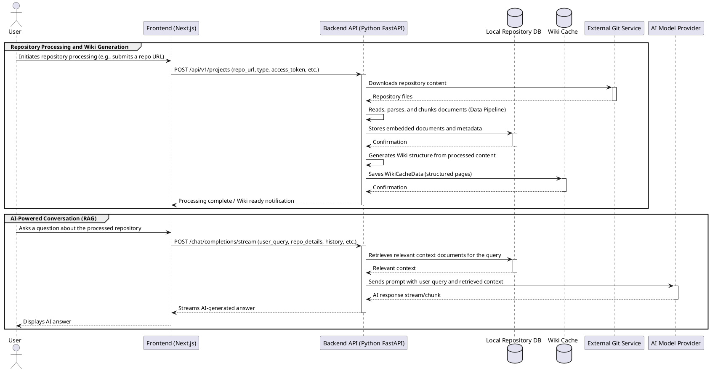
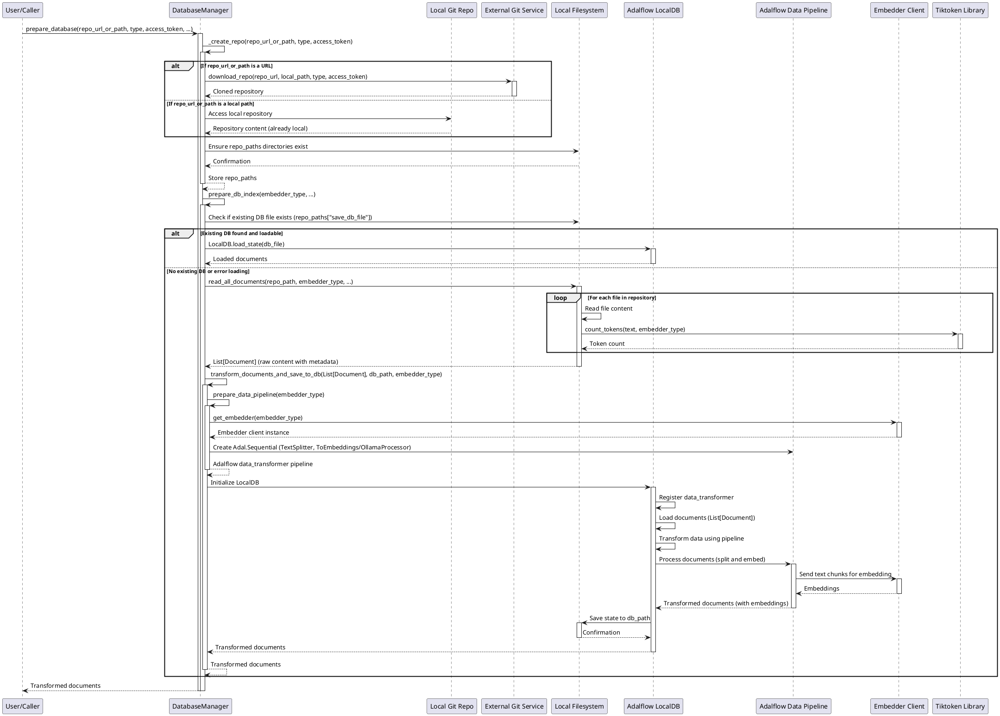
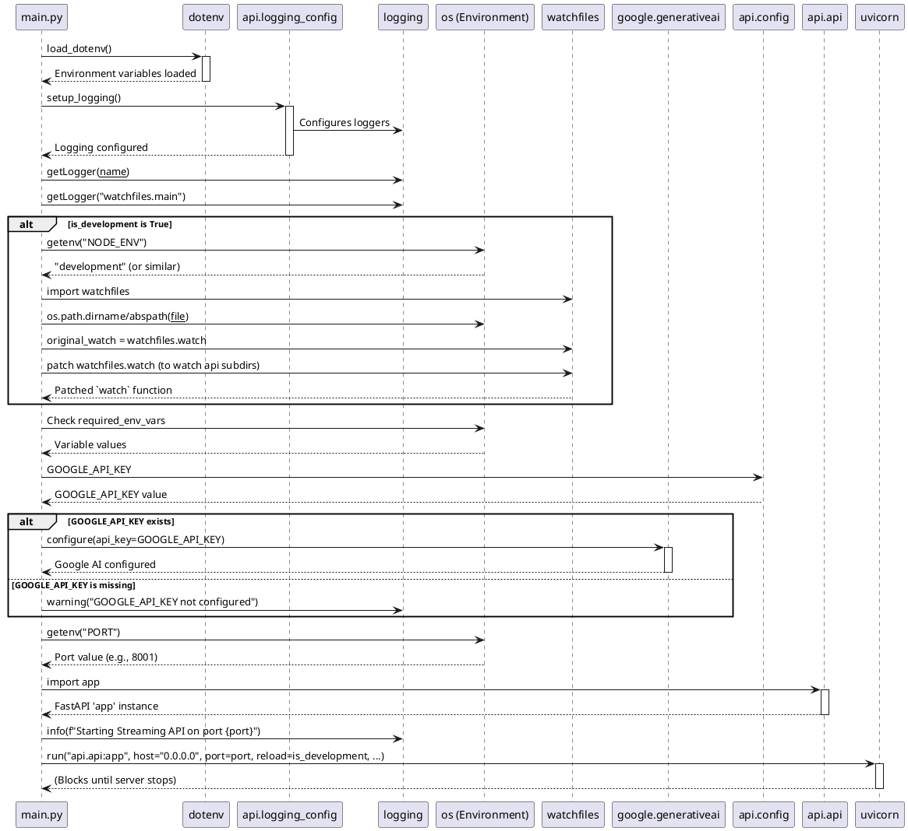
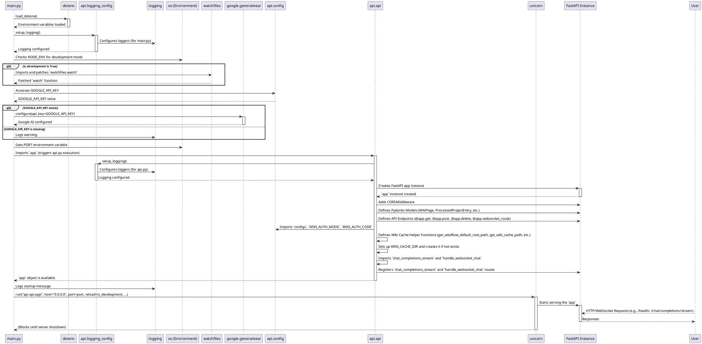
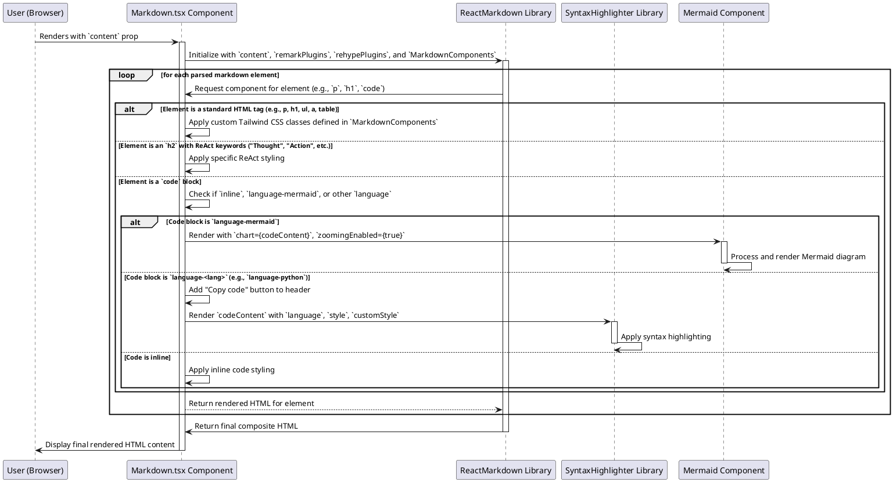
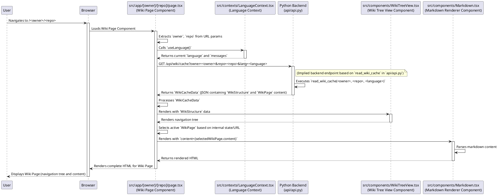

# Reverse Engineering of DeepWiki-Open 

> \# aider chat started at 2025-10-16 01:01:33
> C:\Users\jazzw\.local\bin\aider --no-auto-commits --no-gitignore --model gemini/gemini-2.5-flash  
> Aider v0.86.1  
> Model: gemini/gemini-2.5-flash with diff-fenced edit format  
> Git repo: .git with 124 files  
> Repo-map: using 4096 tokens, auto refresh  

# Overview

> ##### /ask could you give me a high-level overview of this git repo?

This repository contains a full-stack application designed to process code repositories, generate documentation in a "wiki" format, and provide an AI-powered chat/RAG (Retrieval Augmented Generation) interface for querying the repository content.

Key components include:

*   **Backend (Python `api` folder):**
    *   **AI Model Integration:** Clients for various AI providers (Azure AI, AWS Bedrock, Dashscope, Google, OpenAI, OpenRouter) for both embedding and chat completion tasks.
    *   **Data Pipeline:** Functionality to download repositories, read documents, count tokens, and manage a local database for processed content.
    *   **RAG System:** Core logic for Retrieval Augmented Generation, including prompt definitions for simple chat and multi-turn deep research.
    *   **API Endpoints:** FastAPI endpoints for handling model configuration, wiki cache management, and chat completions (both streaming and non-streaming).
    *   **Configuration:** Utilities for loading and managing application and model configurations.

*   **Frontend (Next.js `src` folder):**
    *   **User Interface:** A Next.js application providing pages for viewing processed repository wikis, slides, workshops, and a list of processed projects.
    *   **API Proxy:** Next.js API routes (`src/app/api`) that act as a proxy layer, forwarding requests (e.g., chat, model configuration, project management) to the Python backend.
    *   **Components:** Reusable React components for user interaction, display (e.g., Markdown rendering, Mermaid charts, model selection, token input), and project listings.
    *   **State Management & Types:** Contexts, hooks, and TypeScript type definitions for managing application state and data structures (e.g., `WikiPage`, `WikiStructure`, `ProcessedProject`).

In essence, the application allows users to input a repository URL, processes its content into a structured wiki, and then enables conversational AI interactions with that content using various Large Language Models.

## Tech Stack

> ##### /ask could you give me the tech stack used by this repo?  

Here is a high-level overview of the tech stack used in this repository:

**Backend (Python):**

*   **Language:** Python
*   **Web Framework:** FastAPI
*   **AI/ML Framework:** Adalflow
*   **AI Model Integrations:** Azure AI, AWS Bedrock, Alibaba Cloud Dashscope, Google AI, OpenAI, OpenRouter
*   **Data Models:** Pydantic
*   **HTTP Client:** `aiohttp`
*   **Local Data Storage:** Adalflow LocalDB

**Frontend (TypeScript/JavaScript):**

*   **Framework:** Next.js
*   **Language:** TypeScript
*   **UI Library:** React
*   **Markdown Rendering:** React Markdown
*   **Diagramming:** Mermaid
*   **State Management:** React Context API
*   **Communication:** Fetch API, WebSockets


> ##### /ask which is the main function of backend api?  

The main function of the backend API is to process code repositories, manage the generated wiki-like documentation, and provide AI-powered conversational capabilities (Retrieval Augmented Generation, or RAG) over the processed repository content.


> ##### /ask could you draw a sequence diagram using plantuml syntax?  

The main function of the backend API can be summarized as orchestrating the processing of code repositories into a searchable knowledge base and facilitating AI-powered question-answering (RAG) over that content.

Here is a sequence diagram illustrating this high-level flow:



> ##### /ask is it possible to use local git repo instead of Github?  

Yes, based on the `DatabaseManager.prepare_database` method in `api\data_pipeline.py`, it appears you can use a local repository path instead of a GitHub URL. The parameter is named `repo_url_or_path`, indicating support for both.

Based on the content of `api\data_pipeline.py`, no additional files are needed to confirm that using a local git repository is possible. The logic for handling local paths is contained within that file.

> #### /ask could you create a sequence diagram of data_pipeline.py using plantuml syntax?  

Here is a sequence diagram illustrating the high-level data pipeline flow within `api\data_pipeline.py` using PlantUML syntax:



#### /ask could you draw a sequence diagram of main.py using plantuml syntax?  

#### could you draw a sequence diagram of main.py using plantuml syntax?  


> ##### /ask could you draw a sequence diagram of `main.py` and `api.py` using plantuml syntax?  



> \# aider chat started at 2025-10-16 09:35:12
> C:\Users\jazzw\.local\bin\aider --no-auto-commits --no-gitignore --model gemini/gemini-2.5-flash  
> Aider v0.86.1  
> Model: gemini/gemini-2.5-flash with diff-fenced edit format  
> Git repo: .git with 124 files  
> Repo-map: using 4096 tokens, auto refresh  

> ##### /ask where does the backend store reports?  

Based on the provided file summaries, there is no explicit information about where the backend stores "reports."

The `api\api.py` file contains functions `generate_markdown_export` and `generate_json_export` which return strings, suggesting they generate content, but do not indicate persistent storage of these exports.

The backend does not persistently store "reports" generated by the `/export/wiki` endpoint on the server. Instead, these reports (Markdown or JSON files) are streamed directly to the client as a download.

However, the raw data for the generated wiki pages and their structure, which could be considered the "source" for such reports, are stored in a server-side cache. This wiki cache is located in the user's home directory under `.adalflow/wikicache`.

Specifically, files are stored as:
`~/.adalflow/wikicache/deepwiki_cache_{repo_type}_{owner}_{repo}_{language}.json`

> \# aider chat started at 2025-10-17 08:49:20
> C:\Users\jazzw\.local\bin\aider --no-auto-commits --no-gitignore --model gemini/gemini-2.5-flash  
> Aider v0.86.1  
> Model: gemini/gemini-2.5-flash with diff-fenced edit format  
> Git repo: .git with 124 files  
> Repo-map: using 4096 tokens, auto refresh  

> ##### /ask how does the code store embedding? as a `.pkl` file?  

Based on the provided file summaries, the code primarily uses a database (`db_path`) to store transformed documents, which likely includes embeddings.

In `api\dashscope_client.py`, there is a mention of an `embedding_cache_file_name` for `DashScopeBatchEmbedder` and `DashScopeToEmbeddings`, but the file format (e.g., `.pkl`) is not specified.

There is no explicit mention of `.pkl` files being used to store embeddings in these summaries.

> api\dashscope_client.py  
> Add file to the chat? (Y)es/(N)o/(D)on't ask again [Yes]: y  

Yes, the `DashScopeBatchEmbedder` in `api\dashscope_client.py` stores embeddings as `.pkl` files. It uses a cache path like `./embedding_cache/{embedding_cache_file_name}_{embedder_class_name}_dashscope_embeddings.pkl` and uses `pickle.dump` to save them.

> ##### /ask which program invoke DashScopeBatchEmbedder?  

The `DashScopeToEmbeddings` class invokes `DashScopeBatchEmbedder`.

> ##### /ask what is DashScope?  

DashScope is Alibaba Cloud's platform that provides access to their Qwen and other models through an OpenAI-compatible API.

> \# aider chat started at 2025-10-17 10:51:32

> ##### /ask how does the code render wikicache json file? does it using specific library?  

On the backend, `api\api.py` defines `WikiCacheData` as a Pydantic `BaseModel`. Pydantic is a Python library used for data validation and serialization/deserialization, so it handles converting Python objects to and from JSON format.

On the frontend, the `.tsx` files (e.g., `src\app\[owner]\[repo]\slides\page.tsx`, `src\app\[owner]\[repo]\workshop\page.tsx`) define TypeScript interfaces for `WikiCacheData`, indicating that the data is expected in a JSON structure. The `src\components\Markdown.tsx` component is used to render the `content` of `WikiPage` objects (which are part of `WikiCacheData`) into HTML. This component explicitly uses `ReactMarkdown` for rendering markdown strings.

Therefore, the code uses:
*   **Pydantic** on the backend to manage the `WikiCacheData` as JSON.
*   **ReactMarkdown** (via `src\components\Markdown.tsx`) on the frontend to render the markdown content found within the `WikiCacheData`.

For the question regarding how the code renders `wikicache` JSON files, the files you've provided (`api\api.py`, `src\app\[owner]\[repo]\slides\page.tsx`, `src\components\Markdown.tsx`) are sufficient. No other files are immediately needed for that specific inquiry.

## Frontend

> ##### /ask could you explain functionality of Markdown.tsx?  

The `src\components\Markdown.tsx` component is a React functional component designed to render markdown-formatted text into HTML, applying custom styling and handling specific content types.

Here's a breakdown of its functionality:

1.  **Markdown Parsing and Rendering**:
    *   It uses the `react-markdown` library to parse the `content` prop, which is expected to be a string containing markdown.
    *   It integrates `remarkGfm` (GitHub Flavored Markdown) and `rehypeRaw` to support a wide range of markdown features, including tables, task lists, and raw HTML.

2.  **Custom Component Mapping (`MarkdownComponents`)**:
    *   The core functionality lies in its `MarkdownComponents` object, which maps standard HTML elements (like `p`, `h1`, `h2`, `ul`, `ol`, `a`, `blockquote`, `table`, `code`) to custom React components with specific styling.
    *   **Typography**: Paragraphs, headings (h1-h4), lists, and blockquotes are rendered with Tailwind CSS classes to control their appearance, spacing, and dark mode compatibility.
    *   **Links**: Anchor tags (`a`) are styled with specific colors and include `target="_blank"` and `rel="noopener noreferrer"` for external links.
    *   **Tables**: Tables are rendered responsively with a container that allows horizontal scrolling, and custom styling for headers (`thead`, `th`), body (`tbody`, `td`), and rows (`tr`).

3.  **Special Handling for Code Blocks (`<code>`)**:
    *   **Syntax Highlighting**: For fenced code blocks (e.g., `` ```python ``), it uses `react-syntax-highlighter` (specifically `Prism` with the `tomorrow` theme) to apply syntax highlighting. It also includes line numbers and wraps long lines.
    *   **Copy to Clipboard**: Code blocks include a "Copy code" button that allows users to easily copy the content of the code block to their clipboard.
    *   **Mermaid Diagrams**: If a code block is identified with the language `mermaid` (e.g., `` ```mermaid ``), it renders the content using the `Mermaid` component (imported from `src\components\Mermaid.tsx`), enabling interactive diagram rendering within the markdown.
    *   **Inline Code**: Inline code snippets are styled with a distinct background and text color.

4.  **ReAct Heading Styling**:
    *   Headings (`h2`) that contain specific keywords like "Thought", "Action", "Observation", or "Answer" receive special background and text color styling, likely to differentiate steps in an AI agent's reasoning process.

In essence, `Markdown.tsx` acts as a highly customized markdown renderer that transforms raw markdown text into a visually appealing and interactive HTML representation tailored to the application's design system, with specific features for code display and diagram integration.

> ##### /ask could you draw a sequence diagram of Markdown.tsx using PlantUML syntax?  



> ##### /ask could you draw a sequence diagram based on the frontend source in src folder using PlantUML syntax?  

A sequence diagram for the entire `src` folder is very broad and would result in an extremely complex and unreadable diagram, as it contains many different components and functionalities.

To create a useful sequence diagram, please specify a particular user action or a specific feature you'd like to visualize. For example:

*   "User loads a Wiki page"
*   "User submits a chat message"
*   "User processes a new repository"
*   "User changes the language setting"

Once you provide a specific scenario, I can draw a more focused and understandable sequence diagram.

> ##### /ask could you draw a sequence diagram based on the frontend source in src folder using PlantUML syntax? let's start from how User loads a Wiki page.  

